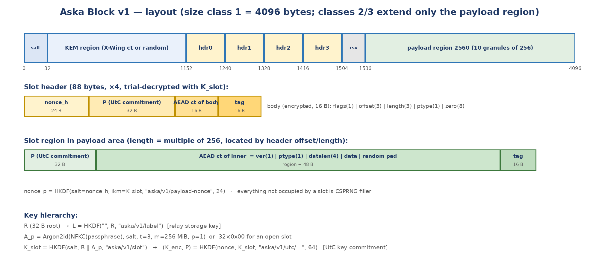

# Aska Block Format Specification

## Version 1, draft 0.6 — 7 October 2026 — container, key hierarchy, shares and encodings

*Draft 0.6 records the format as released in Aska 1.0.0 and 1.0.1 (no format change since draft 0.5; test vectors unchanged) and folds in the informational pre-review findings B-7, B-8 and A-8, a note on the Key Card's client-auth TLV, and decision D-18 (the bech32m prefixes stay for v1).*

- **Status:** Draft 0.6 — the format **as implemented in releases 1.0.0 (6 October 2026) and 1.0.1 (7 October 2026)**; see *Release records v1.0.0* and *v1.0.1*. No byte of the format, no algorithm and no test vector changed since draft 0.5: TV-1…TV-8 are unchanged (TV-3/TV-4/TV-5 SHA-256 values as in draft 0.5) and are reproduced bit-for-bit by the released code. The format code of `aska-core` (`block.rs`, `encodings.rs`, `shares.rs`, `xwing.rs`, `kdf.rs`, `utc.rs`, `consts.rs`) and the Python reference are unchanged since the draft-0.5 commit; between draft 0.5 and 1.0.1 only the Session's receiving-seed matching changed (identical work on a hit and a miss, pre-review B-4, fixed in 1.0.0; §6.4.1). This draft adds: an **Implementation status (1.0.x)** note on Key Card TLV strictness, where the released decoder is more lenient than the normative rules, with its security assessment (§7.3; pre-review B-7); a precise statement of what the long-form bech32m checksum detects (§7.5.2; B-8); a note that the Python reference opens less strictly than §6.2 (§9; A-8); a note on the consequence of the single client-auth TLV 0x06 for circles that include Tails or Whonix users (§7.3; Client Design v0.6 C-03, ADP/1 draft 0.3 §7.1); decision **D-18** — the bech32m human-readable prefixes stay for v1, DC-03 declined (§7.2, §12); and in-place corrections of sentences that still described the pre-draft-0.5 eight-character check (§2, §9, §11). Draft 0.5 was draft 0.4 plus two normative changes from the M8 internal pre-review: a **random permutation of header indices** per Block (§6.1 steps 2–4, §10.3; review finding A-1) and a **hash-based Receiving Key check** (§7.5.3; review finding B-1), with canonical decoding (§7.5.2; B-3) and test vectors TV-3…TV-5 regenerated. Draft 0.4 was draft 0.3 plus the **receiving-key path (X-Wing) made normative** by Design Change DC-02 (decision **D-17**, 30 September 2026; spec decision S-04 revised, §12): KEM-region layout (§4.2), Seal/Open/matching on the KEM path (§6.1, §6.2, §6.4), the X-Wing composition and its Elligator2 encoding (§6.5), the Receiving Key encoding with the long-form bech32m checksum (§7.2, §7.5), the Key Card's circle client-auth TLV as implemented (§7.3), the X-Wing test vector (§9), threats T-27/T-28 (§10.8, §10.9) and requirements KEY-09…KEY-12 (§11). Executable: every normative statement of the symmetric path is implemented in the reference implementation `aska_ref.py`, exercised by `test_aska.py` (16 tests) and fixed by `test_vectors.json` (8 vectors), all delivered alongside this document; the KEM path is implemented in the Rust workspace (`aska-core`: `xwing.rs`, `encodings.rs`, `session.rs`, `block.rs`), which also implements the symmetric path and reproduces the same vectors, and which is the ground truth where this draft and DC-02 differ in wording.
- **Ground truth for implementation statements:** release 1.0.1 (tag `v1.0.1`; development commit `54e5b81`). Where this document and the code disagree, the code is authoritative for what the software does; where the code is *looser* than a normative MUST, the MUST stands and the deviation is marked **Implementation status (1.0.x)**.
- **Satisfies:** BLK-01…BLK-10 and KEY-01…KEY-12 of *Aska — Decision Record and Threat Model v0.4* (the requirements of v0.2 as amended by DC-02 and folded in with v0.3), with one documented refinement (BLK-09, §11, adopted by the Decision Record since v0.3).
- **Depends on decisions:** D-04a (key transport), D-04b (threshold), D-07 (decoys/distress), D-08 (no key reuse), D-14 (crypto stack), D-17 (receiving-key path in v1, DC-02), D-18 (bech32m prefixes kept for v1, DC-03 declined).
- **Not in this document:** the Dead Drop wire protocol (*Aska Dead Drop Protocol ADP/1*), client behaviour — including the handling of networks that block Tor (DC-01, decision D-16), which touches no byte of this format — and the paper/one-time-pad mode (roadmap RM-01). The X-Wing receiving-key path, specified at design level and deferred to v1.1 in drafts 0.2 and 0.3, is **normative in this draft** (§6.5, §7.5) and remains flagged for cryptographic review (§10.8, §12.2). No independent review has taken place: the owner released 1.0.x without one (D-19), and the items stand for anyone qualified to examine them (*Security Review Package v0.1*).
- **Notation:** `a ‖ b` concatenation; `x[i:j]` byte range; all integers big-endian; "random" means output of a cryptographically secure RNG unless a test vector fixes it.

---

# 1. Scope and conformance

This specification defines the **Aska Block**: the fixed-size, random-looking container in which a note (and optionally a decoy) is sealed; the **key hierarchy** that derives every key from a single 32-byte root; the **Share** format used to split that root k-of-n; the **receiving-key path**, in which the root is instead derived from an X-Wing shared secret so that nothing secret has to travel from sender to receiver; and the **encodings** (24 words, bech32m text, QR-ready TLV, long-form bech32m for the Receiving Key) in which roots, Shares, Key Cards, receiving seeds and Receiving Keys are carried between people. It defines byte layouts and algorithms precisely enough that two independent implementations interoperate, and it is accompanied by a reference implementation and test vectors that fix every ambiguity.

An implementation **conforms** if it (a) produces Blocks that open correctly under the reference implementation and vice versa, (b) reproduces all test vectors in §9 bit-for-bit when given the same randomness, and (c) rejects every malformed or tampered input described in §6.2 and §8.4 without returning plaintext. An implementation that does not implement the receiving-key path MUST still fill the KEM region with random bytes (§4.2) and conforms for the symmetric path alone; an implementation that does implement it MUST follow §6.5 exactly. The words MUST, SHOULD and MAY are used as in RFC 2119.

## 1.1 Design goals (from the requirements)

| Goal | Requirement | How this specification meets it |
|---|---|---|
| Indistinguishable from random | BLK-01 | No cleartext field of any kind. Salt, nonces and filler are random; every other byte is AEAD output, HKDF output or (KEM path) a pseudorandom ciphertext. §4, §10.1. |
| Fixed size classes | BLK-02 | Three classes: 4 096, 16 384, 65 536 bytes. Everything the note does not use is random filler. §3, §4.4. |
| Fresh key per Block, never reused | BLK-03, D-08 | One random 32-byte root R per Block; every other key is derived from R with domain separation. On the KEM path R is derived from a fresh X-Wing encapsulation, so it is equally unique. §5, §6.5. |
| Key-committing AEAD | BLK-04, T-24 | XChaCha20-Poly1305 inside the UtC transform (Bellare–Hoang 2022): a 32-byte commitment P is derived with the encryption key from (K, nonce) and verified before decryption. §5.4. |
| Decoy and distress slots; slot count hidden | BLK-05, D-07 | Four fixed 88-byte slot headers, each independently keyed; unused headers are random; slot regions sit at sender-chosen granule offsets. Opening one slot reveals nothing about the others, in either direction. §4.3, §10.3. |
| Versioning inside the envelope | BLK-06 | Format version and payload type are inside the encrypted header body and inner payload; all HKDF info strings carry `aska/v1/`. §4.5, §5.5. |
| Optional X-Wing path still random-looking | BLK-07 | A 1 120-byte KEM region present in *every* Block: random in the symmetric path, X-Wing ciphertext with Elligator2-encoded X25519 component in the KEM path. §4.2, §6.5. |
| No identifiers, timestamps or signatures | BLK-08 | None exist in the format. Authentication is implicit through the AEAD and, on the KEM path, the KEM-derived root. §4, §10. |
| Label unrelated to key (refined) | BLK-09 | Label L is derived one-way from R with its own info string; knowing L gives nothing about R or any key; R holders can compute L, which is what lets a receiver match Blocks locally without asking the relay. §5.2, §11. |
| Words and QR for the key | KEY-01 | 24 BIP-39 words carry R with an 8-bit checksum; a bech32m Key Card carries R plus relay and hints. §7. |
| Shamir 2-of-3 / 3-of-5 with verification | KEY-02, KEY-03 | GF(2^8) byte-wise sharing of R; each Share carries a set identifier and a 4-byte verification tag derived from R; Shares never carry L. §8. |
| Reserved share types | KEY-08 | Share and Key Card use versioned TLV/byte layouts with unused type codes reserved. §7.3, §8.2. |
| Nothing secret travels for the remote case | KEY-09…KEY-12, D-17 | The receiver publishes a Receiving Key (X-Wing public key, `askar1…`) by any channel and keeps a 32-byte receiving seed as 24 words; the sender derives R from an X-Wing encapsulation and never holds anything to hand over; the receiver matches by decapsulating every Block with identical work. §6.4, §6.5, §7.5. |

# 2. Overview

A sender holds a note and, optionally, a decoy. The client draws a random **root** R. From R it derives the **label** L under which the Block will be stored, and — together with a per-Block salt and, if the sender wants passphrase protection, an Argon2id-stretched passphrase — one **slot key** per slot. Each slot is sealed twice: a small **header** (where is my payload, how long, what type, is this the distress slot?) and the **payload** itself, both under the key-committing AEAD. The four headers occupy fixed positions and are trial-decrypted by the receiver; the payloads sit at sender-chosen positions inside the payload region; all remaining space is random. The result is a Block of exactly 4 096, 16 384 or 65 536 bytes that is indistinguishable from random noise and identical in appearance whether it holds one note or four.

The receiver obtains R (as words, a Key Card or reassembled Shares) or, on the optional KEM path, holds the private half of a one-time receiving key. It downloads a bucket of Blocks from the relay, computes L from R and picks the Block whose label matches (or, on the KEM path, tries decapsulation against each Block's KEM region), derives the slot key for the passphrase it was given, trial-decrypts the four headers, and opens the payload the matching header points to. If the header carries the **distress** flag, the client shows the payload exactly as it would any other and, separately, destroys its local copy of R and any Share.

On the KEM path the receiver acts first: once, it draws a 32-byte **receiving seed** (kept as 24 words) and derives from it an X-Wing key pair whose public half, with relay hints, is the **Receiving Key** — an `askar1…` string of about 2 000 characters that is not secret and may travel by any channel, its authenticity confirmed by reading its twelve-character **check** — a hash of the public key, §7.5.3 — to each other *(amended in draft 0.6: draft 0.5 changed the check from the last eight characters of the text to this hash, pre-review B-1, but this overview still described the old form)*. The sender encapsulates to it, derives R from the shared secret, and seals exactly as above; the finished Block differs from a symmetric-path Block only in the content of its KEM region, and there is nothing to hand over (§6.5).

*Figure 1 — Block layout (size class 1) and key hierarchy.*

# 3. Constants

| Name | Value | Meaning |
|---|---|---|
| FORMAT_VERSION | 0x01 | Appears inside encrypted header bodies, inner payloads, Shares, Key Cards and Receiving Keys; never in the clear inside a Block. |
| SIZE_CLASSES | 1 → 4 096; 2 → 16 384; 3 → 65 536 | Total Block length in bytes. |
| SALT_OFF / SALT_LEN | 0 / 32 | Per-Block random salt. |
| KEM_OFF / KEM_LEN | 32 / 1 120 | KEM region: X-Wing ciphertext (1 088 ML-KEM-768 + 32 Elligator2 X25519) or random. |
| CT_M_LEN | 1 088 | ML-KEM-768 ciphertext length; the X25519 representative fills the remaining 32 bytes of the KEM region (`CT_M_LEN + 32 = KEM_LEN`, asserted at compile time). |
| XWING_PK_LEN | 1 216 | X-Wing encapsulation key `pk_M(1 184) ‖ pk_X(32)`. |
| SEED_LEN | 32 | Receiving seed = X-Wing decapsulation key `sk`. |
| XWingLabel | `5c 2e 2f 2f 5e 5c` (`\.//^\`) | Final input of the X-Wing combiner (draft-11 §5.3). |
| N_SLOTS | 4 | Number of slot headers. |
| HDR_OFF / HDR_LEN | 1 152 / 88 | Slot headers: 24 nonce + 32 commitment + 16 body ciphertext + 16 tag. |
| RSV_OFF / RSV_LEN | 1 504 / 32 | Reserved; random in v1 (future: block-wide tag). |
| PAYLOAD_OFF | 1 536 | Start of payload region (= 6 × 256). |
| PAYLOAD_GRANULE | 256 | Slot regions start and end on 256-byte boundaries. |
| Payload region length | 2 560 / 14 848 / 64 000 | By size class; always a multiple of 256. |
| INNER_HDR_LEN | 6 | version(1) ‖ ptype(1) ‖ datalen(4). |
| Max note per class | 2 506 / 14 794 / 63 946 bytes | Payload region − 32 − 6 − 16, single slot. |
| FLAG_DISTRESS | 0x01 | Header flag: opening this slot is a distress event. |
| PTYPE_TEXT / PTYPE_BINARY | 0x01 / 0x02 | Payload type: UTF-8 text, or opaque bytes. |
| KDF profiles (Argon2id) | Profile 1: t = 3, m = 262 144 KiB (256 MiB), p = 1 — v1 default. Profile 2: t = 3, m = 65 536 KiB (64 MiB), p = 1 — reserved for mobile (RM-02). Output 32 bytes. | The profile number is mixed into the slot-key info string; receivers try each profile they support (§5.3). |
| HKDF | HKDF-SHA-512 (RFC 5869) | All key derivation. An empty salt means 64 zero bytes. |
| AEAD | XChaCha20-Poly1305 (IETF), 24-byte nonce | Inside the UtC transform. |
| KEM | X-Wing (draft-connolly-cfrg-xwing-kem-11): ML-KEM-768 (FIPS 203) + X25519 (RFC 7748), combined with SHA3-256 | Receiving-key path only (§6.5). |

*Table 1 — Constants.*

# 4. Block layout

| Offset | Length | Field | Content |
|---|---|---|---|
| 0 | 32 | salt | Random. Input to Argon2id and to the slot-key HKDF. |
| 32 | 1 120 | kem | Symmetric path: random. KEM path: X-Wing ciphertext as §4.2 and §6.5. |
| 1 152 | 4 × 88 | hdr[0..3] | Slot headers (§4.3). Unoccupied headers are random. |
| 1 504 | 32 | reserved | Random in v1. Implementations MUST ignore it on open and MUST fill it with random on seal. |
| 1 536 | to end | payload region | Slot regions (§4.4) at sender-chosen granule offsets; everything else random filler. |

*Table 2 — Top-level layout. Identical for all size classes except the payload region length.*

## 4.1 Salt

Thirty-two random bytes, unique per Block. It is used as the Argon2id salt and as the HKDF salt for slot keys, so that the same root and passphrase yield different slot keys in different Blocks and so that no precomputation across Blocks is possible.

## 4.2 KEM region (normative)

Present in every Block so that the two key-transport paths (D-04a) produce Blocks of identical shape. In the symmetric path it is 1 120 random bytes, drawn in the position given by §6.1 step 2. In the KEM path it holds `ct_M ‖ rep_X` where `ct_M` is the 1 088-byte ML-KEM-768 ciphertext and `rep_X` is the 32-byte **Elligator2 representative** of the X25519 ephemeral public key that X-Wing places in its ciphertext (§6.5). The receiver recovers the X25519 public key from the representative and performs standard X-Wing decapsulation.

| Bytes of the region | Block offset | Field | Content (KEM path) |
|---|---|---|---|
| 0–1 087 | 32–1 119 | ct_M | ML-KEM-768 ciphertext `ct_M = ML-KEM-768.Encaps(pk_M)`, unmodified. |
| 1 088–1 119 | 1 120–1 151 | rep_X | Elligator2 representative of the torsion-dirty ephemeral point `E` (§6.5.2), two high bits random. |

*Table 2a — KEM region layout.*

Rules:

1. A sealer on the KEM path MUST write the region exactly as Table 2a; a sealer on the symmetric path MUST fill it with CSPRNG output. No other content is permitted.
2. The region carries no marker of which path produced it. A receiver that holds a receiving seed treats every Block as a KEM candidate (§6.4); a receiver that holds R ignores the region entirely.
3. Decoding is **total**: every 32-byte string is a valid Elligator2 representative and every 1 088-byte string is accepted by ML-KEM decapsulation (implicit rejection). A symmetric-path Block therefore decapsulates to *some* shared secret, which matches nothing. Receivers MUST NOT treat any property of the region as a reason to skip a Block.
4. The region is not covered by any AEAD tag (§10.4). Corrupting it on the KEM path makes the Block unmatchable (denial of service only); on the symmetric path it has no effect.

## 4.3 Slot headers

Four headers of 88 bytes at fixed offsets `1152 + 88·i`, i = 0..3. Header i for an occupied slot is:

| Bytes | Field | Value |
|---|---|---|
| 0–23 | nonce_h | Random 24-byte nonce. |
| 24–55 | P | UtC commitment: `HKDF(salt = nonce_h, ikm = K_slot, info = "aska/v1/utc/header", 64)[32:64]`. |
| 56–87 | ct | XChaCha20-Poly1305(key = the first 32 bytes of the same HKDF output, nonce = nonce_h, ad = `"aska/v1/header" ‖ i`, msg = body) — 16 bytes ciphertext + 16 bytes tag. |

The 16-byte **body** is `flags(1) ‖ offset(3) ‖ length(3) ‖ ptype(1) ‖ 0x00×8`. `offset` is relative to PAYLOAD_OFF; `length` is the full slot-region length including its own commitment and tag; both are multiples of 256; `flags` bit 0 is FLAG_DISTRESS and all other bits MUST be zero; the eight trailing zero bytes MUST be verified on open (they double as a sanity check against an implementation bug that accepts garbage). An unoccupied header is 88 random bytes. Because P is 256 bits of HKDF output, the probability that a random header passes the commitment check is 2⁻²⁵⁶.

## 4.4 Payload region and slot regions

The payload region starts at 1 536 and runs to the end of the Block. A **slot region** is a contiguous range `[offset, offset + length)` inside it, with both bounds multiples of 256, containing `P_p(32) ‖ ct_p` where `ct_p` is the AEAD ciphertext (plus tag) of the inner payload. Slot regions MUST NOT overlap. The sender chooses their positions; the reference implementation places them consecutively from a random granule-aligned start, but any non-overlapping placement is valid and test vectors fix explicit offsets. Every byte of the payload region not inside a slot region is random filler.

Region length is `ceil((32 + 6 + datalen + 16) / 256) · 256`; the difference between that and the actual content is random padding inside the encryption. Rounding to granules means that a coercer who has opened one slot learns its region's size only to the nearest 256 bytes, and learns nothing about whether the rest of the payload region is filler or other slots (§10.3).

The payload nonce is derived, not stored: `nonce_p = HKDF(salt = nonce_h, ikm = K_slot, info = "aska/v1/payload-nonce", 24)`. The payload commitment and encryption key are `HKDF(salt = nonce_p, ikm = K_slot, info = "aska/v1/utc/payload", 64)` split as for the header, and the associated data is `"aska/v1/payload" ‖ i ‖ nonce_h`, binding the payload to its header.

## 4.5 Inner payload

The plaintext of a slot region is `version(1) = 0x01 ‖ ptype(1) ‖ datalen(4) ‖ data ‖ pad`, where `pad` is random and fills the region. On open, `version` MUST equal FORMAT_VERSION and `ptype` MUST equal the header's `ptype`, and `6 + datalen` MUST not exceed the plaintext length; otherwise the Block is rejected. `ptype` 0x01 is UTF-8 text (which the client MUST validate as UTF-8 before display) and 0x02 is opaque bytes; other values are reserved.

# 5. Key hierarchy

## 5.1 HKDF-SHA-512

All derivations use HKDF-SHA-512 exactly as RFC 5869: `PRK = HMAC-SHA-512(salt, IKM)`; `OKM = T(1) ‖ T(2) ‖ …` with `T(i) = HMAC-SHA-512(PRK, T(i−1) ‖ info ‖ i)`. An empty salt is replaced by 64 zero bytes (the RFC default). Info strings are ASCII and listed in §5.5.

## 5.2 Root, label and slot keys

| Symbol | Derivation | Notes |
|---|---|---|
| R | Symmetric path: 32 random bytes. KEM path: `HKDF(salt = "", ikm = ss, info = "aska/v1/root-from-kem", 32)` where ss is the X-Wing shared secret (§6.5.3). | The only secret a receiver needs. Never reused (D-08). On the KEM path the sender's client forgets R once the Block is posted (KEY-10) and the receiver re-derives it by decapsulation (§6.4). |
| L | `HKDF(salt = "", ikm = R, info = "aska/v1/label", 32)` | Relay storage key. One-way from R; independent of the salt so a receiver can compute it from R alone. |
| A_p | `Argon2id(pwd = NFKC(passphrase) as UTF-8, salt = salt, params of profile p, len = 32)`; or 32 zero bytes for an **open** slot (no passphrase), which always uses profile 1. | Computed once per Block per (passphrase, profile), not per header. |
| K_slot | `HKDF(salt = salt, ikm = R ‖ A_p, info = "aska/v1/slot/p" ‖ p, 32)` where p is the one-byte profile number | Different for every (Block, passphrase, profile). Both R and A_p are required: a passphrase alone opens nothing, and R alone opens only slots that were sealed as open. |
| K_enc, P | `HKDF(salt = nonce, ikm = K_slot, info = "aska/v1/utc/header" or "…/payload", 64)` → first 32 bytes K_enc, last 32 bytes P | UtC transform (§5.4). |
| nonce_p | `HKDF(salt = nonce_h, ikm = K_slot, info = "aska/v1/payload-nonce", 24)` | Payload nonce derived from the header nonce. |

*Table 3 — Key hierarchy.*

## 5.3 Passphrases

Passphrases are Unicode strings normalised with NFKC and encoded as UTF-8 before Argon2id. Because a passphrase must be stretched *before* any header can be decrypted, its parameters cannot be stored in the Block. Instead this specification defines numbered **KDF profiles** (Table 1). A sealer chooses a profile per passphrased slot and mixes its number into the slot-key info string; an opener derives K_slot once per profile it supports and runs the header trial for each. Version 1 desktop clients MUST support profile 1 and MAY support profile 2; a future mobile client will seal with profile 2 and MUST support both. The extra cost is one Argon2id run per additional profile, and only on the Block whose label already matched. New profiles can be added without a format version bump; parameters of an existing profile MUST never change. Implementations SHOULD refuse passphrases shorter than four Diceware-style words or twelve characters for the real slot, and SHOULD warn that decoy passphrases must be equally strong (a weak decoy passphrase would let an attacker learn that a decoy exists — though not that anything else does). Clients MUST use their own input widget for passphrases (CLI-08).

## 5.4 Key-committing AEAD (UtC)

XChaCha20-Poly1305 is not key-committing: an attacker who knows two keys can produce one ciphertext that decrypts validly under both, which matters in a format where one Block is legitimately opened under several keys (RFC 9771). This specification therefore wraps the AEAD in the **UtC ("Unique-then-Commit") transform** of Bellare and Hoang (EUROCRYPT 2022): from the key K and the nonce N derive `(K_enc, P) = HKDF(N, K, info, 64)`; the committed ciphertext is `P ‖ AEAD(K_enc, N, AD, M)`. On decryption, recompute P from the supplied key and nonce, compare in constant time, and only then decrypt. Because P is a pseudorandom function of the key, a ciphertext commits to the key that produced it; and because P is derived rather than stored per key, it leaks nothing about the key or about other Blocks.

## 5.5 Domain separation

| String | Used for |
|---|---|
| `aska/v1/label` | L from R |
| `aska/v1/slot/p` ‖ profile | K_slot from R ‖ A_p, one byte of profile number appended |
| `aska/v1/utc/header` | header (K_enc, P) |
| `aska/v1/utc/payload` | payload (K_enc, P) |
| `aska/v1/payload-nonce` | nonce_p |
| `aska/v1/share-verify` | Share verification tag |
| `aska/v1/root-from-kem` | R from the X-Wing shared secret (§6.5.3) |
| `aska/v1/header` ‖ i | AEAD associated data for header i |
| `aska/v1/payload` ‖ i ‖ nonce_h | AEAD associated data for payload i |

*Table 4 — Info strings and associated data. A v2 format changes the prefix, so no v1 key material can be replayed into v2 derivations. The X-Wing combiner's own label `\.//^\` (§6.5.1) is X-Wing's domain separator, not Aska's, and is used exactly as draft-11 specifies.*

# 6. Procedures

## 6.1 Seal

1. Validate inputs: 1–4 slots; each slot has data, ptype, optional passphrase (with KDF profile), distress flag. Slot keys within one Block MUST be distinct: at most one open slot, and no two passphrased slots with the same (NFKC passphrase, profile). At most one slot MUST carry the distress flag. Compute each slot's region length (§4.4) and check that the sum fits the payload region; otherwise choose a larger size class or fail.
2. Draw randomness in this order (normative for test vectors): salt (32); KEM region (1 120) unless the KEM path supplies it; reserved (32); nonce_h for each of the four header positions (4 × 24); **the header permutation**: three 4-byte draws, a Fisher–Yates shuffle of the four header indices (for i = 3, 2, 1: j = u32 mod (i+1), swap), so that slot s (in the order the sender gave them) is written under header index perm[s]; then the placement start (4 bytes, default placement only); then, per occupied slot in the sender's order, its inner padding; then filler for the whole payload region (occupied bytes are overwritten); then 88 random bytes for each unoccupied header.
3. Choose non-overlapping granule-aligned offsets for the occupied slots (any policy; the reference places them consecutively from a random granule start **in order of increasing header index**, so that region order follows the random permutation rather than the sender's order).
4. For each occupied slot s with header index i = perm[s]: derive K_slot (§5.2); build the inner payload (§4.5); derive nonce_p; seal the payload with UtC (AD carries i) and write it at its offset; build the header body; seal the header with UtC under nonce_h[i] (AD carries i) and write it at `1152 + 88·i`. Fill every header index not used by a slot with 88 random bytes, in ascending index order.
5. Assemble `salt ‖ kem ‖ hdr[0..3] ‖ reserved ‖ payload` and check the total length equals the size class. Compute L from R. Output (L, Block). Zeroise R, every K_slot, K_enc and plaintext buffer unless R must still be shown to the user for hand-over.

### 6.1.1 Seal on the KEM path (normative)

When the sender has been given a Receiving Key (§7.5) instead of being asked to produce a hand-over:

1. Decode the Receiving Key (§7.5); a string that is not a valid `askar1…` Receiving Key MUST be rejected before anything is composed. Its relay hints MAY become the sender's relays when none are configured, and its size-class hint MAY become the sender's size class when none is configured.
2. Compute `(ss, kem) = Aska-XWing.Encaps(pk)` as §6.5.1–6.5.2, where `kem = ct_M ‖ rep_X` is exactly 1 120 bytes; derive `R = HKDF("", ss, "aska/v1/root-from-kem", 32)` (§6.5.3); zeroise ss.
3. Run §6.1 steps 1–5 with this R and with the KEM region **supplied** (step 2 of §6.1 then draws no bytes for it: the draw order is salt, reserved, nonces, …). Everything else — slot count, passphrases, KDF profiles, decoy and distress slots, size classes, padding — is identical to the symmetric path.
4. **Single use of R (KEY-10).** Immediately after sealing, the sender's client MUST destroy its copy of R, keeping only L and the Block for posting. The client MUST NOT display, encode or hand over R or anything derived from it: the words (§7.1), the Key Card (§7.3) and Shares (§8) MUST be refused for a Block sealed on the KEM path, and the threshold ("Guarded") level MUST be refused before sealing, since there is no key the sender could split. What the client MAY show is the check (§7.5) of the Receiving Key it sealed for, so the sender can confirm with the receiver that the right key was used.

## 6.2 Open

1. Reject any input whose length is not a size class.
2. Read salt. For each supported KDF profile (profile 1 only if no passphrase was supplied): compute A_p (or zeros), then K_slot, and run steps 3–5. Return the first slot that opens.
3. For i in 0..3: read nonce_h and the 64-byte committed ciphertext; derive (K_enc, P); if P does not match in constant time, continue. Otherwise decrypt the body; a tag failure here is an error (the commitment matched, so the key is right and the Block has been tampered with or is malformed) and the Block MUST be rejected.
4. Decode the body: flags, offset, length, ptype; verify the eight zero bytes; verify `offset + length ≤ payload length`, granule alignment and that flags has no undefined bits. Any failure rejects the Block.
5. Derive nonce_p and the payload (K_enc, P); verify the payload commitment; decrypt; verify inner version and ptype; extract `data`. Return (index, data, ptype, distress).
6. If no header matched, return "no slot opens with this key" — indistinguishable to the caller from "not my Block". Implementations MUST make the four header checks constant-time with respect to which header matches, and SHOULD process all four headers before returning even after a match, to avoid a timing side channel revealing the slot index.

### 6.2.1 Open on the KEM path

Open is **identical** on both paths. The only difference is where R comes from: on the symmetric path from the user's key material (words, Key Card, Shares); on the KEM path from the matching step of §6.4, which derives R by decapsulating the Block's KEM region with the receiving seed. Passphrases, KDF profiles, decoy and distress slots and all rejection rules apply unchanged; a KEM-path Block with a decoy slot opens the decoy under the decoy passphrase exactly as a symmetric-path Block does. The KEM region is not read again by Open.

## 6.3 Distress semantics

The format only marks a slot; policy belongs to the client. On opening a slot with FLAG_DISTRESS the client MUST display the payload exactly as it would any other slot, with no visible difference in timing or interface, and MUST, in the same operation, destroy its local copy of R (including any wrapped Share or saved Key Card for this Block) so that no later attempt from this device can open any other slot. The sender is responsible for making the distress payload plausible (the reference use is an identical copy of the decoy). On the KEM path the client additionally holds the receiving seed; the distress rule applies to R and the fetched Block, and the seed is destroyed when the Session closes (§6.5.5).

## 6.4 Bucket matching

A relay returns (label, Block) pairs. A receiver holding R computes L and selects the Block with that label; it then runs §6.2. A receiver MAY also run §6.2 over every Block as a fallback when the label is absent. On the KEM path the receiver instead runs decapsulation against each Block's KEM region (§6.5) and, for each candidate R, checks that the derived L matches the Block's label before proceeding — a cheap, exact confirmation.

### 6.4.1 Matching with a receiving seed (normative; KEY-11)

A receiver that holds a receiving seed has no label to ask for. It MUST fetch whole buckets — every size class it may receive (all three when no class is known) from every relay it polls — and then, for **every** record `(l, B)` in every bucket:

1. Take the KEM region `B[32:1152]` (a record too short to contain one is not a Block of any class and is passed over).
2. Compute `ss = Aska-XWing.Decaps(sk, B[32:1152])` (§6.5.1–6.5.2: decode `rep_X`, decapsulate), `R = HKDF("", ss, "aska/v1/root-from-kem", 32)` and `L = HKDF("", R, "aska/v1/label", 32)`.
3. Compare `L` with `l` in constant time. Remember the first record that matches, together with its R.
4. Continue with the next record. **All records MUST be processed even after a match**, and the work per record — one ML-KEM-768 decapsulation, one X25519, one SHA3-256, two HKDF-SHA-512 and one 32-byte constant-time comparison — MUST be the same whether or not the record matches, so that neither the relay nor a local observer learns which Block, if any, was the receiver's.
5. If a record matched: adopt its R (and L) as the Session's key material and continue with §6.2 exactly as on the symmetric path. Otherwise report "not in this bucket", which is indistinguishable from "nothing was sent to this key".

The relays polled are the receiver's own configured relays (command-line, profile or defaults); the relay hints inside a Receiving Key direct the *sender* (§6.1.1) and are not re-read by the receiver, who has only the seed. The same matching MUST be used when a bucket arrives by other means (a bucket file in Qubes split mode).

*As implemented (since 1.0.0).* `Session::match_records_with_seed` (`crates/aska-core/src/session.rs`) picks up the matching root and Block by branch-free conditional copies (`subtle`), wipes every record's label and every candidate label whether or not it matched, and afterwards does identical finishing work on both outcomes — one root locked and one label derived, for the found root or an all-zero stand-in — keeping an unmatched bucket's stand-ins until the Session ends, as a hit's buffers are kept. A record whose length differs from the bucket's first record (a misbehaving relay; lengths are public) is never taken. Before 1.0.0 a hit did a few microseconds of extra finishing work (pre-review B-4, first accepted, then fixed in 1.0.0); the release record v1.0.0 gives the measurement (hit − miss over 10 000 rounds: +4.9 µs before, +0.4 / +0.15 µs, within noise, after). The timing-parity gate `seed_matching_time_does_not_depend_on_a_match` covers it.

## 6.5 The receiving-key path (X-Wing) — normative (DC-02 §2, decision D-17)

A receiver generates an X-Wing key pair (ML-KEM-768 + X25519; public key 1 216 bytes) and publishes the public key with a relay hint as a **Receiving Key** (§7.5). A sender computes `(ss, ct) = XWing.Encaps(pk)`, derives `R = HKDF("", ss, "aska/v1/root-from-kem", 32)`, and seals the Block exactly as in §6.1 with the KEM region set to `ct_M ‖ rep_X`, where `rep_X` is the Elligator2 representative of the X25519 ephemeral public key `ct_X` that X-Wing includes in `ct`. The sender MUST generate the X25519 ephemeral key by rejection sampling until it has a representative (about half of keys do), which requires an X-Wing implementation that exposes or accepts the ephemeral seed. The receiver decodes `rep_X` to `ct_X`, reassembles `ct = ct_M ‖ ct_X`, runs `XWing.Decaps(sk, ct)`, derives R and proceeds with §6.4. The subsections below make each step exact.

### 6.5.1 The KEM

X-Wing as specified in *draft-connolly-cfrg-xwing-kem-11* (23 September 2026): ML-KEM-768 (FIPS 203) combined with X25519 through SHA3-256.

- **Decapsulation key** `sk`: 32 uniformly random bytes — the **receiving seed** (SEED_LEN). `expandDecapsulationKey(sk)`: `expanded = SHAKE256(sk, 96 bytes)`; `(pk_M, sk_M) = ML-KEM-768.KeyGen_internal(expanded[0:32], expanded[32:64])` (the 64-byte ML-KEM seed `d ‖ z`); `sk_X = expanded[64:96]`; `pk_X = X25519(sk_X, BASE)` (with the RFC 7748 clamping of `sk_X`).
- **Encapsulation key** `pk = pk_M ‖ pk_X` (1 184 + 32 = 1 216 bytes, XWING_PK_LEN).
- **Encapsulate**: `(ss_M, ct_M) = ML-KEM-768.Encaps(pk_M)` with 32 fresh random bytes as the FIPS 203 message `m` (1 088-byte ciphertext); an X25519 ephemeral `ek_X` giving `ct_X` (§6.5.2) and `ss_X = X25519(ek_X, pk_X)`; `ss = SHA3-256(ss_M ‖ ss_X ‖ ct_X ‖ pk_X ‖ XWingLabel)` with `XWingLabel = 5c 2e 2f 2f 5e 5c` (`\.//^\`).
- **Decapsulate**: `ss_M = ML-KEM-768.Decaps(ct_M, sk_M)`; `ss_X = X25519(sk_X, ct_X)`; same combiner. Both halves are total functions of their input (ML-KEM's implicit rejection; X25519 accepts any 32 bytes), so decapsulation never fails — it merely yields the wrong secret.

The implementation is Aska's own composition of the RustCrypto `ml-kem` crate (FIPS 203), `x25519-dalek` and `sha3`, so that the X25519 ephemeral is under Aska's control (§6.5.2). It reproduces test vector 1 of draft-11 exactly (`sk = 7f9c2ba4…ef26`, `eseed = 3cb1eea9…85b2` → `ss = d2df0522…e384`, with the published `pk` and `ct` prefixes); this vector is a unit test (TV-9, §9).

### 6.5.2 Uniform encoding of the X25519 half (Elligator2, torsion-dirty; KEY-12)

An X25519 public key is not a random string: its u-coordinate satisfies a quadratic-residuosity test that a random 32-byte string fails half the time. The KEM region of a symmetric-path Block is random, so a raw `ct_X` at a fixed offset would mark KEM-path Blocks. Therefore:

1. The sender generates the ephemeral as a **torsion-dirty, Elligator2-representable** point: `ek_X` random; the published point is `E = clamp(ek_X)·B + T` with `T` a uniformly chosen point of order dividing 8; the pair is re-drawn until `E` has an Elligator2 preimage (about half of all points do; the retry count depends only on discarded candidates). `ct_X` **is the u-coordinate of the dirty point `E`**, and it is `ct_X` — not the clean point — that enters the combiner and the X25519 computation on both sides. Because every clamped X25519 scalar is a multiple of 8 and `8·T = O`, `X25519(sk_X, E) = X25519(sk_X, clamp(ek_X)·B)`: the shared secret is unaffected; only the encoding is.
2. The KEM region of the Block carries `ct_M ‖ rep_X` where `rep_X` is the Elligator2 representative of `E` with its two unused high bits filled from the sender's CSPRNG (1 088 + 32 = 1 120 bytes, the reserved size).
3. The receiver decodes `rep_X` → `ct_X` (the map is total: every 32-byte string decodes to some point, so a random-fill KEM region decodes to *something* and is simply not a match), reassembles `ct = ct_M ‖ ct_X`, and decapsulates.

This is X-Wing with a different way of choosing `ek_X` and of writing `ct_X` on the wire; the ML-KEM half, the combiner and the shared secret are standard. Interoperability with other X-Wing implementations is not a goal (Aska only talks to Aska). The reference implementation delegates step 1 to the `elligator2` crate's key generator and verifies its output statistically: over a sample of sealed Blocks the 32-byte `rep_X` passes `is_montgomery_u` about half the time, as random bytes do, and its two high bits take all four values (M5c gate (b), §9).

### 6.5.3 From shared secret to Block

`R = HKDF-SHA-512(salt = "", IKM = ss, info = "aska/v1/root-from-kem", L = 32)`, where the empty salt is 64 zero bytes as everywhere in this document (§5.1). From `R` on, the Block is sealed exactly as on the symmetric path (§6.1): label `L`, slot keys, decoy and distress slots, passphrases, padding. The only difference in the finished Block is the content of the KEM region. The shared secret `ss` MUST be zeroised as soon as R has been derived, on both sides.

### 6.5.4 Receiving-side matching

A receiver holding a seed fetches whole buckets of every size class from every relay (as today), then for **every** Block: decode `rep_X`, decapsulate, derive `R` and `L`, and compare `L` with the Block's label in constant time. The work per Block is the same whether or not it matches (one ML-KEM decapsulation, one X25519, one SHA3-256 and two HKDF-SHA-512 — root and label — as §6.4.1 step 4 lists; well under a millisecond; *draft 0.6 corrects "one HKDF"*), and all Blocks are processed even after a match, so neither the relay nor a local observer learns which Block, if any, was the receiver's. A match continues with §6.2 exactly as on the symmetric path (passphrase, KDF profiles, decoy/distress). The exact procedure is §6.4.1.

### 6.5.5 Key lifetime (KEY-07 applied to receiving keys)

A receiving key is meant for **one note**. The private half is the seed the receiver keeps; anyone who later learns it can read every Block that was ever encapsulated to it and is still within its time-to-live (at most seven days) or was captured. After a note has opened, the client MUST say so and SHOULD recommend creating a new key for the next one. The format cannot prevent reuse of a seed — the receiver may keep using a key, but is told the cost. The client MUST NOT write the seed, the expanded X-Wing private keys or the Receiving Key to disk except as the user directs (encrypted profile, later revision); in the reference implementation the seed lives only in the Session's locked memory and is destroyed when the key material is cleared or the Session closes. The sender's copy of R is destroyed at sealing time (§6.1.1).

> **Status of the draft-0.3 review flags for the KEM path**
>
> 1. **Pseudorandomness of ML-KEM ciphertext.** Maram and Xagawa (PKC 2023) prove Kyber ciphertexts pseudorandom under MLWE, up to the small bias introduced by compression (q = 3329 is not a power of two). The residual bias is believed negligible for distinguishing a KEM-path Block from a symmetric-path Block given one sample. D-17 **accepts this residual for v1** and records it as threat T-28 (§10.8); it remains a named item for the external review (§12.2).
> 2. **Elligator2 for X25519** is well understood (used in Tor's obfs4) but requires access to the ephemeral key generation inside X-Wing; the libsodium 1.0.22 API does not expose this. **Resolved** by composing X-Wing from `ml-kem`, `x25519-dalek` and `sha3` with the ephemeral chosen by the `elligator2` crate (§6.5.1–6.5.2); the alternative of a non-uniform 32-byte field is not taken.
> 3. **Decision (draft 0.2)** — version 1 clients are symmetric-only and MUST fill the KEM region with random bytes; the KEM path ships in v1.1 after review — is **superseded by D-17** (§12): the path is built in v1 (milestone M5c). As predicted, no change to the Block layout was needed. Version-1 clients that do not implement the path still MUST fill the region with random bytes.

# 7. Encodings

## 7.1 Words (root only)

R is encoded as 24 words from the BIP-39 English list: the 256 bits of R followed by the first 8 bits of SHA-256(R) as checksum, split into 24 groups of 11 bits, each indexing the 2 048-word list. This is byte-identical to BIP-39 entropy encoding, so existing, well-tested libraries can be used, but the words carry no wallet meaning and MUST NOT be fed to a wallet. The checksum detects errors; it does not correct them. Decoding MUST verify the checksum and MUST accept any whitespace and case.

Example (TV-1): R = `000102030405060708090a0b0c0d0e0f101112131415161718191a1b1c1d1e1f` → *abandon amount liar amount expire adjust cage candy arch gather drum bullet absurd math era live bid rhythm alien crouch range attend journey unaware*

The **receiving seed** (§6.5.1) is a different 32-byte key but uses the same encoder: it is shown and entered as 24 BIP-39 words with the same checksum rule (a word list that fails the checksum, or has the wrong count, MUST be rejected before any derivation). Clients MUST keep the two uses apart in their interface and in memory — a receiving seed is never a root and MUST NOT be offered where a root is expected, or vice versa.

## 7.2 bech32m text

Byte strings that must be typed, printed or scanned are encoded with **bech32m** (BIP-350): a human-readable prefix (HRP), the separator `1`, the data in 5-bit groups over the alphabet `qpzry9x8gf2tvdw0s3jn54khce6mua7l`, and a 6-character checksum with the bech32m constant 0x2BC830A3. The 90-character limit of BIP-173 is **not** applied; the checksum still detects up to three substitution errors for strings up to 1 023 characters, which is sufficient for a Key Card of about 136 characters. Encoders MUST emit lowercase; decoders MUST accept all-lowercase or all-uppercase (the latter for QR alphanumeric mode) and MUST reject mixed case. Decoders MUST also reject a string that carries a plain bech32 (BIP-173) checksum rather than a bech32m one.

The Receiving Key is about 2 000 characters and so exceeds the 1 023-character code length within which bech32m's error-detection guarantee holds. It uses the **long-form bech32m** variant defined in §7.5: the same checksum computation with the code-length limit removed.

| HRP | Carries | Typical length |
|---|---|---|
| `aska` | Key Card (§7.3) | ~136 characters with one relay |
| `askas` | Share (§8.2) | ~80 characters |
| `askar` | Receiving Key (§7.5), long-form checksum | ~2 010 characters with one relay — QR, paste or file; not for typing |

The prefixes mark a string as Aska hand-over material to anyone who sees it. They are **kept for v1 by decision D-18** (5 October 2026; a prefix-free "bare" encoding, DC-03, was declined; §12): hand-over material never reaches the network or a relay, so the prefix is visible only on the hand-over channel; a Key Card or a Share is the key itself and must be protected as such whether or not it is marked; the 24 words (§7.1, §7.5.4) are already the unmarked form of a root and of a receiving seed for anyone who needs one; and the Receiving Key is public by design. Decoders use the prefix to tell the three encodings apart and reject material of the wrong kind (`encodings.rs`: `KeyCard::decode`, `share_decode`, `ReceivingKey::decode`).

## 7.3 Key Card

A Key Card carries everything a receiver needs for the symmetric path in one QR code: the root, where to look, and hints. It is a TLV byte string, each element `type(1) ‖ length(1) ‖ value`, encoded with HRP `aska`.

| Type | Length | Value | Presence |
|---|---|---|---|
| 0x01 | 1 | FORMAT_VERSION | MUST be first |
| 0x02 | 32 | R | MUST |
| 0x03 | 32 | Relay onion-service ed25519 public key (the 56-character `.onion` address is reconstructed as in rend-spec-v3: base32(pk ‖ SHA3-256(".onion checksum" ‖ pk ‖ 0x03)[0:2] ‖ 0x03)) | MAY, repeatable |
| 0x04 | 1 | Size class hint | MAY |
| 0x05 | 2 | TTL hint in hours | MAY |
| 0x06 | 32 | Shared circle Tor client-authorisation private key (x25519) for relays that enable client auth (ADP/1 §7.1) | MAY, at most once |
| 0x07–0x7F | — | Reserved for future use (e.g. mixnet address) | Decoders MUST skip unknown types |

*Table 5 — Key Card TLV.*

Encoders emit the elements in the order of Table 5 (version, root, relays, class, TTL, auth key). Decoders MUST reject a Key Card whose 0x01 value is not FORMAT_VERSION, whose 0x02 or 0x03 or 0x06 value is not exactly 32 bytes, whose 0x04 value is not a defined size class, whose 0x05 value is not exactly 2 bytes, or whose declared lengths run past the end of the data; a Key Card without a root MUST be rejected.

> **Implementation status (1.0.x) — Key Card TLV strictness (pre-review B-7).** The normative rules above stand. The decoder in releases 1.0.0 and 1.0.1 (`KeyCard::from_bytes`, `crates/aska-core/src/encodings.rs`) is more lenient than they require, in these respects and no others (each checked against the code by decoding crafted inputs):
>
> 1. **Version element not required, and not required first.** A card with no 0x01 element is accepted as version 1; so is a card whose 0x01 element follows the root or other elements, and one with several 0x01 elements. Every 0x01 element that *is* present is checked: a value other than the single byte FORMAT_VERSION — including a length of 0 or 2 — is rejected (`Error::Version`), as §7.3 requires.
> 2. **Size-class element longer than one byte tolerated.** A 0x04 element of length ≥ 1 is accepted and only its first byte is read (it must still be a defined size class: 1, 2 or 3); a length of 0 is rejected. This is the "length ≠ 1 tolerated" of the pre-review; the 0x02, 0x03, 0x05 and 0x06 lengths are enforced exactly (32, 32, 2 and 32 bytes).
> 3. **Duplicates: last one wins.** A repeated 0x02 (root), 0x04, 0x05 or 0x06 element does not cause rejection; the last occurrence is used. (0x03 is repeatable by design and accumulates.)
> 4. **No canonical-form check.** Elements in any order are accepted, and a card is not re-encoded and compared as the Receiving Key is (§7.5.2), so several byte strings decode to the same card. At the text level the decoder is canonical: `bech32m_decode` re-encodes and compares, which rejects a plain bech32 checksum, non-zero padding bits and mixed case.
>
> Types that Table 5 does not allocate — 0x07–0x7F, and also 0x00 and 0x80–0xFF — are skipped, which is what "Decoders MUST skip unknown types" requires. The Key Card has no relay-hint cap of its own (the Receiving Key's is eight, §7.5.2); the 1 023-character code length of the short-form bech32m decoder bounds a Key Card to 17 relay elements (with class and TTL hints: 1 007 characters at 17 relays; 18 do not encode). The same TLV decoder also parses the plaintext of an encrypted profile file (`profile.rs`, `open_profile`), whose contents are authenticated by the AEAD under the user's passphrase.
>
> *Security impact: none found beyond interoperability.* A Key Card is produced by the sender's client, which already holds R and chooses every field; it reaches the receiver over the hand-over channel, where anyone able to alter it can equally substitute a complete, strictly valid card with a root and relays of their choosing — leniency gives such a party nothing they do not already have, and gives nobody else anything at all. Nothing in the card is authenticated, hashed or compared (there is no check as for the Receiving Key), so non-canonical encodings cannot make two parties disagree about a value they verify. The decoder is memory-safe (bounds-checked slices; a declared length that runs past the end is rejected) and fails without revealing anything about R. Duplicate-element precedence is the same in both of the project's implementations (the Python reference also keeps the last occurrence), so no parser differential exists between them; a third-party decoder that applies the normative rules would *reject* such cards rather than read them differently. Aska's encoders (Rust `KeyCard::to_bytes`, Python `KeyCard.to_bytes`, and the profile writer, which uses the same function) have always emitted strictly conforming cards — 0x01 first with length 1, elements in Table 5 order, no duplicates — so tightening the decoder will reject no card or profile file that Aska has produced. **The decoder is to be tightened to the normative rules in a later release** (not yet assigned to one; the pre-review disposition "align at draft 0.6" is met by this note, the code change is not part of 1.0.x).

**The client-auth key (0x06) applies to every relay on the card.** There is one 0x06 element at most, and its value is the circle's shared x25519 client-authorisation private key that the receiver installs for each listed relay that requires client authorisation. A sender whose relays carry *different* authorisation keys therefore MUST NOT emit 0x06 at all (the reference implementation includes it only when every listed relay shares the same key); a receiver whose card names several relays uses the one key for all of them. Relays that do not require client authorisation ignore it. The Receiving Key (§7.5) carries no 0x06 element: a sender on the KEM path takes any client-auth key from its own configuration.

**Consequence: a Key Card cannot mix relays that need client authorisation with relays that do not** (note added in draft 0.6; no format change). The card has no per-relay marking: either it carries 0x06, and then the receiver treats *every* listed relay as needing the circle key (`Relay::from_keycard`, `crates/aska-core/src/drop.rs`), or it does not, and then the receiver installs no key for any of them. The relays named in a card replace the receiver's configured relays for that receive. The sender's client emits 0x06 only when every relay it lists has the same key (`Session::keycard_inner`); when its relays mix authorised and open ones, the card goes out without 0x06 and lists all of them, and the authorised ones are then reachable for that receiver only if its Tor already holds the circle key by some other means. This matters for the **Tails and Whonix** limitation (Client Design v0.6, C-03): there the control port is filtered and the client cannot install a client-auth key, so it skips every relay it believes needs one, and refuses a card whose relays all need one before any network step ("every relay needs a circle key, which cannot be installed on Tails or Whonix (C-03)"). Since a card with 0x06 marks *all* its relays that way, such a card is always refused on Tails and Whonix; a circle that includes Tails or Whonix receivers must hand them cards **without** 0x06 that list at least one relay which does not require client authorisation. The circle-key model itself (one shared key per relay, travelling in 0x06) is specified in *ADP/1 draft 0.3* §7.1.

Example (TV-7, relay = torproject.org's onion service): `aska1qyqszq3qqqqsyqcyq5rqwzqfpg9scrgwpugpzysnzs23v9ccrydpk8qarc0sxgx3kw9c82pm8mv333dmd8w5gjk4d0ydtq66j9x7wdz8ga897qjervzqzqg9qgqpswt9r6z`

## 7.4 Key Card versus words

The words carry R only, for reading aloud or writing down; the receiver must then learn the relay some other way (a saved relay, a second QR, or the sender saying it). The Key Card is the complete hand-over in one scan. Both are valid Level 1 hand-overs; the client offers both. Neither exists on the KEM path (§6.1.1): the Receiving Key (§7.5) travels *before* the note, from receiver to sender, and carries nothing secret.

## 7.5 Receiving Key (KEM path) — normative (DC-02 §2.5)

The Receiving Key is the public half of a receiving key with its relay hints. Nothing in it is secret; it must only be *authentic*, which the twelve-character **check** lets two people confirm out of band (T-27, §10.8).

### 7.5.1 Payload

`version(1) = 0x01 ‖ pk_M(1 184) ‖ pk_X(32) ‖ TLVs`. The fixed-size public key comes first, as a raw field rather than a TLV element, because the one-byte TLV length cannot hold 1 216. The TLVs that follow use the Key Card's types and lengths:

| Bytes | Field | Value |
|---|---|---|
| 0 | version | 0x01 (FORMAT_VERSION). Decoders MUST reject any other value. |
| 1–1 184 | pk_M | ML-KEM-768 encapsulation key. |
| 1 185–1 216 | pk_X | X25519 public key (u-coordinate). |
| 1 217– | TLVs | `type(1) ‖ length(1) ‖ value`, in the order below; MAY be empty. |

| Type | Length | Value | Presence |
|---|---|---|---|
| 0x03 | 32 | Relay onion-service ed25519 public key, as Table 5 | MAY, repeatable |
| 0x04 | 1 | Size class hint | MAY |
| 0x05 | 2 | TTL hint in hours | MAY |
| other | — | Not permitted. Draft 0.4 had decoders skip unknown types for forward compatibility; since draft 0.5 the canonical-form rule (§7.5.2) rejects any Receiving Key carrying one, and a future version byte is the upgrade path *(row amended in draft 0.6 to match §7.5.2 and the code)*. 0x01, 0x02 and 0x06 are not used in a Receiving Key: the version is the leading byte, there is no root, and there is no client-auth key. | — |

*Table 5a — Receiving Key layout and TLVs.*

Decoders MUST reject a payload shorter than 1 217 bytes, a version byte other than 0x01, a 0x03 value that is not exactly 32 bytes, a 0x04 value that is not a defined size class, a 0x05 value that is not exactly 2 bytes, and declared lengths that run past the end of the data. Typical length with one relay: 1 217 + 34 = 1 251 bytes; with one relay, a class hint and a TTL hint, 1 258 bytes.

### 7.5.2 Text encoding: long-form bech32m

The payload is encoded as §7.2 with HRP `askar`, but with the **long-form bech32m** checksum: the checksum is computed exactly as in BIP-350 — the same generator (`0x3b6a57b2, 0x26508e6d, 0x1ea119fa, 0x3d4233dd, 0x2a1462b3`), the same target residue `0x2bc830a3`, six checksum characters — and the 1 023-character code-length limit of bech32m is **not applied** (the code length is unbounded). Standard bech32m encoders and decoders enforce that limit and so cannot process a string of about 2 010 characters; an implementation needs a checksum type with the limit removed, as the reference implementation's `Bech32mLong` is. For strings up to 1 023 characters the long form is byte-identical to bech32m (so a Key Card or Share encodes identically under either).

**What the long-form checksum detects** *(made precise in draft 0.6; pre-review B-8)*. Draft 0.5 said that beyond 1 023 characters the checksum is "a 30-bit integrity check rather than a guaranteed 3-error detector". More exactly: the bech32m generator polynomial has period 1 023 (x¹⁰²³ ≡ 1 modulo the generator), so two errors with the **same error value** (the same 5-bit difference) at positions **exactly 1 023 apart** — or any multiple of 1 023 — cancel and are **not detected**. For a string of any length the checksum still guarantees to detect (substitution errors in the characters after `askar1`; a damaged prefix fails the prefix check):

- any error in a **single** character;
- any error confined to at most **six consecutive** characters (a burst, such as a misread fragment of a QR line), since the six-symbol checksum is a polynomial code whose generator has degree 6 and a non-zero constant term;
- any error in at most **three** characters whose positions do not differ by a multiple of 1 023 — in particular any such error within a stretch of 1 023 characters.

Every other error pattern passes with a probability of about 2⁻³⁰: **it detects any single error; otherwise it is a 30-bit check**, which is what a pasted or scanned key needs. (The period, the undetected equal-error pair at distance 1 023, the detection of an unequal pair at that distance and of an equal pair at distance 1 022, and the absence of any undetected error of up to three characters within a 1 023-character span were confirmed computationally with the generator constants above for draft 0.6.) The checksum protects against accidents only; deliberate substitution is what the check of §7.5.3 is for. The case rules of §7.2 apply unchanged: lowercase on output, all-lowercase or all-uppercase on input, mixed case rejected.

Length: 1 251 bytes → 2 002 data characters, so `askar1` ‖ data ‖ checksum is **2 014 characters** with one relay and no other hints (2 025 with class and TTL hints added) — "about 2 010". A QR code (alphanumeric mode, upper-cased, error-correction M) of version 37 or smaller holds it; the string is intended for QR, paste or file, not for typing.

**Canonical form (draft 0.5).** Decoders MUST reject a Receiving Key whose re-encoding differs from the text received (padding bits, duplicate or reordered TLVs, unknown TLVs) and MUST reject more than eight relay hints (review finding B-3). A future version byte is the upgrade path for new fields.

### 7.5.3 The check

The **check** is the first 60 bits of `SHA3-256("aska/v1/rk-check" ‖ pk_M ‖ pk_X)`, written as twelve bech32 characters (5 bits each, big-endian) in three groups of four, e.g. `q7xd-9g2m-4ckv`. It is a function of the decoded public key **only**: relay, class and TTL hints, padding and the bech32m checksum do not enter, so both sides compute the same value from the key as decoded, and a substitute key with the same check costs a 2⁶⁰ second-preimage search of the hash. *(Draft 0.4 defined the check as the last eight characters of the text; the M8 pre-review (finding B-1) showed that those are an affine function of attacker-controlled free fields — extra relay hints — and could be matched in milliseconds.)* Both clients show it prominently — the receiver when the key is created and the sender when a Block has been sealed for it — and the two parties read it to each other over a second channel before the first note, exactly as one confirms a phone number (T-27, §10.8).

### 7.5.4 The receiving seed

The **receiving seed** is shown as 24 BIP-39 words with the same encoder as a root (§7.1). The words are the decapsulation key; the client re-derives everything else from them whenever the user enters them (§6.5.1), including the Receiving Key itself, so a receiver who still has the words can re-publish the same `askar1…` key. Nothing about a receiving key is ever written to disk by the client; the user may keep the words in the encrypted profile (C-07) in a later revision — v1 shows them once and expects the user to keep them as they would a note key. The relay hints and other TLVs are chosen when the Receiving Key is encoded and are not derived from the seed.

# 8. Shares

## 8.1 Scheme

R is split byte-wise with Shamir's scheme over GF(2⁸) with the AES reduction polynomial x⁸+x⁴+x³+x+1 (0x11B), exactly as SLIP-39 does. For each of the 32 byte positions the dealer draws k−1 random coefficients and forms `f_j(x) = R[j] + c₁x + … + c_{k−1}x^{k−1}`; Share x holds `y[j] = f_j(x)` for all j. Share indices x run 1..n; **x = 0 is forbidden** (it would be the secret itself — the Trail of Bits finding). Version 1 clients offer the presets (k, n) ∈ {(2, 3), (3, 5)} (D-04b); the format permits 2 ≤ k ≤ n ≤ 255. Shares exist only on the symmetric path: a Block sealed for a Receiving Key has no root the sender could split (§6.1.1).

## 8.2 Share record

| Bytes | Field | Value |
|---|---|---|
| 0 | version | FORMAT_VERSION |
| 1–2 | set_id | Two random bytes drawn once per split, identical in all Shares of the set. Prevents accidental mixing of Shares from different splits. |
| 3 | k | Threshold. |
| 4 | x | Share index, 1..255. |
| 5–36 | y | 32 evaluation bytes. |
| 37–40 | verify | `HKDF(salt = "", ikm = R, info = "aska/v1/share-verify", 4)`; identical in all Shares of the set. |

*Table 6 — Share record (41 bytes), encoded with HRP `askas`.*

The verification tag lets the combiner confirm that reconstruction produced the right R (a forged, corrupted or foreign Share yields a different R and the tag fails) with a false-acceptance probability of 2⁻³². It reveals 32 bits derived one-way from R, which is negligible against a 256-bit secret. Shares deliberately do **not** carry L or any relay information (KEY-03): a trustee's Share identifies neither the Block nor the relay.

## 8.3 Combine

Given at least k Shares: check that all have the same version, set_id, k and verify tag; check that the first k indices are distinct and non-zero; reconstruct each byte by Lagrange interpolation at x = 0; compute the verification tag of the result and compare in constant time. Any failure MUST produce an error and no R. With more than k Shares a combiner MAY try subsets to identify a bad Share.

## 8.4 Error handling

Decoders MUST reject: bech32m checksum failure; wrong HRP; wrong version; k < 2; x = 0; mixed set_ids; fewer than k distinct indices; verification-tag mismatch. None of these may leak partial information about R other than "failed".

# 9. Test vectors

All vectors TV-1…TV-8 are in `test_vectors.json` next to this document. Randomness is fixed by the test RNG `Rng(seed) = SHAKE256("aska-test-vectors" ‖ seed)` consumed sequentially in the draw order of §6.1 step 2. Roots are `R1 = 00 01 02 … 1F` and `R2 = 5B×32`. Passphrases are given as UTF-8 strings. Full Blocks are given as hex in the JSON; only their SHA-256 is reproduced here. TV-9 is the X-Wing vector from draft-11 and lives in the Rust unit tests.

| ID | Vector | Key values (see JSON for all) |
|---|---|---|
| TV-1 | Key hierarchy, open slot | L = 41693af35f8ca2d2ded976fe042a1552…; K_slot(open, profile 1) = ea6ea32493e963ab084a63ceda442760…; header P for nonce 00…17 = 3480adf996064e2dde3820e6b4af3475…; verify tag = 817b8cdb |
| TV-2 | Passphrase derivation, "correct horse", profiles 1 and 2 | profile 1: A_p = bd17a3811de174bd4215a5e1cfc24314…, K_slot = 41d560e5e096e9b578ccd6e44bee8221…; profile 2: K_slot = 2bb51822103412c0c351dcd37c169351… |
| TV-3 | 4 KiB, one open text slot at offset 512 | seed "tv3"; SHA-256(Block) = 2022912e1a5d7d83031e6c8ff1891800e7d9c77104f5238589406abdfd2a6f40; the slot lands on header index 0 |
| TV-4 | 4 KiB, real/decoy/distress at offsets 1024/0/2304 | seed "tv4"; SHA-256(Block) = d77f2b63c84131ecdcb5ce1abd848fdd74ce010e7075be56d89a89babea9c485; passphrases north/south/west open header indices 3/2/0 (the permutation drawn from seed "tv4"), west sets distress; none and "east" open nothing |
| TV-5 | 16 KiB, binary open slot + empty passphrased slot | seed "tv5"; SHA-256(Block) = a4dcfceccac4420a254de18859dff5ecdde1d93723f5acb2adb2812b21468f72; header indices 0/2 |
| TV-6 | Shares of R1, 2-of-3 and 3-of-5 | verify = 817b8cdb; first 2-of-3 Share = askas1q86fjqsp34cz5pu74gmhc2fffuwf5ccnn6q50mrngrg6gp3vw56fswkvtkkgz7uvmv64l8vt |
| TV-7 | Key Card | TLV = 0101010220000102030405060708090a0b0c0d0e…; bech32m as §7.3 |
| TV-8 | Header body | flags 1, offset 1024, length 512, ptype 1 → 01000400000200010000000000000000 |
| TV-9 | X-Wing, draft-connolly-cfrg-xwing-kem-11 test vector 1 (standard X-Wing, clean `ct_X`, no Elligator2) | sk = 7f9c2ba4e88f827d616045507605853ed73b8093f6efbc88eb1a6eacfa66ef26; eseed = 3cb1eea988004b93103cfb0aeefd2a686e01fa4a58e8a3639ca8a1e3f9ae57e2 35b8cc873c23dc62b8d260169afa2f75ab916a58d974918835d25e6a435085b2 (m = eseed[0:32], ek_X = eseed[32:64]); pk[0:16] = e2236b35a8c24b39b10aa1323a96a919; ct_M[0:16] = b83aa828d4d62b9a83ceffe1d3d3bb1e; ss = d2df0522128f09dd8e2c92b1e905c793d8f57a54c3da25861f10bf4ca613e384 |

*Table 7 — Test vector summary.*

**Status in draft 0.6.** The vectors are unchanged from draft 0.5 (`test_vectors.json` is the same file; TV-3, TV-4 and TV-5 have the SHA-256 values in the table above). Release 1.0.1 reproduces all eight: `cargo test -p aska-core --test vectors` (eight tests, TV-1…TV-8) passes on development commit `54e5b81`, and the X-Wing and Receiving Key tests named below (`xwing`, `receiving_key_tests`, `receiving_key_path_end_to_end`) pass on the same commit.

An implementation is expected to (a) regenerate TV-3, TV-4 and TV-5 bit-for-bit from the seeds and explicit offsets, (b) open every Block vector with each listed passphrase and obtain the listed slot index, data and distress flag, (c) fail to open with the listed non-matching passphrases, and (d) reproduce TV-1, TV-2, TV-6, TV-7 and TV-8 exactly.

For the KEM path an implementation is expected to (e) reproduce TV-9 with a standard (derandomised, clean-`ct_X`) encapsulation and decapsulate the same ciphertext back to `ss`, which fixes `expandDecapsulationKey`, the ML-KEM-768 and X25519 halves and the combiner with its label; and (f) pass the Aska-path round trip: a Receiving Key derived from a fresh seed, `Encaps` producing a 1 120-byte KEM region, `Decaps` of that region with the right seed returning the same `ss`, a different seed returning a different `ss`, a random region decapsulating to *some* value whose derived root differs, and `rep_X` passing `is_montgomery_u` about half the time with non-constant high bits. The Aska path is randomised by construction (fresh `m`, rejection-sampled ephemeral, random high bits), so it has no fixed-byte vector; the round-trip vector is produced and checked by `cargo test -p aska-core xwing`. The long-form encoding of §7.5 is fixed by `cargo test -p aska-core receiving_key_tests` (round trip, upper-case acceptance, single-character corruption detected, `aska1…` rejected as a Receiving Key, the check case-insensitive in the text and independent of the checksum; and, since draft 0.5, the check is twelve symbols in three groups, unchanged by relay, class and TTL hints, equal from text and from the key, and different for a different key — *draft 0.6 corrects the draft-0.5 wording "check = last eight characters", which described the test before finding B-1*), and the end-to-end path — KEM send to a Receiving Key, seed receive among non-matching Blocks, decoy and distress on a KEM Block, hand-over refused — by `cargo test -p aska-core receiving_key_path_end_to_end`.

> **Note — the Python reference opens less strictly than §6.2 (pre-review A-8; added in draft 0.6).** `open_block` in `reference/aska_ref.py` does not perform all the rejection checks of §6.2 step 4: it verifies the eight zero bytes and `offset + length ≤ payload length`, but **not** granule alignment of `offset` and `length` and **not** that `flags` has no undefined bits. Two further leniencies of the same kind were noted when this was checked for draft 0.6: when a header's commitment matches but its tag fails (§6.2 step 3) the reference passes on to the next header instead of rejecting the Block, and it returns at the first matching header rather than processing all four (§6.2 step 6, a SHOULD; the reference makes no timing claims). Its Key Card decoder is likewise lenient (it does not check the length of 0x03, 0x05 or 0x06 values or the 0x04 value; compare §7.3). **No product impact:** these checks matter only for malformed or tampered input, which the reference never produces — every Block it seals, and every test vector, satisfies them — and the released code (`block.rs`: `open_payload` and `open_with_key`; `utc.rs`) implements §6.2 in full. The conformance criterion (c) of §1 is met by the Rust implementation; the reference is to be **tightened at the next regeneration of the test vectors**. The vectors themselves are unaffected.

# 10. Security considerations

## 10.1 Indistinguishability from random

Every byte of a Block is one of: CSPRNG output (salt, nonces, reserved, filler, padding, unoccupied headers, symmetric-path KEM region); HKDF-SHA-512 output (commitments P); XChaCha20-Poly1305 ciphertext and tag (indistinguishable from random under the standard PRF assumption on ChaCha20 and the pseudorandomness of Poly1305 tags for a one-time key); or, on the KEM path, ML-KEM ciphertext (pseudorandom under MLWE per Maram–Xagawa, with the compression caveat of §6.5 and §10.8, T-28) and an Elligator2 representative (uniform by construction, §6.5.2). There is no field whose distribution depends on the number of slots, their sizes, the note length, the size class chosen by the sender beyond the class itself, or the presence of a passphrase. A statistical test in the reference suite (chi-square over byte values, repeated-8-gram check) is a smoke test, not a proof.

## 10.2 Key commitment

Without UtC, an attacker who obtained R could craft a Block that opens to different plaintexts under the real and decoy passphrases in a way that is not what the sender wrote, or mount partitioning-oracle attacks against passphrase guessing. With UtC every ciphertext is bound to the exact (K_slot, nonce) that produced it, so a header or payload that passes the commitment check was produced by someone holding that slot key.

## 10.3 Deniability and its limits

Opening one slot reveals its header index, its region and its content, and nothing else: the other three headers are indistinguishable from random whether occupied or not, and the rest of the payload region is indistinguishable from filler. Unlike sequential-header designs, there is no ordering that lets a coercer infer "an earlier secret exists". What a coercer *can* infer: that the Block was produced by Aska (if they already know the receiver uses it), that a slot region of a certain granule size was used, and — from the opened header's index or its region's position — nothing, since header indices are a fresh random permutation per Block and regions are laid out in header-index order (§6.1; before draft 0.5 the implementations wrote the real slot under index 0 and first in the payload, which the M8 pre-review found to be a tell — finding A-1). The honest statement to users is: "opening the decoy proves the decoy exists; it cannot prove a real note does, and it cannot prove one does not." Passphrase strength matters symmetrically: a guessable decoy passphrase would let an attacker confirm a decoy exists.

## 10.4 The Block is not authenticated as a whole

Each slot is independently authenticated; the salt, KEM region, reserved bytes and filler are not. An attacker can therefore corrupt a Block so that some or all slots fail to open (denial of service) but cannot cause a slot to open to altered content, and cannot tell which bytes to corrupt to target one slot rather than another. A block-wide tag would have to be keyed by something all recipients share, which conflicts with independent slot keys; the reserved region is kept for a future design. On the KEM path, corrupting the KEM region changes the decapsulated secret and hence the derived label, so the Block simply fails to match (§4.2); the slots are unaffected and cannot be opened to anything else.

## 10.5 Passphrases and Argon2id

Argon2id at 256 MiB costs roughly one second per guess on a 2026 desktop and is memory-hard, so a passphrase of four random Diceware words (about 52 bits) costs an attacker on the order of 2⁵¹ seconds of single-core work per Block, and the per-Block salt prevents amortisation. Argon2id is only ever computed on the user's own device with R already present; it does not protect R, which is 256 bits of true randomness and never passphrase-derived.

## 10.6 Nonces and randomness

XChaCha20's 192-bit nonce makes random nonces safe. Header nonces are random; payload nonces are derived from them under K_slot, so they are unique whenever header nonces are. All security rests on the CSPRNG that produces R, salts and nonces; implementations MUST use the operating system CSPRNG and SHOULD mix a second source (e.g. hardware RNG or user-supplied entropy) for R on air-gapped devices (roadmap RM-01). On the KEM path the CSPRNG additionally produces the receiving seed, the ML-KEM message `m`, the X25519 ephemeral and its torsion component, and the two high bits of `rep_X`; R itself is then a KDF output of the shared secret and is as unpredictable as the weaker of the two KEM halves allows (§10.8).

## 10.7 Side channels and memory

Commitment comparisons MUST be constant-time. Trial decryption of the four headers SHOULD take the same time regardless of which (if any) matches. Argon2id timing depends only on public parameters. Reference code does not lock or zeroise memory; a product implementation MUST (CLI-03). On the KEM path the label comparison of §6.4.1 MUST be constant-time and the per-Block work independent of a match (KEY-11); the receiving seed, the expanded ML-KEM and X25519 private keys, the shared secret and the KEM-derived root are secrets to the same standard as R and MUST be zeroised when no longer needed (the reference implementation's memory gate searches a process image for all of them after a complete KEM-path flow).

## 10.8 Post-quantum posture

The symmetric path uses only 256-bit symmetric primitives (XChaCha20, Poly1305, SHA-512, Argon2id) and information-theoretic sharing; Grover's algorithm halves the effective key length at best, leaving 128 bits, which NIST regards as secure for decades. The KEM path is hybrid: an adversary must break both X25519 and ML-KEM-768 to recover R. No signatures exist anywhere in the format, so no post-quantum signature scheme is needed and participation deniability is preserved.

**X-Wing as composed here.** The combiner `SHA3-256(ss_M ‖ ss_X ‖ ct_X ‖ pk_X ‖ XWingLabel)` is draft-11's, unchanged, with the one deviation that `ct_X` is the u-coordinate of a torsion-dirty point (§6.5.2). The dirty component is annihilated by the clamped scalar on both sides, so the X25519 shared secret is the standard one; `ct_X` and `pk_X` enter the combiner exactly as transmitted and held, so the hybrid security argument of draft-11 (IND-CCA if either ML-KEM-768 or X25519 holds) carries over unchanged. ML-KEM-768 is never used alone (hybrid is mandatory by every European authority the research report cites). A receiving key is used for one note (§6.5.5); a captured Block is useless without the seed, which never leaves the receiver's device or head.

**T-27 — Substituted Receiving Key.** Adversary: anyone who can alter the channel over which the public Receiving Key travels (A-6 network observer with write access, a compromised website or messenger account). Threat: the sender encapsulates to the adversary's key; the adversary reads the note, and can re-seal it to the real key to hide the substitution. Impact: confidentiality of that note — the same class as giving someone a wrong phone number for the voice hand-over. Mitigation: the twelve-character hash-based check (§7.5.3), confirmed over a second channel before the first note; the client shows it prominently on both sides. A receiving key published in several places (site, profile, signed message) is harder to substitute everywhere. Residual: a sender who skips the check has no protection against substitution — as on the symmetric path a sender who reads the words over the wrong channel has none. The format cannot authenticate the Receiving Key without a signature, which D-14 and BLK-08 exclude.

**T-28 — KEM-region distinguishability (accepted residual, review flag 1 of draft 0.3).** Adversary: a relay operator or anyone who copies buckets (A-3, A-6). Threat: ML-KEM ciphertexts are pseudorandom under MLWE (Maram & Xagawa, PKC 2023) up to the small bias that compression with `q = 3329` introduces; with one Block an observer cannot tell a KEM-path Block from a random-fill one, but with a large sample of Blocks from one relay a statistical test could in principle estimate the *fraction* that carry ML-KEM ciphertexts — never which ones. Impact: reveals that the KEM path is in use on this relay; reveals nothing about any single Block, sender or receiver. Mitigation: Elligator2 for the X25519 half (§6.5.2) removes the decisive tell; ML-KEM's bias is small and needs many samples. Residual: accepted for v1 by D-17; it is exactly the kind of question the external review (OPS-05) should look at (§12.2). *(Draft 0.6: that review was waived for 1.0.x by D-19 and is not planned for now; the item stands for anyone qualified to examine it.)*

**Seed compromise (KEY-07 applied).** A leaked receiving seed opens every Block encapsulated to it that is still on a relay or was captured. Mitigation: one key per note (the client says so after each open), short TTLs, and the seed never written by the client (§6.5.5).

## 10.9 Label linkability

L is public to the relay and to anyone who downloads a bucket. It is a one-way function of R and carries no information about sender, receiver or content. Because R is never reused, no two Blocks share a label. A party holding R can compute L, which is intended; a party holding only a Share cannot.

On the KEM path L is derived from a KEM-derived R and is therefore a one-way function of the X-Wing shared secret, which only the sender (until it forgets R) and the seed holder can compute. The relay cannot link a Block to a Receiving Key: `pk` does not appear in the Block, the KEM region is pseudorandom, and the receiver never asks for a label — it fetches whole buckets and derives every candidate label locally with identical work (§6.4.1, KEY-11), so the relay does not learn which Block, if any, matched, nor whether the receiver uses the KEM path at all. Two Blocks sent to the same Receiving Key share nothing observable: each has a fresh encapsulation and hence an independent R and L. The one linkage the path introduces is on the receiver's side — a seed holder can match every Block ever sent to that key — which is why a receiving key is for one note (§6.5.5).

## 10.10 Versioning and downgrade

A Block has no visible version. A receiver tries the versions it supports (v1 only today), each with its own info-string prefix, so a v2 Block cannot be opened by mistake as v1 or vice versa, and key material derived for one version is useless for another. Adding a version does not change the size classes. The Receiving Key carries an explicit version byte (§7.5.1) because it is public and parsed before any cryptography; a Receiving Key of another version MUST be rejected, never guessed at.

# 11. Requirements traceability and deviations

| Requirement | Where satisfied | Note |
|---|---|---|
| BLK-01 | §4, §10.1 | Met. |
| BLK-02 | §3, §4.4 | Met; payload regions are multiples of 256, achieved by the 32-byte reserved region. |
| BLK-03 | §5.2 | Met; second entropy source is a SHOULD pending the air-gapped generator (RM-01). |
| BLK-04 | §5.4 | Met via UtC. |
| BLK-05 | §4.3, §10.3 | Met; four slots, count hidden, no ordering leak. |
| BLK-06 | §4.5, §5.5, §10.10 | Met. |
| BLK-07 | §4.2, §6.5 | Met. Layout reserved since draft 0.1; the path was deferred to v1.1 in drafts 0.2–0.3 pending Elligator2 access in the X-Wing implementation and confirmation of ML-KEM ciphertext pseudorandomness — **revised by D-17: built in v1 (M5c)**. Elligator2 access is solved by Aska's own X-Wing composition (§6.5.2); the compression bias is accepted as T-28 (§10.8) and remains a review item. |
| BLK-08 | §4, §10.8 | Met. |
| **BLK-09** | §5.2, §10.9 | **Refined.** The requirement said the label must be "unrelated to the note key". This specification derives L one-way from R so that a receiver can match its Block locally in a bucket without any per-Block request to the relay (RLY-02) and so that Shares need not carry L (KEY-03). L reveals nothing about R or any key; the intent of BLK-09 (the relay cannot learn anything about the key from the label) is preserved. Proposed wording for DR v0.3: "computationally independent of every key; derivable only by a holder of R" — adopted in Decision Record v0.3 and kept in v0.4. |
| BLK-10 | This document + `aska_ref.py` + `test_vectors.json` + `aska-core` tests | Met. |
| KEY-01 | §7.1, §7.3 | Met; words carry R only, Key Card carries R plus relay and hints. The released Key Card decoder is more lenient than §7.3 requires (Implementation status (1.0.x), pre-review B-7); no security impact found. |
| KEY-02 | §8 | Met; verification tag plus set_id. |
| KEY-03 | §8.2 | Met; Shares carry neither L nor relay. |
| KEY-04 | §6.2, §10.7 | Client requirement; reference does not lock memory. |
| KEY-05 | §5.3 | Wrapping of at-rest Shares is a client matter; Argon2id parameters defined here. |
| KEY-06 | §6.1, §8.1 | Met; the dealer is the sender's client. |
| KEY-07 | §6.5.5 | Applied to receiving keys with the KEM path (**revised by D-17: built in v1 (M5c)**): one key per note; the client says so after each open; the seed is destroyed with the Session. The format cannot enforce single use of a seed; the sender's R is destroyed at sealing (§6.1.1). |
| KEY-08 | §7.3, §8.2 | Met; reserved TLV types and versioned Share record. |
| KEY-09 | §6.5.1, §7.1, §7.5 | Met (DC-02 §5): the client SHALL generate receiving keys from 32 bytes of CSPRNG output, show the seed as 24 words and the public key as `askar1…` text and QR with its twelve-character check (§7.5.3; eight characters before draft 0.5 — pre-review B-1; corrected here in draft 0.6), and SHALL NOT store either except as the user directs (encrypted profile, later revision). |
| KEY-10 | §6.1.1 | Met (DC-02 §5): when a Receiving Key is given, the client SHALL seal with the KEM path of §6.5 and SHALL NOT display, encode or hand over the derived root in any form; the sender's Session SHALL forget the root when the Block has been posted. The reference implementation destroys R immediately after sealing and refuses words, Key Card, Shares and the Guarded level. |
| KEY-11 | §6.4.1, §10.7, §10.9 | Met (DC-02 §5): receiving-side matching SHALL perform the same work for every Block in every fetched bucket regardless of match, and SHALL process all Blocks even after a match. Verified by the timing-parity test (M5c gate (c)). Since 1.0.0 the finishing work after the loop is identical on a hit and a miss as well (pre-review B-4; §6.4.1). |
| KEY-12 | §4.2, §6.5.2 | Met (DC-02 §5): the X25519 half of a KEM-path Block SHALL be written as an Elligator2 representative of a torsion-dirty point with randomised high bits; the receiver SHALL decode it before decapsulation. Verified statistically (M5c gate (b)). |

*Table 8 — Traceability.*

# 12. Design decisions taken in draft 0.2

The seven open issues of draft 0.1 were decided by the project owner on 25 September 2026 and are incorporated in this draft. They are recorded here (as S-01…S-07) so that the Decision Record can reference them; they are specification-level decisions subordinate to D-01…D-15. S-04 was revised on 30 September 2026 by D-17 (below).

| ID | Issue | Decision | Effect on this document |
|---|---|---|---|
| S-01 | Argon2id parameters and the future mobile client | **KDF profiles.** Profile 1 (256 MiB) for v1 desktop; profile 2 (64 MiB) reserved for mobile; profile number mixed into the slot-key derivation; receivers try each supported profile. | §3, §5.2, §5.3, §5.5, §6.2, TV-1/TV-2 regenerated. No future version bump needed for new parameters. |
| S-02 | Number of slot headers | **Four**, unchanged. | None. |
| S-03 | Size classes | **4 / 16 / 64 KiB**, unchanged; a 256 KiB class may be added later without breaking v1. | None. |
| S-04 | X-Wing KEM path | Draft 0.2: **Deferred to v1.1.** v1 clients are symmetric-only and fill the KEM region with random bytes. Prerequisites: Elligator2 access in the X-Wing implementation; confirmation of ML-KEM ciphertext pseudorandomness under compression. **Revised by D-17: built in v1 (M5c)** — see "Design decisions taken in draft 0.4" below. | Draft 0.3: §6.5 marked deferred; BLK-07 traceability note; KEY-07 follows the path. Draft 0.4: §6.5 normative. |
| S-05 | Distress representation | **Header flag**, unchanged. | None. |
| S-06 | Word list language | **English BIP-39 only** in v1. | None. |
| S-07 | Block-wide integrity | **No tag in v1**; the 32-byte reserved region remains random and reserved. | None. |

*Table 9 — Specification-level decisions.*

## Design decisions taken in draft 0.4

Decided by the project owner on 30 September 2026 as decision **D-17** ("pull the receiving-key path forward and build it right after M5b"), settled in *Design Change DC-02 — The receiving-key path (X-Wing), pulled forward, v0.1* and implemented the same day as milestone M5c. This draft folds DC-02's deltas into the specification; DC-02 remains the record of the decision and its rationale.

| ID | Issue | Decision | Effect on this document |
|---|---|---|---|
| S-04 (revised) | X-Wing KEM path | **KEM path as in DC-02 §2, built in v1 (M5c).** "KEM path deferred to v1.1" becomes: version-1 clients that do not implement it fill the KEM region with random bytes (unchanged); implementations that do MUST follow §6.5.2 for the X25519 half. No change to the Block layout. The ML-KEM compression bias (review flag 1 of draft 0.3) is accepted for v1 as T-28; Elligator2 access (flag 2) is solved by Aska's own X-Wing composition with the `elligator2` crate. | §1, §1.1, §2, §3, §4.2 (normative layout), §5.2, §6.1.1, §6.2.1, §6.3, §6.4.1, §6.5 (normative), §7.1, §7.2, §7.3, §7.4, §7.5 (normative, replaces the draft-0.3 sketch with the 0x10 extended-length TLV by the raw-key layout of DC-02 §2.5), §8.1, §9 (TV-9), §10.1, §10.4, §10.6–§10.10, §11 (BLK-07, KEY-07, KEY-09…KEY-12), §12.2. |

*Table 9a — Specification-level decisions, draft 0.4.*

## Decisions recorded in draft 0.6

No specification-level (S-nn) decision was taken between drafts 0.5 and 0.6. One project decision of the Decision Record touches this document's encodings and is recorded here so that §7.2 can cite it; it changes nothing in the format. The release decisions D-19…D-21 (Decision Record v0.4) change no byte of the format either; D-19 is reflected in §12.2.

| ID | Issue | Decision | Rationale | Effect on this document |
|---|---|---|---|---|
| D-18 (5 Oct 2026, start of M8; Decision Record v0.4) | The bech32m human-readable prefixes (`aska1…` Key Card, `askas1…` Share, `askar1…` Receiving Key) identify a string as Aska hand-over material to anyone who sees it. The developer offered **DC-03**, a prefix-free "bare" encoding of key material. | **DC-03 declined; the prefixes stay for v1.** | The prefixes are visible only on the hand-over channel — hand-over material never reaches the network or a relay. A Key Card or a Share is the key itself and must be protected as such, marked or not. The 24 words are already the unmarked form of a root and of a receiving seed. The Receiving Key is public by design. The prefixes let decoders tell the three encodings apart and reject material of the wrong kind. Revisit if an independent reviewer finds against the prefixes or a prefix is shown to have identified hand-over material to an adversary (Decision Record v0.4, D-18). | §7.2 (rationale paragraph after the prefix table); header. No change to any encoding or test vector. |

*Table 9b — Project decision recorded in draft 0.6.*

## 12.1 Change log

- **Draft 0.6 (7 Oct 2026, releases 1.0.0 and 1.0.1):** no format change; test vectors TV-1…TV-9 unchanged and reproduced by release 1.0.1 (development commit `54e5b81`). Sections touched: **title and header** — version, date, one-line summary, status (format as released in 1.0.0/1.0.1; format code unchanged since draft 0.5), new ground-truth line, *Satisfies* now cites Decision Record v0.4, D-18 added to *Depends on decisions*, D-19 note on the absence of an independent review; **§2** — the Receiving Key check described as the twelve-character hash (stale "last eight characters" corrected; B-1); **§6.4.1** — "As implemented (since 1.0.0)" paragraph: identical finishing work on a hit and a miss (pre-review B-4, fixed in 1.0.0; `Session::match_records_with_seed`); **§6.5.4** — per-record work corrected to two HKDF-SHA-512 (as §6.4.1); **§7.2** — D-18 rationale paragraph after the prefix table; **§7.3** — **Implementation status (1.0.x)** note on Key Card TLV strictness with security assessment and the commitment to tighten the decoder in a later release (pre-review B-7, A-7 second half), and a note that the single 0x06 element makes mixed auth/non-auth cards impossible, with the consequence for Tails and Whonix (Client Design v0.6 C-03; ADP/1 draft 0.3 §7.1); **Table 5a** — "other" row amended: unknown TLVs are rejected by the canonical-form rule, not skipped (consistency with §7.5.2 and `ReceivingKey::decode`); **§7.5.2** — exact error-detection statement of the long-form checksum (pre-review B-8); **§9** — status of the vectors in draft 0.6, the `receiving_key_tests` description corrected (stale "check = last eight characters"), and a note that the Python reference opens less strictly than §6.2 (pre-review A-8); **§10.8** — T-28 residual: external review waived for 1.0.x (D-19); **§11** — KEY-01 (B-7 note), KEY-09 (twelve-character check; B-1), KEY-11 (B-4 fix), BLK-09 (wording adopted by the Decision Record); **§12** — "Decisions recorded in draft 0.6" with Table 9b (D-18); **§12.1** — this entry; **§12.2** — D-19 note, long-form checksum item restated after B-8; **closing paragraph** — current sibling documents.
- **Draft 0.5 (5 Oct 2026, M8 internal pre-review):** header permutation per Block (§6.1 steps 2–4, §10.3 reworded; A-1); hash-based twelve-character Receiving Key check over the public key only (§7.5, T-27; B-1/B-2); canonical decoding and relay-hint cap (§7.5.2; B-3); TV-3…TV-5 regenerated (§9). The reference and the Rust implementation agree bit-for-bit on the new vectors.
- **Draft 0.4 (1 Oct 2026):** receiving-key path (X-Wing) made normative per DC-02 / D-17; S-04 revised. Sections touched: header and status; §1 scope and conformance; §1.1 (BLK-03 note, new KEY-09…KEY-12 row); §2 overview (KEM-path paragraph); §3 constants (CT_M_LEN, XWING_PK_LEN, SEED_LEN, XWingLabel, KEM row); §4 Table 2 cross-reference; §4.2 KEM region made normative with Table 2a and rules; §5.2 (R row note); §5.5 (table note); §6.1.1 Seal on the KEM path (new); §6.2.1 Open on the KEM path (new); §6.3 (seed note); §6.4.1 matching with a receiving seed (new, KEY-11); §6.5 renamed from "deferred to v1.1; design level" to normative, with §6.5.1–6.5.5 from DC-02 §2.1–2.4 and the status of the draft-0.3 review flags; §7.1 (receiving seed uses the same word encoder); §7.2 (bech32-checksum rejection, long-form note, `askar` row); §7.3 (decoder rules, 0x06 semantics as implemented: one key for all listed relays, emitted only when all relays share it; absent from the Receiving Key); §7.4 (no hand-over on the KEM path); §7.5 rewritten as normative (§7.5.1 layout and TLVs, §7.5.2 long-form bech32m with its constants and lengths, §7.5.3 check, §7.5.4 seed); §8.1 (Shares symmetric-path only); §9 (TV-9 X-Wing draft-11 vector 1; KEM round-trip, encoding and end-to-end tests named); §10.1, §10.4, §10.6, §10.7 (KEM-path considerations); §10.8 (X-Wing composition, T-27, T-28, seed compromise); §10.9 (KEM-path linkability); §10.10 (Receiving Key version byte); §11 (BLK-07 and KEY-07 revised by D-17, KEY-09…KEY-12 added, BLK-10 note); §12 (S-04 row revised; "Design decisions taken in draft 0.4" with Table 9a); §12.2 (KEM-path review items). No change to the Block layout, to the symmetric path or to vectors TV-1…TV-8.
- **Draft 0.3 (25 Sep 2026):** Key Card TLV 0x06 allocated for the shared circle client-auth key (ADP/1 decision P-02); reference `KeyCard.auth_key` added with test. No change to Block layout or vectors TV-1…TV-8.
- **Draft 0.2 (25 Sep 2026):** KDF profiles introduced (S-01); KEM path deferred to v1.1 (S-04); remaining issues confirmed as drafted; test vectors TV-1/TV-2 extended, TV-3/4/5 regenerated (slot-key derivation changed); reference implementation and tests updated (16 tests; duplicate-slot-key and multiple-distress rejection added).
- **Draft 0.1 (25 Sep 2026):** first complete draft with reference implementation and eight test vectors.

## 12.2 Remaining review items (not decisions — for the security reviewer)

*Draft 0.6:* the owner released 1.0.0 and 1.0.1 without the independent security review (OPS-05) and decided on 7 October 2026 that it is not planned for now (D-19). The internal pre-review (*Internal Pre-Review Report v0.1*) is the only review the format has had; its two normative changes are in draft 0.5. The items below remain open and are published, with the *Security Review Package v0.1*, for anyone qualified to examine them.

- Confirm the UtC instantiation (HKDF-SHA-512 as the committing PRF over (K, nonce)) against the Bellare–Hoang proof assumptions.
- Confirm that deriving the payload nonce from the header nonce under K_slot introduces no nonce-reuse path when the same passphrase is used for two slots in one Block (duplicate slot keys within a Block are forbidden by §6.1 step 1 and rejected by the reference implementation).
- Statistical review of Block indistinguishability beyond the smoke test in `test_aska.py`.
- Wording of BLK-09 in Decision Record v0.3 (§11).
- **KEM path (DC-02):** the `elligator2` crate (0.1.0; fiat-crypto field arithmetic, formally verified constant-time; differentially tested by its author against the Tor Project's `curve25519-elligator2`) is a young crate and a named item for the external review; its role is confined to one 32-byte encode/decode per Block (§6.5.2). Review also: the torsion-dirty construction and its interaction with the X-Wing combiner (the dirty `ct_X` enters the hash; §10.8); the accepted ML-KEM compression bias T-28 (§10.8) and the sample size at which it becomes measurable on a real relay; Aska's own composition of X-Wing from `ml-kem 0.3.2`, `x25519-dalek 3.0.0` and `sha3` against draft-11 beyond test vector 1; and the long-form bech32m checksum of §7.5.2 as a 30-bit integrity check beyond 1 023 characters (stated exactly in draft 0.6 after pre-review B-8: any single error, any burst of up to six characters and any error of up to three characters at positions not 1 023 apart are detected; equal errors exactly 1 023 apart are not).

*Draft 0.6:* the paragraph below is the draft-0.5 text, kept for the record; its deliverables have been delivered. The current sibling documents are *Decision Record and Threat Model v0.4*, *Client Design v0.6*, *ADP/1 draft 0.3*, the *Internal Pre-Review Report v0.1* and the *Release records v1.0.0* and *v1.0.1*. ADP/1 consumes (L, Block, TTL) from this document unchanged. The next format-related work is to tighten the Key Card decoder (§7.3) and the Python reference's open (§9); neither is assigned to a release yet.

Next deliverable: *Decision Record and Threat Model v0.3* (D-16, D-17, T-26…T-28, KEY-09…KEY-12, CLI-15) and *Client Design v0.5*, folding in DC-01 and DC-02; the *Aska Dead Drop Protocol* (ADP/1) already consumes (L, Block, TTL) from this document unchanged — a KEM-path Block is posted and fetched exactly like any other.
