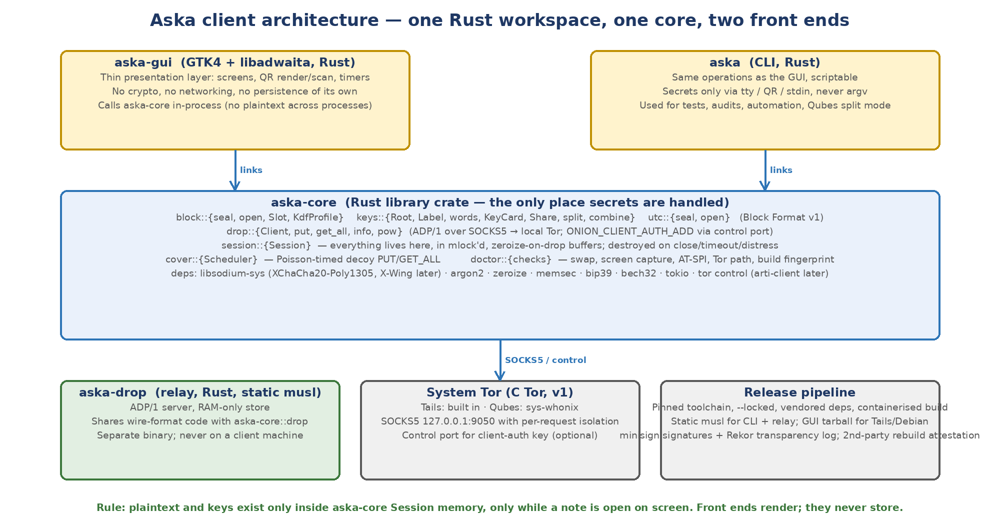
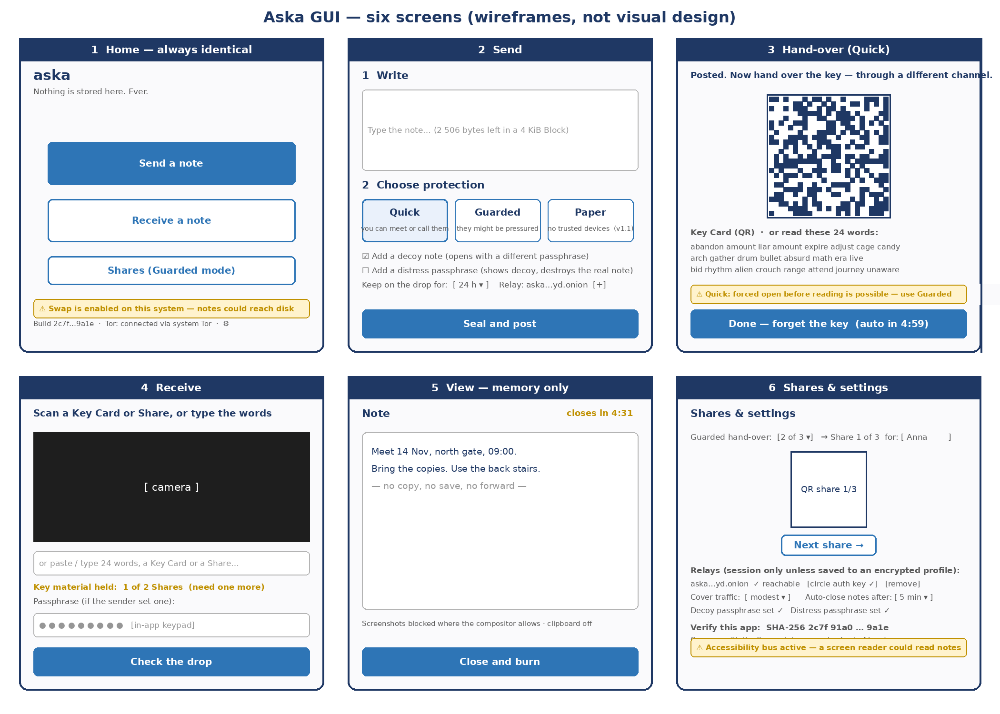

# Aska Client Design

## Version 0.7 — 8 October 2026 — core library, command-line client, graphical client, platform procedures, build and release

- **Status:** Version 0.7 brings the design into line with **release 1.1.0** (8 October 2026), the first feature release after 1.0.x. Ground truth: **release 1.1.0 (tag `v1.1.0`; development commit `fb445fd`)**; where this document and the code differ, the code is authoritative and this document follows it, except where a normative requirement is stricter than the code — those places carry a marked *Implementation status* note. The notes of v0.6 that 1.1.0 resolves are marked *Resolved in 1.1.0* in place. Version 0.6 brought the design into line with releases 1.0.0 and 1.0.1 and folded in the client-side findings of the *Internal Pre-Review Report v0.1* and the owner's decisions D-18…D-21; version 0.5 folded in *Design Change DC-01 — Networks that block Tor v0.2* (D-16, CLI-15), *Design Change DC-02 — The receiving-key path (X-Wing), pulled forward v0.1* (D-17, KEY-09…KEY-12), the Whonix support and GUI packaging added at M6 preparation, and the M6 platform-validation findings (*Platform Validation Checklists M6 v0.2*); all of that remains incorporated. The seven open issues of v0.1 were decided on 25 September 2026 (§12, C-01…C-07) and remain incorporated; C-06 settled as English default with user-selectable supported languages. This document is a design, not a specification: it fixes architecture, behaviours and user flows; exact APIs are settled in code.
- **What v0.7 folds in, in one line:** the 1.1 work list (*Aska 1.1 — Plan v0.3*) as built — hardening (the distress closing line, `receive --class`, circle keys cleared at close (C-15), CLI profile path checks (C-14), profile passphrase normalisation (C-5), CLI `--ttl` restricted to the six cover TTLs (CLI-06), the strict Key Card decoder (B-7)); CLI input in locked memory (C-10) with its gate; the GUI memory gate's passphrase and words needles (C-17); receiving seeds in the encrypted profile (RM-09, TLV 0x10); the finding that no application can exclude its own window from Wayland capture, with the pointer to KDE Plasma's per-window action; in-process camera scanning through Video4Linux2 in the new `aska-scan` crate (C-04, decision **D-22** — not the desktop portal); and the read-only note viewer that keeps the note out of the toolkit (C-02, View side). Session-scoped bridges (RM-08) were dropped from 1.1 by the owner on 8 October 2026 and stay on the roadmap with no release assigned.
- **Satisfies:** CLI-01…CLI-15, KEY-09…KEY-12 and OPS-01…OPS-07 of *Aska — Decision Record and Threat Model v0.5* (OPS-05 and OPS-06 waived for 1.0.x and 1.1.0 by D-19, §10); builds on *Block Format v1 draft 0.7* and *Dead Drop Protocol ADP/1 draft 0.4*. Findings and their dispositions: *Internal Pre-Review Report v0.1*; the work list: *Aska 1.1 — Plan v0.3*; release facts: *Release records v1.0.0, v1.0.1 and v1.1.0* (`docs/releases/`; the last not yet written at the time of this revision); the shipped documents: *User Guide 1.1* and *Relay Operator Guide 1.1*.
- **Depends on decisions:** D-03 (desktop Linux first, Tails/Qubes reference), D-04a/b, D-07 (decoy + distress), D-10 (modest cover traffic), D-11 (warn, do not refuse), D-16 (networks that block Tor: detect and direct, never configure Tor, never a non-Tor path), D-17 (receiving-key path in v1), D-18 (bech32m prefixes stay for v1), D-19 (1.0.x and 1.1.0 released without external security and legal review), D-20 (distribution: public GitHub repository, minisign-signed releases built natively on Debian 13), D-21 (platform validation of the signed releases: Debian 13 smoke test only), **D-22 (camera: in-process Video4Linux2, not the desktop portal)**, P-05 (Rust), P-06 (C Tor in v1).
- **Two front ends:** a **command-line client** (`aska`) for testing, scripting, audit and Qubes split mode, and a **graphical client** (`aska-gui`) for everyday use by the circle. Both are thin layers over one core library; neither holds secrets of its own.
- **Not in this document:** the relay (ADP/1 spec), the paper/one-time-pad mode (RM-01), the mobile client (RM-02; see DC-01 §6a for the Tor requirement it inherits). Of the v1.1 work items named in v0.6 as not started, four are **built in 1.1.0** and described here — receiving seeds in the profile (RM-09, §3.4, §4, §5.4, §5.6.2, §5.6.3), the camera (C-04 as redecided by D-22, §4.4, §5.4, §6.6), unbuffered CLI reads (C-10, §4.3) and the custom read-only viewer (C-02, §5.5) — one was **closed by a finding** (the KDE Wayland capture flag: no such flag exists for an application to set; §6.2), and one was **dropped from 1.1 by the owner** (session-scoped bridges, RM-08, DC-01 option B; §2.4, §12).

---

# 1. Scope and design principles

This document designs the software a member of the circle runs: the **core library** that implements the Block Format and the Dead Drop Protocol and holds every secret; the **command-line client** that exposes the core for testing, scripting and audit; and the **graphical client** that the circle uses day to day. It also fixes how the client behaves on the two reference platforms (Tails and Qubes OS), how it detects and warns about a weak environment, and how it is built and released so that anyone can verify the binary they run is the one that was published.

Five principles, each traceable to a research finding, govern every decision below.

1. **One core, two faces.** All cryptography, networking and secret handling live in one Rust library (`aska-core`). The CLI and the GUI are presentation layers linked into the same process; they never see raw key material except to display it for hand-over, and they never persist anything. Two front ends over one core means one audit surface, one set of tests and no way for the GUI and CLI to disagree about the format. (CLI-01) *Since 1.1.0* a second small library, `aska-scan`, reads the camera and decodes QR codes for both front ends; it holds no key and knows nothing of the format — it hands back the text it read (§2.1, §6.6).
2. **Nothing is stored.** The client has no database, no history, no contacts, no "sent" folder, no cache and no log. Every launch presents the same empty screen to a returning user and to a border officer. The only optional persistence is a user-created encrypted profile holding relay addresses, the circle auth key and — since 1.1.0, at the user's explicit request — receiving seeds (CLI-04, CLI-11, RM-09; §3.4).
3. **Plaintext exists only on screen.** Notes and keys live in locked, zeroise-on-drop memory inside a `Session` object and are destroyed on close, on timeout and on distress. The rendering widget is the only consumer. (CLI-03, T-08, T-10) The places where a copy necessarily lives outside locked memory — toolkit buffers, the KDF's working memory, front-end input buffers — are listed in §3.1 and §7. *Since 1.1.0* two of those places are gone: the CLI reads every line of input straight into locked memory (C-10, §4.3), and the View screen draws the note from a locked buffer of its own instead of a GTK label (C-02, §5.5). The GUI's Send editor remains a GTK text view (§7).
4. **Warn loudly, refuse rarely.** The target users are experts under real threat; the client detects swap, screen capture, accessibility services, a non-Tor path and an unverifiable build and says so plainly at the moment it matters — but it does not lock them out. (D-11, CLI-09, CLI-14)
5. **Verifiable by anyone.** Reproducible builds, signed releases, an in-app verification and no automatic updates: a member can confirm that the binary on their Tails stick is byte-for-byte the published one, without trusting the person who handed it to them. (CLI-10, OPS-01…03, T-18) *As released (1.0.x; 1.1.0 follows the same procedure):* the releases are minisign-signed and `aska verify` checks the binary offline against the signed hash list it ships with; no transparency-log entry was made for 1.0.x, and the independent rebuild is still open (§9, D-20). The 1.1.0 fingerprints are not known at the time of this revision (1.1.0 — see the release record).

A sixth principle follows from the decisions of 30 September 2026 and is restated here because it shapes §2.4, §4, §5 and §8: **Tor is the only path, and the platform owns Tor.** The client never configures Tor, never obtains bridge lines from anywhere, never probes or fingerprints the network it is on, and never falls back to a non-Tor path. When the local network blocks Tor, the client says so where it can tell, and directs the user to the platform's own connection tool — Tor Connection on Tails, the Anon Connection Wizard on Whonix, Tor Browser's connection settings elsewhere — and can use Tor Browser's Tor once that has connected (D-16, CLI-15). On a network whose owner forbids Tor, the correct response is to use another network; the client's messages do not suggest otherwise (DC-01 §9). Release 1.1.0 keeps this behaviour unchanged: the session-scoped bridge configuration of DC-01 option B (RM-08) was dropped from 1.1 by the owner on 8 October 2026 (§2.4).

# 2. Architecture

*Figure 1 — One Rust workspace: the core library, two front ends, the relay, and the system Tor they rely on. (Drawn at v0.1; the `aska-scan` library of 1.1.0, used by both front ends, is not in the figure — Table 1.)*

## 2.1 Workspace layout

| Crate | Type | Responsibility | Secrets? |
|---|---|---|---|
| `aska-core` | library | Block Format v1 (seal/open, KDF profiles, UtC), keys and Shares, encodings (Key Card, Shares, Receiving Key), X-Wing receiving-key path, ADP/1 client over SOCKS5, Tor control-port client-auth and bootstrap query, Session and memory handling, cover-traffic scheduler, environment checks ("doctor"), platform detection (Tails, Whonix, KDE Plasma version), QR encoding and terminal rendering, the encrypted profile (with receiving seeds since 1.1.0), release-signature verification (`fingerprint`). | **Yes — the only place.** |
| `aska` | binary | Command-line client. Argument parsing, terminal I/O into locked memory (1.1.0, C-10), QR rendering to the terminal, camera scanning through `aska-scan` with the external helper as fallback (1.1.0; until 1.0.1 the helper only). No crypto of its own. | Displays for hand-over only. |
| `aska-gui` | binary | GTK4 + libadwaita graphical client. Screens, widgets, timers, the in-app keypad, QR display, the word-at-a-time note viewer (1.1.0, C-02), camera scanning through `aska-scan` with a viewfinder and the helper as fallback (1.1.0, §5.4). No crypto of its own. | Displays for hand-over only. |
| `aska-scan` | library | **New in 1.1.0 (C-04, D-22):** camera capture through the Video4Linux2 user-space ABI with `libc` alone, luma extraction for the raw formats, QR decoding with the pure-Rust `rqrr`; `scan()` with timeout, cancel flag and a downscaled preview for a viewfinder (§6.6). Licence MIT OR Apache-2.0 (C-01). | No key; the frames it holds may show a QR code of key material and are wiped (§6.6). |
| `aska-drop` | binary | ADP/1 relay (specified separately). Shares only the wire-format module with `aska-core`. | Never — holds noise. |
| `aska-proto` | library | ADP/1 wire encoding shared by `aska-core` and `aska-drop`. *As built:* depends on `sha2` and `thiserror`, with `tokio` as an optional feature for the asynchronous client used in the relay's tests (v0.5 said "no dependencies beyond `bytes`"). | No. |

*Table 1 — Cargo workspace. Workspace version 1.1.0; six crates since 1.1.0 (`aska-scan` added in commit `2dc31fc`); crates are marked `publish = false` (released as signed tarballs, not on crates.io); repository `https://github.com/secunos/aska` (D-20).*

## 2.2 Why GTK4 for the graphical client

Three options were weighed. A **web-technology shell** (Tauri/Electron) is excluded by CLI-01 and T-19: even with bundled assets it runs a browser engine whose JavaScript strings cannot be zeroised and whose attack surface dwarfs the rest of the client. A **pure-Rust immediate-mode toolkit** (iced, egui) has no platform dependencies and renders itself, which is attractive for reproducibility, but it lacks mature accessibility hooks, camera integration and native Wayland behaviour, and looks foreign on Tails. **GTK4 with libadwaita via `gtk4-rs`** is what Tails' GNOME desktop is built from, is already installed there and on any Debian, integrates with the camera through PipeWire and the portal APIs, and lets the client look like a native GNOME application — which matters for a tool that must not attract attention. Its cost is a dynamic dependency on system GTK, which §9 addresses. GTK4 is the decision for v1; the core's API is toolkit-agnostic so this can be revisited. The build requires GTK 4 ≥ 4.14 and libadwaita ≥ 1.5 (Debian 13, Ubuntu 24.04 or later, Tails 7; crate features `v4_14` and `v1_5`); the GUI is linked dynamically against them and against the build machine's glibc, which is why release tarballs are built on Debian 13, the oldest supported glibc (§9.1, §9.5). *As built (1.1.0):* the camera is **not** read through PipeWire or the portal after all — `aska-scan` reads Video4Linux2 directly, in process, for both front ends (D-22, §6.6); the toolkit's camera integration named above was one of the reasons for GTK4 but is not used.

## 2.3 The Session — where secrets live

A `Session` is created when the user starts a Send or Receive flow and destroyed when it ends. It owns every secret in `aska-core`: the root R, derived keys, Shares held so far, the plaintext of an open note and the passphrase buffer. All of these are held in locked buffers and wrapped in zeroise-on-drop types; the Session refuses to start if `mlock` fails and the user has not explicitly accepted the warning. *As built:* the locked buffer is Aska's own `LockedBuf` (`aska-core::secret`: page-aligned allocation, `mlock`, `madvise(MADV_DONTDUMP)`, the whole capacity zeroised before release) — not the `memsec` crate named in v0.5. The Session exposes a small, deliberate API — `seal(note, slots, level)`, `post(relays, ttl)`, `hand_over_material()`, `add_key_material(words | keycard | share)`, `check_drops()`, `open(passphrase)`, `close()`, `distress()` — and nothing that returns owned copies of secrets to the front end except the hand-over material, which the front end must display and then drop. A watchdog closes the Session after a configurable idle time (default five minutes) and the front end mirrors that with an on-screen countdown.

**The API as built (1.0.x, unchanged in 1.1.0 except where marked).** The design names above map to: `compose` / `set_passphrase` / `add_decoy` / `set_distress` (each also as a `…_locked` variant taking a `LockedBuf`), `seal(level)`; `post_job()` + `record_post()` for posting from a worker (and the blocking convenience `post()` for the CLI); `hand_over_words()`, `hand_over_keycard()`, `share_text(i)`, `split_shares(k, n)`, `sealed_block()` (split mode); `add_key_material(input)`, `fetch_job()` + `accept_fetch()` (and the blocking `check_drops()`), `accept_bucket(records)` (split mode); `open(passphrase)` / `open_locked`, `plaintext()`; `tick()` (the watchdog), `keep_alive()`, `close()`, `distress()`. A `PostJob` or `FetchJob` owns only public data — ciphertext, label, relays — and a cancel token; while one is in flight the idle watchdog is suspended and its clock is refreshed when the job ends, so a slow Tor fetch can never destroy the key material the user is waiting on. `open()` returns an `OpenInfo` whose `distress` field is for the core's tests only: a front end **MUST NOT** display it or let it change anything observable (pre-review A-10; §6.4 records what the front ends do). *Since 1.1.0:* `close()` also clears the circle auth keys held in the Session's relay configuration (C-15; §3.1), and `add_receiving_seed_bytes(&[u8; 32])` takes a seed held as bytes — one stored in the encrypted profile — beside `add_receiving_seed(words)` (RM-09; §3.3).

Version 0.5 added the receiving-key path to the same object (DC-02; §3.3): on the sending side `set_recipient(askar)` names the Receiving Key to seal for, `recipient_check()` gives its **twelve-character check** (three groups of four, a hash of the public key; pre-review B-1 — v0.5 said eight characters) and `sealed_for_recipient()` says that no hand-over material exists; on the receiving side `add_receiving_seed(words)` takes the 24 seed words and `has_receiving_seed()` reports that mode. The receiving seed, like the root, lives in a locked buffer owned by the Session and is destroyed with it — on `close()`, on `distress()`, by the watchdog, on drop, and (since the pre-review, A-3) when the distress slot of a note is opened. Because of that last rule a front end that wants to say "this receiving key has been used" after the note burns must decide so **before** `open()`, not by asking `has_receiving_seed()` afterwards; both front ends do so since 1.1.0 (§6.4). Two further additions came out of the M5 gates: `keep_alive()` lets the View screen count the user's attention as activity so the idle watchdog does not race the note's own countdown, and `set_relays()` may be called while a sealed Block is waiting to be posted and, on the receiving side, while Collecting or Fetched, so a user can offer another relay without starting over.

## 2.4 Tor integration

Version 1 uses the **system Tor** (P-06): on Tails it is always present; on Qubes it is provided by `sys-whonix` to any Whonix-based qube; on plain Debian the user installs `tor`. The core connects through SOCKS5 with hostname addressing and **per-request isolation** (a random SOCKS username/password pair per connection, which Tor maps to a separate circuit), so a PUT and a later GET_ALL never share a circuit. If the Key Card carries a circle auth key (TLV 0x06), the core installs it for the session via the control port (`ONION_CLIENT_AUTH_ADD` with `ClientName` unset and `Flags=` none, so it is not persisted). **On Tails this is not supported in v1 (C-03):** Tails filters the control port through onion-grater and `ClientOnionAuthDir` requires a root-level torrc change, so the client detects Tails, explains that client-authorised relays cannot be reached from it, and offers any relay in the Key Card that does not require auth. Circles with Tails users therefore keep at least one relay without client auth. The core refuses any destination that is not a `.onion` address and any proxy that is not loopback. Embedding Arti is a roadmap item.

**Whonix (added at M6 preparation).** The same control-port filtering exists on Whonix, so C-03 applies there too: `platform::control_port_filtered()` is true on Tails and on Whonix, `tor::client_auth_add` refuses on both with "client-authorised relays are not supported on Tails or Whonix in v1 (C-03: the control port is filtered there)", and a Key Card whose relays all require a circle key is refused before any network step with "every relay needs a circle key, which cannot be installed on Tails or Whonix (C-03)". Whonix is detected by `/etc/whonix_version`, `/usr/share/whonix` or `os-release`. A Whonix Workstation has no Tor of its own: its Tor runs in the gateway qube at the fixed address **10.152.152.10:9050**. That address is the **single exception** to the loopback rule — `platform::default_socks()` returns it on Whonix (loopback 9050 everywhere else) and `tor::require_loopback` and the CLI's `parse_loopback` accept it only when Whonix is detected. Any other non-loopback proxy is still refused, and on Whonix `--socks 127.0.0.1:9050` is refused by the doctor because nothing listens there (checklist C3 proves both).

**The source of Tor: system Tor by default, Tor Browser's Tor as the alternative (D-16).** Tor Browser runs its own Tor on 127.0.0.1:9150, and a user who had to connect it through a bridge already has a working Tor; Aska can use it. The CLI's `--tor-browser` option points the client at 127.0.0.1:9150 (it conflicts with `--socks`); the GUI has a Tor source setting — *System Tor (port 9050)* / *Tor Browser's Tor (port 9150)* — and offers the switch from a Tor finding on Home (§5.1, §5.6.3). The choice lives in the session; it is never written to a plain settings file.

**When the local network blocks Tor, Aska cannot work around it by itself:** it uses the system Tor and writes no configuration, so it neither edits `torrc` nor issues `SETCONF`, and it never fetches bridge lines or falls back to a clearnet path. What it does is detect and direct (D-16, CLI-15). With a control port configured — or, since `70824f3`, discovered: when none is given, the SOCKS port is the platform default and the platform does not filter the control port, `tor::with_discovered_control` uses 127.0.0.1:9051 with the cookie at `/run/tor/control.authcookie` if, and only if, that cookie is readable by the user; nothing is written — the doctor asks `GETINFO status/bootstrap-phase`; a Tor whose SOCKS port answers but whose bootstrap is below 100 % is reported as the warning `Check::TorNetwork` — "Tor is running but has not reached the Tor network (bootstrap N %); nothing can be sent or fetched until it does." — followed by the platform's direction (Table 4; `tor::blocked_network_guidance`, quoted in §4.1). An old Tor without the field raises nothing, and the existing `status/circuit-established` check then applies. Without a control port the condition cannot be told from a slow start at doctor time; instead, when every network attempt of an operation fails with the **signature of a blocked network** — Tor's own verdicts: a timeout inside Tor's SOCKS exchange (the rendezvous), or a SOCKS reply of "general failure" (0x01) or "host unreachable" (0x04) (`tor::looks_like_blocked_network`) — the same direction is given once at failure time. A refused loopback connection or a bad address is not the signature, and **since the pre-review (C-12) neither is a relay that accepted the connection and then stalled**: an I/O timeout on an established relay stream (`DropError::Timeout`) is a slow relay, not a blocked network, and gives no bridge advice. **Control-port filtering on Tails and Whonix means the bootstrap warning is not available there:** the control port is filtered by onion-grater on both, so the doctor's `TorNetwork` query is unavailable to the client and the direction is given at failure time only; the GUI must not and does not show a bootstrap warning on Tails (checklist B4). Session-scoped bridge configuration through the control port (DC-01 option B, RM-08) was planned for v1.1 in v0.6; **on 8 October 2026 the owner dropped it from 1.1** (Plan v0.2): release 1.1.0 keeps the 1.0 behaviour exactly — detect and direct, configure nothing — and RM-08 stays on the roadmap in the Decision Record with no release assigned. Automatic bridge acquisition (option C) remains rejected.

# 3. Core library design

| Module | Contents | Notes |
|---|---|---|
| `block` | `seal`, `open`, `Slot`, `KdfProfile`, size-class arithmetic, header/inner encoders | Byte-exact with the reference implementation; validated against `test_vectors.json` in CI. `seal` takes an optional KEM region (the receiving-key path, DC-02). Header indices are permuted per Block (pre-review A-1; Block Format draft 0.6 §6.1). Unchanged in 1.1.0 (no format change). |
| `utc` | Key-committing AEAD wrapper over XChaCha20-Poly1305 | Constant-time commitment compare (`subtle`). *As built:* the AEAD is the RustCrypto `chacha20poly1305` crate, not libsodium's `crypto_aead_xchacha20poly1305_ietf` as v0.5 said (Table 5). |
| `keys` | `Root`, `Label`, `Words` (BIP-39), `KeyCard` (TLV + bech32m), `Share`, `split`, `combine`, onion address helpers | All secret-bearing types are `Zeroize + ZeroizeOnDrop` and `!Clone`. `Root` has no `PartialEq`; it compares with `Root::ct_eq` (pre-review A-5). The GF(2⁸) multiply used by `split`/`combine` is branch-free (A-4). |
| `encodings` | `KeyCard` (`aska1…`), Share (`askas1…`), `ReceivingKey` (`askar1…`, long-form bech32m checksum, `check()` = twelve characters derived from the public key); the TLV type constants, including `TLV_PROFILE_SEED = 0x10` (1.1.0) | The Receiving Key exceeds bech32m's 1 023-character code-length limit; the checksum is computed as in BIP-350 without that limit (DC-02 §2.5). The decoder rejects non-canonical strings (the key must re-encode to the text given) and more than eight relay hints (pre-review B-3). **The check (pre-review B-1):** the first 60 bits of SHA3-256(`"aska/v1/rk-check"` ‖ pk_M ‖ pk_X), written as twelve bech32 symbols in three groups of four (`xxxx-xxxx-xxxx`), computed from the **decoded** public key on both sides — relay, class and TTL hints, padding and the checksum do not enter (Block Format draft 0.6 §7.5.3). v0.5's "last eight characters" were an affine function of attacker-chosen fields and could be forged in milliseconds; a substitute key with the same check now costs a 2⁶⁰ second-preimage search. The human-readable prefixes stay for v1 (D-18; DC-03 declined). **Strict Key Card decoding (pre-review B-7, 1.1.0):** `KeyCard::from_bytes` now enforces Block Format §7.3 — the version element first and single with exactly `[FORMAT_VERSION]`; root, class, TTL and auth at most once each with exactly their defined lengths; relays repeatable; unknown types skipped; anything else `Encoding` — in Rust and in the Python reference (four unit tests: `version_must_be_first_and_single`, `duplicates_and_wrong_lengths_are_rejected`, `unknown_types_are_skipped`, canonical round trip). The skip rule is what lets a 1.0.x client open a 1.1 profile without seeing its seeds (§3.4). |
| `xwing` | X-Wing (ML-KEM-768 + X25519 + SHA3-256, draft-connolly-cfrg-xwing-kem-11) composed from `ml-kem`, `x25519-dalek` and `sha3`; `generate_seed`, `new_seed_words`, `receiving_key_from_words`, **`receiving_key_from_seed`** (1.1.0: the same for a seed held as 32 bytes, RM-09), `validate_public_key`, `encapsulate`, `Expanded::from_seed` / `decapsulate`, `root_from_shared_secret`; Elligator2 encoding of a torsion-dirty ephemeral | Draft-11 test vector 1 reproduced in a unit test; uniformity of the 32-byte representative tested. The seed is 32 CSPRNG bytes shown with the root's 24-word encoder (KEY-09). `validate_public_key` (pre-review B-6) checks the ML-KEM half against FIPS 203's modulus check and rejects an X25519 half that gives a non-contributory shared secret. |
| `kdf` | HKDF-SHA-512, Argon2id with profile table | Profile 1: t = 3, m = 256 MiB, p = 1; profile 2: t = 3, m = 64 MiB. *As built:* Argon2id runs on the calling thread (the GUI calls `seal` and `open` from a worker, §5.7; v0.5 said "a dedicated thread"); its working memory is caller-owned, **zeroised after each derivation and not locked** (pre-review C-11, owner acceptance; §3.1). |
| `drop` | ADP/1 client: `info`, `put` (with PoW solve), `get_all`, `fetch` / `fetch_all`, decoy PUT/GET; SOCKS5 with isolation; control-port auth | One connection per request; read timeouts; refuses non-onion. Every record label of a fetched bucket is wiped after matching and when a `FetchOutcome` is dropped (memory gate, `c6baeda`). |
| `tor` | SOCKS5 connect with per-request isolation; `check_socks`; control-port client (`client_auth_add`, `circuit_established`, `bootstrap_progress`); `with_discovered_control`; `looks_like_blocked_network`; `blocked_network_guidance`, `blocked_network_cli_hint` | Loopback-only proxy, with the Whonix gateway as the one platform exception (§2.4). |
| `platform` | `is_tails`, `is_whonix`, `WHONIX_GATEWAY`, `control_port_filtered`, `default_socks`, swap / memlock / session-type / process-name probes, core-dump disabling; **`plasma_version`, `plasma_can_hide_window`** (1.1.0) | Read-only; the doctor's and the Session's view of the host. `plasma_version()` runs `plasmashell --version` only when `XDG_CURRENT_DESKTOP` names KDE and parses "plasmashell 6.6.2" into (6, 6); `plasma_can_hide_window` is true from 6.6 (§6.2). |
| `session` | `Session` state machine (Idle → Composing → Sealed → HandOver ⇄ Posted → Closed; Idle → Collecting → Fetched → Opened → Closed), watchdog, distress, detached `PostJob` / `FetchJob`; `add_receiving_seed_bytes` (1.1.0) | The only owner of secrets. `close()` clears the circle auth keys as well since 1.1.0 (C-15). |
| `secret` | `LockedBuf` (page-aligned, `mlock`, `MADV_DONTDUMP`, zeroised before release; `truncate` zeroising since 1.1.0), `scrub_stack` | The only `unsafe` in `aska-core` besides the process-limit calls in `platform`. `LockedBuf` is also what the CLI's line reader fills since 1.1.0 (§4.3). |
| `cover` | Poisson-scheduled decoy PUT/GET_ALL while the app is open; decoy Blocks are CSPRNG bytes with random labels; decoy TTL drawn from the real TTL choices (pre-review C-3); `TTL_CHOICES_HOURS = [1, 6, 24, 48, 72, 168]` | Default rate: a few per day per relay (D-10); adjustable. v0.5 said "1–3 h TTL" — superseded (§6.5). Since 1.1.0 the CLI's `--ttl` is restricted to `TTL_CHOICES_HOURS` as well (CLI-06). |
| `doctor` | Environment checks (Table 4) returning structured findings for the front ends; since 1.1.0 the Plasma capture `Info` findings | Read-only probes; never writes. |
| `qr` | QR encode to a module matrix and to the terminal (half-block and ASCII renderings) | Uses the `qrcode` crate; the matrix and every rendering are zeroised on drop. *As built:* there is no decoder in the core (v0.5 named "decode from camera frames"). Until 1.0.1 both front ends read QR codes through the external `zbarcam` helper; **since 1.1.0** they decode in process through the separate `aska-scan` crate (`rqrr`), with the helper as fallback (§6.6) — `rqrr` is a dependency of `aska-scan`, not of the core. |
| `profile` | The optional encrypted profile (C-07): `seal_profile`, `open_profile`, `PROFILE_LEN = 4096`; since 1.1.0 `Profile.seeds`, `StoredSeed { index, check }`, `stored_seeds()`, `seed_by_check()`, `add_seed()`, `remove_seed()`, `MAX_SEEDS = 8` (RM-09, §3.4) | A class-1 Block of exactly 4 096 bytes under a fixed public root and Argon2id profile 1. `open_profile` returns `BadLength` for a file that is not of a class length (pre-review A-7; the code comment that says every failure is `NoSlot` is wrong on that point); a class-length file that does not open gives `NoSlot`. The passphrase is NFKC-normalised in two passes into a pre-sized zeroising buffer since 1.1.0 (C-5 applied to profiles; §3.1). |
| `fingerprint` | Hashes the running binary; holds the embedded release public key and tag; finds and verifies the signed `SHA256SUMS` | Embedded at release-build time (§9.2). Self-consistency only (pre-review C-19). |
| `shares`, `cancel`, `rng`, `consts`, `error` | Shamir over GF(2⁸); cancel tokens that abort a socket mid-request; the OS CSPRNG wrapper; constants; the error type | — |

*Table 2 — aska-core modules.*

## 3.1 Memory handling rules

- Secret types (`Root`, `SlotKey`, `Passphrase`, `Plaintext`, `Share`) live in `mlock`ed pages allocated by `memsec` and are `ZeroizeOnDrop`; they implement neither `Clone` nor `Debug` output of contents. *As built:* every secret the Session holds between calls — root, seed, note, passphrases, decoy and distress texts, Shares, the opened plaintext — is a `LockedBuf` (Aska's own page-aligned allocation with `mlock` and `madvise(MADV_DONTDUMP)`, the whole capacity zeroised before it is freed; §2.3). `Root`, `SlotKey` and `Share` are short-lived value types used inside a call: `Zeroize + ZeroizeOnDrop`, `!Clone`, `Debug` redacted. There are no `Passphrase` or `Plaintext` types; passphrases and plaintext are `LockedBuf`s. With `accept_unlocked_memory` false, every single secret buffer must lock or the operation fails with `MemoryUnlocked`.
- The process disables core dumps (`prctl(PR_SET_DUMPABLE, 0)`, `RLIMIT_CORE = 0`) at start. A side effect that matters for testing: a non-dumpable process cannot be traced or read by a non-root process, which is why the write and memory gates run as root (§10.1).
- **Argon2id's working memory is zeroised after each derivation but is not locked** (pre-review C-11; owner acceptance, Pre-Review Report §3 item 1). v0.5 said "allocated locked and zeroised"; neither was true until the pre-review, and only the zeroising is true now. The block memory is caller-owned (`hash_password_into_with_memory`) and wiped after every derivation, success or failure. Locking 64–256 MiB is incompatible with common default `RLIMIT_MEMLOCK` values (8 MiB), so the memory could reach swap while a derivation runs; the swap warning (Table 4) and the Tails / no-swap guidance remain the mitigation (§7). The 256 MiB profile is run once per (Block, passphrase) and never per header; when no slot opens with profile 1, the open is repeated once with the mobile profile 2 (64 MiB), which the Session tries as well (`open_profiles = [P1, P2]`). An open without a passphrase runs no Argon2id at all.
- **Passphrase normalisation goes straight into locked memory** (pre-review C-5): NFKC is computed in two passes over the normalisation iterator — the length first, then the characters encoded one by one through a 4-byte stack scratch into a `LockedBuf` of exactly that size — so no prefix of a passphrase is left in a reallocated, unlocked `String`. (The encrypted profile's own passphrase path in `profile.rs` still normalised into a zeroising `String` in 1.0.x — unlocked, wiped on drop; recorded in §7.) **Resolved in 1.1.0 (C-5 for profiles, step 1):** `profile::nfkc` now does the same two passes — length, then characters through a 4-byte scratch that is zeroised afterwards — into a `Zeroizing<Vec<u8>>` of exactly that length, so no partial copy is left by growth. That buffer is zeroising, not locked (it lives for one seal or open and is wiped on drop); the `Slot` it is copied into is `ZeroizeOnDrop` as well. The profile passphrase therefore stays in §7's list of zeroised-not-locked buffers, with the growth residual gone.
- **The Session refuses an empty passphrase** for the note, a decoy or the distress slot (`EmptyPassphrase`, pre-review A-6): an empty or whitespace-only passphrase would create a slot no receiver can reach, because every front end maps an empty entry to "no passphrase". Opening is unaffected — an empty entry there means "the sender set none".
- **Distress replaces the root rather than removing it** (pre-review A-2): on a distress open the root is overwritten with fresh random bytes, so a follow-on `open()` on the same Session does the same Argon2id work as after a decoy and fails with `NoSlot`, instead of failing at once with `WrongState` (which a coercer could have timed). The label, the key's relays, every Share and the receiving seed are cleared (A-3); the Block stays (public ciphertext), so the follow-on behaviour is identical (§6.4).
- **A Receiving Key is validated when it is named** (pre-review B-6): `set_recipient` decodes the `askar1…` text and runs `xwing::validate_public_key`; an invalid key fails with `BadReceivingKey` before anything is composed, instead of at sealing.
- Camera frames used for QR decoding are single buffers overwritten by the next frame and dropped when the scanner closes. *As built until 1.0.1:* no camera frame entered the process — the `zbarcam` helper decoded and passed only the decoded text on its standard output, which the front end read into a zeroising buffer. **As built since 1.1.0 (C-04, D-22; §6.6):** frames do enter the process, through `aska-scan`: the camera's kernel buffers are mapped with `mmap` (four requested) and marked `MADV_DONTDUMP`; each dequeued frame is reduced to one greyscale working buffer (`Zeroizing<Vec<u8>>`) that is overwritten by the next frame and zeroised when a code decodes; every mapping is blanked (`write_bytes` to zero) before it is unmapped; and the decoded text is moved into zeroising memory at once. One residual remains: the decoder (`rqrr`) hands back a plain `String` whose heap is freed unwiped — the same class of residual as the GUI's toolkit copies, measured by the GUI memory gate (§7, §10.1). The mappings themselves are device memory the kernel owns; they are not `mlock`ed by the client.
- Text entered in the note editor is held in a core-owned `Plaintext` buffer; the GTK text buffer is cleared and the widget destroyed on Session close (GTK cannot guarantee zeroisation of its own buffers — documented residual, §7). *As built:* the editor is a GTK text view; its text is copied into the Session's locked buffer when the user seals, and the widget is then wiped with a same-length filler (§5.7). **The View side is resolved in 1.1.0 (C-02, step 6):** the note is no longer put into a `gtk::Label` — the `NoteView` widget copies it from the Session's locked buffer into a locked buffer of its own and draws it one word at a time (§5.5). **The Send editor is still a GTK `TextView`** (and so are the decoy and distress editors and the key-material view): C-02 remains open for input (§7).
- Nothing is written under `$HOME`, `$XDG_*` or `/tmp` at any time. The optional encrypted profile is the single exception and is written only on explicit user action — since 1.1.0 that includes **rewriting it in place** when the user stores or removes a receiving seed (§3.4). (`install.sh` writes the installed files once, at installation, and is not part of the client; §9.5.)
- The receiving seed and the X-Wing private material derived from it follow the same rules: the seed is a locked buffer in the Session, the expanded decapsulation key exists only for the duration of one bucket match and is dropped afterwards, and the sender's root derived from the KEM shared secret is cleared immediately after sealing (KEY-10). The core memory gate has a second test with these as needles (§10.1). A seed **stored in the profile** (1.1.0) is additionally held, while the profile is open, as a `Secret32` (zeroised on drop; the type the circle auth key already used) in the front end's profile state — in the CLI for the life of the command, in the GUI for the run — and is copied into the Session's locked buffer by `add_receiving_seed_bytes` when chosen (§3.4).
- Secret-handling bodies of `seal`, `open`, `add_key_material`, `add_receiving_seed` (and `add_receiving_seed_bytes`), `accept_fetch` and `accept_bucket` (the last two since the pre-review, B-5) are `#[inline(never)]` inner functions whose caller scrubs the stack afterwards; `[u8; 32]` secrets that live in structs that get moved (labels, relays' circle keys) are boxed so that a move leaves no copy behind. Both rules came out of the M5 memory gates.
- **Front-end buffers outside the core.** The rules above hold inside `aska-core`. Before a secret reaches the Session it passes through the front end: the GUI keypad's fixed-capacity zeroising buffer (§6.3), GTK text buffers (C-02, §7), and in the CLI — until 1.0.1 — the line reader's zeroising `String`s and the `BufReader`/`Stdin` buffers, which kept the last bytes read for the life of the process (pre-review C-10). **Resolved in 1.1.0 (C-10, step 2):** the CLI reads every line byte by byte into a fixed-capacity `LockedBuf` (`SecretLine`) and never through a buffered reader; the GUI's buffers are zeroised where Aska owns them, never locked (§4.3, §7).
- **Implementation status (1.0.x) — circle keys at close (pre-review C-15):** `Session::close()` cleared every secret it held but left the circle auth keys inside its relay configuration until the Session itself was dropped, which both front ends do immediately after closing. **Resolved in 1.1.0 (step 1):** `close()` sets `auth_key = None` on every relay of the Session's configuration before scrubbing the stack (`session.rs`, the loop over `cfg.relays`); `distress()` and `Drop` call `close()`, so all three paths clear them.

## 3.2 Randomness

All randomness comes from `getrandom(2)` (the kernel CSPRNG). For roots, the core additionally mixes in the SHA-512 of a short burst of timing jitter and, when available, `/dev/hwrng`; this is defence in depth for live systems whose entropy state at boot is uncertain (Tails) and costs nothing. The mixing construction is `HKDF(salt = os_random, ikm = jitter ‖ hwrng)` (info `"aska/v1/root-mix"`), so a failure of the secondary sources cannot weaken the OS randomness.

## 3.3 Session API additions for the receiving-key path (DC-02)

The receiving-key path reuses the Session's two flows; nothing new is persisted and no new state is added to the machine. Described at the level of §2.3:

- **Creating a key** is not a Session operation: `xwing::new_seed_words()` draws 32 CSPRNG bytes and returns them as 24 words, and `xwing::receiving_key_from_words(words, relays, class, ttl)` re-derives the public Receiving Key from them (KEY-09). The front ends call these directly, display the result and drop it. (DC-02 §6 named these `Session::new_receiving_key()` and `Session::receiving_key_public()`; the implementation keeps them out of the Session because no Session state is involved.) *Since 1.1.0:* `xwing::generate_seed()` gives the 32 bytes without the word encoding, and `xwing::receiving_key_from_seed(&[u8; 32], relays, class, ttl)` re-derives the public key from a seed held as bytes — what the profile stores (RM-09; §3.4). The check of a stored seed is computed from the public key alone, so it is the same whatever relay hints are given — which is why a stored key is *named* by its check in every list and prompt.
- **Sender.** `set_recipient(askar)` (DC-02's `compose_for`) is allowed in Idle or Composing; it decodes the `askar1…` string, validates the public key (B-6, §3.1), and if the Session has no relays configured the key's relay hints become its relays, and if no size class is pinned the key's class hint is used. `seal()` then takes the KEM path: X-Wing encapsulation gives the shared secret, `R = HKDF-SHA-512("", ss, "aska/v1/root-from-kem")`, and the Block is sealed as on the symmetric path with the KEM region carrying `ct_M ‖ rep_X`. **KEY-10 is implemented strictly:** the root is cleared immediately after sealing — only the label survives, which is all that posting needs — and `hand_over_words()`, `hand_over_keycard()`, `share_text()` and the Guarded level all refuse with `RecipientPath`. `recipient_check()` returns the key's **twelve-character check** (`xxxx-xxxx-xxxx`, §3 `encodings`; v0.5: eight characters) for the Posted screen; `sealed_for_recipient()` tells the front end to end on Posted instead of Hand-over.
- **Receiver.** `add_receiving_seed(words)` (Idle or Collecting) decodes the 24 words with the root's word decoder, stores the seed in a locked buffer, clears any root, label or Shares held, and puts the Session in Collecting. **`add_receiving_seed_bytes(&[u8; 32])` (1.1.0)** does the same from a seed held as bytes — the words path decodes and then calls the same inner function, so the two are one code path from the locked copy onwards. A fetch job for a seeded Session carries no label and asks for every record of every class from every relay; `accept_fetch` / `accept_bucket` then run **matching by decapsulation** (DC-02 §2.4): for every record, decode the representative, decapsulate, derive the would-be root and label, and compare with the record's label in constant time; the first match is kept, but every record is processed with the same work whether or not one matched (KEY-11; timing gate in §10.1). A match continues as on the symmetric path — `open(passphrase)` with the KDF profiles, decoy and distress slots unchanged. The receiver's relays are those configured (`--relay`, the profile, or the Receiving Key's own hints); there is no Key Card to name them.
- **Constant-work matching, as built since release 1.0.0** (`Session::match_records_with_seed`). Until 1.0.0 a hit did a little more work than a miss after the loop — a fresh locked page for the found root and one label derivation — which a GitHub runner measured at a few microseconds per bucket (hit − miss over 10 000 rounds: +4.9 µs). The pre-review had recorded this as finding B-4 and the owner had accepted it as not network-observable; **1.0.0 fixed it and that acceptance is superseded.** Now: (1) every record is decapsulated and its would-be label compared in constant time (`subtle`); (2) the matching record's root and Block are picked up by **branch-free conditional copies** into accumulators that every record passes through, guarded by "label equal, nothing found yet, same length as the bucket's first record"; (3) every candidate label and every record label is wiped, and every record's Block buffer is dropped zeroised, hit or miss; (4) after the loop **exactly one** root is locked and **one** label derived — the found root, or an all-zero stand-in; (5) on a miss the stand-ins (a locked page of zeros, its label, the zero Block accumulator) are parked in a `spent` slot and released with the Session, exactly as a hit's buffers are, so a miss ends with the same moves as a hit. Measured after the fix: +0.4 µs and +0.15 µs (within noise). The timing gate compares one seed against two buckets that differ in a single record (§10.1). Unchanged in 1.1.0.
- **Destruction.** The seed is destroyed with the Session: `close()`, `distress()`, the watchdog and `Drop` all clear it, together with `recipient` and the `kem_sealed` flag. Opening the **distress slot** of a note also clears it (pre-review A-3/C-2/B-9: the seed re-derives the root from a Block that is still on the relay). After a note opened with a seed burns, the front end tells the user the key has been used (KEY-07 as revised by D-17) — in 1.0.x not after a distress open; **resolved in 1.1.0** (both front ends decide the message before `open()`; §6.4). A seed stored in the profile is *not* destroyed by any of this — it is the user's long-lived key, kept at their request until they remove it (§3.4); only the Session's working copy goes.

## 3.4 The encrypted profile with receiving seeds (RM-09, 1.1.0)

The profile of C-07 — relays and an optional circle auth key in one random-looking 4 KiB file — can since 1.1.0 also hold **receiving seeds**, so that a receiver who keeps a long-lived Receiving Key need not type its 24 words each time a note may be waiting (step 3, commit `5386818`). The design points:

- **Format.** The plaintext of the profile Block is a Key Card TLV as before (version, the fixed public profile root in TLV 0x02, relays 0x03, auth key 0x06), **followed by** one `TLV_PROFILE_SEED = 0x10` element per seed: length 32, the raw seed bytes, in the order the user added them. Type 0x10 is **profile-only**: a Key Card MUST NOT carry it, and the Key Card decoder skips it as an unknown type (Block Format §7.3, enforced strictly since B-7). Consequence, tested in `seeds_round_trip_are_named_by_their_check_and_are_invisible_to_a_card_decoder`: a 1.0.x client opens a 1.1 profile and simply sees no seeds; a 1.0.x profile opens in 1.1 with an empty seed list. The file stays **one class-1 Block of exactly `PROFILE_LEN` = 4 096 bytes**, under the same fixed public root and Argon2id profile 1; nothing about it says whether it holds seeds, or how many.
- **Capacity.** At most **`MAX_SEEDS` = 8** seeds (`add_seed` refuses a ninth with `TooLarge`; `open_profile` refuses a file that claims more with `Encoding`); eight seeds and a few relays leave ample room in the 4 KiB payload. A seed already present is refused (`Encoding`), so a key is stored once.
- **Naming.** A stored seed is never shown. The user sees it as a `StoredSeed { index, check }`: its position in the file and the **twelve-character check** of the Receiving Key it yields — computed by `stored_seeds()` from the public key alone (no relay hints enter, §3 `encodings`), so it is the same check the receiver showed when the key was created and the sender saw on Posted. `seed_by_check()` accepts the check in any case and with or without dashes.
- **Core API.** `Profile.seeds: Vec<Secret32>` (zeroised on drop), `stored_seeds()`, `seed_by_check()`, `add_seed()`, `remove_seed()` (the removed seed is returned and zeroised when dropped); `xwing::receiving_key_from_seed` for the public key; `Session::add_receiving_seed_bytes` to receive with a stored seed (§3.3).
- **Writing: the file is rewritten in place.** Both front ends apply the C-14 checks before touching it (regular file, exactly 4 096 bytes, `symlink_metadata` so a link is not followed), open the existing file with `O_NOFOLLOW` for reading, open the profile with the passphrase, apply the change, seal a fresh 4 096-byte image under the **same passphrase**, open the same path with `O_NOFOLLOW` for writing, overwrite it and `fsync` — **no new file, no temporary, no rename** (`files::rewrite_profile` in the CLI; `settings::rewrite_profile` in the GUI). On an ordinary filesystem the same blocks are rewritten, and both images are random-looking Blocks; the "only thing Aska writes is the file you named" rule (§3.1) holds. Every rewrite asks for the passphrase again: in the CLI at a hidden prompt, in the GUI in a dialog holding the in-app keypad (§5.6.3). Creating a profile still uses `create_new` and never overwrites.
- **The paper backup.** When a fresh seed is created and stored at once (`profile add-seed --new`), its 24 words are shown **once**, as a paper backup: a lost or forgotten profile would otherwise lose the key with it (User Guide §7.1). A seed stored from existing words is not shown again. Nothing else about a stored key is ever displayed except its check and the public key derived from it.
- **Compatibility and security.** No change to the Block Format, the wire protocol or the relay. The protection of a stored seed is exactly that of the profile: Argon2id profile 1 (256 MiB) over the passphrase, and the file's indistinguishability from any other class-1 Block. A seed in the profile is a long-lived secret on disk by the user's choice; KEY-07's single-use advice and the §7 residual ("single use is advice, not enforcement") apply with more force to a stored key; the front ends keep the 24 words as the paper backup and say so when a key is stored or removed (§5.6.2).

# 4. Command-line client

The CLI exists so that every capability can be exercised without a display, scripted in tests, audited line by line, and used in Qubes "split mode" (§8.2) where sealing and posting happen in different qubes. It follows a few hard rules: secrets are never accepted on the command line (they would land in shell history and `/proc`), only via the terminal prompt, a QR scan or `--stdin`; nothing is written to a file unless the user names one with an explicit `--out` (or, for the profile, `--file`); and every command prints the relevant warning from `aska doctor` before acting. *Since 1.1.0* every line of input lands in locked memory (C-10, §4.3).

| Command | Purpose | Notes |
|---|---|---|
| `aska doctor` | Run environment checks; print findings and exit code | Used by every other command implicitly. Exit 0 clean, 2 warnings, 6 refusals. An `[INFO]` finding (e.g. the Plasma capture note, §6.2) does not change the exit code (tested). |
| `aska send [--level quick\|guarded] [--shares 2of3\|3of5] [--for NAME]… [--class 1\|2\|3] [--ttl 24h] [--passphrase] [--decoy] [--distress] [--attempts 3] [--out-keycard FILE] [--to ASKAR]` | Read the note from the terminal editor or `--stdin`; seal; post to relays (`--relay`/`--profile`); then run the hand-over flow | Prints Key Card QR and 24 words to the tty (never to a file unless `--out-keycard`). With `--to ASKAR` (DC-02) the Block is sealed for a Receiving Key and there is no hand-over (§4.2); `--to` conflicts with `--level`, `--shares`, `--for` and `--out-keycard`. `--shares` accepts any `KofN` with 2 ≤ k ≤ n ≤ 16. **`--ttl` (1.1.0, CLI-06):** only the six values the cover traffic imitates — `1h`, `6h`, `24h`, `48h`, `72h`, `7d` (`cover::TTL_CHOICES_HOURS`); any other whole number of hours is refused with "bad TTL …: use 1h, 6h, 24h, 48h, 72h or 7d (other values would mark the note among the cover traffic)". (v0.6: "any whole number of hours from 1 to 168" — superseded; §6.5.) The same parser serves `post` and `drop put`. |
| `aska receive [--class 1\|2\|3] [--view-seconds 300] [--attempts 3] [--interval 30] [--receiving-seed]` | Collect key material (words / Key Card / Shares via prompt or camera), fetch buckets, open, display with countdown | Display uses the alternate screen and clears it on exit. With `--receiving-seed` (DC-02) the seed is prompted for instead of key material and every Block on the relays is tried against it (§4.2); **since 1.1.0** the seed line may be the 24 words, **the check of a seed stored in the `--profile`**, or **empty for the only stored seed** (RM-09, §4.2). *Implementation status (1.0.x):* `--class` was accepted but did not narrow the fetch. **Resolved in 1.1.0 (step 1):** `--class` is honoured for 24 words and Shares, which carry no class; a Key Card's own class still wins (`Session::fetch_job`: the Key Card's class, else the configured class, else all three). The help text says so. |
| `aska share split --k 2 --n 3 [--for NAME]…` | Split a key held whole into Shares; print each as QR + bech32m, one at a time | Implemented as the recovery drill: the key material (24 words or a Key Card) is collected as for `receive`, split into fresh Shares in the Session, and shown one at a time on the alternate screen. (v0.4 described this as reachable only after `send` in the same Session, or via a `--root-from-words` flag; neither exists — a `send --level guarded` shows its Shares itself.) |
| `aska share combine [--check-only]` | Prompt for k Shares (scan or paste); verify; continue to `receive` | Never prints the reconstructed root. `--check-only` stops after the Shares verify. |
| `aska key words\|card [--relay ONION] [--auth-key]` | Re-encode current Session key material for hand-over | Card carries relay(s) and optional circle auth key. |
| `aska key receive [--from-words \| --stored [CHECK]] [--relay ONION]…` | New receiving key (DC-02): a 24-word seed to keep and a public `askar1…` key to give out, with its twelve-character check; `--from-words` re-derives the public key from an existing seed; **`--stored [CHECK]` (1.1.0, RM-09)** shows the public key of a seed stored in the `--profile` again — named by its check, or without a check when the profile holds exactly one | The relays given become relay hints inside the key. Nothing is written. `--stored` conflicts with `--from-words`; without a `--profile` that holds a seed it fails with "--stored needs a --profile that holds a receiving seed", and an unknown check with "not the check of a stored key: …". §4.2. |
| `aska drop info\|put\|get ONION [--class N] [--out FILE]` | Raw ADP/1 operations for operators and tests | `put` reads a Block file; `get` writes nothing unless `--out FILE` (the bucket file for `aska open`). |
| `aska seal --out BLOCK.bin` / `aska post BLOCK.bin --relay …` / `aska open BUCKET.bin [--receiving-seed]` | Qubes split mode: seal in an offline qube, post from a networked one; match and open a fetched bucket offline | The Block is safe to move; the key material stays in the offline qube. `open --receiving-seed` decapsulates every record of the bucket (§8.2) and takes the same seed line as `receive --receiving-seed` (words, a stored key's check, or empty). |
| `aska verify` | Print own binary SHA-256, the release tag and signing-key id, the Rekor entry, the result of checking the signed hash list, and how to check them | Never contacts the network. *As released (1.0.x):* prints `release: v1.0.1`, `release key id: 79AD6224AFF176C9`, "Rekor transparency entry: (not recorded)" and `status: MATCH` when the signed `SHA256SUMS` beside the binary (or in `~/.local/share/aska/`) is valid and names this binary (§9.2, §9.4). A 1.1.0 release build prints `release: v1.1.0` in the same way (1.1.0 — see the release record). A development build prints "(none — this is a development build)" and "status: unverifiable (development build)". (v0.5: until M7 it printed "(none — this is a development build)" and "status: unverifiable (no embedded fingerprint)".) |
| `aska profile create\|open\|add-seed\|remove-seed\|forget --file FILE` | Optional encrypted profile with relays, circle auth key and — since 1.1.0 — receiving seeds (Argon2id-wrapped) | Off by default; `forget` overwrites and unlinks. `open` lists the relays, says whether a circle key is present (never showing it) and, since 1.1.0, lists each stored receiving key as "receiving key ‹check› (seed stored, not shown)". **`add-seed --file F [--new]` (1.1.0, RM-09):** store an existing seed (24 words, prompted hidden) or, with `--new`, create a fresh one and store it — its words are shown once, on the alternate screen, as the paper backup ("Receiving seed stored — its words, once"); then the public key and check are printed and "Stored in ‹file› as receiving key ‹check› (n of 8)." A full profile fails with "the profile already holds 8 receiving seeds (the most it can)", a duplicate with "the profile already holds the key ‹check›". **`remove-seed --file F CHECK` (1.1.0):** removes the seed named by its check — "Removed receiving key ‹check› from ‹file› (n stored seed(s) left). Notes sent to it can no longer be read here." — exit 5 for an unknown check. Both ask for the profile passphrase, rewrite the file **in place** (same 4 096 bytes, `O_NOFOLLOW`, `fsync`; §3.4) and print "Deriving the profile key (Argon2id, 256 MiB) …" while sealing. **Path checks (C-14 for the CLI, 1.1.0):** `open`, `add-seed`, `remove-seed` and `forget` first check that the path is a regular file (not a symlink, device or FIFO) of exactly 4 096 bytes, and read and shred it through descriptors opened with `O_NOFOLLOW`; `create` uses `create_new` and never overwrites. (v0.6 recorded that the CLI did not apply these checks in 1.0.x.) |

*Table 3 — CLI command set.*

## 4.1 Global options and the Tor source (D-16)

Every command accepts: `--socks HOST:PORT` (the Tor SOCKS5 port; loopback only, or on a Whonix Workstation the gateway 10.152.152.10 — the platform default is shown by `--help`), `--control HOST:PORT` with `--control-cookie FILE` or `--control-password` (needed only for relays that require a circle key, and for the doctor's bootstrap query when the system Tor's control port cannot be discovered, §2.4), `--profile FILE`, `--relay ONION` (repeatable; added to the profile's relays), `-y/--yes` (acknowledge doctor warnings; success then exits 2), `--accept-unlocked-memory`, `--fast` (skip the 0–90 s cover delay; tests only), `--qr half|ascii|none`, `--idle SECONDS` (default 300; values below 30 are raised to 30), `--scan-cmd CMD` (the camera helper, default `zbarcam --raw --oneshot -Sdisable -Sqrcode.enable`; **since 1.1.0 used only when no camera can be read in process**, §4.4), **`--scan-helper`** (1.1.0: scan with the external helper instead of the in-process camera reader), `--stdin`, and **`--tor-browser`** — use Tor Browser's Tor (127.0.0.1:9150); conflicts with `--socks`. `--tor-browser` exists for the case D-16 describes: the user connected Tor Browser through a bridge with its own connection settings, leaves it open, and Aska uses that Tor.

**The Tor-blocked advice.** `send`, `post` and `receive` keep their attempts on fresh circuits as before; when *every* attempt failed with the blocked-network signature (§2.4) they print one line before exiting 4:

> Every attempt failed the way a blocked network fails (Tor answered, nothing beyond it did). *‹platform direction›*

where the platform direction (`tor::blocked_network_guidance`, followed by `tor::blocked_network_cli_hint`) is, verbatim:

- on Tails: "If this network blocks Tor: open Tails' Tor Connection assistant, choose to connect with a bridge, and try again once it reports connected."
- on Whonix: "If this network blocks Tor: run the Anon Connection Wizard in sys-whonix and choose a bridge, then try again."
- elsewhere: "If this network blocks Tor: connect Tor Browser through a bridge (its Settings → Connection), keep it open, and let Aska use Tor Browser's Tor. (run aska with --tor-browser)" — the guidance text is front-end neutral since `70824f3` and the CLI appends its flag hint (v0.5 quoted the earlier "…and run aska with --tor-browser so it uses that Tor.").

The same direction ends the doctor's `TorNetwork` warning when a control port is configured or discovered (Table 4). An ordinary failure — a relay that is full, a refused loopback connection, a bad address, and since the pre-review (C-12) a relay that accepted the connection and then stalled — prints no such advice (tested). The long help (`aska --help`) states the behaviour in one paragraph: "If the local network blocks Tor, Aska cannot work around it by itself (it uses the system Tor and writes no configuration): the doctor says so when it can tell, and every failed network attempt ends with the same advice — connect Tor through a bridge with your platform's own tool (Tails: Tor Connection; Whonix: Anon Connection Wizard; elsewhere Tor Browser, then --tor-browser)." The client names the tools; it does not obtain bridges, does not say where to obtain them, and does not address any particular network's policy (DC-01 §9). Unchanged in 1.1.0 (RM-08 dropped, §2.4).

## 4.2 The receiving-key path on the command line (DC-02)

- `aska key receive [--relay ONION]…` draws a new seed and shows it as **"Receiving seed — keep these words"** on the alternate screen — 24 words as a numbered block with "Keep these 24 words: they are the only way to read notes sent to this key. One key per note; nothing is stored." — until a key is pressed ("Press any key to continue to the public key"); the screen is cleared, and the public `askar1…` key is printed to stdout followed (on stderr) by "Receiving Key (N characters), check: ‹xxxx-xxxx-xxxx›" — the **twelve-character check** in three groups of four (B-1; v0.5: eight characters) — the relay hint(s) in the key (or "The key names no relay (none given with --relay): senders will need one from you."), and "Give the key to the sender by any channel and confirm the check with them by another." With `--from-words` the seed is prompted for (hidden) and only the public key and check are shown. In `--stdin` mode the output is `SEED …` (new seeds only), `RECEIVING …` and `CHECK …` lines, no QR. **With `--stored [CHECK]` (1.1.0):** nothing is drawn or prompted — the seed named by its check in the opened `--profile` (or its only seed) is re-derived into a public key carrying the relays given, and `RECEIVING …` and `CHECK …` are printed (interactively followed by "Receiving Key of the stored seed ‹check› (N characters)."). The seed itself is never shown by this command; `profile add-seed --new` is the one place a stored seed's words appear, once (§3.4).
- `aska send --to ASKAR …` decodes the Receiving Key (a bad one exits 1 with "--to is not a Receiving Key (askar1…)"; a key that decodes but whose public key fails `validate_public_key` exits 1 with "not a Receiving Key (askar1…)"), uses the key's relay hints when no `--relay`/`--profile` is given, seals with the KEM path, posts with the usual retries, and then — instead of any hand-over — prints "Sealed for the Receiving Key with check ‹xxxx-xxxx-xxxx›. Nothing to hand over — the receiver opens it with their seed. Confirm the check with them over another channel if you have not already." and closes the Session. In `--stdin` mode the single line `POSTED ‹check›` replaces the `KEYCARD`/`WORDS`/`RELAYS` lines. (DC-02 §6 wrote "Posted; nothing to hand over"; the implemented text is the above.) The check printed here is computed by the sender's client from the decoded key, exactly as the receiver's client computes it (B-1, B-2), so a non-canonical or re-encoded copy of the key cannot make the two disagree.
- `aska receive --receiving-seed` prompts for the seed (hidden) instead of collecting key material. **The prompt depends on the opened profile (1.1.0, RM-09):** with no stored seed, "Receiving seed (24 words): "; with one, "Receiving seed (24 words), or Enter for the stored key ‹check›: "; with several, "Receiving seed (24 words), or the check of a stored key (‹check›, ‹check›, …): ". The line is resolved by `Ctx::stored_seed_for`: a check (any case, dashes optional) selects that stored seed — "Stored receiving seed selected." — and the Session takes it through `add_receiving_seed_bytes`; an empty line selects the only stored seed, or fails with "no seed given (and the profile holds none)" / "the profile holds several receiving keys — name one by its check: …"; anything else is taken as 24 words — "Receiving seed accepted." — and an invalid seed exits 1 with "not a valid 24-word receiving seed" before any network use. Then the passphrase prompt as usual, the fetch of every class from every configured relay, and matching by decapsulation (constant work, §3.3). After the note is closed and burned the CLI adds: "This receiving key has now been used; create a new one for the next note (aska key receive)." — *implementation status (1.0.x):* not after a distress open; **resolved in 1.1.0** — the line is decided from `has_receiving_seed()` **before** `open()`, so it is printed after a real, a decoy and a distress open alike (§6.4; test `distress_open_on_receiving_key_path_is_indistinguishable_from_decoy`, which fails on the 1.0.1 binary). The line is printed for a stored seed as well; whether to act on it is the user's choice (§3.4). A seed that matches nothing ends with the usual "Nothing found — the note may not be posted yet, or the drop may have expired." and exit 5. `aska open BUCKET.bin --receiving-seed` does the same against a bucket file (split mode, §8.2).

## 4.3 Scripting mode (`--stdin`) and exit codes

In `--stdin` mode every input is a line of standard input, in this order, and nothing is prompted (with `--profile`, the profile's passphrase is the first line of all, before any of the following — as in 1.0.x). **`send` / `seal`:** `[passphrase] [decoy text] [decoy passphrase] [distress text] [distress passphrase]` — only those asked for by `--passphrase`, `--decoy`, `--distress` — then the note until EOF. **`receive` / `open` / `share combine` / `key words|card` / `share split`:** the key material lines, then an **empty line**, then the passphrase line (which may be empty). **`receive --receiving-seed` / `open --receiving-seed`:** the seed line — **24 words, the check of a seed stored in the `--profile`, or empty for the only stored seed (1.1.0)** — then the passphrase line (no empty separator — the seed is one line and is read as a hidden prompt would read it). **`key receive --from-words`:** the seed line. **`key receive --stored`:** nothing is read. **`profile create`:** the passphrase. **`profile add-seed` (1.1.0):** the passphrase, then the 24 words (none with `--new`). **`profile remove-seed` (1.1.0):** the passphrase. Hand-over material is then printed as `KEYCARD …`, `WORDS …`, `SHARE i/n …` and `RELAYS …` lines; the receiving-key path prints `SEED …`, `RECEIVING …`, `CHECK …` and `POSTED …` (`profile add-seed --new` prints `SEED …` too — the paper backup). (v0.6 noted that `aska --help` listed only the first three groups and `profile create`; since 1.1.0 the long help lists the seed-mode line and the `profile add-seed` / `remove-seed` orders as well.)

Exit codes: **0** success; **2** success after acknowledged doctor warnings (`--yes`, or `y` at the prompt; acknowledging the memory-lock warning also accepts unlocked memory for that invocation — and, since 1.1.0, lets the input buffers be unlocked as well, below); **3** the user declined (at the warnings, at a confirmation, or the Session expired); **4** every relay unreachable or full (the blocked-network advice, if it applies, precedes this); **5** nothing found or nothing opened with that passphrase (also an unknown check for `profile remove-seed`, and a profile that does not open for `add-seed`/`remove-seed`); **6** refused by the doctor — not through Tor, a proxy that is not loopback (or the Whonix gateway on Whonix), or a relay that is not a `.onion` — or client authorisation that is impossible here (C-03); **141** standard output was closed before the command finished — e.g. `aska verify | head -1` — and the command stopped quietly, with nothing on standard error (since release 1.0.1; 1.0.0 aborted with status 134 and "failed printing to stdout: Broken pipe"); **1** any other error (usage, I/O, a bad `--to` or seed, an input line over the cap (below), and a prompt left unanswered for the idle time). `aska --help` lists the same codes, 141 included.

**How 141 works (1.0.1).** Every line the CLI prints to standard output goes through an `out!` macro that returns the write error instead of panicking; a `BrokenPipe` becomes the failure `Fail(exit::PIPE = 141)` (`crates/aska/src/ctx.rs`), so the command **unwinds normally** — the Session is closed and every zeroising buffer is wiped on the way out — and `main` exits with 141, the status a shell reports for a command ended by SIGPIPE (128 + 13). Diagnostics go through a `note!` macro that drops them silently when standard error is closed. Regression test: `closed_stdout_exits_141_quietly` (`verify`, `doctor`, and `send` with the output closed in the middle of the hand-over).

**The CLI's own secret handling.**

- **Prompts honour the idle timeout** (pre-review C-13): every line prompt and hidden prompt on the terminal (not in `--stdin` mode) first waits for input with `poll` for at most the idle time (`--idle`); a prompt left unanswered that long fails with `TimedOut` — "no input at the prompt within the idle time — session ended, nothing kept" — and the command ends with exit 1, the Session closed. (The Session's own watchdog, `Expired`, still gives exit 3.) The multi-line note editor, which runs before a Session exists, is not polled.
- **Secret strings are pre-sized** (pre-review C-8, C-9): the 24 words are laid out by `words_block` into a zeroising buffer sized once, without `join`/`format!` temporaries; hand-over bodies and notes are assembled into pre-sized `Zeroizing<String>`s (QR plus text: text length + 40 KiB); the countdown screen is built once into a pre-sized zeroising frame and only the five countdown digits are rewritten in place each second, so no prefix of a note or key is left in a freed heap chunk. These **output** buffers are zeroising, not locked, in 1.1.0 as well (§7).
- **`OpenInfo.distress` is not used by the CLI** (pre-review A-10). The pre-review's disposition said the field is "kept for the CLI's exit-code semantics"; in 1.0.x there is no such use: `receive` and `open` pass every slot — real, decoy, distress — through one code path and exit with the same status (0, or 2 after acknowledged warnings). The field exists in the core API for the core's tests; front ends MUST NOT display it.
- **Residual (pre-review C-10, deferred to v1.1):** the CLI read lines through a `BufReader` over `/dev/tty` (8 KiB) or over standard input, and `Stdin` kept its own buffer; whatever passed through them — passphrases, key material, seed words — could remain in those buffers, unlocked, for the life of the process. **Resolved in 1.1.0 (step 2, commit `22e5b49`) — input in locked memory.** `crates/aska/src/term.rs` now reads every line the user types **one byte at a time with `read(2)`** straight into a fixed-capacity `LockedBuf` (pinned, `MADV_DONTDUMP`, zeroised on drop): there is no `BufReader`, no `io::stdin()` (whose 8 KiB buffer would keep the bytes), and no reallocating `Vec` or `String`. The line type is **`SecretLine`** (a `LockedBuf` validated as UTF-8, `Deref<Target = str>`, zeroised on drop), which replaced `Zeroizing<String>` at every prompt — passphrases, Key Cards, Shares, seeds, the camera's decoded text (`SecretLine::from_text`); the note from the editor is a `LockedBuf` as well. Caps: **`LINE_CAP` = 8 KiB** per line (a Receiving Key with eight relay hints is about 2 400 characters; a Key Card at most 1 023) and **`NOTE_CAP` = 64 KiB** for the note (the largest Block holds less) — a longer input is an **error** ("input line longer than N bytes" / "the note is longer than N bytes"), never a reallocation. `--stdin` mode reads an **unbuffered `dup(0)`** of its own, so even descriptor 0's standard-library buffer is never touched. The buffers follow the Session's memory-lock rule (`Input::set_require_lock`): with locking required a buffer that cannot be pinned fails with "… for the input; re-run and accept the memory warning, or pass --accept-unlocked-memory"; `--accept-unlocked-memory`, or the acknowledged memory-lock warning, allows unlocked input buffers for that invocation. `LockedBuf::truncate` (zeroising) was added to the core for the trailing-CR strip. **Gate:** `scripts/cli-input-unbuffered.sh` traces one `--stdin` run (`key receive --from-words` fed a seed) under `strace` and fails unless every `read` on the input descriptor is for exactly one byte and no `read` on descriptor 0 happens at all; it prints `CLI-INPUT-UNBUFFERED: OK`, fails on the 1.0.x binary (its `read(0, …, 8192)`), and runs in CI as root (§10.1). Unit test: `lines_are_read_unbuffered_into_locked_memory`.

## 4.4 Scanning a QR code from the terminal (C-04, 1.1.0)

Typing `scan` at any key-material prompt (`receive`, `share combine`, `share split`, `key words|card`) reads the camera — interactively only; in `--stdin` mode `scan` is just a line. **Since 1.1.0 the camera is read in process first** (`Ctx::scan`, D-22; §6.6): "Scanning with the camera — show the QR code to it (up to 90 s; Ctrl-C stops) …", then `aska_scan::scan` with the default options (any `/dev/video*` device in order, 90 s timeout, no preview). The decoded text goes into a `SecretLine` and is added as pasted text would be. **Fallback:** when no camera can be read in process — no `/dev/video*` device, no permission (on Debian the `video` group, §8.3), or a camera that offers only compressed formats such as MJPEG — the CLI says "No camera could be read in-process (‹why›); trying the helper." and runs the external helper exactly as 1.0.x did: "Starting the camera helper (‹--scan-cmd›) — show the QR code to the camera …", the first line of its standard output being the text; an empty result fails with "the camera helper returned nothing (is zbar-tools installed? see --scan-cmd)". Any other in-process error (a timeout, an I/O error on an open camera) is reported as such and does not fall back. **`--scan-helper`** skips the in-process attempt and uses the helper always — for a camera the scanner cannot read, or to keep frames out of the process. The helper's output passes through a short-lived zeroising `String` into the `SecretLine`, as before. **The in-process path has not been run against real camera hardware** (no camera on the development or test machines; §6.6, §7).

### Example: a Guarded hand-over from the terminal

`aska send --level guarded --shares 2of3 --relay ‹relay›.onion --ttl 48h` opens the editor, seals the note into a 4 KiB Block, posts it, and then shows Share 1 of 3 as a QR code with its bech32m text, waiting for a keypress before showing Share 2, then Share 3, then wiping the Session. The receiver runs `aska receive --relay ‹relay›.onion`, scans two Shares (typing `scan`, §4.4) or pastes their text, sees "Share accepted — 1 of 2." and then "Key material complete." (v0.5 quoted "2 of 2 Shares held", which the CLI never printed), is prompted for a passphrase if the sender set one, and the note appears with a countdown. Exit codes: 0 success; 2 warnings acknowledged; 3 refused by user; 4 relay unreachable or full; 5 nothing opened; 6 refused by the doctor; 141 output closed early; 1 other error (§4.3).

### Example: a note to someone across the world (DC-02)

The receiver, once: `aska --relay ‹relay›.onion key receive` — keeps the 24 words, publishes the `askar1…` string anywhere (e-mail, a web page, a messenger) and reads the twelve-character check (three groups of four) to the sender over a call. The sender: `aska send --to askar1…` — writes, posts, sees the same check, and has nothing to hand over. The receiver, when the note may be there: `aska --relay ‹relay›.onion receive --receiving-seed` — types the 24 words and the passphrase if any, reads the note, and is told to create a new key for the next one.

### Example: a long-lived receiving key kept in the profile (RM-09, 1.1.0)

The receiver, once: `aska profile create --file ~/circle.aska --relay ‹relay›.onion`, then `aska profile add-seed --file ~/circle.aska --new` — enters the profile passphrase, writes down the 24 words shown once (the paper backup), and gets the `askar1…` key and its check to publish. Later, with the public key handed to a sender as above: `aska --profile ~/circle.aska receive --receiving-seed` — the profile passphrase, then Enter at the seed prompt ("… or Enter for the stored key ‹check›"), then the note's passphrase if any. To show the key again: `aska --profile ~/circle.aska key receive --stored`; to retire it: `aska profile remove-seed --file ~/circle.aska ‹check›`.

# 5. Graphical client

The graphical client is a GTK4/libadwaita application whose entire purpose is to make the Quick flow take under a minute and the Guarded flow a few minutes, without letting a non-expert make the classic mistakes. It had six screens in v0.4; the implementation separates Shares from Settings, and DC-02 adds two pages — **Posted** (§5.3.1) and **Receiving key** (§5.6.2) — so the released build has nine pages on one `NavigationView`: Home, Send, Hand-over, Posted, Receive, View, Settings, Shares, Receiving key. Release 1.1.0 adds no page; it adds two dialogs (the camera viewfinder of §5.4 and the profile-passphrase dialog of §5.6.3), a row and a list for stored receiving keys (§5.4, §5.6.2) and replaces the View screen's label with the `NoteView` widget (§5.5). Everything below is behaviour, not visual design; the wireframes fix layout and content, and a visual pass (colours, typography, icon) follows in the prototype. User-facing strings are quoted from `crates/aska-gui/locale/en.txt`.

*Figure 2 — The six screens of aska-gui (wireframes, v0.1; the Posted and Receiving-key pages of DC-02 are described in §5.3.1 and §5.6.2).*

## 5.1 Screen 1 — Home

Identical on every launch: the name, one line ("Nothing is stored here. Ever."), three buttons — **Send a note**, **Receive a note**, **Shares** — and a footer with the build fingerprint prefix, the Tor connection state and a settings gear. Any `doctor` findings appear as amber banners above the footer. There is no list of anything, because there is nothing to list. If a profile is saved, opening it is a fourth, small action in the footer; until it is opened the screen is indistinguishable from a fresh install.

**Footer and banners as implemented.** The footer shows "build ‹first 12 hex of the binary's SHA-256›" (or "build unverified" if the binary cannot be read), the Tor state as one of "Tor: checking…", "Tor: connected", "Tor: connected via Tor Browser", "Tor: no circuit yet", "Tor: cannot reach the network", "Tor: not reachable", and the profile action "Open profile…" (or "Profile: ‹name›" once one is open). The checks run on a worker at start and on "Check again". Each finding is a banner — red for a refusal, amber for a warning, blue for information — with the action that fits: a warning gets **Accept** ("Warning accepted for this session."; accepting the memory-lock warning also accepts unlocked memory), information gets **Dismiss**, and a refusal appends "Sending and receiving are disabled until this is fixed." and disables **Send a note**; Receive's and Settings' network actions refuse with "Tor is not available; see the Home screen." Since 1.1.0 the blue information banner is also how the Plasma capture note of §6.2 reaches the user. (Pre-review C-18, left as is: **Send a note** is already clickable while the first doctor run is still in progress. It is not exploitable — the proxy is a fixed loopback address and every relay is validated as an onion — and the post itself is refused if a refusal has arrived by then.)

**Tor findings and "Use Tor Browser's Tor" (D-16).** The two Tor findings — `Tor` (down or no circuit) and `TorNetwork` (running but cannot reach the network) — carry **Check again** and, while the session is on the system Tor, **Use Tor Browser's Tor**: it switches the session's SOCKS port to 127.0.0.1:9150 and re-runs the checks against that Tor only; if that Tor is fine the banner clears and the footer reads "Tor: connected via Tor Browser". At start the GUI probes the system Tor first and, only when that is refused or reported blocked, probes Tor Browser's port as well; when the latter has no Tor finding it is selected automatically and the footer says so. (DC-01 §6 described probing both ports unconditionally; the implementation probes Tor Browser's only when the system Tor fails.) **Implementation (commit 70824f3, 1 October 2026):** the GUI configures no control port of its own, but the doctor discovers the system Tor's conventional one (127.0.0.1:9051 with the cookie at `/run/tor/control.authcookie`) whenever that cookie is readable by the user — a torrc with `ControlPort` and `CookieAuthentication 1`, and on Debian membership of `debian-tor`; nothing is written, and the discovery is skipped on Tails and Whonix (control port filtered) and for Tor Browser's SOCKS port (its cookie lives elsewhere). The discovery is in the core (`tor::with_discovered_control`) and serves the CLI's doctor as well. Where no control port can be found, the GUI detects the condition the way the CLI does, at failure time: a post, a fetch or a Settings reachability check whose every attempt failed with the blocked-network signature (the local Tor answered — a timeout inside Tor's SOCKS exchange, SOCKS general failure or host unreachable — and nothing beyond it did; since C-12 not a relay that stalled after accepting) raises the same `TorNetwork` finding (`doctor::blocked_network_finding`), so the amber Home banner with the platform's direction and the **Use Tor Browser's Tor** button appears and the footer reads "Tor: cannot reach the network". Send keeps the Block and says "Not posted: Tor answered but nothing beyond it did — this network may block Tor. The Block is kept; see the Home screen for what to do, then post again." The finding survives doctor re-runs (which cannot see the condition without a control port) and is cleared by the next successful post or fetch, a reachable relay in Settings, or a change of Tor source. The guidance text is front-end neutral ("… keep it open, and let Aska use Tor Browser's Tor"); the CLI appends "(run aska with --tor-browser)". On Tails and Whonix the direction names the platform tool only. Gate: `scripts/fake_socks.py --fail 1` simulates the blocked network for the Xvfb driver (screenshots `screenshots-m6fix/`). Unchanged in 1.1.0.

## 5.2 Screen 2 — Send

A single scrolling page. **Write**: a core-owned text area with a live byte counter against the current size class (the class is chosen automatically as the note grows and can be pinned). **Choose protection**: three cards in plain language — *Quick: you can meet or call them*, *Guarded: they might be pressured*, *Paper: no trusted devices (v1.1)*. **Options**: a checkbox to add a decoy note (opens a second text area and a passphrase field), a checkbox to add a distress passphrase (explained in one sentence: "shows the decoy and destroys the real note"), the drop lifetime (default 24 h, up to 7 days), and the relay or relays (from the profile if open, or pasted). For Guarded, a threshold selector (2 of 3 / 3 of 5) and a text field per Share labelled "for:" whose content is displayed only and never stored. The **Seal and post** button runs the sealing and posting in the core, with a progress line ("Sealing… posting via Tor… posted to 1 of 2 relays"), and moves to Hand-over. If every relay is full or unreachable, the Block is kept in the Session and the user is offered another relay; nothing is written anywhere. (The Paper card remains inactive in 1.1.0; RM-01 is not scheduled.)

**The byte counter (pre-review C-7).** The counter is computed from the text buffer's own iterators — the UTF-8 length of each character, walked from start to end — without extracting the text; until the pre-review every keystroke copied the whole note into an unwiped toolkit allocation (`TextBuffer::text()`) just to count it. The editor's text is extracted once, when the user presses **Seal and post**, handed to the Session's locked buffer, and the editor is then wiped (§5.7). The lifetime choices are 1 h, 6 h, 24 h (default), 48 h, 72 h and 7 days — the same six values the cover traffic draws its decoy TTLs from (§6.5), and since 1.1.0 the only six the CLI accepts too. **The editor is still a GTK `TextView` in 1.1.0** (`gtk::TextView` for the note, the decoy and the distress text): the custom viewer of 1.1.0 covers the View screen only, and C-02 remains open on the input side — the toolkit's buffer holds the note while it is typed, is wiped with a same-length filler after sealing, and is the GUI's largest remaining toolkit copy of a secret (§7).

**The "To" field (DC-02).** The Options end with a row **"To (receiving key)"** under the lifetime, with the hint "Optional: paste the receiver's askar1… Receiving Key. The note is sealed for that key alone and there is nothing to hand over afterwards. Relays may then be left empty if the key carries them." While the field is non-empty the protection cards are greyed out and Quick is forced (Guarded and Shares do not apply to a key the sender never holds; the Paper card is in any case inactive in v1), and the Guarded controls are hidden. On **Seal and post** a string that is not a Receiving Key fails with "That is not a Receiving Key (askar1…)." (and one whose public key fails validation with the core's "not a Receiving Key (askar1…)", B-6); relays typed on the page are used, otherwise the key's relay hints; the core seals with the KEM path (§3.3); and when a relay stored the Block the flow ends on **Posted** (§5.3.1) instead of Hand-over and the field is cleared. The field shows no check while the user types; the twelve-character check of the key the Block was sealed for appears on Posted, computed by the core from the decoded key (B-1). Passphrase, decoy, distress, lifetime and size class work as for any other note. Implementation notes: the progress strings are "Sealing…", "Posting via Tor (a fresh circuit per relay; this can take a minute)…" and "Posted to {ok} of {n} relays."; a failed post says "Not posted: every relay was unreachable or full. The Block is kept — change the relays and post again." and the button becomes **Post again**; passphrases must be non-empty (whitespace alone counts as empty — and the Session refuses an empty one in any case, A-6), confirmed, and all distinct ("Each passphrase must be different.").

## 5.3 Screen 3 — Hand-over

Quick: the Key Card as a large QR code, the same key as 24 words beneath, and the instruction "Show or read this to the receiver through a *different* channel than the one you used to tell them about the note." The amber banner carries the CLI-14 warning for Quick. A **Done — forget the key** button ends the Session; a five-minute countdown does it automatically. Guarded: the same screen shows **one Share at a time** — "Share 1 of 3 — for: Anna" — as QR plus text, with *Next share*; the last one shows *Done*. Shares are generated together but displayed sequentially so that no two are ever on screen at once. A "Print" action is deliberately absent in v1 (printers spool to disk; RM-01 will design a safe path). The 24 words stand under the QR as 24 GTK labels (" 1. ‹word›" …) in a grid; since 1.1.0 the GUI memory gate looks for them in both forms — the space-joined string and the 24 labels — and finds none after the page is left (C-17, §10.1).

### 5.3.1 Posted — the end of a send to a Receiving Key (DC-02)

When the Block was sealed for a Receiving Key there is no key to hand over, so Send ends on a page titled **"Posted — nothing to hand over"**: "The note was sealed for a Receiving Key. Only the holder of that key's seed can open it; no key exists on this side, and this device keeps nothing."; the heading **Check** with the key's **twelve-character check** (three groups of four, `xxxx-xxxx-xxxx`; v0.5: eight characters) in large monospace type (selectable — it is public); the note "Confirm this check with the receiver over another channel (a call, in person) if you have not already: it is how you both know the key was not swapped on the way." (T-27); the line "Stored on: ‹relays that stored it›"; and a single **Done** button, which returns Home with the toast "Sent. Nothing remains here." Leaving the page by the back arrow closes the Session as well. The Session's root was already cleared at sealing (KEY-10); nothing on this page can reconstruct it.

## 5.4 Screen 4 — Receive

A camera preview for scanning a Key Card, Share or words-QR, and a text field for pasting or typing. A status line reports what the Session holds: "Key Card received", or "1 of 2 Shares (need one more)". The passphrase field uses the app's **own on-screen keypad** (a grid of keys drawn by the app, with a physical-keyboard fallback the user must enable) so that input-method frameworks and keyloggers at the toolkit level see nothing. **Check the drop** fetches the whole bucket from each relay in the Key Card (or the profile), matches labels locally, tries the passphrase across supported KDF profiles, and either opens Screen 5 or reports "Nothing found — the note may not be posted yet, or the drop may have expired" without distinguishing the two.

**As implemented.** The key-material field is a secret text view (no undo history, copy and cut blocked, paste allowed — §5.7) with **Add**, **Scan with camera…** and **Start over**. Status lines: "Nothing received yet.", "Key Card received.", "Key received (24 words).", "Share accepted — {have} of {need} (need more).", "Shares complete — the key is reconstructed.", "That Share belongs to a different set; it was not kept.", "Not recognised as a Key Card, 24 words or a Share.", "The key is already complete. Press Start over to use a different one." A relay row is the fallback "Used when the key material names no relay (words and Shares never do; a Key Card usually does)." **Check the drop** runs as a job (pre-review C-1, §5.7): the fetch goes to a worker as a `FetchJob` while the Session stays on the main thread; the bucket is matched on the main thread when the job returns (`accept_fetch`, constant-time label compare or decapsulation of every record); only the open step — Argon2id, a few seconds — takes the Session to a worker. Fetch errors are told apart honestly: "No relay could be reached. Try again in a moment (fresh circuits)." for an ordinary failure, and for the blocked-network signature (§2.4) **"Tor answered but nothing beyond it did — this network may block Tor. See the Home screen for what to do."** — the GUI's failure-time form of the D-16 direction (the platform-specific tool is named in Settings → Tor, §5.6.3). A wrong passphrase gives "Nothing opened with that passphrase." Leaving the page by the back arrow forgets what was collected unless View now owns the Session.

**The camera, as implemented until 1.0.1:** the external `zbarcam` helper (`zbar-tools`) started on a worker — "Camera helper running — show the QR code to the camera…", "No camera helper found (install zbar-tools). The built-in camera arrives with the platform build." — because the desktop-portal camera (C-04) was not built. **As implemented since 1.1.0 (C-04, D-22; step 5, commit `2dc31fc`):** **Scan with camera…** opens a **Scan dialog** titled "Scan a QR code" with a **viewfinder**, the line "Point the camera at the QR code…" and **Cancel**. `aska_scan::scan` runs on its own thread with a 90 s timeout and a 320-pixel preview; the dialog's Cancel (or closing it) sets the cancel flag. Preview frames reach the main loop over a channel and are drawn every 66 ms as a **greyscale `gdk::MemoryTexture` (format G8)** on a `gtk::Picture` — each texture is built from the frame's zeroising luma buffer, replaces the previous one, and is dropped when the dialog closes; older frames that arrive between polls are discarded. A decoded code closes the dialog and feeds the text to **Add** exactly as pasted text. **Fallback:** `NoCamera` (no device, no permission, a compressed-only camera) hands over to the helper of 1.0.x — "Camera helper running — show the QR code to the camera…" — and the Scan button stays off while it runs; a helper that is not installed is now reported as such — the shell's exit 127 — with "No camera could be read, and the camera helper is not installed (install zbar-tools)." (the 1.0.x line about "the platform build" is gone), and a helper that prints nothing with "The camera helper returned nothing." A timeout says "No QR code seen — the camera gave up. Try again with the code closer and well lit."; a cancel just closes the dialog; an I/O error on an open camera is shown as an error. The viewfinder is a convenience, not a security control: what is on it is what the camera sees, and the only thing kept is the decoded text. **The live camera path has not been exercised on real hardware** (§6.6, §7).

**"I have a receiving seed" (DC-02).** Below the status line a switch **"I have a receiving seed"** — "Enter the 24 seed words of a receiving key instead of a Key Card, words or Shares" — changes what the field takes: with it on, **Add** feeds the 24 words to `add_receiving_seed` and the status reads **"Receiving seed accepted. Every Block on the relays will be tried against it."** (or "Not a valid 24-word receiving seed."); switching the mode either way starts over, so a seed and key material never mix in one Session. **Check the drop** then fetches every class from the relays on the page (or the profile's) and matches by decapsulation, with the same work for every record (§3.3). A flat link **"Create a receiving key…"** under the switch opens the Receiving-key page (§5.6.2). The switch and the link are absent when the page is opened as *Combine Shares* from the Shares screen.

**"Use a stored key" (RM-09, 1.1.0).** When the seed switch is on **and** the open profile holds at least one receiving seed, a combo row **"Use a stored key"** appears above the words field, listing "Type the 24 words" and each stored key by its twelve-character check; its entries follow the profile each time the page is shown, so a key stored on the Receiving-key page is offered on the way back. With a stored key chosen the words field is hidden and the Scan button disabled (neither has anything to add), and **Add** calls `add_receiving_seed_bytes` with that seed — "Stored receiving key ‹check› selected. Every Block on the relays will be tried against it." — after which **Check the drop** proceeds as for typed words. With no profile open, or none that holds a seed, the row takes no space and the page lays out exactly as in 1.0.x. The row is absent in *Combine Shares* mode, like the switch.

## 5.5 Screen 5 — View

The note, rendered from the Session's locked buffer into a read-only view, with a visible countdown (default five minutes, adjustable in settings) and a single **Close and burn** button. There is no copy, save, forward, print or share; text selection is disabled; the window requests screen-capture protection where the platform can honour it (§6.2) and a footer line states plainly what is and is not blocked on this system. Decoy and distress slots render through exactly the same code path with exactly the same timing; the distress action (destroying the Session's key material and any Share) happens in the core before the first frame is drawn and produces no visible or measurable difference.

As implemented: the footer rules line is "No copy, save, forward, print or share. This screen is the only place the note exists."; the countdown reads "Closes and burns in {mmss}"; **Close and burn** and the countdown end with the toast "Closed and burned." — or, when the note was opened with a receiving seed, **"Closed and burned. This receiving key has been used — create a new one for the next note."** (DC-02 §1, KEY-07 revised); the back arrow always ends with "Closed and burned.". While the note is on screen the Session is kept alive so the idle watchdog cannot race the note's own countdown. The page never reads `OpenInfo.distress` (A-10). *Implementation status (1.0.x):* whether the seed toast is shown was decided by asking the Session, after the open, whether it still held a seed — and a distress open has just destroyed it (A-3) — so after a **distress** open of a seed-received note the toast was the plain "Closed and burned." rather than the seed message a decoy or real open would show. **Resolved in 1.1.0 (step 1):** Receive reads `has_receiving_seed()` on the worker **before** calling `open()` and passes the answer to `view::build(ui, info, seed_used)`; the toast is now the same after a real, a decoy and a distress open of a seed-received note (§6.4). The seed message is shown for a stored seed too (the key *has* been used; keeping it is the user's decision, §3.4).

**The note viewer as built since 1.1.0 (C-02, step 6, commit `968bf63`; `crates/aska-gui/src/ui/noteview.rs`).** Until 1.0.1 the note was put into a `gtk::Label`, which copies the whole text into its own storage, a `PangoLayout` of the whole text, the accessibility tree and assorted caches, and frees them unwiped — the C-02 residual the filler wipes of §5.7 only reduced. The View page now uses **`AskaNoteView`**, a `gtk::Widget` subclass:

- **What it holds.** The note goes from the Session's locked buffer into a **`LockedBuf` of the widget's own** (invalid UTF-8 is replaced on the way, never shown raw; a binary note becomes its hex dump first). The widget keeps a table of words — byte ranges and measured pixel widths only, never text.
- **How it draws.** One word at a time: each word gets a **short-lived `PangoLayout`**, which after measuring or drawing is **overwritten with a same-length filler and re-laid out** (its pixel size taken, so the glyph caches are rebuilt for the filler) before it is dropped. The toolkit therefore never holds the note as one string, and the fragments it does touch are overwritten in place.
- **What it resolves itself.** Word wrapping at the widget's width, explicit newlines as paragraph breaks, blank lines, and a word wider than the widget broken by character; `request_mode` is height-for-width and `measure` reports the laid-out height, so the scrolled window sizes it correctly.
- **What it refuses.** Nothing is selectable or copyable (there is no text object to select); the widget cannot take focus; its accessibility role is **`Img`**, so a screen reader sees a picture, not text; its CSS name is `label` so the theme's text styling applies.
- **Destruction.** `clear()` zeroises the locked buffer and empties the word table; it is called on **Close and burn**, when the countdown ends and when the page is left by the back arrow.
- **Measured.** GUI memory gate with the note on screen: the "note text" needle is found **2 times** — the Session's locked buffer and the viewer's — down from 5 with the label; **0 after Close and burn**, as before (§10.1). A visual check covered a multi-paragraph note with a blank line and a 120-character word broken by character.

**What remains (C-02 on the input side).** The Send editor and the decoy and distress editors are GTK `TextView`s, the key-material and seed-words views on Receive and Receiving key are GTK text views, and the Key Card and words on Hand-over are GTK labels — all wiped with same-length fillers (§5.7), none locked (§7).

**The capture line (1.1.0, §6.2).** The footer's capture sentence is chosen from the session type: "Screenshots cannot be prevented on X11." on X11; on Wayland, when `platform::plasma_can_hide_window(plasma_version())` is true (KDE Plasma 6.6 or later), **"Screen capture can be detected but not blocked by Aska — Plasma can hide this window: title bar → More Actions → "Hide from Screencast"."**; on any other Wayland desktop "Screen capture can be detected but not blocked on this system."; otherwise "Screen-capture protection on this system is unknown."

## 5.6 Screen 6 — Shares & settings

Guarded hand-over controls (threshold, per-Share "for:" labels, Share display); relays for this session with reachability check (an INFO call over Tor) and circle-auth-key indicator; cover-traffic level (off / modest / high); note auto-close time; decoy and distress passphrase management for the current Session; the **Verify this app** panel with the binary's SHA-256, the embedded release fingerprint, the Rekor entry and a one-paragraph explanation of how to compare them out of band; and the optional encrypted profile (create, open, forget). Doctor findings are repeated here with their explanations.

In the implementation these live on two pages: **Shares** (reached from Home's third button; §5.6.1) and **Settings** (the gear and the profile action in the footer; §5.6.3). Decoy and distress passphrases are managed on Send, where the slots are created, not in Settings. The Verify panel shows the release tag and signing-key id rather than an "embedded release fingerprint" (§9.2). Since 1.1.0 the receiving seeds a profile holds are managed on the Receiving-key page (§5.6.2), not in Settings, which only shows their count (§5.6.3).

### 5.6.1 Shares — split, combine, and the Receiving key section (DC-02)

**Split a key into Shares**: "Paste the 24 words or the Key Card of a key you hold whole; it is split into fresh Shares shown one at a time. Use this to move a key into Guarded custody, or as a recovery drill." — threshold 2 of 3 / 3 of 5, the "Share {n} for:" names ("a name, shown only, never stored"), **Split**, which runs `split_shares` and shows the Shares on Hand-over one at a time. **Combine Shares**: "Enter enough Shares to reconstruct a key, then check the drop for the note." — **Combine Shares…** opens Receive in Shares-only mode. **Receiving key**: "For a receiver you cannot meet or call: they create a receiving key once and give you its public half by any channel; nothing secret ever travels." — **Create a receiving key…** opens the page below.

### 5.6.2 Receiving key — creating the key (DC-02)

A page titled **Receiving key** opening with "You keep the 24 seed words. You give the public key (askar1…) to whoever may write to you, by any channel, and confirm its twelve-character check (three groups of four) with them by another. One key per note: after a note has opened, create a new one." It holds a relay row ("Relay hints written into the key: the sender's client posts there, and you will fetch from there."), a switch **"I already have a seed"** ("Show the public key for existing seed words instead of creating a new seed") that reveals a secret text view for the words and changes the button from **Create a receiving key** to **Show the public key**, and the result area filled on that button: **"Receiving seed — keep these 24 words"** as a numbered words grid with "They are the only way to read notes sent to this key. Nothing is stored anywhere; write them down or memorise them." (shown for a new seed only — with an existing seed the user has them); the heading **Check** with the twelve characters in large type and "Read these twelve characters to the sender over a second channel; they see the same on their side after posting. The check is computed from the public key alone." (v0.5 quoted the eight-character wording of the M5c build); the **Public Receiving Key** as a QR code (version ≤ 37, upper-cased alphanumeric; decoded by zbarimg to the same string) and as selectable text, a **Copy the key** button — the one place in the application where the clipboard is deliberately used, because the Receiving Key is public — and "Not secret: send it by e-mail, a messenger, a website — anything. The QR carries the same text."; and **Done**, which returns Home. The words are generated and encoded by the `xwing` module (§3.3); the page keeps no copy beyond the labels, which are overwritten with a same-length filler when the page is left (§5.7). In 1.0.x nothing about the key was written anywhere; keeping the seed in the encrypted profile was "a later revision" (DC-02 §2.5; RM-09) — **built in 1.1.0**, below.

**Stored keys (RM-09, 1.1.0; step 3).** Only with a profile open, the page gains a section **"Keys stored in the profile"** — "Receiving keys whose seeds are kept in the encrypted profile ‹name›, named by their checks. Select one to show its public key again, with the relay hints above." — a list of the stored keys by check (or "The profile holds no receiving key yet. Create one below and store it.") and a **Remove from profile** button. **Selecting** a stored key re-derives its public key from the seed with the relay hints currently in the relay row (`xwing::receiving_key_from_seed`), shows the QR, the text and the check as for a fresh key, hides the words area, and says "Stored key ‹check›: its seed stays in the profile and is never shown." — the seed itself is never displayed. **Remove from profile** opens the passphrase dialog of §5.6.3 — "Enter the profile passphrase to remove the key ‹check› from ‹name›. Notes sent to it can no longer be read here unless you kept its 24 words." — removes the seed, rewrites the file in place and reports "Removed ‹check› from the profile." Under the result area a **Store in profile** button appears after a key has been created or derived from existing words — "Keep the seed in the encrypted profile so the 24 words need not be typed on Receive (n of 8 stored)." — and opens the same dialog: "Enter the profile passphrase to add this key to ‹name›. Its seed is then kept in the profile and can be chosen on Receive; the 24 words remain its paper backup." On success the page drops its own copy of the seed and says "Stored in the profile as ‹check›."; a full profile disables the button with "The profile already holds 8 receiving keys (the most it can). Remove one first.", a key already stored with "The profile already holds this key." A wrong passphrase can be retried (the page keeps the seed until the store succeeds). Without a profile open the stored-keys section and the Store button are absent and the page is as in 1.0.x.

### 5.6.3 Settings — environment checks, relays, Tor, timers, language, Verify, profile

**Environment checks** repeats the findings with an explanation per severity ("Sending and receiving are disabled until this is fixed." / "A warning: Aska still works, but this weakens the protection described in the design." / "For information only."; "No findings — this environment passed every check.") and **Check again**. **Relays for this run**: "Relay addresses are remembered until the application closes, or until you open a different profile."; the circle-key indicator ("Circle key: present (from the profile; not shown)." / "Circle key: none — these relays accept anyone (proof-of-work protected)."); **Use these relays** and **Check reachability**, whose result per relay is "reachable — classes {classes}, max TTL {ttl} h, PoW {pow} bits" or "not reachable: {err}". **Tor** (D-16): the combo **Connect through** — *System Tor (port 9050)* / *Tor Browser's Tor (port 9150)* — and the hint **"If this network blocks Tor: connect Tor Browser through a bridge (its Settings → Connection), keep it open, and choose Tor Browser's Tor here. Aska never configures Tor itself."** Changing the source re-runs the checks and restarts cover traffic. (DC-01 §6 also listed a custom loopback port and a live bootstrap/circuit display in this section; neither is implemented — the Tor state is the footer's one line.) **Cover traffic**: Off / Modest (a few decoy requests per relay per day) / High (about hourly), with "Running for {n} relay(s) while the application is open." or "Not running (off, no relays, or Tor unavailable)." **Timers**: idle timeout and note auto-close in minutes (C-05). **Language** (C-06): "Kept for this run only; never saved in a plain file" — switching rebuilds every page. **Verify this app** (M7, as released): this binary's SHA-256; **Release and signing key** — the tag and key id, e.g. "v1.0.1 — key id 79AD6224AFF176C9" (a 1.1.0 release build shows "v1.1.0 — key id 79AD6224AFF176C9"), or "(none — this is a development build)"; the **Rekor transparency entry** — "(not recorded)" for 1.0.x; and one status line: "MATCH — the release's signed hash list is valid and names this binary.", "MISMATCH — the signed hash list next to this binary does not verify. Do not use this binary for anything real.", "MISMATCH — the signed hash list is valid but does not name this binary. Do not use it for anything real.", "Unverifiable here: no SHA256SUMS and SHA256SUMS.minisig were found next to the binary or in the data directory. Keep the release's two files beside the binary, or run install.sh again." or "Unverifiable: this is a development build without a release key." — followed by the how-to paragraph (§9.4). (v0.5 quoted the pre-M7 lines "Embedded release fingerprint" and "Unverifiable: no fingerprint is embedded in this build.") **Encrypted profile** (C-07): "Optional: the relays (and circle key) for your circle in one random-looking file, protected by a passphrase. It is the only thing Aska ever writes, and only to a file you name." — the **Profile file** path is **typed** into an entry row (default `~/aska.profile`; "A path on this computer; ~ is your home folder. Nothing else is ever written."), the passphrase goes through the in-app keypad, and **Create…** / **Open…** / **Forget…** act on that path ("Overwrite {name} with random bytes and delete it? This cannot be undone."). **There is no toolkit file chooser, on purpose:** GTK's file dialog records every file it opens or saves in `~/.local/share/recently-used.xbel` (seen under strace in the M5 gates; `gtk-recent-files-enabled = false` still leaves an empty file behind), and on Flatpak the portal keeps a copy in the document store. A typed path keeps "the only thing written is the file you named" true. Relative paths are taken from the home directory, never from the working directory.

**Profile path checks (pre-review C-14).** Because the path is typed, it could name a symbolic link planted by someone else or a device. **Open…** first takes the path's `symlink_metadata` and refuses anything that is not a regular file of exactly 4 096 bytes (a profile is one class-1 Block) with "The profile did not open (wrong passphrase, or not a profile)." — before reading, so a device path can no longer make the read run until memory is exhausted. **Forget…** applies the same checks and then opens the file for overwriting with `O_NOFOLLOW`, so a link swapped in between cannot redirect the random overwrite. **Create…** opens with `create_new` and never overwrites. (The CLI's `profile open|forget` took the path from its own command line and did not apply these checks in 1.0.x — **resolved in 1.1.0**, Table 3.)

**The profile and its seeds for the run (RM-09, 1.1.0).** When a profile is opened, Settings keeps **its path and its seeds** in the application state for the run (`profile_path`, `profile_seeds: Vec<Secret32>`; replaced by opening another profile, cleared by **Forget…**, and dropped — zeroised — with the application state when the process ends) — the path so that the Receiving-key page can rewrite the file in place, the seeds so that Receive and Receiving key can offer the stored keys without asking for the passphrase again. The status line gains a second line, **"Receiving keys stored in it: {n} of 8."**, under "Open: {name} — {n} relay(s), circle key {present|none}." Settings itself adds and removes no seed; it shows the count. **Every change to the profile asks for the passphrase again**, in a dialog (`settings::edit_profile`) that holds the in-app keypad (§6.3) — the heading and body name the operation and the file — with **Cancel** and **Unlock**: on Unlock the dialog closes, the keypad's buffer is cleared, and a worker reads the file (C-14 checks, `O_NOFOLLOW`), opens it with the passphrase, applies the change, seals a new 4 096-byte image under the same passphrase and overwrites the file in place with `fsync` (§3.4); the run's copy of the seeds is then replaced by what the file now holds. A wrong passphrase gives "The profile did not open (wrong passphrase, or not a profile)." and nothing is written; an empty passphrase is refused before anything is read. The keypad's **Clear** now also redraws the character count (a small fix of step 3).

## 5.7 Behaviours common to all screens

- **No notifications, ever.** The app never calls the notification API; it has no background presence beyond the cover-traffic scheduler, which shows nothing.
- **No window title leakage.** The window title is "aska" on every screen; taskbar previews are refused where the compositor allows.
- **Clipboard is off** for note content; the only copyable strings are the app's own fingerprint and relay addresses. The receiving-key path adds two public strings to that list: the `askar1…` Receiving Key (**Copy the key**, §5.6.2) and the twelve-character check (§5.3.1, §5.6.2). The editors (note, decoy, distress, key material, seed words) keep no undo history, which would otherwise retain every keystroke, and **block copy and cut**; paste works. **As fixed in the pre-review (C-4):** v0.5's editors "cleared the clipboard on copy or cut", but `copy-clipboard` and `cut-clipboard` are run-last signals, so the clearing handler ran *before* GTK's own copy and the clipboard ended up holding the text. Each secret text view now stops the signal's emission (`signal_stop_emission_by_name`) so the class handler never runs, and then clears the clipboard. Verified under Xvfb: with the old binary the clipboard held the note after a copy; with the fixed binary it is empty. The note on View has no text object at all since 1.1.0 (`NoteView`, §5.5), so there is nothing for the clipboard to take there.
- **Idle lock.** Any Session closes after the idle timeout; the app returns to Home ("The session ended and the key was forgotten.").
- **Keyboard shortcuts** exist for every action (the app is fully operable without a mouse) but there are no shortcuts that bypass a confirmation.
- **Language.** English is the default. The client follows the system locale when a translation exists and offers a language selector; Swedish is the first additional language, others follow as translations are reviewed (C-06). All strings are externalised (Fluent/gettext) from the first commit, and translations are reviewed for the same plainness as the English: every warning must still say what to do about it. The language choice lives in the session or the optional encrypted profile, never in a plain file, and is never sent anywhere. (Implemented as `locale/en.txt` and `locale/sv.txt`, about 290 keys in 1.1.0 — the stored-key, Scan-dialog and Plasma strings were added in both languages; a unit test checks that every language has every English key and nothing else.)
- **Filler wipes of toolkit copies.** GTK frees the old text of a buffer or label without zeroising it, so a plain clear leaves the bytes in freed heap memory. Every widget that held a secret — the note editors, the key-material and seed-words views, the Hand-over and Receiving-key labels, and until 1.0.1 the View label — is first set to a same-length filler, so that the allocator hands the *same* chunk back and overwrites it, and then cleared (`wipe_text_view`, `wipe_label`). `wipe_text_view` sizes its filler from the buffer's character count without extracting the text (C-7). This was best effort against the C-02 residual until the custom viewer; **since 1.1.0 the View screen needs no filler wipe** — `NoteView` holds the note in locked memory and applies the same filler idea to each short-lived Pango layout (§5.5) — while the editors and labels of the other pages still rely on it. The GUI memory gate measures the result (§10.1). Leaving Hand-over, Receive, Receiving key or View by the back arrow wipes and forgets as the buttons do.
- **The toolkit writes nothing either.** Before GTK initialises, the GUI sets `MESA_SHADER_CACHE_DISABLE=1` (and `MESA_GLSL_CACHE_DISABLE=1` for older Mesa) and `GSETTINGS_BACKEND=memory`, because the stack would otherwise write Mesa's compiled-shader cache under `~/.cache` and dconf's shared-memory file under the runtime directory — both found by the strace gate. Theme and font settings still arrive through the settings portal / xsettings. The GUI takes no command-line options that could carry a secret. The GUI write gate was re-run after each 1.1 step (camera dialog, viewer) and still finds nothing written (§10.1).
- **Secrets travel with the Session, never through the main loop.** The slow steps (sealing, posting, fetching, opening, profile sealing) run on a worker thread to which the whole `Session` is *moved* and from which it is moved back; the Session is never shared, so `distress()`, `close()` and the watchdog remain available on the main thread. **Superseded by the job model (pre-review C-1, 1.0.0):** moving the whole Session to the worker for a post or a fetch — which over Tor can take minutes — left `close()`, distress and the watchdog without a Session to act on for that time, and a window closed meanwhile left the secrets in a detached thread. As built, the Session stays in the application state on the main thread. **Posting and fetching run as jobs:** `post_job()` / `fetch_job()` hand out a `PostJob` / `FetchJob` that owns only public data (ciphertext, label, relays) and a cancel token; the worker runs the job; the main thread records the result (`record_post`) or matches the bucket (`accept_fetch`). The job's cancel token is kept in the application state, and `close_session()` and `shutdown()` (window closed) cancel it, which aborts the job's sockets wherever it is. **Only the Argon2id steps take the Session off the main thread, for seconds:** the open step on Receive moves the Session to a worker and back; sealing on Send runs on a worker before the new Session is registered with the application. Profile sealing and opening run on a worker without any Session — since 1.1.0 so does a profile rewrite (§5.6.3), and the camera scan runs on a thread of its own that holds no Session and hands back only the decoded text (§5.4). Worker threads get a 2 MiB stack (the core's stack scrub needs at least 512 KiB).
- **The keypad's buffer is fixed** (pre-review C-6): see §6.3.

# 6. Security behaviours and environment checks

## 6.1 Doctor checks (CLI-09)

| Check | How it is detected on Linux | Warning shown | Refuses? |
|---|---|---|---|
| Swap enabled | `/proc/swaps` has entries; zram present | "Swap is enabled — a note could be written to disk. Disable swap or use Tails." | No |
| mlock unavailable / limit too low | `mlock` fails or `RLIMIT_MEMLOCK` < required (8 MiB) | "Cannot lock memory — secrets may be swapped." | No, unless user declined once already |
| Screen capture or recording active | Active PipeWire screencast portal session (`org.freedesktop.portal.ScreenCast`) or X11 (no protection possible). *Since 1.1.0, on a Wayland session:* `platform::plasma_version()` (KDE only) | "Screen is being shared or recorded." / "X11 session: screenshots cannot be prevented. Prefer a Wayland session." *Since 1.1.0 (information, not a warning):* on KDE Plasma ≥ 6.6, "Plasma can hide this window from screenshots and recordings: title bar → More Actions → "Hide from Screencast" (a window rule makes it permanent). Aska cannot turn it on itself."; on older Plasma, "Plasma before 6.6 cannot hide a window from screen capture; capture can be detected, not blocked."; other Wayland desktops: nothing (§6.2) | No |
| Remote desktop | GNOME Remote Desktop / VNC / RDP services active; `SSH_CONNECTION` with X forwarding | "A remote session is active." | No |
| Accessibility bus in use | AT-SPI registry has clients other than the toolkit itself | "An accessibility service could read notes." | No |
| Tor not reachable / not loopback | SOCKS handshake to configured proxy fails; proxy not on 127.0.0.1 (the Whonix gateway 10.152.152.10 is accepted on Whonix only, §2.4); `GETINFO status/circuit-established` false | "Not connected through Tor — nothing will be sent. (‹cause›)" / "Tor is running but has not built a circuit yet." | **Yes** for network operations (the circuit line is a warning) |
| Tor cannot reach the network (`TorNetwork`, D-16, CLI-15) | Control port (configured, or discovered as in §2.4): `GETINFO status/bootstrap-phase` reports PROGRESS below 100 | "Tor is running but has not reached the Tor network (bootstrap N %); nothing can be sent or fetched until it does. If this network blocks Tor: …" — the platform-specific direction of §4.1 (Tails: Tor Connection; Whonix: Anon Connection Wizard in sys-whonix; elsewhere Tor Browser's connection settings, then `--tor-browser`) | No — warn and direct; the operation would only time out |
| Non-onion relay address | Address does not end in `.onion` / fails v3 checksum | "Only .onion relays are allowed." | **Yes** |
| Build fingerprint mismatch | Own binary hash ≠ embedded release fingerprint. *As built (M7):* a release key is embedded and the signed `SHA256SUMS` found beside the binary does not verify, or verifies but does not name this binary's hash | "This build does not match its signed release list — do not use it for anything real (see `aska verify`)." (v0.5: "This build does not match its release fingerprint.") | No (but banner persists) |
| Core dumps enabled | `RLIMIT_CORE` > 0 and `PR_SET_DUMPABLE` could not be cleared | "Crash dumps enabled — secrets could be written on a crash." | No |
| Persistent home on Tails | Tails detected and Persistent Storage unlocked | "Persistent Storage is unlocked — remember nothing from Aska is saved there." | No (informational) |

*Table 4 — Environment checks. The two "Yes" rows are the only refusals (both are integrity failures of the network path, not user choices). The `TorNetwork` row needs a control port: without one the condition cannot be told from a slow start at doctor time, and the same direction is given when the operation fails (`looks_like_blocked_network`, §2.4, §4.1; a relay that stalls after accepting is not counted, C-12). On Tails and Whonix the control port is filtered, so that row never fires there and failure time is the only time. A development build, or a release binary moved away from its signed hash list, is "unverifiable" (`aska verify`), not a `Fingerprint` finding. The Plasma lines of the screen-capture row are `Info` findings: they change no exit code and carry **Dismiss** in the GUI (§5.1).*

### 6.1.1 Implementation status — probes and the two known gaps

The screen-capture, remote-desktop and accessibility rows are detected by **process name** (the kernel `comm`, compared exactly so that "obsidian" does not trip "obs") and environment: recorders `obs`, `wf-recorder`, `kooha`, `gpu-screen-reco`, `simplescreenrec`, `recordmydesktop`, `peek`, `vokoscreenNG`; remote desktop `gnome-remote-de`, `vino-server`, `x11vnc`, `xrdp`, `krfb`, `Xtigervnc`, `Xvnc`, `waypipe`, `wayvnc`, or `SSH_CONNECTION` together with `DISPLAY`; accessibility `orca` or `GNOME_ACCESSIBILITY=1`. Two D-Bus probes that Table 4 names are **not implemented** and remain known gaps in release 1.1.0 (the owner's 1.1 plan lists them as not planned): the **PipeWire ScreenCast-portal** probe (GNOME's own recorder, Ctrl+Shift+Alt+R, is therefore not detected — checklist A18 notes it) and the **AT-SPI registry client** probe (only Orca by name and the environment variable fire). The environment-derived rows are checked in CI by `doctor_findings_fire_on_their_triggers_and_stay_silent_otherwise` (X11, forwarded display, accessibility variable and a dead Tor fire; Wayland, SSH without a display and `GNOME_ACCESSIBILITY=0` stay silent; **since 1.1.0** also the Plasma rows, with a stub `plasmashell` on the test's `PATH`: version 6.6.2 gives the pointer, 6.3.5 the "cannot hide" note, and a non-KDE desktop nothing, with the exit code unchanged by the `Info` finding); the host-dependent rows (swap, mlock, core dumps, Tails persistence, the bootstrap row) were meant for the platform checklists (§8, §10.2), which were not run on the signed releases beyond the Debian 13 smoke test (D-21, §10.3; release checklist row 3.5 open). A Whonix template that renames the detection markers would fall back to refusing the gateway proxy — to be recorded if seen. **The Plasma probe** runs `plasmashell --version` only when `XDG_CURRENT_DESKTOP` names KDE (a child process, read-only, no network); if the command is absent or its output cannot be parsed, no finding is raised.

## 6.2 Screenshots and screen recording — what is actually possible

On **Wayland** applications cannot take screenshots of each other; capture goes through the compositor and the ScreenCast portal, which the client can detect and warn about but not block. GNOME has no per-window "do not capture" flag comparable to Android's `FLAG_SECURE`; KDE's Wayland has one and the client uses it when present. On **X11** any client can read any window, so the client warns that screenshots cannot be prevented and recommends a Wayland session (Tails 7 is Wayland). The honest line in the View screen footer therefore varies: "Screenshots blocked" (KDE Wayland), "Screen capture can be detected but not blocked" (GNOME Wayland), "Screenshots cannot be prevented on X11".

**The sentence "KDE's Wayland has one and the client uses it when present" is withdrawn (1.1 step 4, 8 October 2026; commit `b70509c`, Plan v0.3).** The finding: **no Wayland protocol lets an application exclude its own window from screen capture** — not on KDE, not anywhere (checked against the Plasma 6.6/6.7 sources and discussions). What KDE Plasma 6.6 added is *Hide from Screencast* (renamed in 6.7 to *Hide from Screenshots and Screen Recordings*) as a **user action** in the window's menu (title bar → More Actions), and in 6.7 also as a window rule; it is the user, not the application, who turns it on, and an application cannot ask for it. The "KDE Wayland capture flag" item of earlier designs is therefore closed as **not implementable by an application**, and the most Aska can do is point at the action where it exists. **As built in 1.1.0:** `platform::plasma_version()` reads `plasmashell --version` in a KDE session and `plasma_can_hide_window()` is true from 6.6; on a Wayland session the doctor emits the `Info` finding of Table 4 — the pointer on Plasma ≥ 6.6, ending with "Aska cannot turn it on itself."; "Plasma before 6.6 cannot hide a window from screen capture; capture can be detected, not blocked." on older Plasma; nothing on other desktops, whose behaviour is unchanged ("detected, not blocked") — and the View page's capture line says the same (§5.5). Debian 13 ships Plasma 6.3, so its KDE users are in the second group; a user who turns the action on (or writes the window rule for the "aska" window) has what the design wanted, by their own hand.

As implemented in 1.0.x the footer said "Screenshots cannot be prevented on X11." on X11, "Screen capture can be detected but not blocked on this system." on every Wayland desktop — KDE's per-window flag was "not yet requested", which the finding above turns into "cannot be requested" — and "Screen-capture protection on this system is unknown." otherwise. **Since 1.1.0** the Wayland line on KDE Plasma ≥ 6.6 is "Screen capture can be detected but not blocked by Aska — Plasma can hide this window: title bar → More Actions → "Hide from Screencast"." and the other three lines are unchanged. "Screenshots blocked" is never shown, because the client cannot know whether the user turned the action on. The session type comes from `XDG_SESSION_TYPE`, else `WAYLAND_DISPLAY`, else `DISPLAY`. **X11 validation note:** Ubuntu 26.04, the owner's stand-in for Debian 13 in the first M6 run, ships no Xorg session, so checklist A17 (log in to X11, expect the banner and the footer line) could not be run as written; the X11 path is approximated by starting the client under XWayland with `XDG_SESSION_TYPE=x11 GDK_BACKEND=x11`, which exercises the detection and the strings but not a real X server's capture behaviour. A genuine X11 run was part of the full Debian 13 Checklist A, which was not run on the signed releases (D-21, §10.3). On Qubes 4.3 the GUI domain presents X11 to the qube, so the X11 warning is expected there (§8.2). The Plasma lines have been exercised with the stubbed `plasmashell` only, not on a Plasma desktop.

## 6.3 Passphrase entry

Passphrases are entered on an in-app keypad rendered by the client, which bypasses input-method frameworks (IBus/Fcitx) that could otherwise observe or log keystrokes, and which makes shoulder-surfing harder by shuffling the key layout on each entry (an option, default on). The physical keyboard is available as a fallback behind an explicit toggle with a warning. The passphrase never leaves the core's locked buffer; the widget forwards key indices, not characters. The 24 seed words of a receiving key are the one secret typed on the physical keyboard by design: typing dictionary words on a shuffled keypad is impractical, so Receive and the Receiving-key page take them in a secret text view (no undo, no copy) as they take a pasted Key Card. Since 1.1.0 a stored seed need not be typed at all (§5.4).

**As built (1.0.x, unchanged in 1.1.0).** The keypad has the 29 lower-case letters `a`–`z`, `å`, `ä`, `ö`, the ten digits and `. , - ! ?`, with **Shift**, **Space**, **Delete** and **Clear**; with **Shuffle keys** on (the default) the layout is reshuffled with the OS CSPRNG after **every** key press, not only per entry; the field shows one dot per character and "{n} characters entered". The physical-keyboard fallback is the checkbox "Use the physical keyboard instead", with the warning "Input-method frameworks and keyloggers can see keys typed on the physical keyboard." The second sentence of the design above is **not** how it is built: the keypad does not forward key indices to the core — it keeps the passphrase itself, in a zeroising buffer owned by the field, and hands it to the Session as text when the user seals, opens or uses the profile; the Session normalises it straight into a `LockedBuf` (C-5, §3.1). Since the pre-review (C-6) that buffer, and every copy the field hands out, is a **fixed-capacity** zeroising string of 1 024 bytes (256 characters × 4 bytes; the field stops at 256 characters), so typing never reallocates it and leaves no prefix of a passphrase in a freed heap chunk. The buffer is not locked (§7). The physical-keyboard fallback is a GTK password entry, whose buffer is toolkit memory (C-02). The same keypad field is used in the profile-passphrase dialog of 1.1.0 (§5.6.3). **Measured since 1.1.0 (C-17):** the GUI memory gate types a passphrase on the keypad on Send and on Receive and looks for it at every stage: found exactly once while it is on the keypad (the positive control), and **0** times after Close and burn — a fatal needle, like R and L (§10.1).

## 6.4 Distress

A distress passphrase is created by the sender (Block Format §6.3) and travels only inside the Block. When the receiver enters it, the core opens the distress slot, immediately zeroises R, every Share and any profile-held material for that Block, and *then* returns the decoy plaintext to the front end, which renders it as any other note. Timing is made indistinguishable by performing the destruction work — a fixed number of buffer wipes — on every open, not only on distress. The user guidance states the legal caveat from the Decision Record: destruction can itself be evidence in some jurisdictions (D-13). On a Block sealed for a receiving key the distress slot works identically; the receiving seed is destroyed with the rest.

**As built (1.0.x, unchanged in 1.1.0).** On every open — real, decoy or distress — the Session locks a fresh buffer, moves the root into it (on distress: **fresh random bytes instead**, A-2), clears the old root buffer, and replaces its copy of the Block; Shares are cleared on every open. On distress it additionally clears the label, the key's relays and the receiving seed (A-3) and keeps the Block, so that a second `open()` on the same Session does a full Argon2id and fails with `NoSlot`, exactly as a wrong passphrase after a decoy does. The encrypted profile holds no per-Block material and is not touched — and a receiving seed **stored in the profile** is not touched either: distress destroys the Session's working copy of the seed, not the user's stored key (§3.4; a user who relies on distress for a stored key should know that the key remains in the profile until they remove it). The extra work on the distress path is a few buffer drops — microseconds against the hundreds of milliseconds of Argon2id in every open — so parity is **approximate by construction**, and the timing gate is a **sanity check, not a measurement of parity** (pre-review A-9, §10.1). The sender's text for the distress slot is what is shown (the GUI's Send page and the CLI call it "distress note"); front ends render it through the same code path as any other note and do not read `OpenInfo.distress` (A-10).

**Implementation status (1.0.x) — the farewell line after a distress open of a seed-received note.** Found while re-issuing this document (v0.6). Both front ends decided whether to say that a receiving key has been used by asking the Session, after the open, whether it still held a receiving seed (`has_receiving_seed()`). A distress open has just destroyed the seed (A-3), so on a note received **with a receiving seed** the CLI omitted its line "This receiving key has now been used; create a new one for the next note (aska key receive)." and the GUI showed the plain toast "Closed and burned." instead of "Closed and burned. This receiving key has been used — create a new one for the next note." A real or decoy open showed the seed message. Someone watching the screen who knew the client could therefore tell a distress open from a decoy open of a KEM-path note, contrary to the sentence "produces no visible or measurable difference" (§5.5) and to the deniability that D-07 and CLI-07 ask of the distress slot. Notes received with a Key Card, words or Shares were not affected. **Resolved in 1.1.0 (step 1, commit `7a43117`):** both front ends read `has_receiving_seed()` **before** calling `open()` — the CLI into `used_seed` in `cmd_receive::run`, the GUI into `seed_used` on the worker before `s.open(…)` — and decide the closing line from that, so a real, a decoy and a distress open of a seed-received note end with the same line. CLI regression test `distress_open_on_receiving_key_path_is_indistinguishable_from_decoy` (fails on the 1.0.1 binary, passes now). The format was not touched.

## 6.5 Cover traffic

While the app is open, the `cover` scheduler issues decoy PUTs (random Blocks, random labels, 1–3 hour TTL, size class chosen with the same distribution as real use) and decoy GET_ALLs to the session's relays at Poisson-distributed intervals; real requests are delayed by a random 0–90 seconds so that they fall inside the same process. "Modest" means roughly four to eight decoy requests per relay per day of app uptime; "high" is hourly. The scheduler runs only while the app is open — there is no background service, because a persistent process would itself be a signal. It stops while a Tor refusal stands (decoys through a dead proxy would only be noise in the local log) and follows the relays and the Tor source as they change.

**Decoy TTLs (pre-review C-3, fixed for 1.0.0).** The "1–3 hour TTL" above is superseded: real PUTs carry 24 h by default, so a relay — or anyone who copies its memory — could have separated decoys from real Blocks by TTL or by the deadline it stores (CLI-06). A decoy's TTL is now drawn from the same six choices a real post offers (1, 6, 24, 48, 72 and 168 hours; `cover::TTL_CHOICES_HOURS`): 24 h half of the time, each of the other five equally often. **As built:** each relay has its own Poisson clock with a mean interval of 4 h for *Modest* (about six requests per relay per day) and 1 h for *High*; each decoy is a PUT or a GET_ALL with equal probability; the size class is 1, 2 or 3 with probability 70 %, 20 % and 10 %; a decoy PUT carries a CSPRNG label and a CSPRNG Block of the class size; at most one decoy per relay is in flight, each on its own short-lived thread, and stopping the scheduler cancels them through their sockets. The scheduler belongs to the graphical client: the CLI, which runs one command and exits, sends no decoys and applies only the 0–90 s random delay to its real requests (`--fast` sets it to zero). The GUI offers exactly the six TTL choices; the CLI's `--ttl` accepted any whole number of hours from 1 to 168 in 1.0.x, and a value outside the six was distinguishable from cover by its TTL. **Resolved in 1.1.0 (CLI-06, step 1):** `parse_ttl` accepts only the six values of `TTL_CHOICES_HOURS` (`1h`, `6h`, `24h`, `48h`, `72h`, `7d`; `36h` and the like are refused with the reason), so a scripted sender can no longer single a note out from the cover by its TTL (Table 3; unit test `ttl_and_threshold_parsing`).

## 6.6 The camera (C-04 as redecided by D-22, 1.1.0)

**The decision (D-22, step 5, 8 October 2026).** C-04 (25 September 2026) chose the desktop portal (`org.freedesktop.portal.Camera` via `ashpd`, PipeWire) with V4L2 as a hidden fallback flag, and until 1.0.1 neither was built — both front ends ran the external `zbarcam` helper. For 1.1 the owner decided the other way round: **in-process capture through Video4Linux2, not the portal.** The portal/PipeWire route needs a C library and build-time bindgen on every build, and what it buys — camera access from inside a sandbox — only pays off for sandboxed packaging (Flatpak), which Aska does not ship; direct V4L2 works wherever the user may read the device — Debian and Ubuntu (user in the `video` group, §8.3), Tails, and a Qubes qube with the camera attached — and adds nothing to the build machine's requirements (§9.1). The helper remains the fallback, and `--scan-helper` the way to insist on it.

**The `aska-scan` crate (commit `2dc31fc`; MIT OR Apache-2.0).** Two modules:

- **`v4l2.rs` — a minimal capture layer with `libc` alone.** Written against the stable V4L2 user-space ABI (`linux/videodev2.h`): the structure layouts and `ioctl` request numbers are transcribed into Rust and **asserted in a test against the values a C compiler produces from the kernel headers** (`abi_matches_the_kernel_headers`; e.g. `VIDIOC_REQBUFS = 0xc0145608`), so there is no C library and no generated binding. Only what the scanner needs: single-planar video capture over `mmap` streaming. `Camera::open(path)` enumerates the formats the device offers and takes the first of its **raw** formats, in the scanner's order of preference — `YUYV`, `GREY`, `NV12`, `YU12`, `RGB3`, `BGR3` — that the device offers, asks for 640 × 480 (the driver may adjust), requests **four `mmap` buffers** (at least two must be granted), marks every mapping **`MADV_DONTDUMP`**, and starts streaming; `next_frame(timeout)` dequeues one buffer and requeues it when the `Frame` is dropped; `Drop` stops streaming and **blanks every mapping with zeros before unmapping it** ("the buffer held frames of the key material"). A camera that offers only compressed formats (**MJPEG**) is refused with "the camera offers no raw format this scanner reads (only compressed ones)". `devices()` lists `/dev/video*`, lowest number first. A missing device is an error, not a panic (tested).
- **`lib.rs` — `scan()`.** `ScanOptions { device, timeout (default 90 s), cancel: Arc<AtomicBool>, preview_size (0 = none) }`. `scan(opts, on_preview)` opens the given device or the first `/dev/video*` that opens (`NoCamera(why)` when none does or none exists), then loops: check the cancel flag (`Cancelled`) and the deadline (`Timeout`); wait up to 250 ms for a frame; reduce it to 8-bit luma in **one `Zeroizing<Vec<u8>>` working buffer** (`luma_into`, per format; a short frame is skipped); drop the frame (requeued); hand a **downscaled copy** to the preview callback when asked (the viewfinder, §5.4); and try to decode (`decode_luma`: `rqrr::PreparedImage::prepare_from_greyscale`, the first grid that decodes wins). On success the luma buffer is zeroised and the text returned as `Zeroizing<String>` — trimmed, moved out of the plain `String` the decoder returns (whose heap is freed unwiped; §3.1, §7).
- **Decoder.** `rqrr` 0.9.3, pure Rust, built without its default features so that it pulls in neither `image` nor any C code; its own dependencies are `g2p` and `lru 0.12.5` (§9.3 on the two `lru` advisories).
- **Tests (4, all synthetic).** QR codes generated with `qrcode` are placed in noisy 640 × 480 synthetic frames at Key Card, Share and Receiving-Key sizes — up to QR version 40 at 2 px per module, and the upper-cased alphanumeric form — and decoded; a frame without a code gives `None`; every luma format is extracted correctly; the downscale is checked; and the ABI test above. **The live camera path — a real device, real frames, the viewfinder on a real desktop — has not been run:** there is no camera on the development or test machines (step 5). It is an **unvalidated path** in release 1.1.0 (§7, §10.1); the owner's test with a webcam passed through to a VM, which the plan foresaw, has not taken place.

**Where it is used.** The CLI (`scan` at a prompt, §4.4) and the GUI (the Scan dialog with a viewfinder, §5.4), each with the helper as the fallback on `NoCamera`. The decoded text is handled exactly as a pasted Key Card, Share or Receiving Key; `aska-scan` never sees the format.

**What enters the process now that did not before.** Until 1.0.1 no frame entered the process. Since 1.1.0 the camera's buffers are mapped into it — device memory, excluded from dumps, blanked before release — and one greyscale working copy and the preview copies exist in zeroising heap memory; none of these is `mlock`ed. The frames show whatever the camera sees, which while scanning is a QR code of key material. §7 records this as a residual next to the toolkit's buffers; the memory gate's needles (R, L, the Key Card text) would catch a decoded Key Card left behind, but no gate looks for frame data, and the gates do not exercise the camera (§10.1).

# 7. Residual risks the client cannot remove

- **GTK text buffers (accepted for v1, C-02).** The note editor and view widgets hold text in toolkit-managed memory that the client clears but cannot guarantee to zeroise or to keep out of swap; swap warnings and Tails (no swap, RAM wiped at shutdown) are the mitigation. v1.1 replaces the View screen with a custom read-only renderer drawing from the locked buffer; the editor follows only if review demands it. **Done for the View side in 1.1.0** (`NoteView`, §5.5: the note on screen exists in two locked buffers and in short-lived, filler-overwritten Pango layouts, and the memory gate finds 0 copies after Close and burn). **The input side remains:** the Send editor (note, decoy, distress) and the key-material and seed-words views are GTK text views, the Hand-over and Receiving-key labels are GTK labels, and the physical-keyboard fallback is a GTK password entry. The filler wipes of §5.7 reduce this residual and the GUI memory gate measures it (§10.1).
- **Compositor and GPU buffers.** The rendered frame lives in compositor memory outside the process — since 1.1.0 also the viewfinder's textures while the Scan dialog is open.
- **Camera frames.** *Until 1.0.1:* frames passed through PipeWire and kernel buffers before reaching the decoder — a separate process, the helper. *Since 1.1.0 (D-22, §6.6):* frames are mapped into Aska's own process from the kernel's device buffers (excluded from dumps, blanked before unmapping) and reduced to a zeroising greyscale copy that is overwritten frame by frame; the preview copies and the decoder's plain `String` are zeroising and unwiped heap respectively; none of it is locked. **The in-process camera path is unvalidated on real hardware** in 1.1.0 (no camera on the development or test machines); its tests use synthetic frames. The helper path, when it is taken, is the 1.0.x situation: the frames stay in the helper's process and only the decoded text enters Aska.
- **A compromised endpoint** reads the screen (T-09, T-17). The client limits what else it obtains: no history, no contacts, no persistent keys — except, since 1.1.0 and at the user's choice, receiving seeds in the encrypted profile (§3.4), which are as safe as the profile's passphrase.
- **User behaviour.** Photographing the screen, reading a note aloud, or saving a Key Card to a file are outside the client's control; the guidance says so.
- **The client cannot make a blocked network pass Tor (D-16, T-26).** On a network that blocks Tor the client has no traffic at all — the correct failure. It detects the condition where it can, directs the user to the platform's own connection tool and can use Tor Browser's Tor; it does not acquire bridges, does not probe or fingerprint the network, and does not address any network owner's policy. Bridge distribution and blocking is an arms race the Tor Project runs; Aska inherits its state, and a user who cannot reach Tor at all cannot use Aska. The attempt to connect to Tor is itself visible to the local network. Without a control port (always on Tails and Whonix) the condition is only recognised at failure time, after the attempts have timed out. Unchanged in 1.1.0 (RM-08 dropped from 1.1).
- **The Receiving Key must arrive over an authentic channel (T-27).** The Receiving Key is public, not secret, but a substituted key lets the substitute read the note (and re-seal it to the real key to hide the fact). The mitigation is the **twelve-character check**, shown prominently on both sides (§5.3.1, §5.6.2, §4.2) and confirmed over a second channel before the first note; a key published in several places is harder to substitute everywhere. Since the pre-review (B-1) the check is a 60-bit hash of the public key alone, so a substitute with the same check needs a 2⁶⁰ second-preimage search; v0.5's eight-character check could be matched in milliseconds and did not provide this protection. A sender who skips the check has no protection against substitution — as on the symmetric path a sender who reads the words over the wrong channel has none. The client cannot verify the channel. A stored key is named by the same check, so the receiver can re-confirm it from the profile at any time (§3.4).
- **ML-KEM compression bias (T-28, accepted for v1).** Elligator2 removes the decisive tell of the X25519 half, but ML-KEM ciphertexts carry a small bias from compression with q = 3329. With one Block an observer cannot tell a KEM-path Block from a random-fill one; with a large sample from one relay a statistical test could in principle estimate the *fraction* of Blocks that carry ML-KEM ciphertexts — never which ones. Recorded for the external review (OPS-05) together with the `elligator2` crate and the torsion-dirty construction; that review has not taken place (D-19).
- **Single use of a receiving key is advice, not enforcement (KEY-07 as revised by D-17).** The format cannot enforce single use of a seed and the client does not: a receiver may keep using a key, and anyone who later learns the seed can read every Block encapsulated to it that is still within its TTL (at most seven days) or was captured. The client tells the receiver after every open that the key has been used and that a new one should be created — since 1.1.0 after a distress open too (§6.4) — and short TTLs and the fact that the seed is never written by the client are the rest of the mitigation. **Since 1.1.0 the seed may be written, at the user's request, into the encrypted profile (RM-09):** a stored key is by intention long-lived and reused, so for it the advice is weaker still and the profile's passphrase carries the whole protection of every note ever sent to that key while the Blocks live (§3.4).
- **Argon2id working memory is not locked (C-11, owner acceptance).** During a derivation 64–256 MiB of KDF state lives in ordinary pages that could be swapped; it is zeroised after every derivation. Mitigation: the swap warning, Tails, and the swap-off steps of the User Guide.
- **Front-end input buffers are zeroised, not locked.** The GUI keypad's fixed-capacity buffer (C-6), the profile passphrase's pre-sized normalisation buffer in `profile.rs` (C-5, 1.1.0), and GTK's password entry when the physical keyboard is chosen hold a passphrase in unlocked memory for as long as it is being typed or used; the CLI's hand-over and note display bodies (C-8, C-9) are pre-sized zeroising `String`s. **CLI input buffers (C-10): resolved in 1.1.0** — every line typed or piped into the CLI is read byte by byte into a locked `SecretLine`; there is no `BufReader`/`Stdin` buffer any more (§4.3). (v0.6 listed "the CLI's zeroising line strings" and the deferred C-10 here; both are gone.)
- **Circle keys outlive `close()` by a moment (C-15).** They stayed in the Session's relay configuration until the Session was dropped. **Resolved in 1.1.0:** cleared by `close()` itself (§3.1).
- **The distress farewell line differs on seed-received notes (1.0.x, §6.4).** **Resolved in 1.1.0:** decided before the open in both front ends; the line is the same after every kind of open.
- **Two informational advisories on `lru` (OPS-04, accepted for 1.1.0).** `cargo audit` reports RUSTSEC-2026-0002 and RUSTSEC-2026-0253, both "unsound", on `lru 0.12.5`, a dependency of the QR decoder `rqrr` in `aska-scan` (not of the core). Both require unwinding panics to be reachable; Aska's release profile builds with `panic = "abort"` (§9.1), so neither condition can occur in a release binary. Accepted; recorded in the release notes and here (§9.3).
- **Verification is self-consistency, not a trust anchor (C-19, by design).** `aska verify` and the Verify panel prove that the binary and the signed hash list beside it belong together under the key embedded in that same binary; a forger who replaces all three passes. The out-of-band fingerprint (§9.4 step 1) is what anchors trust. No transparency-log entry exists for 1.0.x (D-20); 1.1.0 — see the release record.
- **No independent review (D-19).** Release 1.0.x was published without the independent security review (OPS-05) and the legal review (OPS-06, D-13); the internal pre-review is the only review, and on 7 October 2026 the owner decided that the external reviews are not planned for now — the decision stands for 1.1.0, whose new code (`aska-scan`, `NoteView`, the profile seeds, the locked CLI input) has had no review beyond its own tests and gates. The Security Review Package and the Legal Review Brief are published so that anyone qualified can review.
- **Platforms validated by smoke test only (D-21).** The signed 1.0.x releases were exercised on Debian 13 only (§10.3); Tails 7 and Qubes OS 4.3 / Whonix are supported by design but unvalidated on them. The decision stands for 1.1.0 (the 1.1.0 smoke test is not yet made at the time of this revision — see the release record); the camera path adds one more thing that no platform has validated.

# 8. Platform procedures

Where the platform's Tor connection tool lives, for the D-16 direction: **Tails** — Tor Connection, at start-up (and from the system menu); **Qubes / Whonix** — the Anon Connection Wizard in `sys-whonix`; **Debian and other Linux** — Tor Browser's connection settings (Settings → Connection), after which Aska uses Tor Browser's Tor (`--tor-browser`, or Settings → Tor in the GUI). The client only names these tools; configuring Tor, and obtaining what that configuration needs, is the platform's business (DC-01 §9).

**Validation status of the released software (D-21, 6–7 October 2026).** The signed releases 1.0.0 and 1.0.1 were validated on **Debian 13 only**, by a smoke test (§8.3, §10.3). **Tails 7** (§8.1) and **Qubes OS 4.3 / Whonix** (§8.2, §8.4) remain **supported by design** — the detection, the C-03 behaviour, the Whonix gateway and the procedures below are implemented and tested in CI where a CI machine can test them — but they were exercised on development builds only (Tails to the first steps, B1–B2, on 1 October 2026; Qubes not at all), and on 7 October 2026 the owner decided to skip Checklists B, C and D and the full Checklist A for 1.0.x, and that the checklists are not planned for 1.1 either (Plan v0.3). The 1.1.0 smoke test is not yet made at the time of this revision (1.1.0 — see the release record). **Revisit trigger:** any report of a Tails or Qubes failure, or before Aska is recommended to someone whose safety depends on Tails. **The camera (1.1.0):** the in-process reader needs read access to `/dev/video*`; it is expected to work on Tails and in a Qubes qube with the camera attached (D-22, §6.6), but has been run on no platform at all.

## 8.1 Tails (reference: amnesic single-machine use)

1. Boot Tails 7 from a USB stick; do not unlock Persistent Storage unless you need the encrypted profile (and understand that only the profile, never notes, would be stored there — since 1.1.0 the profile may hold receiving seeds, §3.4, which is then the one place a long-lived secret of yours lives). Complete Tor Connection — plain or with a bridge, as the network requires — before starting Aska; Aska itself cannot do this step (§2.4).
2. Verify the `aska-gui` tarball and `aska` binary against the published fingerprint (§9.4) — on Tails this means comparing a SHA-256 you compute against one you obtained *before*, out of band. Copy them to `/home/amnesia/aska/` (RAM) — never to Persistent Storage. **The stick that carries the tarball must be FAT32:** Tails did not mount an exFAT stick in the first M6 run (exFAT is Windows' default for sticks larger than 32 GB) and the stick had to be reformatted. Put nothing else on the stick. Unpack with `mkdir ~/aska && tar xzf …tar.gz -C ~/aska` and run `~/aska/*/bin/aska` and `~/aska/*/bin/aska-gui` in place (for 1.0.1: `~/aska/aska-gui-1.0.1-linux-x86_64/bin/aska-gui`; for 1.1.0 the same with `1.1.0`); **do not run `install.sh`** on Tails — it would write to `~/.local`, which is also RAM, but the desktop entry is pointless there. Because the signed hash list travels in the tarball, `bin/aska verify` (or Settings → Verify this app) run in place reports MATCH for a genuine release (§9.4).
3. Run `aska doctor` (or open the GUI). Expected: no swap; mlock OK; Tor reachable at 127.0.0.1:9050 with Tails' per-application stream isolation; Wayland; no accessibility clients. Any other finding is a reason to stop. What checklist **B3** records: whether Tails 7's default `RLIMIT_MEMLOCK` (8 MiB) makes the doctor warn "Cannot lock memory" — if it does, `--accept-unlocked-memory` is needed and that is a packaging/documentation deviation to fix (known gap; unverified, since B3 has not been run; since 1.1.0 the CLI's input buffers are locked too, so the same acceptance covers them, §4.3). If Persistent Storage is unlocked the informational finding appears. Tails' control port is filtered by onion-grater: the GUI must not show a bootstrap warning and must not fail on it (B4); the D-16 direction, when a network blocks Tor, is given at failure time and names Tor Connection (§4.1).
4. Use the app. When done, close it and **shut down Tails**; RAM is wiped by Tails at shutdown and nothing was written. (Checklist B12 confirms nothing under `~/.local/share`, `~/.cache` or `~/.config`; B13 confirms `~/aska` is gone after a reboot.)
5. Circle auth key: not usable on Tails in v1 (C-03). The client detects Tails and, for a Key Card whose relays all require client auth, explains this and stops; otherwise it uses the relays that do not require auth. The receiving-key path works on Tails as anywhere (B7): create a key, send to it from another machine, receive with the words — the twelve-character check must match on both sides.

*Status (D-21):* this procedure is the design; it has not been run end to end on a signed release.

## 8.2 Qubes OS (reference: compartmentalised use, optional split mode)

**Simple mode:** run `aska-gui` in a **disposable Whonix-Workstation qube** (network via `sys-whonix`). The disposable is destroyed when closed, giving Tails-like amnesia with Qubes' isolation. Doctor will report "Tor via sys-whonix" and no swap inside the qube. As implemented: the client detects Whonix and uses the gateway's Tor at **`10.152.152.10:9050` by default** (`aska doctor --help` shows the platform default) — the one non-loopback proxy it will ever accept, and only on Whonix (§2.4); `aska --socks 127.0.0.1:9050 doctor` is refused there with exit 6, which proves that the default was needed and that unknown proxies are still refused (C3). Qubes 4.3 GUI domains present X11 to the qube, so the X11 warning is expected and recorded — the qube's screenshots are taken by dom0, which the client cannot see. C-03 applies on Whonix as on Tails: a Key Card whose relays all need a circle key is refused with the "Tails or Whonix" explanation (C5). The D-16 direction, when it applies, names the Anon Connection Wizard in `sys-whonix`. Whonix templates have no swap by default — record if the doctor warns. A camera attached to the qube (`qvm-usb attach`) appears as `/dev/video*` inside it and should be readable by the in-process scanner (D-22); untested.

**Split mode (highest assurance):** seal in a qube that has **no network device** and post from a disposable that has only Tor. In the offline "vault" qube: `aska seal --level guarded --shares 2of3 --out block.bin` produces the Block file and displays the Key Card / Shares for hand-over; the key material never exists in a networked qube. Copy `block.bin` (which is noise) to the disposable with `qvm-copy`, then `aska post block.bin --relay …` there. On the receiving side the mirror image applies: `aska drop get ONION --class N --out bucket.bin` in the disposable fetches the bucket to a file, `qvm-copy` it into the vault, and `aska open bucket.bin` there does the label match and decryption offline. Split mode removes the only network-exposed moment from the machine that holds keys, at the cost of two extra steps; it is the recommended procedure for Level 2. **KEM Blocks in split mode (DC-02, checklist D5):** in the vault `aska key receive` makes the seed and the `askar1…` key (the vault never touches the network, so the key leaves it by any channel the user chooses — it is public); another machine sends to that key; in the disposable `aska drop get … --out bucket2.bin`; in the vault `aska open bucket2.bin --receiving-seed` decapsulates every record of the bucket offline, with the same work for every record (§3.3), and opens the note. The vault's `find ~ -newer block.bin -type f` must list only the files the user named (D6). Since 1.1.0 the vault may keep the seed in a profile there (`aska profile add-seed`, §3.4) and open with `--profile … open bucket2.bin --receiving-seed` and an empty seed line; the profile is then one more file the user named.

*Status (D-21):* supported by design; Checklists C and D have not been run, on development builds or on the signed releases. The split-mode commands themselves are exercised end to end in CI against the reference relay (`split_mode_seal_post_get_open_and_raw_drop_ops`, `receiving_key_path_send_to_and_receive_with_seed`; since 1.1.0 also `profile_stores_receiving_seeds`).

## 8.3 Plain Debian / other Linux

Supported but not recommended for high-threat use: install `tor`, disable swap or use encrypted swap, prefer a Wayland session, run `aska doctor` and heed it. The client behaves identically; the platform provides fewer guarantees.

**Installing a release.** Debian 13 with GNOME on Wayland is the baseline (checklist A). Verify the tarball's SHA-256 against the paper value (and, with `minisign`, its signature against the published key), unpack it, check `sha256sum -c SHA256SUMS` inside, then `./install.sh`: it copies the two binaries to `~/.local/bin`, writes the desktop entry to `~/.local/share/applications` with the **absolute `Exec` path** (the first M6 run found that `Exec=aska-gui` without a path left the Activities icon inert until the next login, because `~/.local/bin` was not yet on the session PATH — fixed in `8e02af2`), the icon to `~/.local/share/icons`, and — for a signed release — `SHA256SUMS` and `SHA256SUMS.minisig` to `~/.local/share/aska/`, where `aska verify` finds them once the unpacked directory is gone; then it runs `update-desktop-database`, which also writes `~/.local/share/applications/mimeinfo.cache`. Nothing else is written; a `find ~ -newer ‹marker› -type f` after a whole session shows only those files and whatever the desktop's own indexers (`~/.cache/tracker3/…`) do on their own (A2, A14). The installed `aska verify` and Settings → Verify this app must report MATCH with key id `79AD6224AFF176C9` (User Guide §3). The GUI needs `libgtk-4-1` and `libadwaita-1-0` (GTK ≥ 4.14, libadwaita ≥ 1.5); the CLI is static-pie and needs nothing. **The camera (1.1.0):** the in-process reader opens `/dev/video*`, which on Debian and Ubuntu is readable only by members of the **`video`** group — `sudo usermod -aG video $USER`, then log out and in (User Guide §2); without it the client falls back to the `zbarcam` helper from `zbar-tools` when that is installed, and otherwise says so. No new library is needed for the camera (§9.1). **If the network blocks Tor:** connect Tor Browser through a bridge with its own connection settings, keep it open, and run `aska --tor-browser …` or choose *Tor Browser's Tor (port 9150)* in Settings → Tor; the doctor's direction says exactly this (§4.1). **KDE Plasma:** Debian 13 ships Plasma 6.3, below the 6.6 that offers the per-window hide action; the doctor says so (§6.2). **The Ubuntu stand-in:** the first Checklist-A run was made on Ubuntu 26.04.1 in VirtualBox (GNOME Wayland) because the Debian 13 machine was not ready; Ubuntu 26.04 has no Xorg session, so A17 (the X11 warning and footer) could not be run as written and was approximated under XWayland with `XDG_SESSION_TYPE=x11 GDK_BACKEND=x11` (§6.2). A tarball built on Ubuntu 26.04 may refuse to start on Debian 13 or Tails 7 with `version 'GLIBC_2.4x' not found` — a packaging finding (§9.5), not a product deviation; the developer's `…-dev.tar.gz`, built against glibc 2.39, runs there.

**The Debian 13 smoke test of the signed releases (D-21).** On Debian 13 (GNOME, Wayland, in VirtualBox), on 6 October 2026 for 1.0.0 and on 7 October 2026 for 1.0.1, the owner installed the signed tarball as the User Guide §3 describes — tarball SHA-256 and minisign signature checked, `sha256sum -c SHA256SUMS` OK, `install.sh` (for 1.0.1 replacing 1.0.0) — and checked: `aska --version`; `aska verify` → MATCH (release tag, key `79AD6224AFF176C9`); in the GUI Settings → Verify this app → MATCH; Settings → Check reachability against the project's relay → reachable; a send → receive round trip over Tor with a passphrase → opened; a wrong passphrase → "Nothing opened with that passphrase."; for 1.0.1 also `aska verify | true` → exit 141 with nothing on standard error. **Not run on the signed releases:** the rest of Checklist A, including a genuine X11 session (A17) — so the Debian 13 baseline of v0.5 is met only to the extent of this smoke test. For 1.1.0 the same smoke test is planned (Plan v0.3 step 7); its result belongs to the release record.

## 8.4 Whonix outside Qubes

A Whonix Workstation running on another hypervisor (VirtualBox, KVM) presents the same platform to the client as the Qubes disposable of §8.2 simple mode: Whonix is detected by the same markers, the gateway's Tor is at the same fixed address `10.152.152.10:9050`, the control port is filtered in the same way (C-03), and the D-16 direction names the Anon Connection Wizard in the gateway. The procedure is that of §8.2 simple mode without `qvm-copy` (the tarball arrives by shared folder or download) and without a disposable's amnesia, which the user must arrange otherwise (a snapshot rolled back after use). This configuration is not part of the M6 checklists and has not been validated; it is listed so that its behaviour is specified, not because it is recommended.

# 9. Build, release and verification

**State in one paragraph (release 1.0.1, and 1.1.0 about to be tagged).** Milestone M7 (release engineering) is done and two public releases exist: **1.0.0** (6 October 2026, tag commit `48e34b3`) and **1.0.1** (7 October 2026, tag commit `28511d4`; a one-line CLI fix, §4.3). Both were built by the release owner **natively on Debian 13** — the distribution of the release container — with Rust 1.95.0, signed with the minisign key **`79AD6224AFF176C9`**, verified independently by the developer with a separately held copy of the public key (`bin/aska verify` → MATCH on another machine), and published on the release page of the public repository `https://github.com/secunos/aska` (D-20). Each 1.0.x release carries `VENDOR-HASH 193c33cf…4b19` over 163 crates, identical for both releases and on the developer's machine. No Rekor entry was made for 1.0.x, and no independent rebuild in the release container has been published yet. **Release 1.1.0** (development commit `fb445fd`, version 1.1.0 in `Cargo.toml`) follows the same procedure — the 1.0.x runbook, Plan v0.3 step 7 — and is not yet built, signed or smoke-tested at the time of this revision: its tag commit, tarball hash and the rest are "(1.1.0 — see the release record)". What is known from the source: the workspace has six crates (`aska-scan` added), the dependency tree has **171 crates** and its hash is **`VENDOR-HASH 7fdeb3ba…06e4`** (recomputed for this revision at `fb445fd` with `scripts/vendor-hash.sh`), and the toolchain, release profile, container and signing key are unchanged. Details: *Release records v1.0.0 and v1.0.1* (`docs/releases/`), `docs/RELEASING.md`.

## 9.1 Reproducible builds (OPS-02)

Builds run in a container pinned by image digest, with a pinned Rust toolchain (`rust-toolchain.toml`), `cargo build --locked --release` against **vendored** dependencies (`cargo vendor`, checked in with hashes), `SOURCE_DATE_EPOCH` set from the git tag, `-C target-feature=+crt-static` for the musl targets, and stripped, path-remapped binaries (`--remap-path-prefix`). `aska` and `aska-drop` are fully static `x86_64-unknown-linux-musl` binaries. `aska-gui` links GTK4/libadwaita dynamically (they are on Tails and Debian) and is shipped as a tarball containing the binary, a desktop file and an icon; its reproducibility covers the binary, and the tarball is created with fixed timestamps and ordering.

**State at M6, before M7 release engineering** *(superseded by the as-built list below; kept for the record):* `rust-toolchain.toml` pins `stable` (Rust 1.95.0 at M0); the release container will pin `1.95.0` explicitly. `scripts/repro-build.sh` builds `aska` and `aska-drop` twice in clean target directories with `--remap-path-prefix` and `-C target-feature=+crt-static` against an explicit `--target` (so that proc-macro crates still build dynamically for the host) and `--compare` prints `REPRODUCIBLE: OK` when the hashes agree. The CLI is currently **static-pie against glibc** (crt-static on `x86_64-unknown-linux-gnu`), which runs on any glibc or musl system; the musl targets are added at M7. The GUI is dynamically linked against the build machine's **glibc** as well as GTK, so **release tarballs must be built on the oldest supported glibc — Debian 13 (glibc 2.41) or older** — or the GUI refuses to start on Debian 13 and Tails 7 with `version 'GLIBC_2.4x' not found` (M6 finding, now OPS-02 in the Decision Record v0.3). M7 builds in a Debian 13 container.

**As built for 1.0.x and 1.1.0** (the first paragraph of this section is the design; where they differ, this is what exists):

- **Toolchain:** `rust-toolchain.toml` pins `1.95.0` literally (`5992e8f`: "stable" had resolved to different compilers on different machines); `release.sh` refuses any other `rustc`. Release profile: `opt-level = 3`, `lto = "fat"`, `codegen-units = 1`, `panic = "abort"`, `strip = true`. Unchanged for 1.1.0.
- **Static binaries, no musl:** `aska` and `aska-drop` are **static-pie against glibc** — `-C target-feature=+crt-static` with an explicit `--target` (the host triple, `x86_64-unknown-linux-gnu`), so that proc-macro crates still build dynamically for the host. They run on any glibc or musl system. The musl targets of the design were not adopted. **`aska-scan` adds no system library:** its V4L2 layer is `libc` calls against the kernel ABI and its decoder is pure Rust, so the static CLI stays static and the GUI's dynamic dependencies stay GTK 4, libadwaita and glibc (D-22; the portal route would have added a C library and bindgen to every build).
- **Path remapping for all three binaries:** `--remap-path-prefix` rewrites the checkout to `/src`, the Cargo home to `/cargo` and the home directory to `/home` for `aska`, `aska-drop` **and** `aska-gui` (the GUI in its own target directory, `target-gui/`, so the flags do not invalidate the workspace build). The GUI flags were added on 6 October 2026 (`c57638d`) after the first signed 1.0.0 candidate was found to embed 70 build-machine paths in `aska-gui`; that candidate was never published. The release records confirm with `strings` that no build-machine path is embedded in any of the three (step 5 of 1.1 reports "0 build paths" for the development build as well).
- **`SOURCE_DATE_EPOCH`** is the tag commit's time (`git log -1 --pretty=%ct`); `release.sh` refuses a non-numeric value.
- **Dependencies are not checked in.** Instead `scripts/vendor-hash.sh` runs `cargo vendor --locked` into a temporary directory and prints one SHA-256 over every vendored file's path and content (`VENDOR-HASH …`); `release.sh` writes it into `RELEASE-NOTES.txt` and CI runs it in the supply-chain job. Two machines with the same `Cargo.lock` print the same value, so a rebuilder can check that they build from the release's dependency sources. **The value changed in 1.1 step 5:** `193c33cf…4b19` over 163 crates for 1.0.0, 1.0.1 and the first four 1.1 steps (steps 1–3 report it unchanged) → **`7fdeb3ba…06e4` over 171 crates** once `aska-scan` brought in `rqrr` and its dependencies (`g2p`, `lru`, and what they pull in).
- **Reproducibility gate:** `scripts/repro-build.sh && scripts/repro-build.sh --compare` builds `aska` and `aska-drop` twice in a clean `target-repro/` and prints `REPRODUCIBLE: OK` when the hashes agree; `release.sh` refuses to package otherwise, and CI runs it as its own job. This states **determinism on one machine**. Equality across machines needs the same C library and toolchain, i.e. the same release container image (`release/Dockerfile`: `debian:trixie-slim`, rustup with Rust 1.95.0, GTK 4 and libadwaita development packages, `minisign`; unchanged for 1.1.0). Step 5 of 1.1 reports `REPRODUCIBLE: OK` with `aska-scan` linked into the CLI.
- **Build base and D-20:** the GUI binds to the build machine's glibc, so release tarballs must be built on the oldest supported glibc — Debian 13 (glibc 2.41) — or the GUI refuses to start on Debian 13 and Tails 7 with `version 'GLIBC_2.4x' not found` (M6 finding, OPS-02). For 1.0.0 and 1.0.1 the owner built **natively on a Debian 13 machine**, not inside the container; Debian 13 is the container's distribution, so the GUI links the same glibc it would there. This is recorded as a deviation from release checklist row 2.1 and accepted as the 1.0.x practice (D-20); 1.1.0 is to be built the same way (Plan v0.3 step 7). **The container remains the documented route** (`RELEASE_CONTAINER=1 scripts/release.sh <tag>`) and the reference for independent rebuilders; CI's `release-candidate` job builds every pushed tag — or an existing tag on demand — in that container and keeps the unsigned result as an artefact for comparison. A published independent rebuild (release checklist row 2.2) is still open.

## 9.2 Signing and transparency (OPS-03)

Each release artefact is signed with a **minisign** key held offline by the project, and the signature plus the artefact hash are recorded in the **Sigstore Rekor** public transparency log; the Rekor entry ID is embedded in the binary and shown by `aska verify`. Minisign is chosen over Sigstore keyless signing because keyless ties a release to an OIDC identity (a GitHub or Google account), which is undesirable for this project; Rekor is still used for its append-only log. At least one **independent rebuilder** (a second member or an external party) reproduces each release and publishes an attestation; the release page links both.

**Implementation (M7, commits 8ffe27a–c3c81be, tag `v0.1.0-alpha`).** The design above had the Rekor entry and a "release fingerprint" embedded in the binary; a binary cannot contain its own hash, and the Rekor entry covers a signature over that hash, so neither can be embedded in the artefact it describes. What is embedded instead is the project's minisign **public key** and the **tag** (`ASKA_RELEASE_PUBKEY`, `ASKA_RELEASE_TAG`, set by `scripts/release.sh`; an optional `ASKA_REKOR_ENTRY` is read if set and is unset for 1.0.x). The tarball carries `SHA256SUMS` (the binaries' hashes) and `SHA256SUMS.minisig`; the tarball, the relay and `SHA256SUMS.txt` get detached signatures; the Rekor entry for the tarball signature goes into the release notes. `aska-core::fingerprint` (crate `minisign-verify`, pure Rust) hashes the running binary, finds the signed list beside it, one directory up (the tarball layout) or in `~/.local/share/aska/` (where `install.sh` copies it), verifies the signature with the embedded key and checks that the list names the binary's own hash. Statuses: MATCH; MISMATCH (list altered, or valid but without this binary — also a doctor `Fingerprint` warning); not found (unverifiable here, with the directories looked in); development build (no key). Release builds come from the Debian 13 container (`release/Dockerfile`, Rust 1.95.0 pinned); the build step refuses a dirty tree or a HEAD that is not the tag and requires `REPRODUCIBLE: OK`; signing is a separate step on the owner's machine and ends by running the shipped `bin/aska verify`, which must report MATCH. Procedure: `docs/RELEASING.md`. The alpha key (`A50C49A866157F9`) was generated by the developer and is to be rotated by the owner before any release outsiders rely on.

**As released (1.0.x; D-20). Unchanged for 1.1.0 unless the release record says otherwise.**

- **The key:** the bootstrap key `A50C49A866157F9` was retired on 1 October 2026 (`fb71764`) — it signed one internal candidate and nothing published — and replaced by the owner's key **`79AD6224AFF176C9`** (public key in `release/aska-release.pub`, shipped on the release page and embedded in every 1.0.x binary, and in 1.1.0's). The secret key exists only on the release owner's machine, passphrase-protected; it is never in the repository, in CI or in the build container.
- **What is signed:** `release.sh --sign` signs `SHA256SUMS` inside the tarball directory first (trusted comment `aska vX.Y.Z SHA256SUMS`), then makes the deterministic tarball, then signs the tarball `aska-gui-X.Y.Z-linux-x86_64.tar.gz`, the relay `aska-drop-X.Y.Z-linux-x86_64`, the operator's `aska-drop-deploy-X.Y.Z.tar.gz` and `SHA256SUMS.txt` (the hashes of those three), each with the trusted comment `aska vX.Y.Z <file>`; it verifies every signature with the public key and finishes by running the shipped `bin/aska verify` from inside the unpacked directory, which must print `status: MATCH`.
- **What `aska verify` proves (C-19, by design):** that the running binary is named in a `SHA256SUMS` signed by the key embedded in that same binary — a **self-consistency** check. It protects against a damaged or partly replaced installation, not against a forger who replaces binary, list and signature together with their own key; that is what the out-of-band fingerprint is for (§9.4 step 1).
- **Transparency log:** **no Rekor entry** for 1.0.0 or 1.0.1 — there was no `rekor-cli` on the signing machine. `release.sh --rekor` exists; release checklist row 2.6 remains open. `aska verify` prints "Rekor transparency entry: (not recorded)". For 1.1.0 the plan says "if `rekor-cli` is available on the signing machine at release time" (Plan v0.3).
- **Distribution (D-20, supersedes the Prototype Plan's self-hosted Forgejo and Codeberg mirror):** a public GitHub repository, `https://github.com/secunos/aska`, under a pseudonymous account, with a fresh one-commit history at 1.0.0; releases on its release page (for 1.0.0 ten assets: the three files and their signatures, `SHA256SUMS.txt` and its signature, `aska-release.pub`, `RELEASE-NOTES.txt`). Repository rulesets protect release tags (`v*` cannot be moved, deleted or force-pushed) and `main`. The fingerprint card was handed out over a channel other than GitHub. Minisign over keyless signing remains the choice, for the reason given above.
- **Independent rebuilder:** none has published an attestation for 1.0.x (release checklist row 2.2 open). What exists is the developer's independent *verification* of the signed artefacts with a separately held public key (release records) and CI's container build of each tag.

## 9.3 Dependencies (OPS-04)

| Concern | Choice | Rationale |
|---|---|---|
| AEAD, KEM (later) | libsodium 1.0.22 via `libsodium-sys-stable` | XChaCha20-Poly1305 and X-Wing from one well-reviewed library; statically linked. *As built:* **not used.** The AEAD is RustCrypto's `chacha20poly1305 0.10` (XChaCha20-Poly1305, pure Rust); the KEM is the composition in the next row. There is no C library in the cryptographic path. |
| KEM (DC-02, as built) | `ml-kem 0.3.2` (RustCrypto, FIPS 203), `x25519-dalek 3.0`, `sha3` (RustCrypto), `elligator2 0.1.0` (fiat-crypto field arithmetic) — Aska's own X-Wing composition | The X25519 ephemeral must be Aska's to choose (rejection-sampled for Elligator2 representability), which an X-Wing crate or libsodium's X-Wing would not allow. `elligator2` is a young crate confined to one 32-byte encode/decode per Block and is a named item for the external review (OPS-05; not held, D-19). Pinned like everything else. |
| Argon2id | `argon2` crate (RustCrypto) | Pure Rust, widely reviewed; parameters per KDF profile. As built: 0.5.3, called with caller-owned working memory so it can be zeroised (C-11). |
| Hashing/HKDF | `sha2`, `hkdf` (RustCrypto) | Standard. |
| Zeroisation / locked memory | `zeroize`, `memsec` | Volatile writes and compiler fences; `mlock`/`madvise`. *As built:* `zeroize` and `subtle` (constant-time compares); locked memory is Aska's own `LockedBuf` over `libc` (`mlock`, `madvise`) — `memsec` is not a dependency. Since 1.1.0 `LockedBuf` also serves the CLI's input (§4.3) and the note viewer (§5.5). |
| Words, bech32 | `bip39`, `bech32` | Match the reference vectors. The Receiving Key uses an identical bech32m checksum type without the 1 023-character code-length limit (DC-02 §2.5). Unicode normalisation: `unicode-normalization`. |
| Async / networking | `tokio`, hand-written SOCKS5 (≈100 lines) | No HTTP stack anywhere in the client. (The client's own transport is synchronous `std::net`, so that no secret is ever captured by a future; `tokio` serves the relay and the optional async client of `aska-proto` — as built it is not a dependency of `aska-core`, `aska`, `aska-gui` or `aska-scan` outside their tests.) |
| GUI | `gtk4`, `libadwaita` (gtk4-rs) | §2.2. As built: `gtk4 0.9` with feature `v4_14`, `libadwaita 0.7` with `v1_5`. |
| QR | `qrcode` (encode), `rqrr` (decode), PipeWire camera via `ashpd` portal | Pure Rust decoders; camera through the portal so the app needs no direct device access. *As built until 1.0.1:* `qrcode` only; decoding was done by the external `zbarcam` helper in both front ends. **As built since 1.1.0 (D-22):** `qrcode` (encode, core; also a dev-dependency of `aska-scan` for its tests); **`rqrr 0.9.3`** (decode, pure Rust, `default-features = false` — no `image`) with its dependencies `g2p` and `lru 0.12.5`, in `aska-scan` only; the camera through **Video4Linux2 via `libc`** — direct device access, deliberately (§6.6). **`ashpd` and PipeWire are not used** and C-04's portal choice is superseded (§12). |
| Release verification | `minisign-verify` | Pure Rust, no dependencies; verifies the signed `SHA256SUMS` offline (§9.2). |
| CLI | `clap` | Argument parsing; no secret is ever an argument. |
| Policy | All dependencies vendored and hash-pinned; `cargo deny` for licences and advisories; `cargo vet` audits for crypto and I/O crates | Minimal, pinned, verified (OPS-04). *As built:* versions pinned by `Cargo.lock` and built `--locked`; the vendored tree is hashed, not checked in (`VENDOR-HASH`, §9.1); **`cargo deny check`** (policy `deny.toml`: permissive licences plus AGPL-3.0-only for the relay; yanked crates denied; unknown registries and git sources denied) and **`cargo audit`** (RustSec) run in CI's supply-chain job — 168 crates, no advisories on 5 October 2026, `cargo deny` all checks ok on 6 October 2026 (reports in `docs/review/`). `cargo vet` is not used. **1.1.0:** 171 crates (`Cargo.lock`); `cargo deny` ok after step 5; **`cargo audit` reports two informational "unsound" warnings on `lru 0.12.5`** — RUSTSEC-2026-0002 and RUSTSEC-2026-0253 (reproduced for this revision: "2 allowed warnings found") — both of which need unwinding panics, which Aska's `panic = "abort"` release profile rules out; **accepted** by the owner for 1.1.0 (§7). No advisory on any other crate. |

*Table 5 — Dependency policy.*

## 9.4 How a member verifies a build (CLI-10)

1. Obtain the release fingerprint (SHA-256 of the binary) **out of band** — spoken, on paper, or inside a Key Card exchange — before obtaining the binary.
2. Obtain the binary from any source (a USB stick from a friend, the project page, a mirror). Compute its SHA-256 and compare with the fingerprint.
3. Optionally verify the minisign signature with the project's public key (published in the same out-of-band way) and look up the Rekor entry.
4. Run `aska verify` (or open Settings → Verify): the app shows its own hash, the embedded fingerprint and the Rekor ID; they must all agree with what you obtained.
5. Never install an update because the app told you one exists; the app only tells you that a newer version *may* exist and repeats step 1.

**As released (1.0.x; 1.1.0 the same with its own values).** The fingerprint a member obtains out of band is the SHA-256 of the **tarball** (`aska-gui-1.0.1-linux-x86_64.tar.gz`; for 1.1.0 `aska-gui-1.1.0-linux-x86_64.tar.gz` — its hash: 1.1.0, see the release record), together with the key id `79AD6224AFF176C9` and the public key (User Guide §3.1); the two binaries are then checked with `sha256sum -c SHA256SUMS` inside the tarball. Step 3: `minisign -V -P ‹public key› -m ‹tarball›` must report the signature and its trusted comment as verified; there is no Rekor entry to look up for 1.0.x. Step 4: `aska verify` prints this binary's SHA-256, `release: v1.0.1` (or `v1.1.0`), `release key id: 79AD6224AFF176C9`, "Rekor transparency entry: (not recorded)", the signed hash list it found and `status: MATCH`; the GUI's Verify panel shows the same (§5.6.3). That status proves self-consistency only (C-19, §9.2) — step 1 is what makes the check worth anything. Step 5 holds unchanged: the client has no update check at all; a 1.0.x user learns of 1.1.0 by the project's channels, not from the app.

**Until M7** no fingerprint and no Rekor entry are embedded: `aska verify` prints this binary's SHA-256, "(none — this is a development build)" for both embedded values and "status: unverifiable (no embedded fingerprint)"; the GUI's Verify panel reads "Unverifiable: no fingerprint is embedded in this build." Steps 1 and 2 — the paper value against `sha256sum` — are therefore the whole verification of an M6 build, and the checklists record the three SHA-256 values (tarball, `bin/aska`, `bin/aska-gui`) for that reason. *Superseded by M7:* a development build now prints "(none — this is a development build)" for the release and "status: unverifiable (development build)", and the GUI reads "Unverifiable: this is a development build without a release key."; a release build behaves as described above.

## 9.5 Packaging the graphical client

`scripts/package-gui.sh [VERSION] [SUFFIX]` builds the release `aska-gui` (`cargo build --release --locked -p aska-gui`, dynamic against the system GTK 4 ≥ 4.14 / libadwaita ≥ 1.5) and the release `aska` as **static-pie** (`-C target-feature=+crt-static` with an explicit `--target x86_64-unknown-linux-gnu`, in its own target directory so the flag reaches the crate and not the build scripts, and does not disturb the GUI build — fixed in `68bc609` after the first tarball shipped a dynamically linked CLI while claiming static), and produces `dist/aska-gui-VERSION-linux-x86_64SUFFIX.tar.gz` with: `bin/aska-gui`, `bin/aska`, `share/applications/org.aska.Aska.desktop`, `share/icons/hicolor/scalable/apps/org.aska.Aska.svg`, `install.sh`, `README.txt`, and `SHA256SUMS` over the two binaries. The tarball is deterministic (`--sort=name`, `--mtime=@$SOURCE_DATE_EPOCH` from the last commit or 0, numeric owner 0, `gzip -n`); the script prints its SHA-256. A tree without `.git` therefore carries 1970 timestamps, which is why the checklists use a marker file rather than `find -newer bin/aska` (A2). **`deploy/gui/install.sh`** installs for the current user only: binaries to `~/.local/bin` (`$XDG_BIN_HOME`), the desktop entry to `~/.local/share/applications` **with the absolute `Exec` path substituted in** (`8e02af2`; the shipped entry says `Exec=aska-gui` and is only a template), the icon to `~/.local/share/icons/hicolor/scalable/apps`, then `update-desktop-database`; it prints the verification reminder and a PATH note; removal is four `rm`s. **Developer builds** are named with the suffix `-dev` (`…-linux-x86_64-dev.tar.gz`) so that they cannot overwrite an owner's build of the same version in the shared folder; whichever tarball is under test, its three SHA-256 values are the paper values for that run. **Build base:** because the GUI binds to the build machine's glibc, release tarballs are built in a Debian 13 container (M7); the developer's M6 tarball was built with glibc 2.39 and runs on Debian 13 / Tails 7 and newer, while an owner tarball built on Ubuntu 26.04 may not (§9.1).

**As released (1.0.x; the packaging scripts are unchanged for 1.1.0).**

- **Path remapping:** both binaries are built with the `--remap-path-prefix` flags of §9.1; the GUI in `target-gui/` (`c57638d`).
- **Contents:** in addition to the list above, the tarball carries `docs/USER_GUIDE.md` and `docs/RELAY_OPERATOR_GUIDE.md` (for 1.1.0 the 1.1 editions, commit `fb445fd`), and a signed release adds `SHA256SUMS.minisig`. `README.txt` names the requirements (Debian 13, Ubuntu 24.04 or later, Tails 7, or Qubes OS 4.3; GTK 4 ≥ 4.14 and libadwaita ≥ 1.5 for the GUI), the three verification steps, `./install.sh`, and "On Tails: do NOT run install.sh". The camera adds no requirement to the tarball; the `video` group and the optional `zbar-tools` are documented in the User Guide (§8.3).
- **Release order:** for a release, `release.sh` calls `package-gui.sh` with `ASKA_NO_TAR=1` and the embedded key and tag; the tarball is made only by `release.sh --sign`, after `SHA256SUMS` inside it has been signed, so the signature travels inside the tarball.
- **Release file names:** `aska-gui-X.Y.Z-linux-x86_64.tar.gz` (+ `.minisig`) for users; `aska-drop-X.Y.Z-linux-x86_64` (+ `.minisig`, static-pie) and `aska-drop-deploy-X.Y.Z.tar.gz` (+ `.minisig`; `install-debian.sh`, `torrc.aska-drop`, `aska-drop.service` and the Relay Operator Guide, deterministic) for relay operators; `SHA256SUMS.txt` (+ `.minisig`); `aska-release.pub`; `RELEASE-NOTES.txt`. (The relay-side changes of 1.1 — the installer writing the volatile-journal drop-in before the relay's first start, the relay's wiped map keys — belong to ADP/1 draft 0.4 and the Relay Operator Guide 1.1, which says the relay upgrade is optional.)
- **`install.sh`** additionally copies `SHA256SUMS` and `SHA256SUMS.minisig` to `~/.local/share/aska/` (`$XDG_DATA_HOME/aska`) when the tarball carries the signature, so that `aska verify` keeps working after the unpacked directory is deleted; removal therefore deletes five items — the two binaries, the desktop entry, the icon and `~/.local/share/aska/SHA256SUMS*` (the script's header lists them; User Guide §12 removes `~/.local/share/aska` as a whole).
- **Build base for 1.0.x:** built natively on Debian 13 (D-20, §9.1); 1.1.0 the same (Plan v0.3 step 7).

# 10. Testing and acceptance

| Layer | What | Gate |
|---|---|---|
| Format conformance | Reproduce all Block Format test vectors bit-for-bit; open every vector with every listed passphrase; reject listed non-matches | CI, every commit |
| Protocol conformance | Rust client against the Python reference relay and the Rust relay against the Python reference client; malformed-request corpus | CI |
| Property tests | Random notes/slots/passphrases round-trip; tamper anywhere → no plaintext; Shares: any k reconstruct, any k−1 give nothing | CI |
| Memory tests | After Session close, scan process memory (via `/proc/self/mem` in a test harness) for known plaintext and key bytes → none; core dumps disabled; `mlock` verified | CI (Linux). *Since 1.1.0* also the CLI's read pattern (`cli-input-unbuffered.sh`) and, in the GUI gate, the passphrase and the 24 words as needles (§10.1). |
| Adversarial tests | T-02 (relay cannot distinguish real from decoy traffic in a recorded trace), T-04 (Block byte statistics), T-10 (no files created anywhere during a full flow: `strace`/`inotify` harness), T-24 (multi-key ciphertext rejection) | Release. *As built:* T-10 is the four write gates of §10.1, in CI on every push; the T-02 trace comparison is not automated. |
| GUI tests | Screen flows scripted with GTK's accessibility-free test harness (`gtk4-rs` test backend); timing parity of decoy vs distress open (statistical) | Release. *As built:* the GUI is driven under Xvfb with `xdotool`, Key Cards are read off the screen with `zbarimg`, and the GUI write and memory gates run in CI; the GUI crate has four unit tests; timing parity is a core test (§10.1) and a sanity check only (A-9). The Scan dialog, the stored-key row and the `NoteView` are not driven by the gates beyond what the round trip touches (the viewer is: the note is on View during the memory gate's third scan). |
| Camera | QR decoding on generated codes in synthetic frames; the V4L2 ABI transcription against the kernel headers (1.1.0) | CI (`aska-scan` unit tests). **Not tested: a real camera** (§6.6). |
| Platform tests | Full Tails run (boot → verify → send → receive → shutdown) and Qubes split-mode run, recorded as a checklist | Release. *1.0.x (D-21):* Debian 13 smoke test only (§10.3); the Tails and Qubes runs were not made, and are not planned for 1.1 (Plan v0.3). |
| Reproducibility | Two independent rebuilds match the release hash | Release. *1.0.x:* same-machine `REPRODUCIBLE: OK` on the build machine and in CI; an independent rebuild in the release container is open (§9.1). |
| External review | Independent security review of core + client before use outside the circle (OPS-05); legal review (OPS-06) | Before external release. ***Waived for 1.0.x (D-19), and for 1.1.0:*** released publicly without either; the internal pre-review (2 High and 11 Medium fixed) is the only review; on 7 October 2026 the owner decided the external reviews are not planned for now. |

*Table 6 — Test plan.*

## 10.1 Gates in place (release 1.1.0)

*(At M6, under the heading "Gates in place at M6", this section reported 111 passing tests; at 1.0.1, 119 + 2 ignored; the list below is the state of the 1.1.0 source, `fb445fd`.)*

- **Unit and integration tests:** `cargo test --workspace --release` reports **131 passing tests and 2 ignored** slow ones (counted again for this revision on the development machine at `fb445fd`; the commit messages of steps 5 and 6 report the same) — `aska-core` 74 (38 unit incl. the X-Wing draft-11 vector, Elligator2 round trip, representative uniformity, the Receiving Key encoding and its twelve-character check, the profile and cover distributions, and since 1.1.0 the strict Key Card decoder (B-7, 4 tests) and the profile seed round trip (RM-09); 10 property incl. the header permutation; 8 vector; 13 session end-to-end incl. the receiving-key path, distress, cancellation and the watchdog during jobs; 2 memory gate; 2 Tor/doctor incl. the scripted control port at 5 %, 100 % and "field absent"; 3 timing — the Mann–Whitney sanity test and the 2 ignored timing gates), `aska-proto` 11, `aska-drop` 19 (9 unit, 7 server, 3 interop), `aska` 19 (6 unit incl. `lines_are_read_unbuffered_into_locked_memory` and the restricted `--ttl` set; 13 CLI end-to-end incl. `key receive` / `send --to` / `receive --receiving-seed`, split mode, profile, **`profile_stores_receiving_seeds`** (add new and from words, list, `--stored`, receive by check / empty line / words, the ambiguity error, remove), **`distress_open_on_receiving_key_path_is_indistinguishable_from_decoy`**, the blocked-network guidance with one CONNECT per attempt and exit 4, the negative check that an ordinary failure prints no bridge advice, `--tor-browser` and its conflict with `--socks`, the doctor trigger test — now with the stubbed `plasmashell` — "no secret in argv, environment or files", and `closed_stdout_exits_141_quietly`), `aska-gui` 4, **`aska-scan` 4** (§6.6). `cargo clippy --workspace --all-targets --all-features -- -D warnings` and `cargo fmt --check` clean.
- **No-file-writes (T-10, §3.1):** `scripts/no-writes-check.sh` (relay), `no-file-writes-client.sh` (core), `no-file-writes-cli.sh` (the `aska` binary through a whole `send` and `receive` in `--stdin` mode under `strace`, against the reference relay through a fake SOCKS port) and `no-file-writes-gui.sh` (the graphical client under `strace` with a private `HOME`/`XDG` tree, through a whole Send *and* — with the Key Card read off the screen by `zbarimg` — Receive; afterwards nothing opened for writing anywhere, nothing written to a non-socket descriptor, and the private HOME empty) all print `OK`. The GUI gate is what verifies the Mesa and dconf switches of §5.7, and it was re-run after the C-1 job refactor and after every 1.1 step. **Why the write gates run as root (1.0.0):** Aska makes itself non-dumpable at start (`PR_SET_DUMPABLE 0`, §3.1); a tracer that is not root then sees bare descriptor numbers instead of paths and socket labels, and every check would be blind. The gates therefore **refuse to judge an unreadable trace** — they print `INCONCLUSIVE … run this gate as root` and fail — and CI builds as the ordinary runner user and runs only the gates as root (`sudo -E`). The binaries are passed in prebuilt. (1.1 step 2: the GUI gate's cleanup now kills the traced GUI, so the gate cannot hang when `DISPLAY` is preset.)
- **CLI input unbuffered (C-10, 1.1.0):** `scripts/cli-input-unbuffered.sh` — the C-10 gate of §4.3. It runs `aska --stdin key receive --from-words` under `strace -e trace=dup,read` with a seed on standard input, finds the descriptor returned by `dup(0)`, and fails unless at least 50 reads were made on it, **every one of them for exactly one byte**, and **no `read` on descriptor 0** occurred at all (the standard library's `Stdin` would show as `read(0, …, 8192)`); it prints `CLI-INPUT-UNBUFFERED: OK`. Without a traceable process it prints `C-10 GATE: INCONCLUSIVE — … run as root` and fails, like the write gates. It fails on the 1.0.x binary and runs in CI as root after the CLI write gate.
- **Memory gates (T-08):** core — `no_secret_survives_session_close` (needles XOR-masked so the search never holds them contiguously) and `no_receiving_key_secret_survives_session_close` (seed, expanded X-Wing key and root as needles); GUI — `scripts/memory-gate-gui.sh` with `memscan.py` drives a full round trip under Xvfb and scans the live process from outside (`/proc/PID/mem`, needs root) at four stages — hand-over on screen, back on Home, note on View, and after **Close and burn**; the last scan is the gate. **The needles since 1.1.0 (C-17, step 2) — eight:** the root R, the label L and **the passphrase** (fatal if found after close; the passphrase is typed on the in-app keypad on Send and again on Receive by the driver, and a positive control finds it exactly once while it is on the keypad), and, reported as the toolkit residual, the note text, the Key Card string (lower and upper case) and **the 24 words** in two forms — the Session's space-joined string and the 24 Hand-over labels (" 1. ‹word›"). The scanner derives R and L with the Python reference, so CI installs its libraries (`python3-nacl`, `python3-argon2`, `python3-mnemonic`) and the gate checks them before driving the GUI. **Results at 1.1.0:** all **eight needles 0** after Close and burn — `MEMORY-GATE (GUI): OK — no key material and no passphrase in memory; no note, Key Card or words text either`; while the note is on View the "note text" needle is found **2** times (the Session's locked buffer and the viewer's; it was 5 with the GTK label of 1.0.x — step 6), and the words are 0 once the Hand-over page is left. During the pre-review a first re-run had **failed** — the relay's copy of the label L survived in freed heap because bucket record labels were plain arrays — and was fixed by wiping every record label after matching and on `FetchOutcome` drop (`c6baeda`); the gate has passed since.
- **GUI gates wait for the window (1.0.0):** both GUI gates wait up to 90 s for the window titled "aska" instead of a fixed delay (which was too short on a busy runner with the GUI under `strace`) and keep a screenshot on failure (`GATE_SHOT_DIR`; uploaded by CI). The driver library (`lib-gui-gate.sh`) gained a `keypad_type` helper in 1.1 for the passphrase needles.
- **Timing parity — a sanity check, not a measurement (pre-review A-9):** `scripts/timing-parity.sh` runs the two `#[ignore]` release tests and prints `TIMING-PARITY: OK` when neither distinguishes its two samples at p < 0.01 (two-sided Mann–Whitney U). (1) `decoy_and_distress_opens_are_indistinguishable_in_time`: 150 opens each of a decoy and a distress slot of one Block, interleaved, with KDF profile 2; at N = 150 under Argon2id's jitter the test has little power against the microsecond difference the distress path adds (§6.4), so a passing p-value says that no gross difference exists — it is not evidence of parity, and v0.5's presentation of p = 0.62 as such is withdrawn. (2) `seed_matching_time_does_not_depend_on_a_match`: **one** seed matched against two buckets that differ in a single record — 20 random Blocks plus either the KEM Block sealed for that seed (hit) or one more random Block (miss) — 400 rounds each, interleaved. (Until 6 October 2026 the miss side used a second seed, so the test compared two keys' decapsulation speed rather than a hit with a miss, and failed on a GitHub runner for that reason; corrected in `d8f87cc`. The corrected test then exposed the real hit-only work fixed in 1.0.0, §3.3.) A run for v0.6 at `54e5b81` on the development machine: decoy/distress medians 152.0 / 150.5 ms, p = 0.48; matching medians 7.33 / 7.34 ms over 21 Blocks, p = 0.78. The matching code is unchanged in 1.1.0; the gate was not re-run for this revision.
- **Reproducible build:** `scripts/repro-build.sh && scripts/repro-build.sh --compare` → `REPRODUCIBLE: OK` (§9.1); CI runs it as its own job. Re-run in 1.1 step 5 after `aska-scan` joined the CLI build.
- **Supply chain in CI:** `cargo deny check` and `cargo audit` (installed with `--locked`), and `scripts/vendor-hash.sh`, in the `supply-chain` job on every push (§9.3). The two `lru` advisories are informational and do not fail the job (§7, §9.3).
- **Doctor triggers in CI:** `doctor_findings_fire_on_their_triggers_and_stay_silent_otherwise` (§6.1.1) — the half of the M6 doctor matrix a CI machine can do, since 1.1.0 including the Plasma rows with a stubbed `plasmashell` (the CLI test harness lets a test override `PATH`); the host-dependent rows are on the platform checklists.
- **Uniformity (DC-02 gate b):** `is_montgomery_u` on the 32-byte representative of sealed Blocks passes about half the time and the high bits vary (unit test).
- **Clipboard (C-4):** checked by hand under Xvfb against the old and the fixed binary (§5.7); not an automated gate.
- **The note viewer (C-02, 1.1.0):** measured by the GUI memory gate (above) and checked visually with a multi-paragraph note (wrapping, a blank line, a 120-character word broken by character); no automated rendering test.
- **CI as a whole** (`.github/workflows/ci.yml`, GitHub-hosted `ubuntu-24.04` runners): job `test` — fmt, clippy, the test suite, a release build of the relay, CLI, GUI and the `local_e2e` example as the runner user, then as root the four write gates, **the C-10 gate** (after the CLI write gate) and the GUI memory gate, and the timing-parity gate; job `reproducible`; job `supply-chain`; and job `release-candidate`, which on a pushed tag (or on demand for an existing tag) builds the release in the Debian 13 container and keeps the unsigned result as an artefact. For both 1.0.x releases the test, reproducible and supply-chain jobs were green on the released source (release records); for 1.1.0 each step was pushed by the owner and the checks ran before the next step started (Plan v0.3); the state at `fb445fd` is to be recorded in the 1.1.0 release record.
- **Owner gates over Tor against the project's relay:** M3 (`live_e2e`), M4 (CLI), M5 (GUI send → receive, passphrases, Settings reachability, profile across a restart) and M5c (Shares → Create a receiving key… → Send → To → Posted with the same check → Receive with the seed) all passed; and the Debian 13 smoke tests of 1.0.0 and 1.0.1 included a send → receive over Tor (§10.3). The owner test on Debian that Plan v0.3 foresaw for the stored seeds (step 3) and the webcam test for the camera (step 5) have not taken place at the time of this revision.

**Inherent limits of the memory and write gates (pre-review C-17).** The gates are strong evidence for what they test and blind to some things by construction: (a) they search for **whole needles**, so a partial copy of a secret (a prefix left by a reallocation, a fragment) is not found — the fragments of C-5 and C-8 were such partial copies, which the gates had not found; (b) *in 1.0.x* the GUI memory gate's needles were R, L, the note marker and the Key Card text — **passphrases, the 24 words and a receiving seed were not needles** there — **resolved in 1.1.0** for the passphrase (fatal) and the 24 words (residual; both forms); a receiving seed is still not a GUI needle (the core gate covers seed and expanded key, and the GUI round trip of the gate does not use the receiving-key path); (c) the write gates trace system calls of the traced process tree, so a write that **another process makes on Aska's behalf** — over a socket (D-Bus services, portals, the display server) or in a child process outside the trace — is not seen; (d) the gating memory scan is a snapshot at one moment, after Close and burn, and says nothing about what was in memory, or in swap, before; and, new with 1.1.0, (e) **no gate exercises the camera** — the Scan dialog is not driven, no frame needle exists, and the `aska-scan` tests use synthetic frames (§6.6). The pre-review asked for these limits to be listed in the Security Review Package §7 as well.

## 10.2 M6 platform validation — status on 1 October 2026

The M6 gate as written — "the Tails checklist passes with zero deviations; the Qubes split-mode checklist passes; every doctor finding fires on its trigger and stays silent otherwise" — is **not passed**. **Checklist A** (Debian 13 baseline) was run on **Ubuntu 26.04.1 in VirtualBox (GNOME Wayland) as a stand-in**: the owner reports the run completed with no deviations reported; per-line results were not recorded; A17 (X11) was not testable (§6.2); A5 produced one packaging finding (the desktop entry's `Exec` without a path), fixed. **Checklist B** (Tails 7 from a fresh USB stick) reached B1–B2 (the stick had to be reformatted from exFAT to FAT32) and was then **discontinued** by the owner for lack of time, who decided on 1 October 2026 to proceed on the assumption that Tails works. **Checklists C and D** (Qubes 4.3 simple and split mode) and the **Debian 13 baseline** itself were **not run**. B, C and D therefore remain **open gate items and move to the release checklist (M8)**, together with the doctor trigger matrix's platform rows. What is established: the build installs and runs on a current GNOME/Wayland desktop with every flow exercised once by the owner, and the packaging produced three findings, all fixed (§9.5). Deviations found later go to the developer as they are found; the checklist is re-run from the failing step on the fixed build. *Outcome:* the release checklist rows 3.1–3.6 stayed open for 1.0.x and were replaced by the smoke test of §10.3 (D-21); for 1.1 the owner decided on 7 October 2026 that the checklists are not planned (Plan v0.3).

## 10.3 Platform validation of the signed releases (D-21)

The owner's decision (6–7 October 2026) is that the platform validation of the signed releases is a **Debian 13 smoke test only**: install per User Guide §3, `aska verify` → MATCH, the GUI's Verify → MATCH, reachability of the project's relay, a send → receive over Tor with a passphrase, and a wrong passphrase refused. It was made on 6 October 2026 for 1.0.0 and on 7 October 2026 for 1.0.1 (with, for 1.0.1, `aska verify | true` → exit 141 quietly), both on Debian 13 (GNOME, Wayland, VirtualBox) — §8.3 gives the steps. On 7 October 2026 the owner decided to **skip Checklists B, C and D and the full Checklist A** for 1.0.x, and the 1.1 plan keeps that. Consequences stated where they apply: Tails 7 and Qubes OS 4.3 / Whonix are **supported by design, unvalidated** on the signed releases (§8); the real-X11 check (A17), the Tails memlock question (B3), the doctor matrix's host rows (§6.1.1), the Plasma lines (§6.2) and the in-process camera (§6.6) are untested on them. **For 1.1.0** the same smoke test is the plan (step 7) and has not yet been made (1.1.0 — see the release record). **Revisit trigger:** any report of a Tails or Qubes failure, or before Aska is recommended to someone whose safety depends on Tails.

# 11. Requirements traceability

| Requirement | Where satisfied |
|---|---|
| CLI-01 | §2 — native Rust core; CLI and GTK4 GUI as thin layers; no web client (§2.2); `aska-scan` as a second small library that holds no key (1.1.0). |
| CLI-02 | §8.1, §8.2 — Tails and Qubes procedures; doctor recognises both (and Whonix, §2.4). Supported by design; validated on the signed releases on Debian 13 only (D-21, §8, §10.3). |
| CLI-03 | §2.3, §3.1 — Session-owned locked memory (`LockedBuf`), zeroise on close/timeout/distress; nothing written (§3.1). Argon2id working memory zeroised but not locked (C-11, owner acceptance); CLI input locked since 1.1.0 (C-10, §4.3); the note viewer's buffer locked since 1.1.0 (C-02, §5.5); the GUI's remaining front-end buffers zeroised, not locked (§7). |
| CLI-04 | §5.1 — identical Home; no lists. The stored-key row and list of 1.1.0 appear only with a profile open (§5.4, §5.6.2). |
| CLI-05 | §5.4 — bucket fetch and local matching; KDF profiles tried; §3.3 matching by decapsulation with constant work (1.0.0); `receive --class` honoured for words and Shares (1.1.0). |
| CLI-06 | §6.5 — Poisson cover traffic, randomised delays, decoy TTLs drawn from the real TTL choices (C-3); the CLI's `--ttl` restricted to the same six values (1.1.0). |
| CLI-07 | §6.4 — decoy and distress with approximately indistinguishable timing (A-9: the gate is a sanity check); distress replaces the root and clears the seed (A-2, A-3). The farewell line after a distress open of a seed-received note — open in v0.6 — fixed in 1.1.0 (both front ends decide before the open). |
| CLI-08 | §5.5, §5.7, §6.3 — clipboard blocked on secret views (C-4), own viewer (`NoteView`, 1.1.0) and keypad (fixed-capacity buffer, C-6), core dumps disabled, capture protection where possible (none requestable on Wayland, §6.2). |
| CLI-09 | §6.1 — Table 4; §6.1.1 implementation status (two probes still missing; the Plasma capture note added in 1.1.0). |
| CLI-10 | §5.6.3, §9.4 — `aska verify` and the Verify panel check the signed hash list with the embedded key (self-consistency, C-19); out-of-band fingerprint first; no auto-update (D-20). |
| CLI-11 | §5.6.3, Table 3 `profile`, §3.4 — relays entered by user; optional encrypted profile only, which since 1.1.0 may hold receiving seeds at the user's request (RM-09); profile path checks in both front ends (C-14; the CLI since 1.1.0). |
| CLI-12 | §5.2 — post to multiple relays. |
| CLI-13 | §5.2, §5.5 — TTL and class choice; countdown and burn. |
| CLI-14 | §5.3 — plain-language residual-risk banners at the point of relevance; §5.3.1 and §5.6.2 the twelve-character check; §6.2 the honest capture line, naming Plasma's action where it exists. |
| CLI-15 | §2.4, §4.1, Table 4 `TorNetwork` row, §5.1, §5.4, §5.6.3, §8 — detect and direct, Tor Browser's Tor, no Tor configuration, no bridge acquisition, no non-Tor path; Whonix gateway as the one non-loopback exception; a stalled relay is not the blocked-network signature (C-12). Unchanged in 1.1.0 (RM-08 dropped). |
| KEY-09 | §3.3, §4.2, §5.6.2 — 32 CSPRNG bytes as 24 words; `askar1…` text and QR with the twelve-character check (B-1); nothing stored except as the user directs — the encrypted profile, built in 1.1.0 (RM-09, §3.4); prefixes kept (D-18). |
| KEY-10 | §3.3, §4.2, §5.2, §5.3.1 — KEM-path sealing; root cleared at sealing; hand-over, Shares and Guarded refused for a Block sealed to a receiving key; public key validated at `set_recipient` (B-6). |
| KEY-11 | §3.3, §10.1 — same work for every Block, all Blocks processed, branch-free pick-up and identical finishing work on hit and miss (1.0.0; B-4 acceptance superseded); `seed_matching_time_does_not_depend_on_a_match`. |
| KEY-12 | §3 `xwing`, §3.3, §10.1 — Elligator2 representative of a torsion-dirty point with randomised high bits; decoded before decapsulation; uniformity test. |
| OPS-01 | §9 — open source: AGPL-3.0 for `aska-drop`; dual MIT / Apache-2.0 for `aska-core`, `aska-proto`, `aska`, `aska-gui` and `aska-scan` (C-01); public repository `https://github.com/secunos/aska` (D-20). |
| OPS-02 | §9.1, §9.5 — reproducible builds (same-machine gate; independent rebuild open); release tarballs built on Debian 13, natively for 1.0.x (D-20); static-pie CLI and relay; `--remap-path-prefix` for all three binaries; no new system library for the camera (D-22). |
| OPS-03 | §9.2 — minisign key `79AD6224AFF176C9`; signed `SHA256SUMS` inside the tarball and detached signatures on every download; no Rekor entry for 1.0.x (D-20). |
| OPS-04 | §9.3 — pinned by `Cargo.lock`, vendored tree hashed (`VENDOR-HASH`, 171 crates in 1.1.0), `cargo deny` and `cargo audit` in CI; two informational `lru` advisories accepted (`panic = "abort"`); `cargo vet` not used. |
| OPS-05 | §10 external review gate — **waived for 1.0.x and 1.1.0 (D-19)**, not planned for now; §7 review items (T-28, `elligator2`) remain open. |
| OPS-06 | §10 legal review gate — **waived (D-19)**; §6.4 legal caveat. |
| OPS-07 | §5.7 — no telemetry, crash reports or analytics anywhere; the camera reader opens a device, never a network (§6.6). |

*Table 7 — Traceability.*

## 11.1 Requirements added by DC-01 and DC-02 (text as in Decision Record and Threat Model v0.3, §12 and §14, carried into v0.4 and v0.5; amendments since v0.3 marked)

| ID | Requirement |
|---|---|
| KEY-09 | The client SHALL generate receiving keys from 32 bytes of CSPRNG output, show the seed as 24 words and the public key as `askar1…` text and QR with its eight-character check, and SHALL NOT store either except as the user directs (encrypted profile, later revision). *Amended (pre-review B-1; Block Format draft 0.6 §7.5.3):* the check is **twelve characters** — the first 60 bits of SHA3-256(`"aska/v1/rk-check"` ‖ pk_M ‖ pk_X) as bech32 symbols in three groups of four — computed from the decoded public key on both sides. *Implementation note (1.1.0):* the "later revision" is release 1.1.0 — the seed may be stored in the encrypted profile as TLV 0x10, at most eight per profile, only on the user's explicit action and never anywhere else (§3.4). |
| KEY-10 | When a Receiving Key is given, the client SHALL seal with the KEM path of DC-02 §2 (Block Format §6.5) and SHALL NOT display, encode or hand over the derived root in any form; the sender's Session SHALL forget the root when the Block has been posted. *Implementation note:* the reference client is stricter — it clears the root immediately after sealing and refuses words, Key Card, Shares and the Guarded level for a Block sealed to a receiving key; only the label survives to post. Since the pre-review (B-6) it also validates the public key when the recipient is named. |
| KEY-11 | Receiving-side matching SHALL perform the same work for every Block in every fetched bucket regardless of match, and SHALL process all Blocks even after a match. *Implementation note (1.0.0):* the finishing work after the loop is identical on hit and miss as well (§3.3). A stored seed takes the same path (`add_receiving_seed_bytes`, 1.1.0). |
| KEY-12 | The X25519 half of a KEM-path Block SHALL be written as an Elligator2 representative of a torsion-dirty point with randomised high bits (DC-02 §2.2; Block Format §6.5.2); the receiver SHALL decode it before decapsulation. |
| CLI-15 | The client SHALL, when a control port is available, distinguish a Tor that is not running or not on loopback (refuse network operations, Client Design Table 4) from a Tor that runs but has not reached the network (warn, and direct the user to the platform's bridge tool). When no control port is available, the client SHALL give the same direction when every network attempt of an operation fails with the signature of a blocked network (the local Tor answered; nothing beyond it did). The client SHALL be able to use Tor Browser's SOCKS port. The client SHALL NOT edit Tor configuration files, SHALL NOT obtain bridge lines from any source, and SHALL NOT fall back to any non-Tor path. *Implementation notes (code as of `54e5b81`, release 1.0.1; unchanged at `fb445fd`, release 1.1.0):* "not on loopback" admits one exception — the Whonix gateway address 10.152.152.10 is accepted as the SOCKS proxy only when Whonix is detected (`/etc/whonix_version`, `/usr/share/whonix` or `os-release`); the direction is platform-specific (Tails: Tor Connection; Whonix: Anon Connection Wizard in sys-whonix; elsewhere: Tor Browser's connection settings, then `--tor-browser`); a control port is "available" when configured or discovered (127.0.0.1:9051 with a readable cookie, §2.4); the control port is filtered by onion-grater on both Tails and Whonix, so on those platforms the doctor's `TorNetwork` warning is unavailable and the direction is given at failure time; the blocked-network signature is Tor's own verdict — a timeout inside Tor's SOCKS exchange (the rendezvous) or a SOCKS "general failure" (0x01) or "host unreachable" (0x04) reply — and a refused loopback connection, a bad address or (since C-12) a relay that stalls after accepting is not; an old Tor without the `status/bootstrap-phase` field raises nothing; `--tor-browser` selects 127.0.0.1:9150 and conflicts with `--socks`. Session-scoped bridges (option B, RM-08) are not built and not scheduled (owner, 8 October 2026). |

*Table 7a — Requirement texts (DC-01 §5, DC-02 §5; Decision Record v0.3, carried into v0.4 and v0.5).*

# 12. Design decisions taken in v0.2

The seven open issues of v0.1 were decided by the project owner on 25 September 2026 and are incorporated in this version. Recorded as C-01…C-07 (client-level, subordinate to D-01…D-15).

| ID | Issue | Decision | Effect on this document |
|---|---|---|---|
| C-01 | Licence | **AGPL-3.0** for `aska-drop`; **dual MIT / Apache-2.0** for `aska-core`, `aska-proto`, `aska`, `aska-gui`. | OPS-01 traceability row; workspace `Cargo.toml` licence fields. *1.1.0:* `aska-scan` is MIT OR Apache-2.0 as well (`LICENSE.md` updated in step 5). |
| C-02 | Editor / viewer memory | **GTK text buffers in v1** with the documented residual; **custom read-only viewer in v1.1**; editor unchanged unless review demands. | §7 first bullet; roadmap. *1.1.0:* the custom viewer is built (`NoteView`, §5.5); the editor is unchanged, as decided — C-02 remains for input (§7). |
| C-03 | Client-auth relays on Tails | **Not supported on Tails in v1.** Client detects Tails and explains; circles with Tails users keep ≥ 1 relay without client auth (PoW-protected). Supported on Qubes and Debian. *Extended at M6 preparation to Whonix (both filter the control port): supported on Debian and on non-Whonix Qubes qubes only.* | §2.4, §8.1 step 5, §8.2. |
| C-04 | Camera access | **Desktop portal** (`org.freedesktop.portal.Camera` via `ashpd`); V4L2 as a hidden fallback flag. | §9.3 unchanged. (Not built in 1.0.x; the `zbarcam` helper stood in, §5.4.) **Superseded by D-22 (8 October 2026):** built in 1.1.0 as **in-process V4L2** with the helper as the fallback and no portal — the reverse of C-04's order (§6.6, Table 12). |
| C-05 | Timers | **5 minutes** note auto-close; **5 minutes** idle timeout; both adjustable. | §2.3, §5.5 unchanged. |
| C-06 | Localisation | **English default; user-selectable supported languages.** Follows system locale; Swedish first, others as reviewed translations arrive; strings externalised from the first commit; choice stored only in session or encrypted profile. (Settled 25 Sep 2026 after two revisions.) | §5.7 language bullet. |
| C-07 | Encrypted profile format | **Reuse the Block Format UtC container**: one random-looking file, Argon2id profile 1, holding relays + optional circle auth key; no new format. | Table 3 `profile`; §5.6.3; §3 `profile` row. *1.1.0:* extended, within the same container and the same 4 KiB class-1 Block, with the profile-only TLV type 0x10 for receiving seeds (RM-09, §3.4); still no new format. |

*Table 8 — Client-level decisions.*

### Design decisions taken in v0.5

Two decisions of the project owner on 30 September 2026, recorded in the Decision Record v0.3 as D-16 and D-17 and specified in the two design-change notes, are folded into this version; the client-level consequences are listed here. No C-decision changed.

| ID | Decision (Decision Record v0.3) | Effect on this document |
|---|---|---|
| D-16 | **Networks that block Tor — option A, detect and direct** (DC-01). Aska does not configure Tor and does not fall back to any non-Tor path. When the local network blocks Tor, the client detects the condition where it can and says so plainly, directs the user to the platform's own Tor connection tool (Tor Connection on Tails, the Anon Connection Wizard on Whonix, Tor Browser's connection settings elsewhere), and can use Tor Browser's Tor (`--tor-browser`, SOCKS 127.0.0.1:9150) once that has connected. Session-scoped bridge configuration through the control port (option B) is a v1.1 feature; automatic bridge acquisition (option C) is rejected. Adds threat T-26 and requirement CLI-15. | §1 sixth principle; §2.4 (Tor source, blocked-network detection, control-port filtering); §4.1 (`--tor-browser`, the advice text); Table 4 `TorNetwork` row; §5.1 (banner action, start-up probe), §5.4 (failure-time message), §5.6.3 (Settings → Tor); §7; §8 (where each platform's tool is); §11 CLI-15. *Option B (RM-08) was dropped from 1.1 on 8 October 2026 — Table 12.* |
| D-17 | **Receiving-key path pulled forward into v1** (DC-02), built in milestone M5c. X-Wing per draft-connolly-cfrg-xwing-kem-11 composed by Aska, with the X25519 half of the ciphertext written as an Elligator2 representative of a torsion-dirty point; the receiver creates a receiving key once (32-byte seed shown as 24 words) and publishes the public `askar1…` Receiving Key with its eight-character check (twelve characters since pre-review B-1); the sender seals to it and there is no hand-over. Spec decision S-04 revised; KEY-07 revised (single use is advice); adds threats T-27, T-28 and requirements KEY-09…KEY-12. | §2.3, §3 (`encodings`, `xwing` rows), §3.1, §3.3 (Session API); Table 3 and §4.2 (`key receive`, `send --to`, `receive --receiving-seed`, `open --receiving-seed`); §5.2 (To field), §5.3.1 (Posted), §5.4 (seed switch), §5.6.1, §5.6.2 (Receiving key page), §5.7 (public strings); §6.3, §6.4; §7 (T-27, T-28, single use); §8.2 (KEM Blocks in split mode); §9.3 (KEM dependencies); §10.1 (new gates); §11 KEY-09…KEY-12. *The "encrypted profile, later revision" of KEY-09 is 1.1.0 (RM-09, §3.4).* |

*Table 9 — Decisions of 30 September 2026 as they affect the client.*

### Design decisions taken in v0.6

Four decisions of the project owner between 2 and 7 October 2026, recorded in the Decision Record v0.4 as D-18…D-21, and the client-side dispositions of the *Internal Pre-Review Report v0.1*, are folded into this version. No C-decision changed.

| ID | Decision (Decision Record v0.4) | Effect on this document |
|---|---|---|
| D-18 | **The bech32m prefixes stay for v1** (~2 October 2026, M8 start): DC-03, a prefix-free "bare" encoding of key material, is declined. Key Card `aska1…`, Share `askas1…`, Receiving Key `askar1…` keep their human-readable prefixes; the prefixes are visible only on the hand-over channel, and the 24 words are already the unmarked form. | §3 `encodings` row; §11 KEY-09. |
| D-19 | **Release 1.0.0 without the independent security review (OPS-05) and the legal review (OPS-06 / D-13)** (6 October 2026); release checklist §4 and §5 waived for 1.0.x; published publicly, therefore outside the circle. The internal pre-review is the only review; the Security Review Package and Legal Review Brief are published so that anyone qualified can review. On 7 October 2026 the owner decided the external reviews are not planned for now. | Header; §7 (no independent review); §9.3 (`elligator2` review item); Table 6 external-review row; §11 OPS-05, OPS-06. *Stands for 1.1.0 (Plan v0.3).* |
| D-20 | **Distribution** (6 October 2026): public GitHub repository `https://github.com/secunos/aska` under a pseudonymous account with a fresh one-commit history at 1.0.0; releases on its release page, signed with minisign key `79AD6224AFF176C9` (public key `release/aska-release.pub`); signed `SHA256SUMS`; `aska verify` checks the binary offline; no Rekor entry for 1.0.x; built natively on Debian 13 (the release container's distribution), not inside the container; repository rulesets protect release tags. Supersedes the Prototype Plan's self-hosted Forgejo with a Codeberg mirror. | §1 fifth principle; §9 (state paragraph, §9.1 build base, §9.2 as released, §9.4, §9.5); §11 OPS-01…OPS-03, CLI-10. *1.1.0 follows the same procedure.* |
| D-21 | **Platform validation of the signed releases = Debian 13 smoke test only** (6–7 October 2026): install per User Guide §3, `aska verify` MATCH, GUI Verify, reachability, send → receive over Tor with a passphrase, wrong passphrase refused. Tails 7 and Qubes OS 4.3 / Whonix remain supported by design, exercised on development builds only (Tails to the first steps, 1 October); on 7 October the owner decided to skip Checklists B, C and D and the full Checklist A. Revisit trigger: any report of a Tails or Qubes failure, or before recommending Aska to someone whose safety depends on Tails. | §6.1.1, §6.2; §7; §8 (validation status, §8.1–§8.3 status notes); §10 Table 6, §10.2 outcome, new §10.3; §11 CLI-02. *Stands for 1.1.0 (Plan v0.3).* |

*Table 10 — Decisions of 2–7 October 2026 as they affect the client.*

| Finding | Disposition | Where in this document |
|---|---|---|
| A-1 (High) header permutation | Fixed (format; Block Format draft 0.6) | §3 `block` row |
| B-1 (High) Receiving Key check forgeable; B-2 | Fixed: twelve-character hash-based check from the decoded key | §2.3, §3 `encodings`, §3.3, §4.2, §5.3.1, §5.6.2, §7, §11 |
| A-2, A-3/C-2/B-9 distress follow-on open; seed on distress | Fixed | §3.1, §3.3, §6.4 |
| A-4, A-5 GF(2⁸) branches; `Root` equality | Fixed | §3 `keys` row |
| A-6 empty passphrases | Fixed (`EmptyPassphrase`) | §3.1, §5.2 |
| A-7 `open_profile` error on a wrong-size file | Documented: `BadLength` | §3 `profile` row |
| A-9 timing gate power | Accepted (Info): "sanity check" | §6.4, §10.1 |
| A-10 `OpenInfo.distress` | Documented: MUST NOT be displayed; neither front end reads it (the CLI does not use it for exit codes either) | §2.3, §4.3, §5.5 |
| B-3, B-5, B-6 canonical decoding; scrub after split-mode matching; key validation | Fixed | §3, §3.1 |
| B-4 seed-matching hit/miss work | Accepted at the pre-review, then **fixed in 1.0.0**; acceptance superseded | §3.3, §10.1 |
| B-7 Key Card decoder leniency | Implementation status in Block Format draft 0.6; **fixed in 1.1.0** (strict per §7.3, Rust and Python reference) | §3 `encodings` row, §3.4, Table 13 |
| C-1 GUI moved the Session to workers | Fixed: job model | §5.4, §5.7 |
| C-3 decoy TTL | Fixed | §3 `cover`, §6.5 |
| C-4 clipboard on secret views | Fixed and verified | §5.7 |
| C-5 NFKC into a growing `String` | Fixed (Session); **the profile's path fixed in 1.1.0** | §3.1, §6.3, Table 13 |
| C-6, C-7 keypad buffer; byte counter | Fixed | §5.2, §5.7, §6.3 |
| C-8, C-9 CLI words and countdown | Fixed | §4.3 |
| C-10 CLI read buffers | Deferred to v1.1 → **built in 1.1.0** (locked `SecretLine`, the C-10 gate) | §3.1, §4.3, §7, §10.1, Table 13 |
| C-11 Argon2id memory | Zeroised; not locked — owner acceptance | §3, §3.1, §7 |
| C-12 stalled relay counted as blocked | Fixed | §2.4, §4.1, §5.1, Table 4, §11.1 |
| C-13 CLI prompts and the idle timeout | Fixed | §4.3 |
| C-14 GUI profile path | Fixed (GUI); **the CLI's commands fixed in 1.1.0** | §5.6.3, Table 3, Table 13 |
| C-15 circle keys after `close()` | Open (next core revision) → **fixed in 1.1.0** | §3.1, §7, Table 13 |
| C-17 gate limits | Documented; **the missing needles (passphrase, 24 words) added in 1.1.0** | §10.1, Table 13 |
| C-18 Send clickable before the first doctor run | Left (not exploitable) | §5.1 |
| C-19 verification is self-consistency | By design; documented | §7, §9.2, §9.4 |

*Table 11 — Client-side findings of the Internal Pre-Review Report v0.1 and where they land (dispositions amended in place for 1.1.0). Relay and protocol findings (D-1…D-9) belong to ADP/1 draft 0.4 and the Relay Operator Guide.*

### Design decisions taken in v0.7

One new decision of the project owner (D-22, 8 October 2026, recorded in the Decision Record v0.5), one finding that closes a planned item, one roadmap item built and one dropped, and the 1.1.0 dispositions of the findings carried from v0.6. No C-decision changed except that D-22 supersedes C-04's choice of route.

| ID | Decision or outcome (Decision Record v0.5; Plan v0.3) | Effect on this document |
|---|---|---|
| D-22 | **Camera: in-process Video4Linux2, not the desktop portal** (8 October 2026, 1.1 step 5). The portal/PipeWire route needs a C library and build-time bindgen on every build and only pays off for sandboxed packaging, which Aska does not ship; V4L2 works on Debian/Ubuntu (user in `video`), Tails and a Qubes qube with the camera attached. New crate `aska-scan` (MIT OR Apache-2.0): V4L2 with `libc` only, ABI asserted against the kernel headers, raw formats YUYV/GREY/NV12/YU12/RGB3/BGR3, MJPEG-only cameras fall back to the `zbarcam` helper, four `mmap` buffers `MADV_DONTDUMP` blanked before unmapping, `rqrr` decoder, synthetic-frame tests. **The live camera path is unvalidated on real hardware.** Two informational `lru` advisories accepted (`panic = "abort"`). | Header; §1 principle 1; §2.1 Table 1 (`aska-scan` row, CLI and GUI rows); §2.2; §3 `qr` row; §3.1 camera bullet; §4.1 (`--scan-cmd`, `--scan-helper`), new §4.4; §5.4 (Scan dialog); §5.7; new §6.6; §7 (camera, `lru`); §8 (video group, platforms untested); §9.1 (no system library; vendor hash), §9.3 Table 5 (QR and policy rows); §10 Table 6 camera row, §10.1 (tests, limit e); §11 CLI-01, OPS-02, OPS-04, OPS-07; Table 8 C-04. |
| RM-09 | **Receiving seeds in the encrypted profile — built in 1.1.0** (step 3): profile TLV 0x10, at most 8, Key Card decoder skips it, file stays one class-1 Block rewritten in place; core, CLI and GUI as in §3.4, Table 3, §4.2, §4.3, §5.4, §5.6.2, §5.6.3. | §1 principle 2; §2.3; §3 Table 2 (`encodings`, `xwing`, `session`, `profile` rows); §3.1; §3.3; new §3.4; Table 3; §4.2, §4.3, new CLI example; §5.4, §5.5, §5.6, §5.6.2, §5.6.3, §5.7; §6.3, §6.4; §7; §8.1, §8.2; §11 CLI-04, CLI-11, KEY-09, §11.1 KEY-09, KEY-11; Table 8 C-07, Table 9 D-17. |
| Step 4 finding | **No Wayland protocol lets an application exclude its own window from screen capture.** KDE Plasma 6.6 added "Hide from Screencast" (6.7: "Hide from Screenshots and Screen Recordings", also as a window rule) as a *user* action. Built: `platform::plasma_version` / `plasma_can_hide_window`; doctor `Info` on Plasma ≥ 6.6 pointing at the action ("Aska cannot turn it on itself"), `Info` "cannot hide" on older Plasma; the View page's capture line. The "KDE Wayland capture flag" item is closed as **not implementable by an application**. | Header; §3 `platform`, `doctor` rows; §5.1; §5.5 (capture line); Table 4 screen-capture row and caption; §6.1.1; §6.2; §8.3; §10.1; §11 CLI-08, CLI-09, CLI-14. |
| RM-08 | **Bridges for the session (DC-01 option B) — dropped from 1.1 by the owner on 8 October 2026** (Plan v0.2). Aska keeps the 1.0 behaviour; RM-08 stays on the roadmap with no release assigned. | Header; §1 sixth principle; §2.4; §4.1; §7; §11 CLI-15, §11.1; Table 9 D-16. |

*Table 12 — Decisions and outcomes of 7–8 October 2026 as they affect the client.*

| Item carried from v0.6 | Disposition in 1.1.0 | Where in this document |
|---|---|---|
| B-7 Key Card decoder strictness | **Resolved** (step 1): version first and single; root/class/TTL/auth at most once with exact lengths; unknown types skipped; Rust and Python reference; 4 tests | §3 `encodings` row, §3.4 |
| C-10 CLI input buffers | **Resolved** (step 2): byte-by-byte reads into fixed-capacity `LockedBuf`s (`SecretLine`, `LINE_CAP` 8 KiB, `NOTE_CAP` 64 KiB), `--stdin` on an unbuffered `dup(0)`; gate `cli-input-unbuffered.sh` in CI | §3.1, §4.3, §7, §10.1 |
| C-15 circle keys after `close()` | **Resolved** (step 1): cleared in `close()` | §2.3, §3 `session` row, §3.1, §7 |
| C-17 missing gate needles | **Resolved** (step 2) for the passphrase (fatal) and the 24 words (residual, two forms); results: all 8 needles 0 after close. A receiving seed is still not a GUI needle | §5.3, §6.3, §10.1 |
| C-02 (View side) | **Resolved** (step 6): `NoteView` draws from a locked buffer, one word at a time; "note text" 2 hits on View (was 5), 0 after close. The Send editor remains a GTK `TextView` — C-02 stays open for input | §3.1, §5.2, §5.5, §5.7, §7, Table 8 |
| C-14 (CLI) profile path checks | **Resolved** (step 1): regular file, exact size, no symlink following, `O_NOFOLLOW` on read and shred | Table 3, §3.4, §5.6.3 |
| C-5 (profile) passphrase normalisation | **Resolved** (step 1): two-pass NFKC into a pre-sized zeroising buffer (unlocked, as before) | §3 `profile` row, §3.1, §7 |
| The distress farewell line on seed-received notes (§6.4 of v0.6) | **Resolved** (step 1): both front ends decide before `open()`; CLI regression test | §2.3, §3.3, §4.2, §5.5, §6.4, §7, §11 CLI-07 |
| `receive --class` not honoured (Table 3 of v0.6) | **Resolved** (step 1): honoured for words and Shares; a Key Card's class wins | Table 3, §11 CLI-05 |
| CLI `--ttl` outside the cover set (§6.5 of v0.6) | **Resolved** (step 1, CLI-06): only the six cover TTLs accepted | Table 3, §3 `cover` row, §6.5, §11 CLI-06 |
| The two doctor D-Bus probes (§6.1.1) | **Open** — not planned (Plan v0.3) | §6.1.1 |
| Rekor entry; independent rebuild (§9.2) | **Open** — Rekor "if `rekor-cli` is available at release time"; rebuild row 2.2 open | §9.1, §9.2 |
| Paper mode (RM-01), mobile client (RM-02), bridges (RM-08) | **Open** — later; RM-08 without a release assigned | Header, §2.4 |

*Table 13 — Status notes of v0.6 and their 1.1.0 dispositions.*

## 12.1 Change log

- **v0.7 (8 Oct 2026):** re-issue for release 1.1.0 — ground truth release 1.1.0 (tag `v1.1.0`; development commit `fb445fd`); folds in the 1.1 work list (*Aska 1.1 — Plan v0.3*) as built in commits `7a43117` (step 1), `22e5b49` (step 2), `5386818` (step 3), `b70509c` (step 4), `2dc31fc` (step 5), `968bf63` (step 6) and `fb445fd` (the shipped guides), decision D-22, the step-4 finding and the owner's dropping of RM-08. Sections touched: **header** (version, date, status and ground truth, one-line summary, satisfies, depends-on D-22, cross-references to Decision Record v0.5, Block Format draft 0.7, ADP/1 draft 0.4, Plan v0.3, User Guide 1.1, Relay Operator Guide 1.1 and the release records incl. v1.1.0 not yet written; not-in-scope rewritten: four v1.1 items built, one closed by a finding, one dropped); **§1** (principles 1, 2, 3, 5 and the sixth principle qualified for 1.1.0); **§2.1** Table 1 (new `aska-scan` row; core, CLI and GUI rows; caption: six crates, version 1.1.0); **§2.2** (camera not through PipeWire/portal after all — D-22); **§2.3** (API: `close()` clears circle keys — C-15, `add_receiving_seed_bytes` — RM-09; the "decide before `open()`" rule); **§2.4** (RM-08 dropped — Plan v0.2); **§3** Table 2 (`block` unchanged; `encodings` B-7 strict decoder and `TLV_PROFILE_SEED`; `xwing` `generate_seed`/`receiving_key_from_seed`; `platform` Plasma probes; `session`; `secret` `truncate`; `cover` CLI `--ttl`; `doctor` Plasma `Info`; `qr` decoding through `aska-scan`; `profile` seeds API and C-5); **§3.1** (C-5 for profiles resolved; camera frames as built since 1.1.0; View side of C-02 resolved, Send editor remains; in-place profile rewrite as the one write; stored seeds in front-end state; inner-function rule incl. `add_receiving_seed_bytes`; front-end buffers — C-10 resolved; C-15 resolved); **§3.3** (`generate_seed`, `receiving_key_from_seed`, `add_receiving_seed_bytes`; destruction: farewell line resolved, stored seeds not destroyed); new **§3.4** (the profile with receiving seeds: format, capacity, naming, API, in-place rewrite, paper backup, compatibility); **§4** intro; Table 3 (`doctor` INFO; `send --ttl` six values — CLI-06; `receive --class` resolved and the seed line; `key receive --stored`; `open --receiving-seed` seed line; `verify` 1.1.0; `profile add-seed`/`remove-seed`/`open` listing, in-place rewrite, C-14 for the CLI); **§4.1** (`--scan-cmd` as fallback, `--scan-helper`; RM-08 unchanged); **§4.2** (`--stored`; the seed prompt and its resolution; farewell line resolved with its regression test); **§4.3** (`--stdin` orders: seed line forms, `key receive --stored`, `profile add-seed`/`remove-seed`, `--help` now lists them; exit codes 1, 2 and 5 notes; output buffers still zeroising; **C-10 resolved** — `SecretLine`, `LINE_CAP`/`NOTE_CAP`, `dup(0)`, `set_require_lock`, `LockedBuf::truncate`, the gate); new **§4.4** (camera scanning from the terminal: in-process first, helper on `NoCamera`, `--scan-helper`, unvalidated); examples (scan; new stored-key example); **§5** intro (no new page; two dialogs, a row and a list, `NoteView`); **§5.1** (Plasma `Info` as a blue banner; unchanged otherwise); **§5.2** (Paper card still inactive; CLI shares the six TTLs; Send editor still a `TextView` — C-02 input side); **§5.3** (24 words as labels, the new needle); **§5.4** (camera as implemented until 1.0.1 kept; Scan dialog with viewfinder, fallback and strings as implemented since 1.1.0; "Use a stored key" row); **§5.5** (farewell toast resolved; the `NoteView` viewer: what it holds, how it draws, what it resolves, what it refuses, destruction, measured; what remains; the capture line); **§5.6** (seeds managed on Receiving key); **§5.6.2** (RM-09 built: stored-keys list, Store in profile, Remove from profile, strings); **§5.6.3** (Verify tag for 1.1.0; C-14 CLI note resolved; new paragraph: path and seeds kept for the run, seed count, the passphrase dialog and in-place rewrite, keypad Clear fix); **§5.7** (clipboard: nothing to take on View; ~290 locale keys; filler wipes: View no longer needs one; write gate re-run; profile rewrite and the scan thread on workers); **§6.1** Table 4 (screen-capture row: Plasma `Info` lines; caption); **§6.1.1** (gaps remain, not planned; Plasma rows in the CI trigger test; the Plasma probe's behaviour); **§6.2** (the "KDE's Wayland has one and the client uses it" sentence withdrawn — the step-4 finding; as built: probes, `Info` findings, capture line; "Screenshots blocked" never shown; Plasma lines exercised with a stub only); **§6.3** (stored seed need not be typed; keypad in the profile dialog; passphrase needle result); **§6.4** (stored seed untouched by distress; the farewell-line note resolved with the fix and its test); **§6.5** (CLI `--ttl` resolved — CLI-06); new **§6.6** (the camera: D-22, the `aska-scan` crate — `v4l2.rs`, `lib.rs`, decoder, tests — where used, what enters the process, unvalidated on hardware); **§7** (C-02 View side done, input side remains; compositor incl. viewfinder; camera frames rewritten; compromised endpoint and stored seeds; T-27 and the stored check; single use and stored keys; front-end buffers rewritten — C-10 resolved; C-15 resolved; farewell resolved; new `lru` bullet; C-19 1.1.0; D-19 and D-21 stand for 1.1.0 incl. the unreviewed new code); **§8** (checklists not planned for 1.1; 1.1.0 smoke test pending; camera untested on any platform; §8.1 stored seeds on Tails, 1.1.0 path, memlock covers input buffers; §8.2 camera in a qube, stored seed in the vault, the new CI test; §8.3 the `video` group, Plasma 6.3 on Debian 13, the 1.1.0 smoke test pending); **§9** (state paragraph: 1.1.0 about to be tagged, six crates, 171 crates, `VENDOR-HASH 7fdeb3ba…06e4`, placeholders for the unknown values; §9.1 as built for 1.1.0: no system library for `aska-scan`, "0 build paths", the vendor hash change, repro gate re-run, container unchanged; §9.2 unchanged, key embedded in 1.1.0, Rekor per the plan; §9.3 Table 5: `LockedBuf` uses, `tokio` scope, QR row rewritten — `rqrr`/`g2p`/`lru`, V4L2, no `ashpd` — policy row: 171 crates, the two `lru` advisories accepted; §9.4 1.1.0 values as placeholders, no update check; §9.5 scripts unchanged, 1.1 guides in the tarball, camera adds no requirement, relay-side changes pointed to ADP/1 and the Relay Operator Guide); **§10** Table 6 (memory tests, GUI tests, new camera row, platform tests, external review for 1.1.0); **§10.1** (heading; 131 + 2 ignored with the per-crate breakdown; write gates re-run; **the C-10 gate**; memory gate: the eight needles, the numbers 2 / 0, results; `keypad_type`; timing gate not re-run; repro re-run; `lru` in supply chain; Plasma in the doctor trigger test; the viewer's checks; CI job list with the C-10 gate; owner gates pending; C-17 limits: (b) resolved for passphrase and words, new (e) camera); **§10.2** (outcome for 1.1); **§10.3** (1.1.0 pending; Plasma and camera untested); **§11** Table 7 (CLI-01, CLI-03, CLI-04, CLI-05, CLI-06, CLI-07, CLI-08, CLI-09, CLI-11, CLI-14, CLI-15, KEY-09, OPS-01, OPS-02, OPS-04, OPS-05, OPS-06, OPS-07) and **§11.1** (title; KEY-09 1.1.0 note; KEY-11 stored seed; CLI-15 notes at `fb445fd`, RM-08 not scheduled); **§12** Table 8 (C-01, C-02, C-04 superseded by D-22, C-07 notes), Table 9 (D-16 RM-08 note, D-17 RM-09 note), Table 10 (D-19…D-21 stand for 1.1.0), Table 11 (B-7, C-5, C-10, C-14, C-15, C-17 dispositions amended in place; caption), new "Design decisions taken in v0.7" (Table 12: D-22, RM-09 built, the step-4 finding, RM-08 dropped; Table 13: the v0.6 status notes and their 1.1.0 dispositions); this change log; next deliverables. Privacy: no names, no machine or user names, no addresses; the project's relay is "the project's relay". Nothing still true was removed; superseded sentences are kept and marked in place ("As built", "As released", "Superseded", "Resolved in 1.1.0", "Implementation status"). No cryptography or wire behaviour changed in 1.1.0 and none is described as changed. Values not yet known for 1.1.0 (tag commit, fingerprints, smoke test) are written "(1.1.0 — see the release record)".
- **v0.6 (7 Oct 2026):** re-issue for the released software — ground truth release 1.0.1 (tag `v1.0.1`; development commit `54e5b81`); folds in the client-side findings of *Internal Pre-Review Report v0.1*, the release changes of 1.0.0 (constant-work seed matching; gates as root; GUI gates waiting for the window; GUI path remapping) and 1.0.1 (exit status 141), and decisions D-18…D-21. Sections touched: **header** (version, date, status and ground truth, one-line summary, satisfies, depends-on D-18…D-21, v1.1 items named as not started); **§1** (principles 3 and 5 qualified); **§2.1** Table 1 (core and GUI rows; `aska-proto` dependencies as built; caption: version 1.0.1, repository — D-20); **§2.2** (crate features); **§2.3** (`LockedBuf` instead of `memsec`; the API as built incl. `PostJob`/`FetchJob`; `OpenInfo.distress` MUST NOT be displayed — A-10; twelve-character check — B-1; seed cleared on a distress open — A-3); **§2.4** (control-port discovery; stalled relay not the blocked signature — C-12; RM-08 not started); **§3** Table 2 (`block` A-1; `utc` RustCrypto AEAD instead of libsodium; `keys` A-4, A-5; `encodings` B-1, B-3, D-18; `xwing` B-6; `kdf` thread and C-11; `drop` label wiping; `tor`; new `secret`, `profile` (A-7), `shares/cancel/rng` rows; `cover` C-3; `qr` no core decoder); **§3.1** (as-built secret types; non-dumpable ⇒ root gates; C-11 rewritten; new bullets C-5, A-6, A-2, B-6, front-end buffers, C-15 implementation-status note; camera and editor as built; B-5 added to the inner-function rule); **§3.2** (HKDF info); **§3.3** (B-6, twelve-character check, new constant-work-matching bullet — 1.0.0, B-4 acceptance superseded; A-3 on destruction); **§4** Table 3 (`send` ranges; `receive --class` implementation-status note; `key receive` check; `verify` as released; `profile open`); **§4.1** (`--idle` floor; control-port discovery; verbatim direction text corrected to the front-end-neutral form + CLI hint; C-12); **§4.2** (twelve-character check; key validation; distress note); **§4.3** (exit code 141 — 1.0.1; prompt timeout → exit 1 — C-13; how 141 works; C-8/C-9; A-10 truth; C-10 residual; seed-mode `--stdin` orders vs `--help`); examples (placeholder relay address; CLI messages corrected; 141; twelve-character check); **§5** intro; **§5.1** (C-18; discovery in the core; C-12); **§5.2** (byte counter — C-7; TTL choices; To field: B-6, check shown on Posted; A-6); **§5.3.1** (twelve-character check); **§5.4** (job model — C-1; copy/cut blocked; C-04 not started); **§5.5** (back-arrow toast; A-10; implementation-status note on the seed toast after distress); **§5.6** (Verify shows tag and key id); **§5.6.2** (twelve-character strings; RM-09 not started); **§5.6.3** (Verify strings as released; new profile path checks paragraph — C-14); **§5.7** (clipboard — C-4; language test; filler from character count — C-7; job model replaces "Session moved to workers" — C-1; keypad pointer); **§6.1** Table 4 (TorNetwork via discovered control port; `Fingerprint` row as built; caption C-12 and "unverifiable" note); **§6.1.1** (gaps still open in 1.0.1; host rows untested on releases — D-21); **§6.2** (KDE flag v1.1; X11 check not run — D-21); **§6.3** (keypad as built: key set, reshuffle per key, fixed-capacity buffer — C-6, no key-index forwarding); **§6.4** (as built: A-2, A-3, approximate parity — A-9, A-10; new implementation-status note on the distress farewell line); **§6.5** (decoy TTL — C-3; scheduler as built; GUI only; CLI `--ttl` caveat); **§7** (T-27 with the 60-bit check; T-28 review not held — D-19; single-use exception; new bullets: C-11, front-end buffers incl. C-10, C-15, the distress farewell line, C-19, D-19, D-21); **§8** (new validation-status paragraph — D-21; §8.1 1.0.1 path, verify in place, B3 unverified, status note; §8.2 status note and CI coverage; §8.3 installing a release incl. `SHA256SUMS*` copy, the Debian 13 smoke test — D-21); **§9** (new state paragraph — M7 done, 1.0.0/1.0.1, D-20; §9.1 as built: pinned 1.95.0, static-pie glibc not musl, remap for all three binaries, epoch, vendor hash, repro gate, native Debian 13 build, container as documented route, CI release-candidate job; §9.2 as released: key rotation, what is signed, C-19, no Rekor, GitHub distribution and rulesets, rebuilder open; §9.3 Table 5: libsodium, `memsec`, `rqrr`, `ashpd`, `cargo vet` not used, `tokio` scope, `minisign-verify` and `clap` rows, `cargo deny`/`cargo audit` in CI; §9.4 as released and the development-build strings; §9.5 heading, as released: remap, docs in the tarball, release order, file names, `install.sh` copies the signed list, Debian 13 native); **§10** Table 6 (as-built notes; external review waived — D-19); **§10.1** (heading; 119 + 2 ignored; write gates as root and INCONCLUSIVE; memory-gate regression and fix; GUI gates wait for the window; timing parity as sanity check — A-9, corrected matching test, local p-values; supply chain; clipboard check; CI jobs; C-17 limits); **§10.2** (outcome sentence); new **§10.3** (D-21); **§11** Table 7 (CLI-02/03/05/06/07/08/09/10/11/14/15, KEY-09/10/11, OPS-01…OPS-06 pointers) and **§11.1** (title; KEY-09 amendment — B-1; KEY-10, KEY-11 notes; CLI-15 notes at `54e5b81`, discovery, C-12); **§12** Table 8 (C-04, C-07 notes), Table 9 (D-17 check length), new "Design decisions taken in v0.6" (Table 10: D-18…D-21; Table 11: pre-review findings); this change log; next deliverables. Privacy: the example relay address and the hosting-provider term for the project's relay replaced by neutral wording. Nothing still true was removed; superseded sentences are kept and marked in place ("As built", "As released", "Superseded", "Implementation status (1.0.x)"). Cross-references now point to Decision Record v0.4, Block Format draft 0.6, ADP/1 draft 0.3 and the release records v1.0.0 and v1.0.1.
- **v0.5 (1 Oct 2026):** folds in *DC-01 — Networks that block Tor v0.2* (§6, §6a, §9 boundaries), *DC-02 — The receiving-key path v0.1* (§6 client deltas), the Whonix support and GUI packaging of M6 preparation (`3d4453b`), and the M6 findings of *Platform Validation Checklists M6 v0.2* (§1, §8, §9); behaviour and strings taken from the code at `994a2d1`. Sections touched: header (version, status, satisfies, depends-on, not-in-scope); §1 (sixth principle, D-16 boundaries); §2.1 (Table 1 core row); §2.2 (GTK/glibc versions); §2.3 (Session additions); §2.4 (Whonix gateway and C-03 on Whonix, Tor source D-16, blocked-network detection, control-port filtering); §3 Table 2 (new `encodings`, `xwing`, `tor`, `platform` rows; `block`, `session` notes); §3.1 (seed, inner functions, boxed secrets); new §3.3 (Session API for the receiving-key path); §4 Table 3 (every row revised to the implemented options; `key receive`, `--to`, `--receiving-seed`, `open`, `drop get --out`, `verify` until M7); new §4.1 (global options, `--tor-browser`, the advice text verbatim), §4.2 (receiving-key path on the CLI), §4.3 (`--stdin` order, exit codes 0/2/3/4/5/6/1); example amended, second example added; §5 intro (nine pages), Figure 2 caption; §5.1 (footer states, banner actions, "Use Tor Browser's Tor", GUI control-port gap); §5.2 (To field); new §5.3.1 (Posted); §5.4 (implemented strings, camera helper, blocked message, seed switch and link); §5.5 (seed toast, keep-alive); §5.6 (two pages) with new §5.6.1 (Shares incl. Receiving key section), §5.6.2 (Receiving key page), §5.6.3 (Settings incl. Tor section and typed profile path with the recently-used.xbel rationale); §5.7 (public strings, filler wipes, toolkit writes off, Session moved to workers); §6.1 Table 4 (Tor row Whonix note and strings, new `TorNetwork` row, caption) with new §6.1.1 (process-name probes, the two gaps, CI trigger test); §6.2 (implemented footer lines, X11 validation note / Ubuntu 26.04 approximation, Qubes X11); §6.3 (seed words on the keyboard); §6.4, §6.5 (one sentence each); §7 (four new bullets: blocked network, T-27, T-28, single use); §8 intro (where each platform's tool is); §8.1 (Tor Connection, FAT32 stick, no `install.sh`, RAM home, B3/B4/B12/B13, receiving key on Tails); §8.2 (Whonix gateway default, C3, X11, C-03, KEM Blocks in split mode, D6); §8.3 (tarball and `install.sh`, Ubuntu stand-in, glibc note, `--tor-browser`); new §8.4 (Whonix outside Qubes, unvalidated); §9.1 (M6 state: static-pie CLI, glibc base, Debian 13 container at M7); §9.3 Table 5 (KEM row, bech32m note, transport note, camera note); §9.4 ("unverifiable" until M7); new §9.5 (package-gui.sh, install.sh, `-dev` naming, build base); §10 new §10.1 (every gate in place with test counts) and §10.2 (M6 status: A on Ubuntu, B discontinued, C/D not run, gate open → M8); §11 Table 7 (CLI-02/05/09/10/11/14 pointers, new CLI-15 and KEY-09…KEY-12 rows, OPS-02/05 pointers) and new §11.1 (requirement texts as in Decision Record v0.3); §12 Table 8 (C-03, C-04, C-07 notes), new "Design decisions taken in v0.5" (Table 9: D-16, D-17); this change log. Nothing from v0.4 was removed; sentences no longer true were amended in place and the discrepancies between the design-change notes and the code are noted where they occur (§3.3, §4.2, §5.1, §5.6.3). **Rev. 1 Oct 2026 (70824f3):** §5.1 D-16 in the GUI implemented — control-port discovery and failure-time detection on Send/Receive/Settings; the former open item is closed. **Rev. 2 (1 Oct 2026, M7):** §9.2 implementation note — embedded public key + tag instead of fingerprint/Rekor; signed SHA256SUMS verified offline by `aska verify`; release container and procedure.
- **v0.4 (25 Sep 2026):** C-06 settled — English default, user-selectable languages, Swedish first; supersedes v0.3.
- **v0.3 (25 Sep 2026):** C-06 amended to English only (withdrawn in v0.4).
- **v0.2 (25 Sep 2026):** decisions C-01…C-07 incorporated; Tails client-auth text revised; licence fixed.
- **v0.1 (25 Sep 2026):** first complete design with architecture diagram and six wireframes.

Next deliverables (v0.6 listed, after 1.0.1: the distress farewell line; `receive --class`; circle keys at `close()` (C-15); the two doctor D-Bus probes; words and passphrase needles for the GUI memory gate (C-17); a Rekor entry and an independent rebuild; and the v1.1 items — all but the D-Bus probes, the Rekor entry and the rebuild are done in 1.1.0, and RM-08 was dropped). Open after 1.1.0: **release 1.1.0 itself** — build, sign, Debian 13 smoke test, publish, and the release record v1.1.0 with the values this document leaves as "(1.1.0 — see the release record)"; the first run of the in-process camera on real hardware (§6.6) and the owner's Debian test of the stored seeds (§10.1); the two doctor D-Bus probes (§6.1.1, not planned); a receiving-seed needle for the GUI memory gate (§10.1 limit b); a Rekor entry and an independent rebuild (§9.2); C-02 on the input side (the Send editor), only if a review demands it (C-02, §7); and the roadmap items without a release — the paper mode (RM-01), the mobile client (RM-02) and session-scoped bridges (RM-08).
