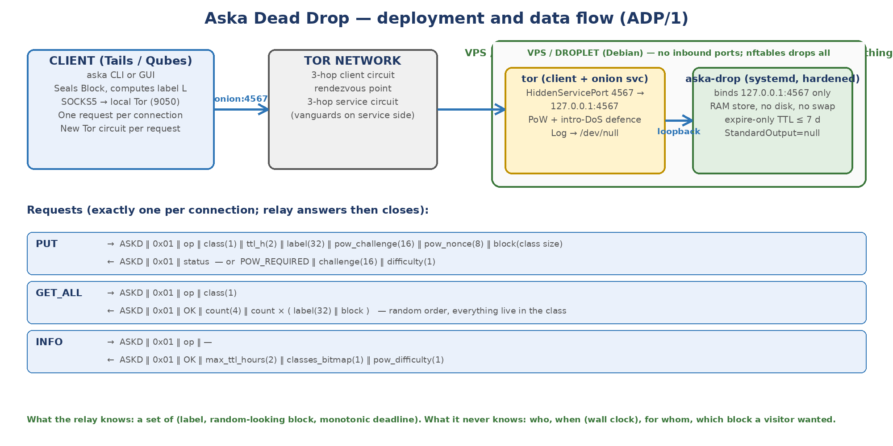

# Aska Dead Drop Protocol Specification

## ADP/1, draft 0.4 — relay wire protocol, storage model, DoS defences and operator runbook

*Draft 0.4 records the relay as released in Aska 1.1.0: the wire protocol is unchanged and remains ADP/1 (a 1.1.0 relay is functionally identical to 1.0.x on the wire, so operators need not upgrade); two implementation-status notes of draft 0.3 are resolved — residue in freed locked memory (§5.1) and the installer's journal drop-in (§9.2).*

- **Status:** Draft 0.4 — 8 October 2026. Records release 1.1.0 (1.1 step 1, "hardening after the specification re-issue"): the relay now wipes expired labels, lapsed challenges and digests in place and refused PUT bodies on drop (§5.1), the installer configures and asserts the RAM-only journal *before* the relay's first start (§9.2), and the stale unit description in `deploy/DEPLOY.md` is corrected; the client-side sweep honours `receive --class` (§8.1). **No byte of the protocol changed**: framing, operations, status codes, PoW rule, caps, timeouts, INFO body and the malformed-request corpus are those of draft 0.3, and ADP/1 stays at version 0x01. Draft 0.3 folded in the relay and protocol findings of the internal pre-review (D-1…D-9), the relay's locked-memory start-up check and the "fatal line to the volatile journal" amendment, the one-key-per-card limitation of Key Card TLV 0x06, and the deployment of signed releases. Draft 0.2 decided the six open issues of draft 0.1 (§13, P-01…P-06); those decisions stand.
- **Ground truth:** release 1.1.0 (tag `v1.1.0`; development commit `fb445fd`). Every implementation statement in this draft was checked against that code; between draft 0.3 (`54e5b81`) and 1.1.0 the relay changed in exactly two source files (`crates/aska-drop/src/store.rs`, `server.rs`) and the deployment in two (`deploy/install-debian.sh`, `deploy/DEPLOY.md`); `aska-proto`, the torrc, the unit file and the Python reference relay are untouched.
- **Executable:** the production relay is `aska-drop` (Rust, `crates/aska-drop`, AGPL-3.0) over the shared wire crate `aska-proto`; the production client is the Dead Drop client in `crates/aska-core` (`drop.rs`, `tor.rs`). The Python module `reference/aska_drop.py` remains the readable reference for the wire decisions: `test_drop.py` (8 tests, including two end-to-end flows with the Block Format reference) and `selftest` pass, and the Rust test `malformed_corpus_identical_on_both_relays` (`crates/aska-drop/tests/interop.rs`) checks that both relays answer a 22-item malformed-request corpus with identical status bytes; the relay's own tests (19: 9 unit tests in the crate, 3 in `tests/interop.rs`, 7 in `tests/server.rs`) pass on `fb445fd`. The Python relay is not a deployable relay (§4.5.1). `deploy/` holds the torrc, hardened systemd unit and Debian install script referenced by the runbook; operators follow the *Relay Operator Guide* (`docs/RELAY_OPERATOR_GUIDE.md`, version 1.1, shipped in the deploy tarball).
- **Satisfies:** RLY-01…RLY-10 of *Aska — Decision Record and Threat Model v0.5*; consumes (label, Block, TTL) exactly as defined in *Aska Block Format Specification v1 draft 0.7* (which is the format of draft 0.6 unchanged). Client-side behaviour is specified in *Aska Client Design v0.7*; the findings referred to as D-1…D-9 are those of the *Internal Pre-Review Report v0.1*; the 1.1 work is planned in *Aska 1.1 Plan v0.3*; the released builds are recorded in *Release records v1.0.0 / v1.0.1 / v1.1.0* (the last not yet written when this draft was issued — where a 1.1.0 fingerprint would be cited, see the release record).
- **Depends on decisions:** D-05 (expire-only, TTL default 24 h / max 7 days), D-06 (Tor onion only, self/friend-hosted, no public list), D-10 (modest cover traffic); for distribution and review status, D-19 and D-20 (§11.6, §13.2).
- **Not in this document:** client polling policy and cover-traffic schedule beyond conformance minimums (Client Design), mixnet transport (RM-05).
- **Notation:** as in the Block Format Specification; all integers big-endian; sizes in bytes.

---

# 1. Scope and conformance

This specification defines the **Aska Dead Drop Protocol, version 1 (ADP/1)**: the wire protocol between an Aska client and a Dead Drop relay, the relay's storage and expiry semantics, its identifier-free defences against flooding, the Tor configuration that exposes it, and the procedure for operating one on a small Linux server. It answers the question the Block Format left open — how a sealed Block travels from sender to receiver — while keeping the relay incapable, by construction, of learning who posted, who collected, or which Block a visitor wanted.

A relay **conforms** if it implements the three operations of §4 exactly, enforces the storage rules of §5 and the rejection rules of §4.5, exposes itself only as a Tor onion service (§7), and keeps no record of any kind beyond the live store (§5.4). A client conforms if it speaks §4, reaches relays only through Tor, and meets the minimums of §8. MUST, SHOULD and MAY are used as in RFC 2119.

Where the 1.0.x code behaves differently from, or more precisely than, the normative text, this draft says so in place. A paragraph headed **Implementation status (1.0.x)** marks a case where the code does not yet meet a statement of this specification; the statement remains the requirement. *(Draft 0.4.)* A paragraph headed **Resolved in 1.1.0** marks such a case that release 1.1.0 removed; the draft-0.3 note is kept beneath it, marked, for the record. Notes that 1.1.0 did not resolve keep their heading. Statements about "the 1.0.x relay" that this draft does not amend are also true of the 1.1.0 relay, which changed only in the respects the header names; statements about "the 1.0.x client" (§3, §6.2, §8.1) are also true of the 1.1.0 client — its Dead Drop code (`drop.rs`, `tor.rs`, `cover.rs`, `aska-proto`) is unchanged since `54e5b81` — except where §8.1 says otherwise (the class set of the fetch sweep).

## 1.1 Design goals (from the requirements)

| Goal | Requirement | How ADP/1 meets it |
|---|---|---|
| Onion-only reachability | RLY-01 | The relay binds to loopback; Tor forwards a v3 onion service to it. No clearnet listener exists (§7). |
| Exactly two data operations, no per-label retrieval | RLY-02 | PUT stores a Block under its label; GET_ALL returns every live Block of a size class. There is no operation that takes a label as a query (§4). |
| Expire-only, TTL 1 h – 7 d, default 24 h | RLY-03, D-05 | Deadlines are monotonic-clock values; deletion happens at expiry only; no read signal exists (§5.2). |
| No logs, architecturally | RLY-04 | The relay has no logging code path and no logging library; it prints nothing while serving. The only output it can ever produce is one line on stderr giving the reason for a fatal start-up failure or an abort, with no content, which the unit sends to the volatile journal (§9.7). Tor logs to /dev/null. *(Draft 0.2 said the unit discards stdout and stderr; amended per pre-review D-6.)* |
| Size-class enforcement | RLY-05 | PUT rejects any Block whose length is not exactly the declared class size (§4.5). |
| RAM-only storage | RLY-06 | The store is an in-memory map; the process locks all its memory (`mlockall`) and refuses to start if the lock limit cannot hold the configured store (§9.6); the unit has no writable filesystem; the installer removes swap (§5.1, §9). Since 1.1.0 what leaves the store is wiped as it goes: expired labels and digests in place, refused PUT bodies on drop (§5.1). |
| Vanguards and PoW | RLY-07 | torrc enables onion-service PoW and intro-DoS defence; Tor's built-in vanguards-lite is active; the full `vanguards` add-on is an operator option (§7, §9.4). *(Draft 0.2 said the runbook installs vanguards; the installer does not.)* |
| Single static binary, minimal config | RLY-08 | Configuration is port, TTL ceiling, per-class caps and PoW base difficulty, plus one hidden development-only switch that a deployment never uses (§9.3). |
| Identifier-free rate limiting | RLY-09 | Adaptive proof-of-work on PUT, bound to the label; per-class capacity caps; per-connection timeouts and budget; connection load shedding; Tor-level PoW (§6). |
| Transport-agnostic semantics | RLY-10 | PUT / GET_ALL / INFO are defined as messages over any reliable byte stream; §10 describes carrying them over a mixnet. |

# 2. Overview

A Dead Drop is a small daemon holding a set of `(label, Block, deadline)` triples in memory. A **sender** connects over Tor to the relay's onion service and issues one PUT containing the size class, the time-to-live in hours, the 32-byte label from the Block Format, and the Block itself. A **receiver** connects the same way and issues one GET_ALL for a size class; the relay streams back *every* live Block of that class in random order, and the receiver picks out its own by label locally (Block Format §6.4). Nothing the receiver sends identifies which Block it wanted, and nothing the relay stores identifies who sent or fetched anything. Blocks disappear when their deadline passes; nothing else ever deletes them, so there is no signal that a Block was collected.

Two features keep the relay usable without identifiers: an adaptive **proof-of-work** requirement on PUT that rises as a size class fills, so flooding costs the flooder more than it costs the relay; and **per-class capacity caps**, so a full class rejects new Blocks rather than evicting old ones — a sender who receives a "full" status simply uses another relay, while a receiver never loses a Block that was accepted.

*Figure 1 — Deployment and the three operations of ADP/1.*

# 3. Constants

| Name | Value | Meaning |
|---|---|---|
| MAGIC | `ASKD` (0x41 0x53 0x4B 0x44) | First four bytes of every request and response. |
| PROTO_VERSION | 0x01 | ADP/1. |
| OP_INFO / OP_PUT / OP_GET_ALL | 0x01 / 0x02 / 0x03 | The only operations. |
| SIZE_CLASSES | 1 → 4 096; 2 → 16 384; 3 → 65 536 | From the Block Format Specification; a relay MAY serve a subset. |
| LABEL_LEN | 32 | Block label L. |
| TTL | 1 ≤ ttl_hours ≤ max_ttl_hours; default 24; max_ttl_hours ≤ 168 | D-05. |
| CHALLENGE_LEN | 16 | PoW challenge; valid 120 s; single use. The all-zero value is reserved for "no challenge" (first attempt). |
| NONCE_LEN | 8 | PoW solution. |
| POW_DOMAIN | `aska/adp1/pow` | Domain separator for the PoW hash. |
| Default capacity per class | 2 000 / 800 / 200 Blocks | ≈ 8 MB + 13 MB + 13 MB of RAM; operator-configurable, but see the client listing ceiling below and §10.1. |
| Relay I/O timeout | 30 s per read and per write on the relay side | Each fixed-length read (header, PUT fields, Block, GET_ALL class byte) and each write (status, count, every label, every Block) must complete within 30 s. A read that fails (timeout or end of stream) is answered with the status of §4.5.1, best effort; a write that fails ends the connection. *(Draft 0.2 said "per read; a slow or stalled client is dropped without response". Both the Rust relay and the Python reference answer a failed header read with `ST_BAD_REQUEST`.)* |
| Relay connection budget | 300 s per connection | Overall deadline on top of the per-call timeout (pre-review D-1); when it elapses the connection is closed with no further bytes (§6.3). |
| Relay connection limit | 256 concurrent connections | A connection that arrives when all slots are taken is closed at once without a response; nothing queues (D-1). |
| Relay expiry tick | 60 s | Expiry also runs on a timer (§5.2). |
| Client listing ceiling | 4 096 / 1 600 / 400 records | The 1.0.x client refuses a GET_ALL listing longer than this per class (`MAX_LISTING_RECORDS`); twice the default caps, class 1 rounded up. See §10.1 (pre-review D-5). |
| Client PoW ceiling | 24 bits | The 1.0.x client refuses a challenge harder than this (`MAX_POW_DIFFICULTY`) without solving it (§6.2, §8.1). |
| Default port | 4567 on 127.0.0.1 | Behind `HiddenServicePort 4567`. |

*Table 1 — Constants. The relay values are in `crates/aska-proto/src/lib.rs` and `crates/aska-drop/src/server.rs`.*

# 4. Wire protocol

## 4.1 Framing

Every request begins `MAGIC ‖ PROTO_VERSION ‖ op` (6 bytes) followed by an operation-specific body; every response begins `MAGIC ‖ PROTO_VERSION ‖ status` (6 bytes) followed by an operation-specific body. **Exactly one request is carried per connection**: the relay reads one request, writes one response, and closes. A client that wants to do two things opens two connections — ideally on two Tor circuits (§8). There is no negotiation, no keep-alive, no headers, no timestamps and no client-supplied identifier of any kind. Unknown magic, version or op are answered with `ST_BAD_REQUEST` and the connection is closed. A header that does not arrive in full — the stream ends, or 30 s pass — is also answered with `ST_BAD_REQUEST` (best effort: if the peer has gone, nothing is delivered). Bytes that follow a complete request are not read and have no effect (the malformed-request corpus checks "PUT trailing garbage" and "INFO with trailing bytes" → `ST_OK`).

The choice of a minimal binary framing over HTTP is deliberate: HTTP carries dates, user agents, content types and negotiation that either leak or must be scrubbed, and an HTTP parser is a large attack surface on a machine whose only job is to hold noise. ADP/1 can be parsed with fixed-length reads and no allocation beyond the Block itself.

## 4.2 INFO

| Direction | Layout |
|---|---|
| Request body | — (empty) |
| Response body | `max_ttl_hours(2) ‖ classes_bitmap(1) ‖ pow_base_difficulty(1)`; bit *c−1* of the bitmap is set if size class *c* is served. |

INFO lets a client confirm it is talking to an ADP/1 relay and learn its limits. It reveals nothing about stored content or activity. Operators use it as their only health check (§9.5). INFO reports the *base* PoW difficulty, not the current adaptive difficulty of any class, and it does not report the caps; a class whose cap is 0 is not served and its bit is clear. The body stays at four bytes in this draft (see §10.1 for the deferred question of advertising caps).

## 4.3 PUT

| Direction | Layout |
|---|---|
| Request body | `class(1) ‖ ttl_hours(2) ‖ label(32) ‖ pow_challenge(16) ‖ pow_nonce(8) ‖ block(SIZE_CLASSES[class])` |
| Response body | Empty, except for `ST_POW_REQUIRED`, whose body is `challenge(16) ‖ difficulty(1)`. |

On a first attempt the client sends all-zero `pow_challenge` and `pow_nonce`. If the relay currently requires work for this class (§6) it answers `ST_POW_REQUIRED` with a fresh challenge and the difficulty; the client solves the puzzle and repeats the PUT with the same label and Block, carrying the challenge and its solution. If no work is required the relay stores the Block directly. A PUT of a label that already exists with **identical** content returns `ST_OK` (idempotent retry after a dropped connection); with different content it returns `ST_DUPLICATE` and stores nothing. The relay reads the entire Block before validating anything except the class byte, so that the time to reject does not depend on content.

**Processing order (both implementations).** Header → fixed fields (59 bytes) → class byte → the whole Block → PoW gate → store rules. The store rules run in this order after expiry: class served → TTL in range → length → existing label (`ST_OK` if identical, `ST_DUPLICATE` otherwise) → cap (`ST_FULL`) → store. Because the existing-label check comes before the cap check, an identical retry still returns `ST_OK` in a full class, and a different Block under a live label returns `ST_DUPLICATE` rather than `ST_FULL` (see §11.2). The difficulty a solved PUT must meet is the class's difficulty when that PUT arrives, not when the challenge was issued; if the class filled up in between, a correct solution at the old difficulty is answered `ST_POW_INVALID` and the client asks once more (§8.1).

**Class byte, as implemented.** The Rust relay answers `ST_BAD_CLASS` before reading the Block only for a class byte outside 1–3; a defined class with cap 0 is rejected after the Block has been read, by the store rules. The Python reference rejects any class it does not serve (including cap 0) before reading the Block. Both answer `ST_BAD_CLASS` in the end; see the note below for the one visible difference.

**PUT buffer (Rust relay).** The relay reserves the Block buffer with a fallible allocation (`try_reserve_exact`) before reading the Block. Under `mlockall(MCL_FUTURE)` an allocation can be refused when lockable memory is exhausted; the relay then answers **`ST_FULL`** for this PUT instead of aborting the process (§9.6). Since 1.1.0 the buffer is a zeroising one from the moment it is created (`Zeroizing<Vec<u8>>`, `server.rs` `handle_connection`, passed as such through `put_policy` to `Store::put`): a body that is not stored — whatever the status — is overwritten with zeros when the buffer is dropped, and a body that is stored becomes the stored Block's shared zeroising handle without a copy (§4.4, §5.1). The Python reference has no such path.

**Implementation status (1.0.x) — unserved class with a non-zero PoW base.** With `--pow-base` above 0, the Rust relay applies the PoW gate before the store rules, so a first-attempt PUT to a defined but unserved (cap-0) class receives `ST_POW_REQUIRED` and only the solved retry receives `ST_BAD_CLASS`; the Python reference answers `ST_BAD_CLASS` at once. The final status is the same and nothing is stored, but the two relays are not byte-identical in this configuration (a residue of pre-review D-2, which aligned the reference for the default base of 0). Candidate for alignment in a later revision; not scheduled. *(Draft 0.4: unchanged in 1.1.0; the note stands.)*

## 4.4 GET_ALL

| Direction | Layout |
|---|---|
| Request body | `class(1)` |
| Response body | `count(4) ‖ count × ( label(32) ‖ block(SIZE_CLASSES[class]) )` |

The relay first runs expiry, then returns every live Block of the class **in an order freshly randomised with a CSPRNG for each response**. Insertion order, and therefore posting order, MUST NOT be recoverable from the listing. There is no pagination, no cursor, no "since" parameter and no filter: any of those would let a visitor express interest in a subset, which is exactly the information the relay must never receive. With the default caps a full class-3 listing is about 13 MB, which is acceptable over Tor for a low-volume circle; §10 discusses growth.

**Zero-copy listings (Rust relay).** A stored Block is held as a shared, zeroising handle (`Block = Arc<Zeroizing<Vec<u8>>>` in `crates/aska-drop/src/store.rs`). `get_all` takes a snapshot of the class as a list of `(label, handle)` pairs and shuffles it (Fisher–Yates with unbiased CSPRNG indices); it does not copy any Block. A listing therefore costs the relay a label copy and a pointer per record however many listings are in flight, and the relay's peak memory stays at one copy of each Block. A Block's bytes are zeroised when its last holder drops it — the store on expiry, or the last in-flight listing that still refers to it. A Block that was live when a listing began is still sent by that listing if its deadline passes during transmission, and is zeroised when the listing ends (at most the 300 s connection budget later); a listing that begins after the deadline never contains it.

The relay writes the count, then each record's label and Block, each write under the 30 s timeout and the whole connection under the 300 s budget (§6.3). If either expires the relay stops writing and closes; the client sees a truncated listing and treats the attempt as failed.

## 4.5 Status codes and rejection rules

| Code | Name | When |
|---|---|---|
| 0x00 | ST_OK | Stored (or identical duplicate), or listing follows. |
| 0x01 | ST_BAD_REQUEST | Wrong magic, unsupported version, unknown op; header or PUT fixed fields not received in full (end of stream or 30 s timeout). |
| 0x02 | ST_BAD_CLASS | Size class not served by this relay (undefined class, or cap 0); also a GET_ALL whose class byte is missing. |
| 0x03 | ST_BAD_TTL | ttl_hours outside 1..max_ttl_hours. |
| 0x04 | ST_BAD_LENGTH | Block shorter than the class size (connection ended early or the 30 s read timeout elapsed). |
| 0x05 | ST_FULL | Class at capacity; nothing stored, nothing evicted. Also, on the Rust relay, a PUT whose Block buffer could not be allocated (§4.3). |
| 0x06 | ST_DUPLICATE | Label exists with different content. |
| 0x07 | ST_POW_REQUIRED | Work required; challenge and difficulty follow. |
| 0x08 | ST_POW_INVALID | Challenge unknown, expired, already used, or nonce does not verify at the class's current difficulty. |

*Table 2 — Status codes. A relay MUST NOT add codes that reveal store contents (e.g. "label not found" cannot exist because no operation looks up a label). Draft 0.2 listed "truncated fixed fields" under ST_BAD_REQUEST without distinguishing operations; the GET_ALL class byte is answered ST_BAD_CLASS by both implementations, which this table now states.*

### 4.5.1 Rejection behaviour by failure point (as implemented)

| Failure point | Rust relay `aska-drop` | Python reference |
|---|---|---|
| Header incomplete (end of stream, or 30 s) | `ST_BAD_REQUEST` | `ST_BAD_REQUEST` |
| Bad magic or version; unknown op | `ST_BAD_REQUEST` | `ST_BAD_REQUEST` |
| PUT fixed fields incomplete | `ST_BAD_REQUEST` | `ST_BAD_REQUEST` |
| PUT class byte outside 1–3 | `ST_BAD_CLASS`, Block not read | `ST_BAD_CLASS`, Block not read |
| PUT class defined but cap 0 | Block read; then PoW gate if difficulty > 0; then `ST_BAD_CLASS` | `ST_BAD_CLASS`, Block not read |
| PUT Block buffer cannot be allocated | `ST_FULL` | — (no such path) |
| PUT Block incomplete (end of stream, or 30 s) | `ST_BAD_LENGTH` | `ST_BAD_LENGTH` |
| GET_ALL class byte missing, undefined or not served | `ST_BAD_CLASS` | `ST_BAD_CLASS` |
| All connection slots busy (256) | closed at once, no response | — (no limit) |
| Connection budget (300 s) elapsed | closed, no further bytes | — (no budget) |
| A response write cannot complete in 30 s | connection closed | — (no write timeout) |

Every status in this table is sent best effort under the 30 s write timeout; a peer that has gone receives nothing. The Python reference implements the same wire decisions (the 22-item malformed corpus is answered identically by both relays) but has none of the operational limits of the last three rows, no memory locking and no zeroisation; it exists to make the wire format readable and testable, not to be deployed.

# 5. Storage model

## 5.1 RAM only

The store is an in-memory map per size class from label to `(block, deadline, digest)`, where `digest` is SHA-256 of the Block used only for idempotent duplicate detection. The relay MUST NOT write Blocks, labels, deadlines or any derived value to persistent storage. The process MUST run with memory locked against swapping and with core dumps disabled; the host SHOULD have no swap. A restart loses all Blocks — accepted, because senders can post to two relays (CLI-12) and because a relay that could survive a restart would have to persist something a seizure could read.

The Rust relay meets the locking requirement with `mlockall(MCL_CURRENT | MCL_FUTURE)` after setting `RLIMIT_CORE` to 0 and marking the process non-dumpable (`PR_SET_DUMPABLE 0`), and it refuses to start when the lock limit cannot hold its configured store (§9.6). Stored Blocks are zeroising shared handles (§4.4); their bytes are overwritten when the last holder drops them.

> **Resolved in 1.1.0 — residue in freed locked memory.** The two kinds of residue that the draft-0.3 note below describes are wiped by the 1.1.0 relay (`crates/aska-drop/src/store.rs`, `server.rs`; 1.1 step 1):
>
> (a) **Map keys and digests.** The per-class maps and the challenge map are keyed by `WipedKey<N>`, a fixed-size byte array with a `Drop` implementation that zeroises it (`WipedKey<32>` for labels, `WipedKey<16>` for challenges), and each entry's SHA-256 digest is a `Zeroizing<[u8; 32]>`. Expiry removes entries with `HashMap::retain`, which drops each removed entry *in place* in its table slot — so an expired label, its digest and (through the shared handle, if no listing still holds it) its Block are overwritten with zeros where they lay, and so is a lapsed challenge. A challenge **consumed by a solved PUT** is removed the same way — `consume_challenge` reads its deadline and then removes it with `retain` rather than `HashMap::remove`, because `remove` would move the key out of its slot before dropping it and leave the 16 bytes in the table (the standard library's table reads an entry out rather than dropping it in place); the challenge map holds at most the challenges issued in the last 120 s, so the scan is trivial. The entry's deadline and a challenge's expiry are `Instant`s (monotonic, no calendar meaning) and are not wiped.
>
> (b) **PUT bodies.** The body of every PUT arrives in a `Zeroizing<Vec<u8>>` (§4.3) and keeps that type through the PoW gate into the store: a body that is refused — `ST_POW_REQUIRED`, `ST_POW_INVALID`, `ST_DUPLICATE`, `ST_FULL`, `ST_BAD_TTL`, `ST_BAD_LENGTH`, `ST_BAD_CLASS` — or that is an identical retry answered `ST_OK` without being stored, is overwritten with zeros when it is dropped at the end of the request; a stored body becomes the Block's shared zeroising handle (§4.4) without being copied.
>
> **Residual, by design:** the hash tables themselves are ordinary `HashMap`s. When a table grows it allocates a larger one and *moves* its live entries across; the bytes of the old table — live labels, digests and challenges of that moment — are freed unwiped and stay in locked memory until the allocator reuses them. These are values the relay is still serving in every listing (labels) or that are about to lapse (challenges), so the residue adds nothing beyond Table 3's left column; it is stated so that Table 3 is exact. A table that only shrinks in population does not reallocate. Wiping the old table on growth would need a custom table or a pre-sized one, and is not planned. With these two mechanisms the "memory image can contain labels of recently expired Blocks and bodies of recently refused PUTs" of draft 0.3 is no longer the case; a memory image of a running 1.1.0 relay yields the left column of Table 3, plus the moved-from bytes of a table that has grown.

**Implementation status (1.0.x) — residue in freed locked memory.** *(Draft-0.3 note, kept for the record; superseded by the "Resolved in 1.1.0" note above. It still describes releases 1.0.0 and 1.0.1.)* Two kinds of residue are not explicitly wiped by the 1.0.x relay. (a) When an entry expires, its Block bytes are zeroised, but the entry's label, deadline and digest stay in the freed slot of the hash table until the slot is reused; the same holds for consumed or expired PoW challenges. (b) A PUT body that is not stored — answered `ST_POW_REQUIRED`, `ST_DUPLICATE`, `ST_FULL`, `ST_BAD_TTL`, `ST_BAD_LENGTH`, `ST_BAD_CLASS`, or an identical retry answered `ST_OK` — is freed without being overwritten. All of this is in locked memory and never reaches disk, and none of it is more than the relay already serves to every visitor (labels appear in every listing, Blocks are ciphertext), but it means a memory image of a running relay can contain labels of recently expired Blocks and bodies of recently refused PUTs, which Table 3 does not list. Wiping the slot on removal and zeroising the PUT buffer are candidates for a later relay revision; not scheduled (§13.2). *(Draft 0.4: both done in 1.1.0 — see above.)*

## 5.2 Deadlines and expiry

On PUT the relay records `deadline = monotonic_now + ttl_hours × 3600`. It MUST use a monotonic clock, never wall-clock time, so that no value in memory corresponds to a calendar instant. Expiry runs before every PUT and GET_ALL (and MAY run on a timer): every entry whose deadline has passed is deleted. Nothing else deletes a live entry. In particular there is no delete-on-read (D-05), no operator delete operation, and no eviction when full.

As implemented, the Rust relay also runs expiry every 60 s, so memory stays flat on an idle relay; an expired entry therefore leaves the store at the next PUT, GET_ALL or tick, and is never served by a listing that begins after its deadline (see §4.4 for a listing already in progress). The same passes remove PoW challenges whose 120 s validity has run out. The Python reference expires on PUT and GET_ALL only.

## 5.3 Capacity

Each class has a cap in Blocks. When a class is at its cap, PUT returns `ST_FULL`. Caps SHOULD be set so that total memory stays well inside the systemd `MemoryMax` (default caps use about 35 MB of Blocks); the relay does not read `MemoryMax` itself. Caps also determine how much memory the relay must be able to lock, which the relay checks at start (§9.6), and they MUST NOT exceed the client listing ceiling of the clients the relay serves, or receivers stop being able to fetch the class once it holds more Blocks than the ceiling (§10.1, D-5). Because listing is all-or-nothing, caps also bound the receiver's download (§10).

## 5.4 What the relay knows — and does not

| The relay holds | The relay never holds |
|---|---|
| Live Blocks (random-looking bytes) by label | Any key, passphrase or plaintext |
| A monotonic deadline per Block | Wall-clock posting time, or any timestamp |
| A SHA-256 of each Block (duplicate detection) | Client IP addresses (onion service) or any client identifier |
| Outstanding PoW challenges, each for at most 120 s (removed when used, or at the first expiry pass after they lapse) | Which Block a GET_ALL visitor was interested in |
| Per-class caps and PoW settings | Logs, counters over time, access records, crash dumps |

*Table 3 — Knowledge boundary. A forensic image of the running host yields the left column only; of a powered-off host, nothing. The one line a fatal start-up failure or abort can write goes to the RAM-only journal and carries no Block, label or peer (§9.7). See §5.1 for residue in freed memory: the 1.0.x relay did not wipe expired labels, digests or refused PUT bodies; the 1.1.0 relay does, and what remains is spent challenges and the moved-from bytes of a hash table that has grown — nothing outside this table's left column.*

# 6. Denial-of-service defences without identifiers

A relay cannot rate-limit "per user" because there are no users; it can only make abuse expensive and bound its own exposure. ADP/1 uses three layers.

## 6.1 Tor-level

The onion service enables Tor's introduction-point rate limiting and **onion-service proof-of-work** (`HiddenServicePoWDefensesEnabled 1`), which Tor activates automatically under load and which makes each new rendezvous cost the client CPU time. This protects the *reachability* of the relay. The shipped torrc sets the intro-DoS rate to 25 per second with a burst of 200, and the PoW queue rate to 250 with a burst of 2 500 (§7).

## 6.2 Application-level adaptive proof-of-work on PUT

The relay computes a difficulty *d* for each class: `d = base + extra`, where `extra` is 0 while the class is below 50 % of its cap and rises by one bit for every further 12.5 % (to a maximum of +4). Precisely, with *n* live Blocks and cap *c*: `extra = 0` if `2n < c`, otherwise `min(4, ⌊(8n − 4c) / c⌋ + 1)` — +1 from 50 % fill, +2 from 62.5 %, +3 from 75 %, +4 from 87.5 % (integer arithmetic in `store.rs`, identical to the reference's `int((fill − 0.5) / 0.125) + 1`). With a non-zero base, a near-full class therefore costs sixteen times more work per Block than an empty one. When *d* > 0 a PUT without a valid solution receives a 16-byte random challenge (valid 120 s, single use). The client finds an 8-byte nonce such that `SHA-256(POW_DOMAIN ‖ challenge ‖ label ‖ nonce)` has *d* leading zero bits, and retries. Binding the label into the hash means a solution cannot be reused for a different Block; binding the challenge means it cannot be precomputed. At *d* = 20 a solution costs about one second on a laptop and nothing measurable for the relay to verify. Operators SHOULD leave `base = 0` for a friend-hosted relay and raise it if flooding is observed.

**At base 0 the adaptive PoW is near-free (pre-review D-4, accepted under P-03).** With the default base of 0, a class below half its cap requires no work at all, and above that the extra 1–4 bits cost the client on average 2 to 16 hash evaluations — nothing. Half of every class can therefore be filled at no cost, and the rest at negligible cost. This is accepted for friend-hosted relays whose address stays inside the circle: the cap (§5.3) and Tor's own defences (§6.1) are the protection, and a flood ends in `ST_FULL`, never in eviction. **Operators of a relay whose address leaves the circle** — shared beyond the people who need it, written down publicly, or otherwise exposed — SHOULD set a non-zero base (P-03 suggests 8). The 1.0.x client refuses any challenge above 24 bits, so `base + 4` must stay at or below 24: a base above 20 makes a near-full class unusable for released clients.

## 6.3 Capacity caps and timeouts

Caps bound memory; timeouts and budgets bound slow connections; systemd's `MemoryMax` bounds the worst case. Tor itself limits concurrent rendezvous circuits. None of these mechanisms records anything about the client. As implemented in the Rust relay (`crates/aska-drop/src/server.rs`):

- **Per-call timeout, reads and writes.** Every fixed-length read and every write has a 30 s timeout. A reader that stops reading a listing stalls the relay's write and is dropped after 30 s.
- **Per-connection budget (pre-review D-1).** A reader that paces its reads just inside the per-write timeout could otherwise hold a slot for (number of records × 30 s). Every connection — the motivating case is GET_ALL — now runs under an overall 300 s deadline, after which it is closed without further bytes. A listing at the default class-3 cap (about 13 MB) needs a sustained rate of about 44 kB/s to finish inside the budget; a listing at the client ceiling (about 26 MB, §10.1) about 88 kB/s.
- **Load shedding, not queueing (D-1).** At most 256 connections are served at once. The accept loop takes a slot with `try_acquire`; when none is free the new connection is closed immediately and nothing waits. Before D-1 new clients queued behind stalled ones. A shed client sees a closed connection and, like any failed attempt, tries again later or another relay (§8).
- **Per-connection memory.** One Block buffer per PUT connection (256 × 64 KiB = 16 MiB at worst), reserved fallibly: if lockable memory is exhausted the PUT is answered `ST_FULL` instead of aborting the relay (§4.3, §9.6). Listings allocate no Block copies (§4.4).

The Python reference applies the 30 s timeout to reads only and has no budget, no connection limit and no write timeout (§4.5.1).

## 6.4 Challenge bookkeeping and randomness failures (new in draft 0.3)

**Outstanding challenges (pre-review D-7).** Each challenge the relay issues is kept in a map (16-byte challenge → monotonic expiry) until it is used or lapses. This map is **not** part of the locked-memory requirement the relay checks at start (§9.6). Its size is bounded by the rate of challenge-issuing requests over 120 s: each entry costs the requester a Tor stream to the onion service and the upload of a complete Block of at least 4 KiB (the relay reads the whole Block before deciding that work is needed), so the rate is held down by Tor's introduction-rate limits and onion-service PoW (§6.1) and by the throughput Tor delivers to one service, and the entries (32 bytes of payload each, plus table overhead) are expected to stay small against the 64 MiB runtime headroom. If the map ever outgrew the lockable memory, its growth is an infallible allocation and would abort the relay, which systemd restarts five seconds later with an empty store — a liveness failure, not a disclosure.

**CSPRNG failures (pre-review D-8).** The relay's two uses of the operating system's random source fail safe. If a challenge cannot be drawn (or comes out all-zero, the reserved value), the relay sends the all-zero challenge and does not record it; a client that echoes it is treated as making a first attempt and is challenged again, and the 1.0.x client gives up after a second challenge following a solved one — the PUT fails, and nothing is ever stored without the required work. If an index for the listing shuffle cannot be drawn, that draw falls back to 0: the listing still goes out, in a fixed permutation of the hash map's iteration order, which is set by keyed hashing of the labels rather than by insertion order. A host whose kernel random source fails is an operator fault to fix; neither path stores, reveals or orders anything it should not.

# 7. Tor configuration

The relay process binds `127.0.0.1:4567` only. Tor runs on the same host as a client (`SocksPort 0`, `ClientOnly 1` — it never relays for others) with a single v3 onion service forwarding port 4567. The reference `torrc` (in `deploy/`) sets: `Log notice file /dev/null` and `SafeLogging 1`; `AvoidDiskWrites 1`; three introduction points; intro-DoS defence with a rate of 25/s and burst 200; PoW defences with queue rate 250 and burst 2 500. The installer takes Tor from the Tor Project's own package repository (`deb.torproject.org`, signing key installed into `/usr/share/keyrings/`), so that current versions carry onion-service PoW and vanguards-lite. **Vanguards**: tor 0.4.7+ ships vanguards-lite by default; for a long-lived relay the runbook recommends the `vanguards` add-on for full layer-2/3 guard protection against guard-discovery attacks of the kind used in the Boystown case. Operators SHOULD rotate the onion address periodically (generate a new service directory, distribute the new address through Key Cards).

**Implementation status (1.0.x) — vanguards.** Draft 0.2 said the runbook installs the `vanguards` add-on. The 1.0.x installer (`deploy/install-debian.sh`) does not: a relay installed with it has Tor's built-in vanguards-lite only, and the full add-on is an operator step (§9.4). RLY-07 is a SHOULD and is met in part; adding the add-on to the installer is not scheduled. *(Draft 0.4: the 1.1.0 installer is unchanged in this respect; the note stands.)*

## 7.1 Optional client authorisation with a shared circle key (P-02)

Tor v3 client authorisation encrypts the service descriptor so that only holders of an authorised x25519 private key can even discover or reach the relay; outsiders cannot scan, flood or fingerprint it. Tor's native model is one key per client, which would leave a **list of member keys on the relay** — a membership count and pseudonymous identifiers the design otherwise avoids. ADP/1 therefore specifies the variant that fits the threat model: **one shared circle key**. The operator generates a single x25519 key pair, installs the public half as the relay's only `authorized_clients` entry, and the private half travels to members inside Key Cards as TLV type 0x06 (Block Format §7.3, allocated by this specification). The relay holds one key and learns nothing about membership; the client installs the key into its local Tor (via `ONION_CLIENT_AUTH_ADD` on the control port, or `ClientOnionAuthDir`) before connecting. Client authorisation is **off by default** and is an operator option (§9.4). Rotating the circle key is done together with onion-address rotation. Per-member keys MUST NOT be used.

As implemented in the 1.0.x client, installation is by the control port only: `ONION_CLIENT_AUTH_ADD <address> x25519:<key>` with no `ClientName` and no `Permanent` flag, so Tor holds the key for its running session only; the client never writes `ClientOnionAuthDir` or any torrc. The control port is configured explicitly, or discovered as `127.0.0.1:9051` with the cookie at `/run/tor/control.authcookie` when the system Tor's default SOCKS port is in use and that cookie is readable by the user. On Tails and Whonix the control port is filtered, so client-authorised relays cannot be used there in v1 (Client Design v0.7, C-03): the client leaves such relays out, and refuses before any network step when every relay needs a key. A card without TLV 0x06 leaves any authorisation to the user's own Tor configuration, which the client neither reads nor changes.

The onion address is the relay's only identity. It is distributed out of band — inside Key Cards (TLV type 0x03 carries the 32-byte ed25519 public key from which the address is reconstructed), spoken, or written — never through a public list (D-06).

### 7.1.1 One auth key per Key Card (new in draft 0.3)

TLV 0x06 occurs at most once in a Key Card, and its key **applies to every relay listed in the card** (Block Format draft 0.7 §7.3, unchanged since draft 0.6). The 1.0.x and 1.1.0 clients behave accordingly on both sides:

- **Receiving a card.** Every relay read from a card that carries 0x06 is given that key (`Relay::from_keycard` in `crates/aska-core/src/drop.rs`), and the key is installed for each of them; a relay that does not require authorisation ignores it.
- **Making a card.** The card includes 0x06 only when every relay it lists has the same key (`Session::keycard_inner` in `crates/aska-core/src/session.rs`); when the relays differ — some with a key, some without, or different keys — the card carries no 0x06 at all. On the command line, `--auth-key` applies the one key it prompts for to every `--relay` given.

Consequently the arrangement Client Design C-03 recommends — "a circle with Tails or Whonix users keeps at least one relay without client authorisation" — **cannot be expressed in one Key Card**. On Tails or Whonix, a card with 0x06 makes every listed relay an authorised one in the client's view, so all of them are left out and the receive is refused ("every relay needs a circle key…"), even if one of the relays is in fact open. A card without 0x06 leaves the authorised relays unreachable from any platform. Circles that need both kinds of relay **issue a second card**: the sender posts to all relays as usual (§8), and hands members on Tails or Whonix a Key Card that lists only the relay(s) without client authorisation and carries no 0x06 — for example by re-encoding the key material from its 24 words with `aska key card` and only those relays given with `--relay`. Per-relay authorisation TLVs, which would let one card carry both, are a candidate for a future draft of this specification and of the Block Format; they are not part of ADP/1 draft 0.3, nor of draft 0.4.

# 8. Client conformance minimums

- Clients MUST reach relays only through Tor (a local SOCKS5 proxy with hostname addressing) and MUST refuse to connect to anything but a `.onion` address.
- Clients MUST open a new connection per request and SHOULD request Tor circuit isolation per connection (SOCKS username/password isolation or a fresh `NEWNYM`), so that a PUT and a later GET_ALL do not share a circuit.
- Clients MUST send PUTs with the label computed as Block Format §5.2 and the class matching the Block length; they SHOULD post each Block to two relays when the Key Card lists two.
- Clients MUST randomise the delay between sealing and posting and between polls, and MUST issue decoy PUTs and GET_ALLs on a Poisson schedule at the level chosen in D-10 (default modest). Decoy Blocks are random bytes of a real class with a random label and a TTL drawn from the same choices as real posts; they are indistinguishable from real ones. *(Draft 0.2 said "a short TTL"; a short decoy TTL let the relay, or anyone copying its memory, separate decoys from real Blocks by their deadline — pre-review C-3. The 1.0.x client draws a decoy's TTL from the real choices 1, 6, 24, 48, 72 and 168 hours, 24 h half of the time.)*
- Clients MUST fetch with GET_ALL and match labels locally; they MUST NOT implement or use any relay operation that narrows a listing.
- Clients MUST treat `ST_FULL` and connection failure as "try another relay or later", never as an error that reveals anything to the user about a particular Block.
- Clients MUST solve PoW challenges transparently and MUST NOT persist challenges, relay addresses (unless the user saves an encrypted profile, CLI-11) or listing contents beyond the session.

## 8.1 The 1.0.x client (as implemented; new in draft 0.3)

The Dead Drop client in `crates/aska-core` (`drop.rs`, `tor.rs`) over the blocking wire module `aska-proto::client_sync`:

- **Isolation.** Each connection uses a fresh random SOCKS5 username and password, which Tor maps to a separate circuit (`IsolateSOCKSAuth`, on by default); the proxy must be loopback (the Whonix gateway is the one platform exception, Client Design §2.4).
- **Timeouts.** 120 s for connect and rendezvous, 60 s per read or write on the established stream, and a 600 s deadline for a whole request.
- **PUT.** Posts to every relay configured or listed in the Key Card. A first attempt; on `ST_POW_REQUIRED`, solve and resubmit on a fresh connection; if a solved submission is answered `ST_POW_INVALID` (the challenge lapsed during a slow circuit, or the class's difficulty rose, §4.3), request and solve one fresh challenge. At most four connections per relay; a second challenge after a solved one, or a difficulty above 24 bits, ends the attempt with an error. Any status other than `ST_OK` counts as "not stored on this relay".
- **GET_ALL.** A fixed sweep of every relay × every class regardless of where a match turns up, so that no relay learns from the client's behaviour whether it held the Block; labels compared in constant time; the count is checked against the listing ceiling (4 096 / 1 600 / 400, §10.1) before anything is allocated, and a longer listing is refused as an error for that relay and class. *(Made precise in draft 0.4.)* "Every class" means the **class set fixed before the sweep starts** (`Session::fetch_job`, `crates/aska-core/src/session.rs`): the one class a Key Card's size-class hint names, if there is one; otherwise, **since 1.1.0**, the one class given as `aska receive --class` (for 24 words, Shares and a receiving seed, which carry no class — in 1.0.x the option was accepted but not applied to the sweep, so all three classes were fetched; 1.1 step 1); otherwise all three. The set is chosen from the user's own key material and command line, never from anything a relay says, and is swept in full on every relay whether or not a match has already turned up — which is the property this bullet is about. A narrower set reveals to a relay only what the GET_ALL itself must carry (a class byte), and spares the receiver the listings of classes it knows it cannot be in.

# 9. Operator runbook — a relay on a small Linux server

This runbook installs a Dead Drop on a fresh Debian 12/13 server — a rented virtual server, a dedicated machine or a Qubes VM all work identically, because the relay needs **no inbound connectivity at all** (a home machine behind NAT works too, without port forwarding, provided it is x86-64: the signed release is built for `linux-x86_64` only, and other architectures need a self-built binary). The scripts referenced are in `deploy/` next to this document and, for operators, in the signed deploy tarball; read them before running them. Every step exists to satisfy a numbered requirement, noted in brackets.

**The operator document is the *Relay Operator Guide*** (`docs/RELAY_OPERATOR_GUIDE.md`, version 1.1 for `aska-drop` 1.1.0, also inside `aska-drop-deploy-<version>.tar.gz`): it is the step-by-step procedure for installing from the signed release, checking, upgrading and decommissioning, and what running a relay means for the operator. This section is the specification-level account of the same procedure and of why each step exists. `deploy/DEPLOY.md` holds the project's own deployment notes for one hosting provider, including the soak gate and recovery from a firewall lock-out *(draft 0.4: its summary of the unit, which still read `MemoryLock=infinity` and "output to null", now states `LimitMEMLOCK=infinity`, standard output to null and standard error to the RAM-only journal, as §9.2 step 6 and §9.7 — 1.1 step 1)*.

**Upgrading to 1.1.0 is optional.** The 1.1.0 relay binary is functionally identical to 1.0.x on the wire — same framing, operations, status codes, PoW rule, caps, timeouts and INFO body (§3–§6) — and the unit file and torrc are unchanged; a 1.0.x client talks to a 1.1.0 relay and a 1.1.0 client to a 1.0.x relay. What 1.1.0 adds is internal to the host: in-memory wiping of what leaves the store (§5.1) and, for *new* installations, the journal order of §9.2. An operator who upgrades follows §9.4 (verify, replace the binary, restart); one who does not loses nothing on the wire, and keeps the draft-0.3 residue in locked memory, which §5.1 assessed as adding nothing beyond what every visitor sees. The *Relay Operator Guide 1.1* says the same ("upgrading is optional").

## 9.1 Choosing and paying for a host

Any 1 vCPU / 1 GB x86-64 machine is ample; the store uses about 35 MB of Blocks at default caps, the relay must be able to lock about 98 MiB at default caps (§9.6; it locks about 9 MiB when empty, per the Relay Operator Guide, and grows with the Blocks), and Tor uses about 100 MB. The provider will see that the machine talks to the Tor network and will hold the operator's payment identity; the design tolerates this (D-06) because an operator who is identified and compelled can produce only what §5.4 lists. Operators who want to minimise even that exposure can pay with a provider that accepts cash-bought vouchers or Monero, or host at home. Prefer a jurisdiction without secret technical-capability notices, but assume seizure anyway — the design does.

## 9.2 Installation (deploy/install-debian.sh)

The installer is a POSIX shell script of seven numbered steps, run as root. Over SSH it **refuses to start** unless `SSH_ALLOW` is set, so that the firewall cannot lock the operator out by accident: `SSH_ALLOW=any` keeps key-only SSH open from anywhere, `SSH_ALLOW=<address or CIDR>` keeps it open from that source only, and `SSH_ALLOW=none` closes it deliberately (the provider's console is then the only way in). Run from a console, an unset `SSH_ALLOW` also closes SSH.

1. **Base and updates** (installer step 1). `apt dist-upgrade`, install `unattended-upgrades` so Tor and the kernel stay patched without an operator logging in.
2. **No swap** (RLY-06; step 2). `swapoff -a`, comment swap out of `/etc/fstab`, `vm.swappiness=0`. A Block in RAM must never reach disk.
3. **Firewall: drop all inbound** (step 3). nftables with `input` policy `drop`, loopback and established connections allowed, outbound open. An onion service only makes *outbound* connections to Tor, so nothing needs to be open — not even SSH. If `SSH_ALLOW` keeps SSH open, the installer also sets `PasswordAuthentication no` and `PermitRootLogin prohibit-password`.
4. **Tor from the Tor Project repository** (step 4; current versions carry PoW and vanguards-lite). The installer adds `deb.torproject.org` with its signing key for the running Debian release, installs `tor` and `deb.torproject.org-keyring`, and installs `deploy/torrc.aska-drop` as `/etc/tor/torrc`. Tor creates `/var/lib/tor/aska-drop/` with the onion keys and `hostname`.
5. **Relay binary** (step 5). Install the reproducibly built static `aska-drop` binary (OPS-02/03) as `/usr/local/bin/aska-drop`. Since 1.0.0 it is published as a signed release file, **`aska-drop-<version>-linux-x86_64`** with its minisign signature, beside **`aska-drop-deploy-<version>.tar.gz`** (installer, torrc, unit and the Relay Operator Guide, also signed) and a signed `SHA256SUMS.txt`, on the release page of `https://github.com/secunos/aska` under release key `79AD6224AFF176C9` (D-20). **Verify its SHA-256 against the fingerprint obtained out of band, and its signature, before installing** — a poisoned relay binary cannot read Blocks, but it could log connection metadata. The installer expects the file renamed to `aska-drop` in its working directory.
*(Draft 0.4: the installer's steps 6 and 7 are the other way round since 1.1.0 — the journal drop-in is installer step 6 and the unit step 7 — so that journald is RAM-only before the relay can write its first line; the numbering of this list is kept for stable cross-references, and the resolved-status note after the list says what changed.)*

6. **Hardened systemd unit** (`deploy/aska-drop.service`; installer step 7 since 1.1.0, step 6 in 1.0.x). It runs `aska-drop serve --port 4567` as a dynamic user with a read-only view of the filesystem (`ProtectSystem=strict`), no home, a private `/tmp`, no devices, loopback-only networking (`IPAddressDeny=any` + `IPAddressAllow=localhost`, address families IPv4/IPv6 only), the `@system-service` system-call set minus `@privileged` and `@resources` with `setrlimit` and `prlimit64` allowed back for the hardening calls, an empty capability bounding set, `LimitMEMLOCK=infinity` (§9.6), `LimitCORE=0`, `StandardOutput=null`, `StandardError=journal` (§9.7, RLY-04), `MemoryMax=512M`, and `Restart=always` with a 5 s delay. *(Draft 0.2 listed `MemoryLock=infinity`, which is not a systemd directive and was silently ignored, and `StandardError=null`; both corrected.)*
7. **Volatile journald** (installer step 6 since 1.1.0, step 7 in 1.0.x). A drop-in `/etc/systemd/journald.conf.d/volatile.conf` with `Storage=volatile` and `RuntimeMaxUse=16M`, so that even systemd's own unit messages and the relay's one possible fatal line never touch disk. Since 1.1.0 the installer also **asserts** it before going on: journald is restarted; if a persistent journal directory `/var/log/journal` exists (nothing of the relay is in it yet, since the relay has not been installed as a unit), it is removed and journald restarted again; the script then checks that the drop-in contains `Storage=volatile` and that `/var/log/journal` is absent, and **exits with status 1** if either check fails — so the unit of the next step is never installed, let alone started, on a host whose journal could reach disk.
8. **Read the onion address** from `/var/lib/tor/aska-drop/hostname` (printed by the installer at the end) and give it to the circle out of band. It goes into Key Cards as the 32-byte public key (Block Format §7.3).

> **Resolved in 1.1.0 — journal drop-in (pre-review D-6).** The 1.1.0 installer (`deploy/install-debian.sh`, 1.1 step 1) writes the volatile drop-in **before** it installs and enables the relay's unit, and asserts it as step 7 above describes (`grep -q '^Storage=volatile' …/volatile.conf || exit 1`; `[ ! -d /var/log/journal ] || exit 1`). The relay's first start therefore happens under a journal that is already RAM-only, and an installation on which the assertion fails stops before the relay exists. This is the installer's behaviour for **new** installations; a relay installed with the 1.0.x installer keeps whatever it did then — its drop-in was written, after the first start and unchecked — and an operator of such a relay who wants the assurance runs the checks of step 7 by hand (the drop-in file containing `Storage=volatile`, and the absence of `/var/log/journal`, are the two conditions the installer asserts). D-6's "assert the drop-in" disposition is thereby met in full; its row in Table 7 (§13.3) is amended.

**Implementation status (1.0.x) — journal drop-in.** *(Draft-0.3 note, kept for the record; superseded by the "Resolved in 1.1.0" note above. It still describes the 1.0.x installer.)* Pre-review D-6 asked the installer to assert the volatile drop-in. The 1.0.x installer writes it (step 7) but does not check it afterwards, and it writes it after enabling the relay (step 6): should the relay fail at its very first start, that one line would be stored under the distribution's default journal setting. Operators SHOULD confirm that `/etc/systemd/journald.conf.d/volatile.conf` exists after installation. Moving the step before the unit and adding a check are not scheduled. *(Draft 0.4: both done in 1.1.0.)*

## 9.3 Configuration

| Setting | Default | Notes |
|---|---|---|
| --port | 4567 | Loopback port Tor forwards to (must match `HiddenServicePort`). |
| --max-ttl-hours | 168 | Accepted range 1–168; hard ceiling 168 (D-05). Operators MAY lower it. |
| --cap-1 / --cap-2 / --cap-3 | 2000 / 800 / 200 | Per-class Block caps; set 0 to not serve a class. Keep at or below the client listing ceiling 4096 / 1600 / 400 (§10.1); raising a cap raises the memory the relay must lock (§9.6). |
| --pow-base | 0 | Base PoW difficulty in bits, accepted range 0–64; adaptive bits (up to +4) are added on top (§6.2). Keep at 20 or below for 1.0.x clients (they refuse more than 24 bits). |
| --insecure-no-mlock | off; hidden | **Development only.** Hidden from `--help`. Skips the start-up lock-limit check and tolerates a failed `mlockall` (memory then stays unlocked, with one warning line on stderr). It exists so that the relay can run as an unprivileged user — for example in a development VM, where the default `RLIMIT_MEMLOCK` is 8 MiB — for the no-writes gate (`scripts/no-writes-check.sh`) and similar tests. It MUST NOT be used on a relay that serves real Blocks, and the shipped unit does not use it. |

*Table 4 — The complete relay configuration surface (RLY-08): `aska-drop serve` with four settings (port, TTL ceiling, per-class caps, PoW base) and one hidden development switch. There is deliberately nothing else: no data directory, no log level, no admin port. Draft 0.2 listed the four settings only.*

**Exit status.** `aska-drop serve` exits 3 when process hardening fails — core dumps cannot be disabled, the lock limit is too small for the configured caps (§9.6), or `mlockall` fails — and 2 when the arguments are invalid, the runtime cannot be started or the port cannot be bound. In every case it writes one line naming the reason to stderr first (§9.7). While serving it never exits on its own.

## 9.4 Operating

- **There is nothing to back up.** A restart or rebuild loses live Blocks by design; tell the circle to post important Blocks to two relays.
- **Updates.** Unattended upgrades handle Tor and the OS. Relay binary updates are manual: verify the new release's fingerprint and signature, replace the binary (and the unit, if the release notes say it changed, followed by `systemctl daemon-reload`), `systemctl restart aska-drop`. The Relay Operator Guide §6 gives the commands. A restart loses the live Blocks (nothing is persisted), so an operator picks a quiet moment and tells the circle. *Release 1.1.0:* optional (§9, "Upgrading to 1.1.0 is optional"); the unit did not change; the 1.1.0 fingerprint is in the release record v1.1.0.
- **Onion rotation.** Every few months (or after any suspected exposure): stop tor, move `/var/lib/tor/aska-drop/` away and shred it, start tor, distribute the new address. Old Key Cards stop working; that is the point.
- **Client authorisation (optional, closed circles — §7.1).** Generate one x25519 key pair for the circle (e.g. `openssl genpkey -algorithm x25519`), write `descriptor:x25519:<base32 public key>` to `/var/lib/tor/aska-drop/authorized_clients/circle.auth`, reload Tor, and put the private key into the circle's Key Cards (TLV 0x06). Never create per-member `.auth` files. Rotate the circle key whenever the onion address is rotated. Members on Tails or Whonix cannot use an authorised relay; a circle that includes them keeps at least one relay without authorisation and hands those members a separate Key Card that lists only that relay (§7.1.1).
- **PoW base.** Leave `--pow-base 0` for a relay whose address stays within the circle. For a relay whose address leaves the circle, set a non-zero base (8 is the P-03 suggestion; at most 20 for 1.0.x clients): at base 0 half of every class can be filled for free (§6.2, D-4).
- **Caps.** Do not raise a cap above the client listing ceiling (4096 / 1600 / 400): receivers on released clients would stop being able to fetch that class as soon as it held more Blocks than the ceiling (§10.1, D-5). When raising caps within that limit, keep the locked-memory requirement (§9.6) inside the unit's `MemoryMax`.
- **Vanguards.** Install the `vanguards` package (or use Arti when it ships onion-service PoW) for full guard-layer protection on a relay that will run for months. The installer does not do this (§7).
- **Seizure or compromise.** Assume it yields Table 3's left column at most. Rotate the onion address afterwards so the circle stops using the compromised host.

## 9.5 Health check without logs

Because the relay logs nothing, the only health check is functional: from another machine over Tor, run `aska drop info <onion>` (INFO op) and, optionally, post and fetch a decoy Block. The operator learns "up / down / capacity" and nothing about content or usage — the same as any other client. For a relay with default settings the answer is: max TTL 168 h, classes 1–3, PoW base 0. Without the Aska client, `python3 reference/aska_drop.py info --host <onion> --socks 127.0.0.1:9050` asks the same question. On the host itself, the operator can confirm that the process holds locked memory (`VmLck` in `/proc/<pid>/status`) and that the journal holds no line written by the relay process (systemd's own start and stop messages for the unit are expected); neither reveals anything about content.

## 9.6 Locked memory: the RLIMIT_MEMLOCK requirement (new in draft 0.3)

**Why.** With `mlockall(MCL_CURRENT | MCL_FUTURE)` every page the process maps, now and later, must fit inside `RLIMIT_MEMLOCK`; the kernel refuses an allocation that would exceed it, and the release build aborts on a refused allocation. A relay started under a lock limit smaller than its configured store therefore runs while the store is small and dies — under a client, possibly hours later — the first time the store grows past the limit. This happened on the project's relay on 29 September 2026: its unit carried `MemoryLock=infinity`, which is not a systemd directive and was ignored, so the relay ran under the default 8 MiB limit and aborted at its first full listing, losing every live Block on restart.

**Requirement.** A relay MUST be able to lock its worst-case footprint, and MUST refuse to start when it cannot. The Rust relay computes

`required = Σ over classes c of ( cap_c × (SIZE_CLASSES[c] + 256) ) + 64 MiB`

where 256 bytes per record covers the label, deadline, digest, map slot and shared-handle header, and the 64 MiB headroom covers the static binary, two worker-thread stacks (fully resident under `MCL_FUTURE`), the runtime and slack (`required_locked_bytes` in `crates/aska-drop/src/harden.rs`). Listings add nothing (§4.4). For the default caps this is 35 174 400 + 67 108 864 = 102 283 264 bytes, about **98 MiB**.

**Start-up check and refusal.** Before locking, the relay reads its hard `RLIMIT_MEMLOCK`. It starts if the hard limit is unlimited, if the process holds `CAP_IPC_LOCK` in its effective set (the kernel then does not apply the limit; read from `CapEff` in `/proc/self/status`), or if the limit cannot be read (`mlockall` then decides). Otherwise, if the hard limit is below `required`, it **refuses to start with exit code 3** and one stderr line naming both numbers, for example: `aska-drop: RLIMIT_MEMLOCK is 8 MiB but the configured store needs at least 98 MiB locked; set LimitMEMLOCK=infinity in the systemd unit (or lower --cap-1/2/3), otherwise the relay would abort the first time the store grows past the limit`. Under the unit's `Restart=always` systemd retries every 5 s, so the line repeats in the journal until the unit is fixed.

**Locking.** The relay then sets glibc's `M_ARENA_MAX` to 1 (before any worker thread exists: under `MCL_FUTURE` each per-thread arena would be locked in full as a 64 MiB reservation, so one arena grown in small steps keeps the locked footprint proportional to what is stored), raises its soft `RLIMIT_MEMLOCK` to the hard limit, and calls `mlockall(MCL_CURRENT | MCL_FUTURE)`; a failure is fatal (exit 3) unless the development switch of §9.3 is given. The order at start is: core dumps off and non-dumpable → lock-limit check → lock → bind 127.0.0.1 → serve.

**Unit.** The shipped unit sets `LimitMEMLOCK=infinity`, so the check passes for any caps and the bound on the relay's memory is the unit's `MemoryMax=512M`; operators who raise caps keep `required` inside it. If lockable memory is ever exhausted at run time, a PUT's Block buffer is refused gracefully with `ST_FULL` (§4.3); other allocations remain infallible and would abort the process.

## 9.7 Output, stderr and the journal (new in draft 0.3; amends "no logs")

ADP/1's "no logs" requirement (RLY-04) is met as follows, superseding draft 0.2's "the systemd unit discards stdout/stderr" (pre-review D-6):

- **No output while serving.** The relay has no logging library and no logging code path; it writes nothing to stdout or stderr while it runs, whatever the traffic. Connection errors, rejected requests, shed connections and accept failures are handled silently.
- **One line on a fatal start-up failure or abort.** The only thing that can reach stderr is a single line giving the reason the process cannot start (hardening, lock limit, runtime, port bind — §9.3) or is aborting (the Rust runtime's message for a panic or a refused allocation; the release build aborts on panic). The line carries no Block content, no label and no peer. With `--insecure-no-mlock`, a failed lock produces one warning line at start.
- **Where it goes.** The unit sets `StandardOutput=null` and `StandardError=journal`; the installer configures journald with `Storage=volatile` (RAM only, capped at 16 MiB), so the line lives in memory, is lost at reboot, and can be read with `journalctl -u aska-drop`. Sending it to the journal rather than discarding it is deliberate: on 29 September 2026 the absence of exactly this line made a lock-limit fault take a day to diagnose.

Tor's own logging stays at `/dev/null` (§7).

# 10. Scaling and transport evolution

GET_ALL-of-everything is the right design for a circle and the wrong one for a crowd: a receiver's download is bounded by the class cap, not by their own traffic. For the target user (D-01) this is fine — a circle posting a few dozen Blocks a day stays under a few megabytes per poll. Three evolution paths exist that preserve the anonymity property, and the message semantics of §4 are designed so that any of them can be adopted without changing the Block Format or the client's local matching logic:

- **More relays, smaller circles.** The friend-hosted model scales horizontally by adding relays; a Key Card names the relay, so partitioning is natural and leaks only "this Block is on relay X", which the sender chose.
- **Time-bucketed listing without a "since" parameter.** A relay MAY partition its store into fixed public epochs (e.g. six-hour buckets identified by an epoch number derived from the relay's own uptime, not wall clock) and GET_ALL MAY take an epoch selector. This is a weaker property than v1 (a visitor reveals which epoch it cares about) and is therefore not in ADP/1; it is noted as the first candidate for ADP/2 if volume demands it.
- **Mixnet transport (RM-05).** PUT and GET_ALL are message-oriented and idempotent, so they map directly onto Katzenpost/Echomix Pigeonhole-style storage or Nym mixnet service providers. The blob model (fixed-size random Blocks, random labels) is exactly what those systems store best.

## 10.1 The client listing ceiling — a documented limitation (pre-review D-5; new in draft 0.3)

A client must not let a relay decide how much memory it allocates: a hostile relay could announce a huge count and stream 64 KiB records until the client runs out of memory. The 1.0.x client therefore refuses any listing whose count exceeds a fixed per-class ceiling, checked before anything is allocated (`MAX_LISTING_RECORDS` in `crates/aska-proto/src/lib.rs`):

| Class | Block size | Default relay cap | Client ceiling (records) | Largest accepted listing |
|---|---|---|---|---|
| 1 | 4 096 | 2 000 | 4 096 | ≈ 16.9 MB |
| 2 | 16 384 | 800 | 1 600 | ≈ 26.3 MB |
| 3 | 65 536 | 200 | 400 | ≈ 26.2 MB |

*Table 4a — Client listing ceiling.*

The ceiling is **hard-coupled to twice the default caps** (class 1 rounded up to 4 096). A relay configured with a larger cap works only while it holds no more Blocks than the ceiling; once it does, every GET_ALL of that class from a released client fails ("relay listing exceeds the client limit"), so the relay has silently become unreachable for listings of that class, while PUTs still succeed. The relay does not know the ceiling and does not enforce it.

**Status in ADP/1 draft 0.3 and 0.4: documented limitation, no wire change.** A relay intended for 1.0.x clients MUST NOT be configured with a cap above the client ceiling for that class (§9.3, §9.4). The INFO body is unchanged.

**Planned resolution (a later draft).** Two candidates, to be decided together with the client:

1. **Derive the ceiling from a byte budget** per listing (for example the ≈ 26 MB the class-2 and class-3 ceilings already allow), so that the limit tracks memory rather than a record count and is the same for every class. Client-only; no wire change.
2. **Advertise caps in INFO**, so that a client can size its ceiling to the relay it is talking to, still bounded by a hard maximum. This adds INFO fields and therefore needs a compatibility plan for released clients, which read exactly four bytes.

Neither is part of ADP/1 draft 0.3 or 0.4; 1.1.0 changed neither the ceiling nor INFO.

# 11. Security considerations

## 11.1 What a compromised relay learns

A relay adversary (A-1) with full control of the host learns the live set of Blocks and labels, their deadlines, and the timing and size of connections arriving from Tor. It cannot read Blocks (no key ever reaches it), cannot attribute them (no IP, no identifier, no account), cannot tell which Block a visitor fetched (visitors fetch everything), and cannot tell posting order from a listing (randomised). It *can* observe that "something was posted at monotonic time t and something was fetched at t + Δ", which is the timing side channel that cover traffic and random client delays blunt (T-02, T-06). It can withhold or corrupt Blocks (availability only; corruption is detected by the Block's AEAD, T-03). A compromised relay can also simply ignore everything in §5–§9 — log, keep expired Blocks, record timings — which is why the client never trusts it with anything (§11.6).

## 11.2 Label as the only client-supplied identifier

The label is chosen by the sender, is uniform random to everyone without R, and is never reused (Block Format §10.9). A relay that receives the same label twice sees either an idempotent retry or a collision, and treats the latter as a duplicate. A malicious sender who learns a label (e.g. by seeing a Key Card) could pre-emptively PUT garbage under it to block the real Block — mitigated by the duplicate rule (the real Block is then rejected, which the sender notices and can retry on another relay) and by the fact that labels are secret until the Key Card is handed over.

**The duplicate rule is a label-existence oracle (pre-review D-9; by design).** A PUT of arbitrary content under a chosen label answers `ST_DUPLICATE` if that label is live and something else if it is not. This reveals nothing that a GET_ALL of the same class does not — every live label is in every listing — so ADP/1 keeps the rule (P-04) and adds no status to hide it.

**Interaction with a full class.** The store checks for an existing label *before* it checks the cap (§4.3). Hence:

- **Class full:** a probe answers `ST_DUPLICATE` (label live) or `ST_FULL` (label absent) and **stores nothing** — a repeatable, side-effect-free existence test that costs the prober a Block upload and the near-full difficulty (base + 4 bits; with base 0, about sixteen hashes, §6.2). An identical retry still answers `ST_OK`, so the P-04 retry works on a full relay.
- **Class not full:** a probe under an absent label *stores* the probe Block, which then occupies that label until its TTL ends — the pre-emptive blocking described above. The real sender's later PUT is answered `ST_DUPLICATE`; the 1.0.x client counts it as "not stored on this relay" and relies on the other relays it posted to.

Since a 32-byte label from Block Format §5.2 does not collide by chance, an `ST_DUPLICATE` for a freshly derived label means that someone else knew the label before the post — a sign that the key material or the relay is not what the sender thinks.

## 11.3 Proof-of-work

PoW is a cost, not an identity; a determined flooder with more CPU than the circle can still fill a class, at which point the class returns `ST_FULL` and honest senders use another relay. Challenges are random, single-use and expire in two minutes, so solutions cannot be hoarded; binding the label prevents reuse across Blocks. Verification is one SHA-256 for the relay. At the default base of 0 the cost to a flooder is negligible (§6.2, D-4, accepted under P-03): for a friend-hosted relay the cap and Tor's defences are the protection, and relays whose address leaves the circle set a non-zero base. The challenge map's memory and the behaviour on randomness failures are in §6.4 (D-7, D-8).

## 11.4 Denial of receipt

Expire-only means a sender never learns whether a Block was collected — a deliberate property (no read receipts, T-11, T-15) with a usability cost: the receiver must confirm out of band if confirmation matters.

## 11.5 Tor-specific risks

A long-lived onion service is a guard-discovery target; vanguards and rotation address this (T-07). Tor circuits are not post-quantum; a recorded Tor stream reveals, at most, connection metadata to a future quantum adversary, never Block contents, which are protected inside the Block (T-21). Client-side: Tor use from a small monitored network is itself observable (T-05); the client warns.

## 11.6 Operator exposure

The operator is identifiable to the hosting provider and can be compelled. The design's answer is that compliance is empty: the operator can hand over a running machine and the adversary obtains Table 3. An operator MUST NOT modify the relay to log, and the reproducible-build fingerprint lets the circle check that the binary on the relay is the published one only if the operator cooperates — which is why the *client* never trusts the relay with anything. Since 1.0.0 the published binary is a signed release file (`aska-drop-<version>-linux-x86_64`, minisign key `79AD6224AFF176C9`, signed `SHA256SUMS.txt`; D-20), which lets an operator verify what they install, but still tells the circle nothing about what a given relay is actually running.

# 12. Requirements traceability

| Requirement | Where satisfied |
|---|---|
| RLY-01 | §7 (loopback bind, onion service only, `IPAddressDeny=any` in the unit). |
| RLY-02 | §4.3, §4.4 — PUT and GET_ALL only; INFO is metadata-free; no per-label retrieval surface (verified by `test_no_per_label_retrieval_surface`). |
| RLY-03 | §5.2 — monotonic deadlines, expire-only, max 168 h, default 24 h; expiry also on a 60 s timer. |
| RLY-04 | §5.4, §9.2 steps 6–7, §9.7 — no logging code path or library; no output while serving; a fatal start-up or abort line (no content) to stderr → volatile journal; Tor log to /dev/null. Since 1.1.0 the installer makes the journal volatile, and asserts it, before the relay's first start (§9.2; D-6 closed). |
| RLY-05 | §4.3, §4.5 — exact class length required. |
| RLY-06 | §5.1, §9.2 step 2, §9.6 — `mlockall` with the start-up lock-limit check (exit 3), unit `LimitMEMLOCK=infinity` / `LimitCORE=0`, non-dumpable process, no swap. Since 1.1.0, in-place wiping of expired labels and digests, of lapsed challenges and of refused PUT bodies (§5.1); residual: the moved-from bytes of a grown hash table. |
| RLY-07 | §7 — PoW, intro-DoS, vanguards-lite (full vanguards an operator option, see the implementation-status note), rotation. |
| RLY-08 | §9.3 — four settings plus one hidden development switch; single static signed binary; systemd unit provided. |
| RLY-09 | §6 — adaptive label-bound PoW, caps, read/write timeouts, per-connection budget, load shedding; no identifier. |
| RLY-10 | §4 message semantics; §10 mixnet mapping. |

*Table 5 — Traceability.*

# 13. Design decisions taken in draft 0.2

The six open issues of draft 0.1 were decided by the project owner on 25 September 2026 and are incorporated in this draft. Recorded as P-01…P-06 (protocol-level, subordinate to D-01…D-15).

| ID | Issue | Decision | Effect on this document |
|---|---|---|---|
| P-01 | Listing cost vs receiver anonymity | **All-or-nothing GET_ALL in ADP/1.** Uptime-epoch buckets noted as the first ADP/2 candidate only if volume ever requires it. | §4.4, §10 unchanged. |
| P-02 | Tor client authorisation | **Optional, off by default, one shared circle key** carried in Key Cards (TLV 0x06). Per-member keys forbidden. | §7.1 added; runbook §9.4 updated; Block Format Key Card TLV 0x06 allocated (BFS draft 0.3). Draft 0.3: one key per card limitation documented (§7.1.1). |
| P-03 | PoW base difficulty | **0 by default** (friend-hosted relays); adaptive bits still apply. Raise (e.g. 8) for any relay whose address is shared beyond the circle. | §6.2, §9.3 unchanged. Draft 0.3: the near-free cost at base 0 (pre-review D-4) recorded as accepted under this decision (§6.2, §9.4, §11.3). |
| P-04 | Idempotent duplicate rule | **ST_OK for an identical re-PUT** (retry-friendly). Only a party already holding label and Block can trigger it. | §4.3 unchanged. Draft 0.3: label-existence oracle and full-class interaction stated (§11.2, D-9). |
| P-05 | Production implementation language | **Rust** for the production relay and client core (static, reproducible builds; mlock; zeroising buffers). Python remains the reference. | Feeds the Client Design / prototype plan. Implemented: `aska-drop`, `aska-proto`, `aska-core`. |
| P-06 | Tor implementation | **C Tor in v1.** Revisit Arti when it ships onion-service PoW and vanguards. | §7 unchanged. |

*Table 6 — Protocol-level decisions.*

## 13.1 Change log

- **Draft 0.4 (8 Oct 2026, release 1.1.0):** no wire change; see §13.5 for the full list of sections touched.
- **Draft 0.3 (7 Oct 2026):** see §13.4 for the full list of sections touched.
- **Draft 0.2 (25 Sep 2026):** decisions P-01…P-06 incorporated; §7.1 shared circle client-auth added; runbook updated; reference Key Card gains TLV 0x06 (tests updated).
- **Draft 0.1 (25 Sep 2026):** first complete draft with reference relay/client, tests and deploy scripts.

## 13.2 Remaining review items (for the security reviewer)

Status, 8 October 2026 (draft 0.4): release 1.1.0 changes nothing on the wire and leaves this list as it was, except that the residue item is narrowed to what 1.1.0 still leaves (below); D-19 stands — the external review is not planned. *Status, 7 October 2026:* release 1.0.x was published without the independent security review (D-19); the internal pre-review (Pre-Review Report v0.1) is the only review so far, and the external review is not planned for now. These items stay open for anyone qualified who reviews the published code; items 1–3 are Security Review Package v0.1 §4 items 11–13.

- Confirm that the SHA-256 PoW with label binding cannot be outsourced or amortised across relays (the challenge is relay-specific and single-use, so it should not).
- Review the 30-second read and write timeout, the 300 s per-connection budget, the 256-connection load shedding and per-connection memory (one Block buffer) against Tor's concurrent-circuit limits for slow-loris resistance. *(Draft 0.2 named the read timeout only; D-1 added the budget and shedding.)*
- Confirm that randomised listing plus monotonic-only deadlines leaves no ordering leak through the expiry process (e.g. deletion order within one expiry pass is irrelevant because nothing observes it).
- *(New.)* Check the locked-memory model of §9.6: the per-record overhead (256 bytes) and the 64 MiB headroom against measured use, and the outstanding-challenge map outside that budget (§6.4, D-7).
- *(New in draft 0.3; narrowed in draft 0.4.)* Residue in freed locked memory. Draft 0.3: expired entries' labels, digests and deadlines, and refused PUT bodies (§5.1 implementation-status note) — confirm the assessment that it adds nothing beyond what every visitor sees, or recommend wiping. *Draft 0.4:* 1.1.0 wipes those (§5.1, "Resolved in 1.1.0"); what remains for review is the moved-from bytes of a hash table that has grown and the unwiped `Instant`s — confirm that none of it adds to Table 3, or recommend a pre-sized or self-wiping table.
- *(New.)* The resolution of the listing ceiling (§10.1, D-5): byte budget or caps in INFO.

## 13.3 Pre-review findings on the relay and protocol, and where this draft records them (new in draft 0.3)

| ID | Sev. | Finding (short) | Disposition in the code | Where in this draft |
|---|---|---|---|---|
| D-1 | Medium | GET_ALL had no overall deadline; new clients queued behind stalled ones. | Fixed: 300 s per-connection budget; load shedding with `try_acquire`. | §3, §4.4, §4.5.1, §6.3 |
| D-2 | Low | Rust and Python disagreed on a cap-0 class. | Fixed: reference made `serves()`-aware. Residue with a non-zero PoW base noted. | §4.3, §4.5.1 |
| D-3 | Low | Python reference ignored challenge expiry on consume. | Fixed: expiry checked on consume, as the Rust relay does. | §4.5.1, §6.2 |
| D-4 | Low | At PoW base 0 the adaptive PoW is near-free. | Accepted (P-03). | §6.2, §9.4, §11.3, §13 |
| D-5 | Low | Client listing ceiling hard-coupled to 2× default caps. | Deferred; documented limitation, no wire change. | §3, §5.3, §9.3, §9.4, §10.1 |
| D-6 | Low | Unit sends stderr to the journal; documents said "discarded". | Documents amended; installer writes the volatile drop-in (does not yet assert it). *Draft 0.4: closed — the 1.1.0 installer writes and asserts it before the relay's first start.* | §1.1, §9.2, §9.7, §12 |
| D-7 | Info | Outstanding-challenge map not in the locked-memory budget. | Bounded by Tor's intro rate and per-request cost; recorded. | §6.4, §13.2 |
| D-8 | Info | CSPRNG-failure paths are safe liveness traps. | Recorded. | §6.4 |
| D-9 | Info | Duplicate-label rule is a label-existence oracle. | By design; full-class interaction added. | §11.2 |

*Table 7 — Relay and protocol findings of the Internal Pre-Review Report v0.1. Also folded in from the same report: C-3 (decoy TTL, §8).*

## 13.4 Change log — draft 0.3 (7 October 2026)

Ground truth: release 1.0.1 (tag `v1.0.1`; development commit `54e5b81`). No change to the wire protocol, the status codes, the PoW rule, the caps or the INFO contents; ADP/1 stays at version 0x01.

- **Header:** draft 0.3, date, ground-truth line; production relay and client named (P-05 implemented); test evidence updated (Python 8 tests; Rust malformed corpus identical on both relays); Relay Operator Guide named as the operator document; cross-references to Decision Record v0.4, Block Format draft 0.6, Client Design v0.6, Pre-Review Report v0.1, release records v1.0.0/v1.0.1; D-19/D-20 added to dependencies.
- **§1:** paragraph on implementation notes and "Implementation status (1.0.x)" marking.
- **§1.1 Table:** RLY-04 (stderr → volatile journal, D-6), RLY-06 (`mlockall`, start-up check), RLY-07 (installer does not install the vanguards add-on), RLY-08 (hidden development switch), RLY-09 (timeouts, budget, shedding).
- **§3 Table 1:** timeout row corrected (reads *and* writes; failed header read answered `ST_BAD_REQUEST`, not "dropped without response"); rows added for the all-zero reserved challenge, NONCE_LEN, connection budget, connection limit, expiry tick, client listing ceiling (D-5) and client PoW ceiling; capacity row points to §10.1.
- **§4.1:** failed header read handling; trailing bytes ignored.
- **§4.2:** INFO reports the base difficulty and no caps; body unchanged.
- **§4.3:** processing order; difficulty checked at retry time; class-byte handling in both implementations; fallible PUT buffer → `ST_FULL`; implementation-status note on cap-0 classes with a non-zero PoW base (D-2 residue).
- **§4.4:** zero-copy listings with shared zeroising handles; in-flight listing and expiry; write timeouts and budget.
- **§4.5 Table 2:** ST_BAD_REQUEST, ST_BAD_CLASS (missing GET_ALL class byte), ST_BAD_LENGTH, ST_FULL (allocation failure) and ST_POW_INVALID rows made precise. **§4.5.1** (new): rejection behaviour by failure point, Rust vs Python; the Python relay is not deployable.
- **§5.1:** how the Rust relay locks and zeroises; implementation-status note on residue in freed locked memory (not a pre-review finding; found while checking this draft).
- **§5.2:** 60 s expiry timer; challenges expire in the same passes.
- **§5.3:** lock requirement and client ceiling as further bounds on caps; the relay does not read `MemoryMax`.
- **§5.4 Table 3:** challenge row made precise; note on the fatal line and on residue.
- **§6.1:** intro-DoS and PoW queue values. **§6.2:** exact adaptive schedule; D-4 (near-free at base 0, accepted under P-03; non-zero base for relays whose address leaves the circle); base ≤ 20 for 1.0.x clients. **§6.3:** rewritten for D-1 (read/write timeout, 300 s budget, load shedding, fallible buffer). **§6.4** (new): D-7 challenge map, D-8 CSPRNG failures.
- **§7:** Tor from the Tor Project repository; "runbook installs vanguards" amended to "recommends", with an implementation-status note. **§7.1:** how the 1.0.x client installs the key (control port only, session-only, Tails/Whonix C-03). **§7.1.1** (new): TLV 0x06 applies to every relay in a card; C-03's "keep one non-auth relay" needs a second card; per-relay auth TLVs a future-draft candidate.
- **§8:** decoy TTL drawn from the real TTL choices (pre-review C-3) instead of "short". **§8.1** (new): the 1.0.x client's isolation, timeouts, PUT/PoW retry flow, fixed GET_ALL sweep and listing ceiling.
- **§9:** Relay Operator Guide as the operator document; `deploy/DEPLOY.md` described; hosting examples generalised and x86-64-only release noted. **§9.1:** lock requirement. **§9.2:** `SSH_ALLOW` option and refusal over SSH; Tor from the Tor Project repository; signed `aska-drop-<version>-linux-x86_64` and `aska-drop-deploy-<version>.tar.gz` (D-20); unit directives corrected (`LimitMEMLOCK=infinity`, `StandardError=journal`; `MemoryLock=` was not a directive); journald drop-in contents; implementation-status note on the drop-in (D-6). **§9.3 Table 4:** accepted ranges; hidden `--insecure-no-mlock`; exit status. **§9.4:** upgrades with signature check; Tails/Whonix second card; PoW base (D-4); caps vs ceiling (D-5); vanguards not installed by the installer. **§9.5:** expected INFO answer; Python health check; on-host checks. **§9.6** (new): RLIMIT_MEMLOCK requirement, formula, refusal with exit 3, `CAP_IPC_LOCK`, `M_ARENA_MAX 1`, `mlockall`, unit `LimitMEMLOCK=infinity`. **§9.7** (new): "no logs" amended to "no output while serving; one fatal line to stderr → volatile journal" (D-6).
- **§10.1** (new): client listing ceiling as a documented limitation with the planned resolution (D-5); no new wire field.
- **§11.1:** a compromised relay can ignore §5–§9. **§11.2:** label-existence oracle and full-class interaction (D-9). **§11.3:** D-4 and pointer to §6.4. **§11.6:** signed release files (D-20).
- **§12 Table 5:** RLY-03, RLY-04, RLY-06, RLY-07, RLY-08, RLY-09 rows amended.
- **§13 Table 6:** draft-0.3 effects added to P-02, P-03, P-04, P-05. **§13.1:** pointer to §13.4. **§13.2:** review status (D-19) and three new items. **§13.3** (new): pre-review findings D-1…D-9 and where they are recorded. **§13.4** (new): this change log.
- **Closing line:** the "next deliverable" note of draft 0.2 is historical (below).

## 13.5 Change log — draft 0.4 (8 October 2026)

Ground truth: release 1.1.0 (tag `v1.1.0`; development commit `fb445fd`). **No change to the wire protocol**, the status codes, the PoW rule, the caps, the timeouts or the INFO contents; ADP/1 stays at version 0x01, and the 1.1.0 relay is functionally identical to 1.0.x on the wire. Relay source changed in `crates/aska-drop/src/store.rs` and `server.rs` only; `aska-proto`, the Python reference relay, the torrc and the unit are unchanged since `54e5b81`; the deployment changed in `deploy/install-debian.sh` and `deploy/DEPLOY.md`. Sections touched:

- **Header:** draft 0.4, date, one-line summary; status paragraph (what 1.1.0 changed and that the wire did not); ground-truth line naming the four files that changed; test evidence (relay tests on `fb445fd`; `interop.rs` named); Relay Operator Guide 1.1; cross-references to Decision Record v0.5, Block Format draft 0.7, Client Design v0.7, Plan v0.3, release records v1.0.0/v1.0.1/v1.1.0.
- **§1:** the **Resolved in 1.1.0** convention; what "1.0.x" statements still cover.
- **§1.1 Table:** RLY-06 (in-memory wiping since 1.1.0).
- **§4.3:** PUT buffer zeroising from creation (`Zeroizing<Vec<u8>>` through `put_policy` to `Store::put`).
- **§5.1:** **Resolved in 1.1.0** — residue in freed locked memory: `WipedKey<N>` map keys for labels and challenges and `Zeroizing` digests dropped in place by `retain`; consumed challenges removed with `retain` as well (a `remove` would copy the key out and leave the slot bytes — found while drafting, fixed before the tag) and the unwiped `Instant`s stated; PUT bodies wiped on drop whatever the status; the residual that a grown table's old bytes move unwiped; the draft-0.3 note kept and marked, with its closing sentence annotated.
- **§5.4 Table 3:** caption note on residue updated to 1.1.0.
- **§8.1:** the GET_ALL sweep's class set made precise — Key Card hint, else `receive --class` (honoured since 1.1.0; accepted but not applied in 1.0.x), else all three — and why the sweep's property is unchanged.
- **§9:** Relay Operator Guide 1.1; `deploy/DEPLOY.md` stale unit summary corrected; new paragraph **Upgrading to 1.1.0 is optional** (functionally identical on the wire; unit and torrc unchanged; what 1.1.0 adds and for whom).
- **§9.2:** installer steps 6 and 7 swapped since 1.1.0 (journal first, then the unit), list numbering kept with the installer's own numbers given; step 7 describes the assertion (journald restarted, persistent journal removed if present, drop-in and absence of `/var/log/journal` checked, exit 1 on failure); **Resolved in 1.1.0** note on the drop-in (D-6 closed; new installations only; what an operator of a 1.0.x-installed relay can check by hand); the draft-0.3 note kept and marked.
- **§9.4:** updates bullet — restarts lose live Blocks; 1.1.0 optional; fingerprint in the release record.
- **§12 Table 5:** RLY-04 (journal before first start) and RLY-06 (wiping; residual) rows amended.
- **§13.1:** pointer to this section. **§13.2:** status for draft 0.4; the residue review item narrowed to what 1.1.0 leaves. **§13.3 Table 7:** D-6 row closed. **§13.5** (new): this change log.
- **Closing note:** current client document and releases.

Nothing still true was removed; superseded sentences are amended in place and say what superseded them. Privacy: no person, employer, place, host, address or onion name appears in this draft; the project's relay is referred to only as "the project's relay".

*Historical note from draft 0.2:* the next deliverable named there was *Aska Client Design v0.1* (CLI-01…CLI-14, OPS-01…OPS-07) followed by the prototype plan. Both were delivered; the current client document is *Aska Client Design v0.7* (v0.6 at draft 0.3), and the software has been released as 1.0.0, 1.0.1 and — the release this draft matches — 1.1.0.
