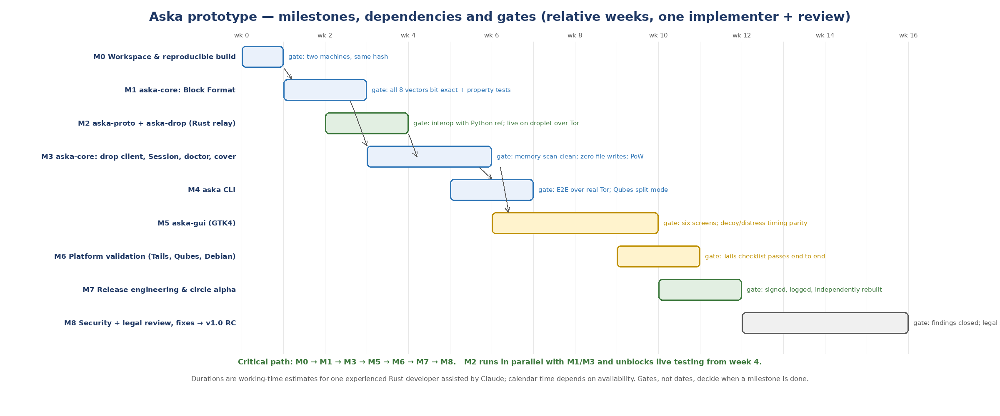

# Aska Prototype Plan

## Version 0.1 — from an empty workspace to a reviewed v1.0 release candidate

- **Status:** Draft 0.1 for owner approval. This is the last planning document before implementation starts; once approved, the first coding session executes Milestone 0.
- **Inputs:** Decision Record & Threat Model v0.2 (D-01…D-15), Block Format v1 draft 0.3 (S-01…S-07), Dead Drop Protocol ADP/1 draft 0.2 (P-01…P-06), Client Design v0.4 (C-01…C-07), and the Python reference implementation (24 tests, 8 vectors).
- **Method:** vertical slices with hard test gates. A milestone is done when its gate passes, not when its calendar slot ends. The Python reference is the oracle for every conformance gate.
- **Working model assumed:** one experienced developer (the owner) working with Claude sessions for design, code generation, review and documentation; an independent rebuilder from the circle; external security and legal reviewers engaged at M8.
- **Effort figures** are working-time estimates, not calendar commitments, and are given as ranges.

---

# 1. Purpose and approach

Everything Aska needs has now been decided and specified: the container a note travels in, the protocol it travels by, the relay that carries it, and the two clients that produce and consume it. This plan turns those documents into working software in a fixed order, with a test gate at the end of each step that must pass before the next step begins. The gates are drawn from the test plan in the Client Design (§10) and from the conformance sections of the two specifications; the Python reference implementation is the oracle for every conformance gate, which is why it was written first.

Four rules shape the plan. **Core before surface**: nothing with a screen is built until the core library reproduces every test vector and the relay interoperates with the reference, because a bug found in the format after the GUI exists costs ten times more. **Live from week four**: the Rust relay is built early and deployed on a real droplet over real Tor, so that everything after it is tested against the actual network rather than a mock. **Gates, not dates**: each milestone has a binary exit criterion; estimates are provided for planning, but a milestone that has not passed its gate is not done. **Nothing secret in the repository**: no relay addresses, no keys, no test notes with real content; test fixtures are the published vectors.

*Figure 1 — Milestones, dependencies and gates. M2 runs in parallel with M1/M3.*

# 2. Repository, tooling and conventions

| Concern | Decision for the prototype | Notes |
|---|---|---|
| Hosting | A self-hosted **Forgejo** instance reachable over Tor and clearnet, mirrored read-only to Codeberg | Avoids tying the project to a single US platform identity; mirrors give auditors easy access. A plain git repository on the owner's machine is acceptable for M0–M3. |
| Layout | Cargo workspace: `crates/aska-core`, `crates/aska-proto`, `crates/aska`, `crates/aska-gui`, `crates/aska-drop`; `reference/` (the Python code and vectors, unchanged); `deploy/`; `docs/` (the design documents as Markdown) | The Markdown twins of every design document live in `docs/` so the repository is self-describing. |
| Toolchain | `rust-toolchain.toml` pinning a stable Rust release; `Cargo.lock` committed; dependencies vendored (`cargo vendor`) and hash-checked | OPS-04. |
| Licences | AGPL-3.0 for `aska-drop`; dual MIT / Apache-2.0 for the rest (C-01); `LICENSE-*` files and per-crate `license` fields from the first commit |  |
| Quality gates in CI | `cargo fmt --check`, `cargo clippy -D warnings`, `cargo test --locked`, `cargo deny check`, `cargo vet` (crypto and I/O crates), vector conformance test, reproducible-build check (two containers, compare hashes) | CI runs in the pinned build container so CI output *is* the release build. |
| Build container | Debian 13 image pinned by digest with the pinned toolchain; produces static musl `aska` and `aska-drop`, and the `aska-gui` tarball | OPS-02. |
| Commits | Signed commits (SSH or minisign-derived key); conventional messages; every change to a specification is a commit to `docs/` with a version bump in the document | Keeps documents and code in one history. |
| Secrets hygiene | A pre-commit hook rejects anything that looks like an onion address, a bech32m Key Card or Share, or 24 BIP-39 words | Nothing secret in the repository. |

*Table 1 — Tooling decisions for the prototype (adjustable at M0 review).*

# 3. Milestones

Each milestone lists its scope, deliverables, the gate that closes it, its effort range in working days, and the risks specific to it. "Reference" means the Python implementation delivered with the specifications.

## M0 — Workspace and reproducible build (2–3 days)

**Scope.** Create the workspace and all five crates as empty shells with licences, CI, the pinned toolchain, vendoring, `cargo deny`/`vet` configuration, the build container, and the pre-commit secrets hook. Import `reference/` and `docs/`. **Deliverables:** a repository that builds a "hello" `aska --version` and `aska-drop --version` reproducibly. **Gate:** two independent machines (the owner's and a Claude cloud session, or two containers with different hosts) produce byte-identical release binaries for both static targets. **Risk:** reproducibility surprises (timestamps, build paths) — solved here once rather than at M7.

## M1 — aska-core: Block Format (6–9 days)

**Scope.** Modules `block`, `utc`, `kdf`, `keys` and the encodings: HKDF-SHA-512, Argon2id with KDF profiles, UtC over libsodium XChaCha20-Poly1305, seal/open with the four-header trial, KDF-profile iteration, Shamir over GF(2⁸) with verification, BIP-39 words, bech32m, Key Card TLV (including 0x06), onion address helpers. All secret types `Zeroize`/`ZeroizeOnDrop`, allocated through the locked allocator. **Deliverables:** the crate with unit and property tests, and a `vectors` test that loads `reference/test_vectors.json`. **Gate:** all eight vectors reproduce bit-for-bit given the specified test RNG and offsets; every Block vector opens with every listed passphrase and rejects every listed non-match; property tests (random round trips, tamper anywhere → no plaintext, any k of n Shares reconstruct, any k−1 give nothing) pass 10 000 iterations; `cargo vet` records audits for `argon2`, `zeroize`, `memsec`, `libsodium-sys-stable`. **Risk:** subtle byte-order or padding divergence from the reference — the vectors catch it; Argon2 memory allocation under `mlock` limits on default Linux (`RLIMIT_MEMLOCK` is often 8 MiB) — handle by raising the limit where permitted and warning otherwise, as the doctor design specifies.

## M2 — aska-proto and aska-drop, the Rust relay (5–7 days, parallel to M1/M3)

**Scope.** The ADP/1 wire encoding crate; the relay as a `tokio` server bound to loopback with the RAM-only store, monotonic deadlines, expire-only TTL, per-class caps, idempotent duplicate rule, adaptive label-bound PoW, CSPRNG-randomised listing, 30-second read timeouts, `mlock` and no-core-dump at start, four configuration flags and no logging code path. Adapt `deploy/` scripts to the Rust binary. **Deliverables:** static `aska-drop`; the relay running on a DigitalOcean droplet as an onion service. **Gate:** the Python reference client passes all its tests against the Rust relay and the Rust relay's test client passes against the Python reference relay (bidirectional interop); the malformed-request corpus is rejected identically; a 24-hour soak on the droplet with synthetic load shows flat memory and correct expiry; `strace` confirms no file writes after start. **Risk:** Tor onion-service PoW configuration on current Tor packages — verify on the droplet early.

## M3 — aska-core: drop client, Session, doctor, cover traffic (7–10 days)

**Scope.** SOCKS5 client with per-request isolation credentials; ADP/1 client operations with PoW solving; control-port `ONION_CLIENT_AUTH_ADD` (with Tails detection that declines, C-03); the `Session` state machine with locked memory, watchdog, `distress()`; the `doctor` probes of Client Design Table 4; the Poisson cover-traffic scheduler; randomness mixing for roots; `fingerprint` module reading the embedded release hash. **Deliverables:** a core that can seal, post, poll, match and open against the live droplet relay from a test harness. **Gate:** end-to-end test over real Tor (Level 1 with decoy; Level 2 via Shares) against the M2 droplet; **memory gate** — a harness closes a Session and scans process memory for the note plaintext, R and every derived key, finding none; **file gate** — `strace`/`inotify` over a full send-and-receive shows no file created or written anywhere; PoW challenge path exercised; doctor produces the expected findings on a deliberately weakened test VM (swap on, X11, AT-SPI client). **Risk:** `mlock` and zeroisation guarantees through async boundaries — keep secrets out of futures' captured state; review by a second Claude session focused on this alone.

## M4 — aska command-line client (4–6 days)

**Scope.** The full command set of Client Design Table 3, terminal QR rendering, camera capture via a small helper (portal), the alternate-screen viewer with countdown, `seal`/`post`/`open` for Qubes split mode, `verify`, `profile`. **Deliverables:** static `aska`. **Gate:** scripted E2E over real Tor between two machines using only the CLI (Quick and Guarded); Qubes split-mode walkthrough executed on a Qubes 4.3 machine; exit codes and refusal behaviour (non-Tor, non-onion) verified; no secret ever appears in `argv`, environment or a file (harness check). **Risk:** terminal QR legibility across terminals — provide both half-block and ASCII renderings.

## M5 — aska-gui, the graphical client (12–18 days)

**Scope.** GTK4/libadwaita application implementing the six screens of Client Design §5 over `aska-core`: Home, Send (three protection cards, decoy/distress options, TTL, relays, threshold selector), Hand-over (QR + words; one Share at a time), Receive (portal camera scanner, in-app shuffled keypad), View (read-only, countdown, close-and-burn), Shares & settings (relays with INFO reachability check, cover level, timers, verify panel, encrypted profile). Doctor banners; identical window title; clipboard off for content; capture protection request where the compositor supports it; string externalisation with English as the shipped language (C-06). **Deliverables:** `aska-gui` tarball with desktop file and icon. **Gate:** every screen flow executes on GNOME Wayland; the **timing-parity test** (open a decoy slot and a distress slot 1 000 times each; the distributions of time-to-first-frame must not be distinguishable at p < 0.01) passes; memory and file gates from M3 re-run with the GUI; the six wireframes are matched by screenshots in the review package. **Risk:** GTK text-buffer residual (accepted, C-02); portal camera availability on the test machines; the largest milestone — split into 5a (Home/Send/Hand-over) and 5b (Receive/View/Settings) with an intermediate demo.

## M6 — Platform validation (4–6 days)

**Scope.** Execute and record the Tails procedure (Client Design §8.1) end to end on Tails 7 from a fresh USB stick, the Qubes simple and split procedures (§8.2), and a Debian 13 run; verify every doctor detection against a real condition; confirm C-03 behaviour on Tails; measure Argon2id time on the Tails reference hardware. **Deliverables:** completed checklists with screenshots, and fixes. **Gate:** the Tails checklist passes with zero deviations; the Qubes split-mode checklist passes; every doctor finding fires on its trigger and stays silent otherwise. **Risk:** Tails Tor stream isolation and portal behaviour differing from Debian — this milestone exists to find exactly that.

## M7 — Release engineering and circle alpha (4–5 days)

**Scope.** Release procedure: tag, containerised reproducible build, minisign signing with an offline key, Rekor log entry, embedding of the release fingerprint, publication of artefacts and `SHA256SUMS`, independent rebuild and attestation by a second party, verification instructions (Client Design §9.4), no-auto-update policy text in the app. First tagged release **v0.1.0-alpha** for the circle. **Deliverables:** signed artefacts, attestation, release notes. **Gate:** two independent rebuilds match the release hashes; `aska verify` on a fresh Tails shows the matching fingerprint and Rekor ID; a circle member with no prior involvement installs and verifies from the written instructions alone. **Risk:** minisign/Rekor tooling friction — rehearse the whole procedure on a throwaway tag first.

## M8 — Security review, legal review, fixes → v1.0 release candidate (4 weeks elapsed; 6–10 days of work)

**Scope.** Assemble the review package (all design documents, threat model, reference and Rust code, test results, the review items flagged in the specifications: UtC instantiation, nonce derivation, statistical indistinguishability, PoW amortisation, slow-loris limits, expiry ordering); engage an independent security reviewer (OPS-05) and a legal reviewer for Sweden, EU, UK and US (OPS-06, D-13); triage and fix findings; publish the reports; tag **v1.0.0-rc1**. **Gate:** all High and Medium findings closed or formally accepted by the owner with rationale; legal sign-off on the distress function, Tor-only operation and possession risk per jurisdiction; Decision Record v0.3 issued with any resulting changes (including the BLK-09 wording). **Risk:** reviewer availability — start the engagement during M5 so the review begins as soon as M7 ships.

# 4. Critical path, effort and sequencing

| Milestone | Depends on | Effort (working days) | Cumulative (working days) |
|---|---|---|---|
| M0 Workspace | — | 2–3 | 2–3 |
| M1 Core: Block Format | M0 | 6–9 | 8–12 |
| M2 Proto + relay | M0 | 5–7 | (parallel) |
| M3 Core: client side | M1, M2 | 7–10 | 15–22 |
| M4 CLI | M3 | 4–6 | 19–28 |
| M5 GUI | M3 | 12–18 | 31–46 |
| M6 Platform validation | M4, M5 | 4–6 | 35–52 |
| M7 Release & alpha | M6 | 4–5 | 39–57 |
| M8 Reviews & RC | M7 | 6–10 (+ reviewer time) | 45–67 |

*Table 2 — Effort ranges. Roughly 9–14 working weeks of implementation for one developer working with Claude, plus review elapsed time; calendar duration depends on availability.*

The critical path is M0 → M1 → M3 → M5 → M6 → M7 → M8. M2 is off the critical path and should start as soon as M0 closes so that a live relay exists by the time M3 needs one. M4 is short and can overlap the start of M5; it also provides the harness used by M5's gates. If time must be cut, the GUI (M5) is the only milestone with internal scope to trade — the settings screen and encrypted profile could ship after the alpha — whereas the core, relay, CLI and validation milestones have no optional parts.

# 5. Risks and mitigations

| Risk | Likelihood | Impact | Mitigation |
|---|---|---|---|
| Rust core diverges from the format reference in a subtle byte | Medium | High | Bit-exact vector gate at M1; reference kept in the repo; any spec change requires regenerating vectors first. |
| Memory guarantees leak through async/GTK boundaries | Medium | High | Memory-scan gate at M3 and M5; secrets never captured in futures; dedicated review session on `Session`. |
| Reproducible builds break on toolchain or dependency updates | Medium | Medium | Solved at M0 and re-checked in every CI run; updates are deliberate, reviewed commits. |
| Tails behaviour differs from Debian (Tor isolation, portals, mlock limits) | High | Medium | M6 exists for this; C-03 already removes the hardest case; test on Tails from M4 onward informally. |
| GTK4 milestone overruns | Medium | Medium | Split into 5a/5b; settings/profile deferrable; CLI already usable by the circle from M4. |
| Onion-service PoW or vanguards tooling changes in Tor | Low | Medium | Verify on the droplet at M2; runbook pins the tested Tor version. |
| Reviewer availability delays M8 | Medium | Low | Engage during M5; publish alpha to the circle regardless — the alpha is not a public release. |
| Scope creep (KEM path, paper mode, mobile) before v1.0 | Medium | Medium | All are roadmap items with format hooks already reserved; the plan admits no new features before M8 closes. |
| Single-developer dependency | High | High | Everything is written down; STATE.md, specs and reference let any competent Rust developer (or a fresh Claude session) resume at any gate. |

*Table 3 — Risk register.*

# 6. Definition of done for v1.0

- Rust `aska-core` reproduces all Block Format vectors and passes property, memory and file gates; `aska-drop` interoperates bidirectionally with the reference and has run a 24-hour soak on a real onion service.
- `aska` and `aska-gui` complete both Level 1 and Level 2 flows over real Tor between two machines, with decoy and distress behaviour verified and timing parity demonstrated.
- The Tails, Qubes (simple and split) and Debian checklists pass; every doctor detection is verified.
- Releases are reproducible, minisign-signed, Rekor-logged and independently rebuilt; verification works from the written instructions alone on a fresh Tails.
- Independent security review completed with all High/Medium findings closed or accepted; legal review completed; Decision Record v0.3 issued.
- Documentation: user guide (English, with the language framework in place), operator runbook, and all design documents in `docs/` at their final versions.
- Explicitly **not** in v1.0: X-Wing KEM path (v1.1), custom read-only viewer (v1.1), additional languages (as translations arrive), paper/one-time-pad mode (RM-01), mobile client (RM-02), timelock and threshold decryption (RM-03/04), mixnet transport (RM-05).

# 7. The first coding session

On approval of this plan, the first implementation session executes M0 in full and begins M1. Concretely, in order: create the workspace and crates with licences and `rust-toolchain.toml`; import `reference/` and `docs/`; write the build container definition and CI pipeline; prove reproducibility with two builds; then port `hkdf_sha512`, `utc_seal`/`utc_open`, the KDF profile table and `derive_label`/`derive_slot_key` from the reference and make TV-1 and TV-2 pass. Each subsequent session picks up from `STATE.md`, which will record the current milestone, the last passing gate and the next task — exactly as it has through the research and design phases.

Decisions required from the owner before that session: approval of this plan; the repository hosting choice (Table 1 proposes self-hosted Forgejo with a Codeberg mirror); and confirmation that a DigitalOcean droplet (or equivalent) can be provisioned at M2 for the live relay.
