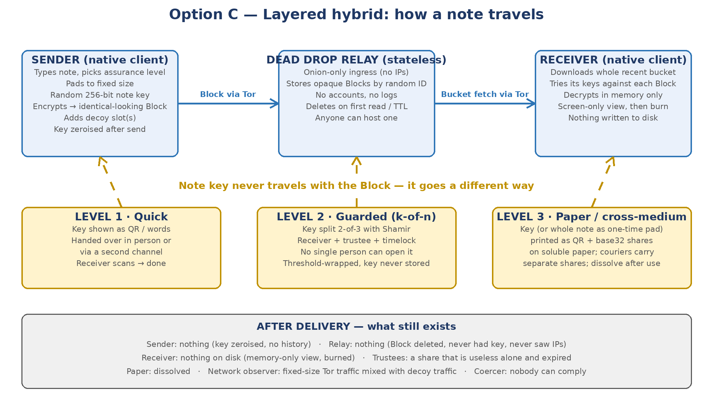

# Option C — The Layered Hybrid

## How the recommended architecture works in the real world, explained through use cases

- **Version:** 0.1 — concept explanation; no protocol or code decisions have been made yet
- **Date:** 25 September 2026
- **Prepared for:** the project owner
- **Companion to:** *Secure Notes Sharing App — Research Report v0.1* (Section 5.3 introduced Option C; this document expands it)
- **Audience:** written in plain language first, with the technical reasoning behind each choice in the margins. Nothing here requires cryptography background to follow.
- **Status:** Working document for the design discussion. Names used for the building blocks (Block, Dead Drop, Bucket, Share, Level) are placeholders.

---

# 1. Option C in one page

Option C is a way of sending a note so that, once it has been read, **nothing remains anywhere that could reveal it, prove it existed, or show who sent or received it** — and so that, before it is read, **no single person can be forced to open it**. It does this by separating three things that ordinary secure messengers keep together: the encrypted note itself, the key that opens it, and the identities of the people involved.

The encrypted note (we call it a **Block**) travels through a **Dead Drop**: a dumb relay that stores random-looking, identical-sized parcels under random labels for a short time, reachable only over Tor, keeping no accounts and no logs. The **key** never travels with the Block. Depending on how dangerous the situation is, it is handed over in person as a QR code, split into pieces so that two or three people (or a person and a timer) must cooperate to reassemble it, or printed on dissolving paper and carried by separate couriers. The **receiver** does not ask the relay for "my note" — it downloads everything recent and quietly tries its key against each parcel, so the relay never learns who a note was for. The note is shown on screen from memory only, then destroyed; the relay deletes the Block the moment it has been collected.

The same app also offers a **paper mode** for the highest-threat cases: the note itself can be encrypted with a one-time pad printed on soluble paper, giving the only kind of security that no computer, quantum or otherwise, can ever break. Both modes produce Blocks that look identical, both carry **decoy slots** (a second, innocent note that opens with a different passphrase), and both are read by the same memory-only viewer.

*Figure 1 — How a note travels in Option C. The Block and the key take different routes; after delivery nothing is left.*

> **Why "layered hybrid"**
>
> **Hybrid** because it combines the digital dead drop (fast, usable every day) with the paper path (slow, but unconditionally secure) in one product with one container format — the user's threat level, not the product, decides how much friction to accept.
>
> **Layered** because no single component is trusted: the relay cannot read or link anything; Tor hides who talks to the relay; the key travels separately; the key is split so no one person holds it; the container is indistinguishable from random and carries decoys; the client keeps nothing; and the paper option removes even the dependence on computational assumptions.
>
> Every layer was chosen because the research found the alternative failing in a real case: relays get seized (Sky ECC, MATRIX), operators get coerced (Phantom Secure), update channels get poisoned (EncroChat, Ghost), links get logged (every one-time-note service), devices get extracted (Cellebrite), and single key-holders get jailed for refusing (RIPA).

# 2. The building blocks, explained

This section explains each component in everyday language, and then, in a short note, why the research led to that choice. The names are placeholders for the design phase.

## 2.1 The Block — the sealed parcel

A Block is what the app produces when you write a note: a parcel of bytes that looks like random noise, always exactly the same size regardless of how long the note is (short notes are padded; long notes go into a larger standard size). It has no readable header, no file signature, no version string in the clear — nothing that lets anyone say "this is a Secure Notes file". Inside, the note is encrypted with a fresh random 256-bit key that is generated for this Block alone and never reused. The Block also contains room for one or more **decoy notes**, each opened by its own passphrase, and random filler so that a Block with one note and a Block with three notes cannot be told apart.

> *Why: 256-bit symmetric encryption is already safe against quantum computers (Section 3.1 of the research report). Fixed sizes and random-looking content give *structural* deniability, which the research found far more reliable than hidden volumes or theoretical deniable encryption. The decoy design follows Superbacked's Blockcrypt, whose honest limitation — revealing a later passphrase proves earlier notes exist — the app will document. The container uses a key-committing construction so a decoy cannot be used against the owner (RFC 9771).*

## 2.2 The Note Key — and why it travels separately

Every Block has one key. The key is the only thing that turns the noise back into a note, and it is deliberately kept apart from the Block. If an adversary seizes the relay, they get Blocks and no keys. If they intercept the key hand-over, they get a key and no Block — and because the Block sits on a relay they cannot link to that key, they cannot even find the parcel it opens. The key is 32 bytes: it fits in a QR code, in 24 spoken words, or on a strip of paper.

> *Why: every one-time-note service today puts the key in the link (after the #), which means whoever holds the link holds everything, and server logs tie creator, reader and time together. Separating key from Block is what makes "the relay knows nothing" literally true.*

## 2.3 The Dead Drop — a relay that knows nothing

The Dead Drop is a small piece of open-source server software that anyone can run. It accepts Blocks over Tor only (so it never sees a real IP address), files each one under a random 256-bit label chosen by the sender's app, keeps it for a short, sender-chosen time (minutes to days), and deletes it either when it has been collected or when the time runs out — whichever comes first. It has no user accounts, no login, no analytics, and no log files. It cannot answer the question "who posted this?" or "who is this for?" because it was never told. Several Dead Drops can exist in the world; the sender's app simply picks one (or posts to two for redundancy).

> *Why: the research found that every hosted service is eventually compelled or seized (Proton was ordered to log an activist's IP; Sky ECC and MATRIX servers were taken; Telegram now hands over data). The only defence is a server whose seizure yields nothing — the Mullvad model, where a police raid in 2023 left empty-handed. Onion-only ingress removes IPs; statelessness removes logs; deletion-on-read removes history.*

## 2.4 The Bucket fetch — collecting without asking

When the receiver's app checks for notes, it does not ask the relay for a specific label. It downloads **all** Blocks posted in the last window (say, the last 24 hours) and tries its own keys against each one locally. Most will not open — they are other people's notes, or decoy traffic — and are discarded. This costs some bandwidth (Blocks are small and few), but it means the relay cannot tell which parcel a given visitor came for, or whether they found anything at all. The receiver's app also fetches at random times, and occasionally posts its own decoy Blocks, so that even a watcher who sees "someone connected to the relay" learns nothing about real activity.

> *Why: true metadata-private messaging (PIR inboxes, mixnets) is still research-grade or too slow (Section 3.3). "Everyone downloads everything" is the oldest and simplest way to get receiver anonymity, is proven in systems like Bitmessage and Hyphanet, and works well for the low volumes a notes app handles. The blob format is designed so it can later move onto a mixnet such as Katzenpost without changing the client.*

## 2.5 Shares — splitting the key so no one person can be forced

For situations where the receiver themselves might be pressured, the key is not handed over whole. It is split into **Shares** using Shamir secret sharing: for example three Shares of which any two rebuild the key, and any single one reveals nothing at all — not a hint, not a partial key, mathematically nothing. The Shares go to different holders: the receiver, a trusted colleague or lawyer, a second device kept elsewhere, or a **timelock** (a share that only becomes available after a chosen date). A person holding one Share who is threatened cannot open the note, cannot be made to open it, and can prove that they cannot.

> *Why: Shamir sharing is information-theoretically secure — quantum computers do not matter — and is mature (SLIP-39, codex32, Superbacked blocksets). Research on deniable secret sharing (2025) shows a lone coerced share-holder cannot fake a share, which is fine: the point is that they genuinely cannot comply. Threshold *decryption*, where the key is never reassembled even at the end, is the stronger form and will replace reassembly once post-quantum threshold libraries mature (NIST process, ~2027).*

## 2.6 Assurance Levels — letting the threat choose the friction

Not every note faces a nation-state. The app offers three Levels that use the same Block format but differ in how the key is handled and how much effort the user accepts. Level 1 (Quick) hands over the key directly — a QR code scanned across a table, or words read over a call on a different channel. Level 2 (Guarded) splits the key into Shares held by different parties or a timelock. Level 3 (Paper) moves the key, or the entire note as a one-time pad, onto dissolving paper carried physically, and can be operated without any trusted computer at the receiving end.

|  | Level 1 — Quick | Level 2 — Guarded | Level 3 — Paper / cross-medium |
|---|---|---|---|
| Typical use | Everyday sensitive notes between people who can meet or have a second channel | Notes the receiver might be pressured over; hand-overs; succession | Hostile environments; no trusted devices; secrets that must outlive any computer |
| Where the Block goes | Dead Drop via Tor | Dead Drop via Tor | Dead Drop, public bulletin, or carried on paper as QR |
| How the key moves | QR shown in person, or 24 words over a separate channel | Split 2-of-3 or 3-of-5; Shares to receiver + trustee(s) + optional timelock | Key or whole one-time pad printed on soluble paper; Shares carried by different couriers |
| Who can open it before delivery | Receiver only | No single person | No single person; no computer needed |
| Security basis | AES-256/XChaCha20 + hybrid PQ KEM if used | Same + Shamir (unconditional below threshold) | One-time pad (unconditional) or Shamir |
| Effort | Seconds | Minutes; coordination with trustees | Preparation session; physical logistics |
| Decoy slots | Yes | Yes | Yes (spare innocent pad page) |

*Table 1 — The three assurance Levels share one container and one viewer.*

## 2.7 The paper path — one-time pads and share cards

In Level 3 the app becomes a generator and printer. Working on a device with all radios off (or a dedicated small computer with no network hardware), it produces truly random key material from two independent sources, prints it as QR codes with a human-readable base32 text fallback, and — for the one-time-pad variant — prints a worksheet that lets the receiver decrypt by hand if they have no device at all. The paper is water-soluble: a glass of water destroys it in seconds, silently and legally. The pad pages or key Shares are split so that separate couriers carry separate pieces, and each piece alone is worthless. A small **integrity tag** printed with the pad lets the receiver confirm the note was not altered in transit.

> *Why: the one-time pad is the only cipher with a mathematical proof of unbreakability, and it gives deniability for free (any ciphertext can be "decrypted" to any innocent text with a fake pad). History shows it fails on operations, not mathematics — pad reuse, decrypting on a computer that keeps swap files, printer tracking dots, indented writing — so the app enforces single use, prints on a monochrome printer or offers hand-copy templates, and instructs "write on glass, never photograph, dissolve after use". The integrity tag is a Carter–Wegman one-time MAC, also unconditionally secure. No shipped product does this today.*

## 2.8 Decoys and the distress key

Every Block can hold a second, innocent note behind a second passphrase. If the receiver is forced to open "the note", they open the decoy: a shopping list, a birthday message, something plausible for that relationship. Optionally, the app also accepts a **distress passphrase**: it shows the decoy exactly as usual, but silently destroys the real note in the same moment, so that even a later, more determined attempt finds nothing. The app never indicates how many notes a Block contains.

> *Why: decoys are the one form of content deniability that is deployed and understood (VeraCrypt hidden volumes, Superbacked). The research also shows the limit honestly — a coercer who already knows a second passphrase exists is not fooled — which is why decoys are a layer, not the foundation. The distress key mirrors GrapheneOS's duress PIN at note level.*

## 2.9 The client — native, verifiable, amnesic

The app is a native application (Android with GrapheneOS as the reference platform, iOS, and desktop Linux), not a website. Its releases are built reproducibly so that anyone can confirm the published app matches the published source, and every release is signed and recorded in a public transparency log. It does not auto-update silently; it tells the user a new version exists and shows a fingerprint they can check elsewhere. While running, it keeps the note only in protected memory, never writes plaintext to disk, excludes itself from cloud backups, blocks screenshots and screen recording, sends no notifications, refuses to run if screen-reading accessibility services are active, and uses its own on-screen keypad for passphrases. It has no contact list, no history and no "sent" folder. An optional **amnesic mode** guide shows how to run it from a live USB (Tails or a Superbacked-OS-style image) and prove afterwards that nothing was written.

> *Why: the endpoint is where every real case was lost (Section 3.5). EncroChat and Ghost died through poisoned updates; *US v. Sharp* (2026) recovered Signal messages from Apple's notification cache; Windows Recall screenshots everything; web JavaScript can be swapped per user. Each rule above closes one of those doors.*

# 3. How a note travels, step by step

The following is the Level 1 flow in full. Levels 2 and 3 change only the key step (step 4).

1. **Write.** The sender opens the app and types the note. The app pads it to the nearest standard size and, if asked, lets the sender add a decoy note with its own passphrase.
2. **Seal.** The app generates a fresh random 256-bit note key and a random 256-bit label, encrypts the note (and decoy) into a Block, and computes a small integrity tag inside the Block so tampering is detectable.
3. **Post.** The app connects to a Dead Drop over Tor and uploads the Block under its label with a time-to-live chosen by the sender (for example 24 hours). Nothing else is sent: no sender identity, no recipient hint, no device information. The app may post one or two decoy Blocks at random times around it.
4. **Hand over the key.** The app shows the key (and, if the receiver has not used that Dead Drop before, the Dead Drop's onion address) as a QR code or as 24 words. The sender shows the QR to the receiver in person, or reads the words over a different channel — a phone call, a different messenger, a piece of paper. *The key is never sent through the same channel as the Block.*
5. **Forget.** As soon as the receiver confirms (or after a short timer), the sender's app wipes the key from memory. The sender now holds nothing: no copy of the note, no key, no record that a note was sent.
6. **Collect.** The receiver's app, at a random moment within its normal polling rhythm, connects to the Dead Drop over Tor and downloads all Blocks posted in the current window. It tries the scanned key against each; exactly one opens.
7. **Burn on the relay.** The Dead Drop deletes a Block the first time it is included in a completed bucket download that requested it — or, more simply in the broadcast model, when its time-to-live expires. (Which of these two behaviours to use is a design decision; see Section 7.)
8. **Read.** The note is decrypted into protected memory and shown on screen. Screenshots are blocked. There is no "save", "forward" or "copy" button by default. If the receiver enters the decoy passphrase instead, the decoy is shown; if they enter the distress passphrase, the decoy is shown and the real note is destroyed.
9. **Destroy.** When the receiver closes the note (or after a timer), the app zeroises the memory. The key is discarded. The receiver now holds nothing either.

## 3.1 Who knows what, and when

| Moment | Sender | Dead Drop | Receiver | Network observer | Trustee (Level 2) |
|---|---|---|---|---|---|
| Before sending | Plaintext (typing) | Nothing | Nothing | Nothing | Nothing |
| After posting | Key (briefly); no plaintext copy | One random-looking Block under a random label; no IP; no identity | Nothing | Fixed-size Tor traffic from someone to somewhere | Nothing |
| After key hand-over | Nothing (key wiped) | Same | Key (or its Share) | Possibly saw a QR being shown, or a call being made — never the key material itself | One Share (useless alone) |
| During collection | Nothing | Sees a Tor visitor download the whole bucket; cannot tell which Block mattered | Plaintext in protected memory | Fixed-size Tor traffic | Same |
| After reading | Nothing | Nothing (Block deleted / expired) | Nothing (memory zeroised) | Nothing linkable | An expired Share |
| Years later, with a quantum computer | Nothing to attack | Nothing retained; even a recorded Block is AES-256 (Grover-resistant) or one-time-pad (unbreakable) | Nothing | Recorded Tor traffic reveals connection metadata at most, never content | Nothing |

*Table 2 — The information held by each party at each stage. The design goal is that the last two rows read "nothing" everywhere.*

# 4. Use cases

Six scenarios follow, chosen to exercise different parts of Option C: everyday use, coercion of the receiver, coercion of the sender, succession, hostile environments with no trusted electronics, and a compromised device. Each describes the situation, the set-up, what happens step by step, what an adversary obtains at each point, and what risk remains. Names are fictional.

## Use case 1 — Handing over privileged credentials to a successor (Level 1 → 2)

### Situation

Erik is leaving his role as infrastructure lead at a mid-sized industrial group. He must hand the root credentials for the identity provider, the backup encryption passphrase and the domain registrar recovery codes to his successor, Anna, who starts next week and is currently abroad. Company policy forbids sending credentials by e-mail or chat, the password manager's sharing feature would leave a permanent audit trail with the vendor, and Erik wants no lingering copy on his own devices after he leaves.

### Set-up

Both have the app. Erik chooses **Level 2** because the credentials are high-value and Anna is travelling: the key is split 2-of-3 between Anna, the CIO (Maria) and a 7-day timelock. Erik writes the credentials as one note and adds a decoy note containing an old, already-rotated set of test-environment credentials.

### What happens

1. Erik's app seals the note into a Block and posts it to the company's own Dead Drop (a small onion service the IT team runs on a spare VM; it could equally be any public Dead Drop) with a 10-day time-to-live.
2. The app splits the note key into three Shares. Share 1 is shown as a QR code that Erik reads to Anna over a video call she takes on her personal phone; her app stores it in the phone's secure enclave, wrapped and useless alone. Share 2 goes the same way to Maria. Share 3 is deposited with the timelock service, which will release it only after seven days.
3. Erik's app wipes the key. Erik has nothing to keep and nothing to be asked for on his last day.
4. When Anna lands, she and Maria are in the same room. Anna's app fetches the day's bucket over Tor, Maria shows her Share as a QR, Anna's app reassembles the key in memory, opens the Block, and displays the credentials. Anna types them straight into the systems and rotates them. She closes the note; her app zeroises memory; the Dead Drop deletes the Block.
5. Had Maria been unavailable, the timelock Share would have released after seven days and Anna could have opened the note alone — but nobody could have opened it earlier without two of the three parties.

### What an adversary gets

| Adversary | Obtains |
|---|---|
| Someone who compromises the Dead Drop VM | A random-looking Block they cannot open or attribute; no IP addresses; no record of who it was for. |
| Someone who intercepts Anna's video call | One Share — mathematically no information about the key; the Block is unreachable to them anyway (they do not know its label). |
| Anna, threatened in transit | Cannot comply: she holds one Share and can demonstrate that alone it opens nothing. |
| Erik, pressured after leaving | Cannot comply: holds nothing. |
| Auditor asking "were credentials transferred securely?" | A process description; deliberately no content log. If an audit trail is required, the design can add a signed *receipt of hand-over* that proves a transfer occurred without revealing content — a policy decision (Section 7). |

### Residual risk

Anna's phone during the minute the credentials are on screen; a compromised phone would see them, which is why the app recommends GrapheneOS/Lockdown Mode and why Anna rotates the credentials immediately after use. The decoy is only useful if Anna is asked before, not after, rotation.

## Use case 2 — A source and a journalist under surveillance (Level 1, Tor-first)

### Situation

Sofia works in a public agency in a country where contacting journalists is dangerous. She wants to pass a short summary of what she has seen, and a document reference, to Daniel, a reporter she has met once at a conference. She assumes her phone's traffic is monitored, that Daniel's phone may be seized at a border, and that any messaging account can be subpoenaed.

### Set-up

At the conference, Daniel had shown Sofia a QR code from his app: a **one-time receiving key** (a hybrid post-quantum public key generated for exactly one Block) plus the onion address of a public Dead Drop he polls. Sofia's app stored it. Nothing about Daniel — no name, no number — was stored with it. Sofia uses **Level 1** because the only meeting they will ever have has already happened.

### What happens

1. Weeks later, at home, Sofia writes the note. Because she has Daniel's one-time receiving key, her app encapsulates the note key to it using the hybrid X25519 + ML-KEM scheme, so **no separate key hand-over is needed at all**: the Block can only be opened by whoever holds the matching one-time private key — Daniel's app, which will delete it after one use.
2. Her app pads the note to the standard size, adds a decoy (a note about a restaurant), and posts the Block through Tor to the Dead Drop with a 72-hour life. Her app also posts two decoy Blocks at random intervals that day.
3. Daniel's app polls the Dead Drop over Tor twice a day at random times, downloading the whole bucket. One Block opens with his one-time key. He reads it, notes the document reference by hand on paper, closes the note. The one-time private key is destroyed; the Block is deleted at the relay.
4. Sofia's app kept nothing — not even the fact that a Block was sent. Daniel's app kept nothing either. If they need to exchange again, Daniel must publish a new one-time key: through a friend, a printed QR left somewhere, or at another meeting. Reuse is deliberately impossible.

### What an adversary gets

| Adversary | Obtains |
|---|---|
| Sofia's ISP / national monitoring | That her phone made Tor connections of fixed size at a few random times — indistinguishable from the decoy Blocks and from the app's idle cover traffic. No destination, no content. |
| The Dead Drop operator, or police seizing it | A few dozen identical-looking Blocks from many people, with random labels and expiry times. No IPs, no accounts, no way to say which was Sofia's or Daniel's. |
| Border agents seizing Daniel's phone (locked) | A GrapheneOS phone in before-first-unlock state after auto-reboot; Cellebrite extraction fails; the app has no history to find anyway. |
| Border agents seizing Daniel's phone (unlocked, forced open) | An app with no inbox, no contacts, no past notes. If the Block is still pending, they could force him to fetch it — this is why Level 2 exists for higher-risk receivers. |
| Sofia, questioned | She can truthfully say she has no copy, no key and no record; the app shows the same empty state it always shows. |
| A future quantum computer replaying recorded traffic | Tor traffic metadata at most; the Block itself was protected by AES-256 and a hybrid KEM whose ML-KEM component is quantum-resistant. |

### Residual risk

Tor from a small, monitored network is itself unusual (the Harvard bomb-hoax lesson); the app should warn about this and suggest using it where Tor use is common. If Daniel's phone is compromised by spyware before he reads, the note is exposed on screen; nothing in any design survives that. The one-time receiving key must be published somehow, and that channel is the weakest link for a second exchange.

## Use case 3 — Crossing a border with nothing to give (Level 2 with timelock)

### Situation

Lena, a lawyer, must bring case notes to a client meeting in a country where devices are routinely searched and travellers are compelled to unlock them. She cannot risk carrying the notes, and she cannot risk being forced to fetch them on arrival.

### Set-up

Before leaving, Lena posts her notes as a Block from her office (Level 2). The key is split 2-of-3: one Share on the travel phone (wrapped in its secure enclave), one with her colleague Marcus at the office, and one in a timelock set for 48 hours after her scheduled arrival. She travels with a freshly reset phone containing only the app and its one Share.

### What happens

1. At the border Lena is asked to unlock the phone. She does — there is nothing to hide on it. The app shows an empty state. If officers force her to run a fetch, her app downloads the bucket and can open nothing: it has one Share, and two are needed. She can state this plainly and it is true.
2. If officers copy the phone, they copy one wrapped Share bound to that phone's hardware, worthless without a second Share.
3. At the meeting, Lena calls Marcus over an ordinary line. He reads his Share as 24 words. Her app reassembles the key in memory, fetches the bucket, opens the note, and shows it. She works from the screen; nothing is saved. She closes it; the Block is gone from the relay; the key is gone from memory.
4. If Marcus were unreachable — or if Lena preferred not to involve anyone — the timelock Share releases 48 hours after arrival and she opens the note alone, having been un-coercible during the border crossing itself.
5. If Lena had entered her **distress passphrase** at the border, the app would have shown the decoy note (a generic itinerary) and, silently, discarded her Share, making the real note permanently unrecoverable by anyone who later gained control of her phone.

### Why this works

The coercion happens at a moment when, by construction, nobody present can decrypt. The cost is that Lena needs a second party or time to open her own notes; the design lets her choose which. Nothing about this depends on Lena's courage or on the border officers' technical skill.

## Use case 4 — Succession: "if something happens to me" (Level 3 shares on paper)

### Situation

Alex wants his family to be able to reach his financial accounts, password manager and personal instructions if he dies or is incapacitated — but only then, and without any single person (a family member, a lawyer, a cloud provider) being able to read them earlier or being a target for pressure. He also wants the arrangement to still work in 20 years, whatever happens to computers.

### Set-up

Alex uses **Level 3** in its cross-medium form. The note is sealed into a Block; the Block itself is printed as a QR card (it is only noise, so it is safe to print several copies) and also stored as a file in two places. The key is split 3-of-5 and printed as five **Share cards** on durable paper: one each to his partner, his brother, his lawyer, one in a bank safe-deposit box, and one kept at home in a sealed envelope. Each card carries a QR and the base32 text of that Share, plus a checksum so a damaged card can be detected. The app also prints a one-page recovery instruction sheet with the Dead Drop-free procedure ("scan the Block card, then any three Share cards").

### What happens

1. Nothing, for years. No server is involved. Any single card, if found, stolen or subpoenaed, reveals nothing. Two cards together still reveal nothing.
2. When the time comes, the partner, the brother and the lawyer meet (or the partner retrieves the bank card). Any three cards are scanned by the app, on any phone, in amnesic mode; the key is rebuilt in memory; the Block card is scanned; the note is displayed and worked from. The cards are then dissolved or shredded and burned.
3. Alex can update the note at any time by sealing a new Block and reprinting the Block card; the Share cards stay valid, because the app can reuse the same split key for a new Block (a design choice — reusing the key across Blocks trades some forward secrecy for convenience; see Section 7).

### Why this works

Shamir shares are unconditionally secure below the threshold and will remain so regardless of quantum computing; the Block is protected by AES-256, which is also expected to hold. Nobody is a single point of coercion, there is no company to go out of business, and paper needs no power. The pattern is exactly what Superbacked, Trezor's Shamir backup and Cypherock do for cryptocurrency seeds, generalised to arbitrary notes.

## Use case 5 — No trusted electronics at all (Level 3, one-time pad by hand)

### Situation

Two members of a human-rights group, Amara and Tomas, will be separated for three months in a region where every phone and laptop must be assumed compromised or seized at any time, and where possessing encryption software is itself dangerous. They need to exchange a handful of short messages — dates, places, yes/no decisions — with certainty that no interception, now or in fifty years, can read them.

### Set-up

Before separating, at a location they trust, they run the app in amnesic mode on a device with no radios and generate a **one-time pad booklet**: ten pages, each holding key material for one message of up to 400 characters plus an integrity tag, printed on water-soluble paper in monochrome, each page numbered. The app prints two identical booklets — one each — and a **hand-decryption worksheet** with the substitution table. The booklet is split: each person carries pages 1–5 in one place and 6–10 in another, and they agree that no page is ever used twice. The device is wiped; the amnesic OS never wrote to disk.

### What happens

1. Tomas needs to send "meet 14 Nov, north gate, bring copies". He takes page 3, writes on a single sheet on glass, converts letters to numbers with the worksheet, adds the page's key digits column by column (modulo 10), computes the short integrity tag from the page's tag key, and gets a string of digits.
2. He posts the digits anywhere public and mundane — a classified-ad site, a comment thread, a Nostr relay, or a printed notice — or reads them over an open phone line. The channel does not matter; the digits are unbreakable noise to everyone but Amara.
3. Tomas dissolves page 3 and the working sheet in water.
4. Amara sees the posting, takes her page 3, subtracts the key digits, verifies the tag, reads the message, and dissolves her page 3.
5. If Amara is stopped and searched, her remaining pages are random digits with no message attached to them — and if forced to "decrypt" a past posting, she can produce a spare innocent page that turns it into a harmless text, because a one-time pad decrypts to whatever pad you present.

### Why this works

This is the only mode with a mathematical proof of unbreakability, and it needs no working computer at the moment of use. The app's role is to do the two things humans do badly — generate true randomness and never reuse it — and to make the paper handling (soluble stock, monochrome, numbered single-use pages, tag worksheet) foolproof. The known historical failures — pad reuse, decrypting on a laptop, keeping the password on paper — are prevented by construction or by explicit instruction printed on the booklet itself.

## Use case 6 — The sender's device is already compromised (any Level)

### Situation

Unknown to her, Nadia's phone carries commercial spyware installed by a zero-click exploit two weeks ago. She uses the app to send a Level 2 note to a colleague.

### What happens, honestly

The spyware can read Nadia's screen and keystrokes. It captures the note as she types it. **No design — Option C or any other — protects the content of a note typed on a compromised device.** What Option C limits is the *blast radius*: the spyware sees this one note, not an archive of past notes (there is none); it sees no contact list, no recipient identity and no account (there are none); it cannot recover previous Blocks from the relay (they are deleted and were never linked to her); it cannot impersonate her to the colleague in a way that leaves a permanent signed record (there are no signatures); and, because the key was split and wiped, it cannot later decrypt the Block from the relay even if it captured the label. When Nadia discovers the compromise and wipes the phone, nothing further leaks.

The app also raises the cost of getting to this point: it recommends and detects hardened platforms (GrapheneOS, Lockdown Mode), it works with no attachments or link previews (the usual zero-click entry points), and the paper mode removes the device from the moment of use entirely. This is the case that justifies the endpoint guidance in Section 2.9 and the existence of Level 3.

# 5. What each adversary obtains — the summary view

| Adversary | Level 1 — Quick | Level 2 — Guarded | Level 3 — Paper / OTP |
|---|---|---|---|
| Relay operator, or police seizing the relay | Identical-looking Blocks under random labels; no IPs, no accounts, no logs. Cannot open or attribute. | Same. | Same, or nothing at all if the Block travelled on paper. |
| ISP / national network monitoring | Fixed-size Tor connections at random times, mixed with cover traffic. No content, no destination, no correlation to a specific note. | Same. | Public digits on a mundane site, or nothing. |
| Global passive observer correlating Tor timing | Could, with large effort, link "someone posted" to "someone fetched" in time — mitigated by random delays and cover traffic. Content still unreadable. | Same; but even a linked fetch yields nothing without two Shares. | Not applicable. |
| Sender's device seized after sending | Nothing: key wiped, no history. | Nothing. | Nothing; used pages dissolved. |
| Receiver's device seized before reading (locked, hardened) | Extraction fails (BFU, secure element). | Same; plus nothing usable even if extracted (one Share). | Not applicable. |
| Receiver's device seized before reading (unlocked) | Key present → note can be fetched and read. **This is the Level 1 weak point.** | One Share only → nothing. Coercer must also reach a trustee or wait out the timelock. | Not applicable. |
| Receiver coerced in person | Can be forced to open it; decoy passphrase is the only defence. | Cannot comply alone; decoy/distress passphrase as a second layer. | Cannot comply alone (split pad) and can present an innocent fake pad. |
| Sender coerced in person after sending | Cannot comply: holds nothing. | Same. | Same. |
| Trustee coerced | — | Holds one Share: mathematically nothing. | Holds a partial booklet: nothing. |
| Malicious or coerced app distributor | Reproducible builds and transparency log let anyone detect a poisoned release; no silent auto-update. | Same. | Same; paper mode does not need the app at reading time. |
| Quantum computer, 2035, with everything recorded | Block: AES-256 (safe). Key encapsulation, if used: hybrid with ML-KEM (safe). Tor circuit metadata: exposed, content not. | Same; Shamir Shares: unconditionally safe. | One-time pad: unconditionally safe. |
| Spyware already on the sender's device | Reads this note as typed. Blast radius limited: no archive, no contacts, no account, no signatures. | Same. | Paper mode: device not involved at use time → nothing. |

*Table 3 — Adversary outcomes per Level. Bold marks the one deliberate weakness of Level 1.*

# 6. What the user actually sees

Option C is only worth building if a non-expert can use Level 1 in under a minute and Level 2 in a few minutes without being able to make the classic mistakes. A first sketch of the experience, for the design discussion:

- **Opening the app** shows a single screen with two buttons — *Send* and *Receive* — and nothing else. No inbox, no history, no contacts. The same empty screen greets a border officer and a returning user.
- **Send** asks for the note text, then the Level as three plain-language cards ("Quick: you can meet or call them", "Guarded: they might be pressured", "Paper: no trusted devices"). A toggle adds a decoy note. A slider sets how long the Block may wait on the relay.
- **Level 1 hand-over** shows a QR code and, beneath it, the same key as 24 words, with the instruction "Show or read this to the receiver through a *different* channel than the one you will tell them about the note". A *Done — forget key* button ends it.
- **Level 2 hand-over** shows one QR per Share, one at a time, each labelled "Share 1 of 3 — for: [the sender types a role, e.g. "Anna"]"; the label is displayed only, never stored. A timelock Share shows a date picker.
- **Level 3** produces a print preview and a checklist ("monochrome printer or hand-copy template; soluble paper loaded; radios off") that must be ticked before printing.
- **Receive** shows a camera view to scan a key or Share, or a text field for the 24 words. When enough key material is present, a single *Check the drop* button fetches and, if a Block opens, shows the note full-screen with a countdown. Closing it returns to the empty home screen.
- **Settings** are minimal: which Dead Drop(s) to use (default: a curated list, with the option to paste an onion address), polling rhythm, cover-traffic level, decoy and distress passphrases, and a *Verify this app* screen showing the build fingerprint to compare with the public log.

# 7. Honest limits and open design questions

## 7.1 What Option C does not solve

- **A compromised or unlocked device at the moment of reading.** The note is on a screen; whoever controls that screen reads it. Option C minimises what else they get; it cannot make the screen unreadable.
- **Traffic analysis by a global adversary.** Tor does not defeat an observer who sees both ends. Cover traffic and random delays raise the cost; a mixnet transport later would raise it further; certainty is not available.
- **The first exchange of a key or one-time receiving key.** Somebody has to meet, call, or leave a QR somewhere. Option C makes this a single, small, deniable event rather than an account, but it cannot remove it.
- **Deniability against a coercer who knows the design.** Decoys convince someone who does not know decoys exist. Against an adversary who does, the honest claim is "you cannot prove there is more", which is what the structural design delivers — and no more.
- **Human factors.** Someone can still photograph a pad page, read a note aloud, or reuse a page. The app prevents what it can (single-use enforcement, no copy button, printed instructions) and the guidance must be blunt about the rest.
- **Legal exposure for possession.** In some jurisdictions possessing encryption tools or flash paper is itself suspicious. The app's empty home screen and the noise-only Block format help; they do not change the law.

## 7.2 Decisions specific to Option C for the design phase

1. **Delete-on-read versus expire-only at the Dead Drop.** Deleting when a Block is fetched is a stronger "fire and forget", but in a broadcast model every fetch downloads every Block, so "read" must be signalled — which leaks a little. Expiry-only leaks nothing but leaves the Block up for its full life. Choose one, or make it per-Block.
2. **Whether Level 1 uses a one-time receiving key (as in Use case 2) or a shared symmetric key (as in Use case 1), or both.** The receiving-key model removes the hand-over step after the first meeting; the symmetric model has no public-key cryptography at all.
3. **Threshold implementation.** Reassemble the key on the receiver's device (simple, mature) or use threshold decryption so the key never exists in one place (stronger, PQ variants not yet standardised).
4. **Timelock provider.** A public randomness beacon (drand) is convenient but not post-quantum and adds a trusted party; a delay function is trustless but requires computation. Or offer only human trustees in version one.
5. **Key reuse across Blocks in succession mode (Use case 4).** Convenient for updating a will-style note without reprinting Share cards; costs forward secrecy. Decide the default.
6. **Audit-friendly variant for corporate use (Use case 1).** Whether to offer an optional, signed hand-over receipt that proves *that* a transfer happened without revealing *what* — deliberately breaking participation deniability for users who want an audit trail.
7. **Dead Drop discovery.** A curated default list in the app, user-pasted onion addresses, or both; and how to rotate onion addresses to limit guard-discovery exposure.
8. **Cover-traffic budget.** How much decoy posting and fetching a phone should do by default, given battery and data costs.
9. **Paper materials and printing.** Soluble paper source, monochrome-printer guidance, hand-copy templates, and whether to build a stateless single-board-computer image for generation and reading.
10. **Hardened-platform policy.** Whether the app refuses to run, warns, or merely advises on platforms without a secure element, or with accessibility services or screen recording active.

These questions, together with the ten in Section 6 of the research report, form the agenda for the design discussion. Once they are settled, the next deliverables are the threat model and requirements document, the Block format specification, and the Dead Drop protocol specification.
